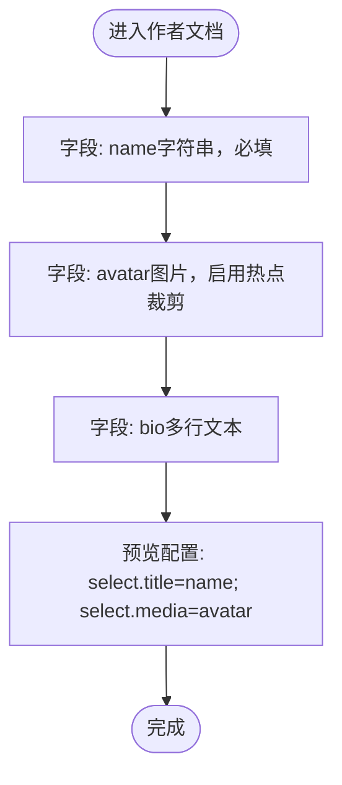

# 作者信息模型

<cite>
**本文引用的文件**
- [sanity/schemaTypes/author.ts](file://sanity/schemaTypes/author.ts)
- [sanity/schemaTypes/post.ts](file://sanity/schemaTypes/post.ts)
- [sanity/schemaTypes/index.ts](file://sanity/schemaTypes/index.ts)
- [sanity/sanity.config.ts](file://sanity/sanity.config.ts)
- [sanity/package.json](file://sanity/package.json)
- [src/lib/sanity.ts](file://src/lib/sanity.ts)
- [src/pages/blog/[slug].astro](file://src/pages/blog/[slug].astro)
- [src/components/PostCard.astro](file://src/components/PostCard.astro)
</cite>

## 目录
1. [引言](#引言)
2. [项目结构](#项目结构)
3. [核心组件](#核心组件)
4. [架构总览](#架构总览)
5. [详细组件分析](#详细组件分析)
6. [依赖分析](#依赖分析)
7. [性能考虑](#性能考虑)
8. [故障排除指南](#故障排除指南)
9. [结论](#结论)

## 引言
本文件聚焦于 Sanity 内容模型中的 Author（作者）文档类型，系统性地解析其字段结构、验证规则、预览配置与在其他文档类型（如 post）中的引用关系，并说明其在前端渲染中的可视化呈现方式。目标是帮助内容编辑者与开发者准确理解 Author 模型的设计意图与最佳实践。

## 项目结构
- 后端（Sanity Studio）位于 sanity/ 目录，包含 schemaTypes 定义与 Studio 配置。
- 前端位于 src/，通过 src/lib/sanity.ts 发起 GROQ 查询，消费后端数据并在页面中渲染。
- Author 与 Post 等文档类型通过 reference 字段建立关联，实现跨文档的数据引用。

图表来源
- [sanity/schemaTypes/author.ts](file://sanity/schemaTypes/author.ts#L1-L33)
- [sanity/schemaTypes/post.ts](file://sanity/schemaTypes/post.ts#L1-L84)
- [sanity/schemaTypes/index.ts](file://sanity/schemaTypes/index.ts#L1-L10)
- [sanity/sanity.config.ts](file://sanity/sanity.config.ts#L1-L31)
- [src/lib/sanity.ts](file://src/lib/sanity.ts#L1-L99)
- [src/pages/blog/[slug].astro](file://src/pages/blog/[slug].astro#L46-L126)
- [src/components/PostCard.astro](file://src/components/PostCard.astro#L1-L71)

章节来源
- [sanity/schemaTypes/author.ts](file://sanity/schemaTypes/author.ts#L1-L33)
- [sanity/schemaTypes/post.ts](file://sanity/schemaTypes/post.ts#L1-L84)
- [sanity/schemaTypes/index.ts](file://sanity/schemaTypes/index.ts#L1-L10)
- [sanity/sanity.config.ts](file://sanity/sanity.config.ts#L1-L31)
- [sanity/package.json](file://sanity/package.json#L1-L38)
- [src/lib/sanity.ts](file://src/lib/sanity.ts#L1-L99)
- [src/pages/blog/[slug].astro](file://src/pages/blog/[slug].astro#L46-L126)
- [src/components/PostCard.astro](file://src/components/PostCard.astro#L1-L71)

## 核心组件
- 作者文档模型（Author）
  - 字段：name（必填）、avatar（图片，启用热点裁剪）、bio（多行文本）。
  - 预览：select 中将 name 作为标题、avatar 作为媒体缩略图。
- 博客文章模型（Post）
  - 字段：author（reference 指向 author），用于建立与作者的关联。
- 前端渲染
  - 文章详情页直接使用 post.author.name 与 post.author.avatar 渲染作者信息。
  - 文章列表卡片可复用作者信息（由查询返回）。

章节来源
- [sanity/schemaTypes/author.ts](file://sanity/schemaTypes/author.ts#L1-L33)
- [sanity/schemaTypes/post.ts](file://sanity/schemaTypes/post.ts#L1-L84)
- [src/lib/sanity.ts](file://src/lib/sanity.ts#L1-L99)
- [src/pages/blog/[slug].astro](file://src/pages/blog/[slug].astro#L46-L126)

## 架构总览
下图展示了 Author 与 Post 的数据模型关系，以及前端如何通过 GROQ 查询获取并渲染作者信息。

图表来源
- [sanity/schemaTypes/author.ts](file://sanity/schemaTypes/author.ts#L1-L33)
- [sanity/schemaTypes/post.ts](file://sanity/schemaTypes/post.ts#L1-L84)

## 详细组件分析

### 作者文档模型（Author）
- 字段定义与用途
  - name：字符串，必填。作为作者标识与预览标题。
  - avatar：图片，启用热点裁剪（hotspot）。支持在编辑器中设置焦点区域，便于在不同布局中精准裁剪。
  - bio：多行文本，用于作者简介。
- 验证规则
  - name 字段使用必填校验，确保内容编辑时必须填写。
- 预览配置
  - preview.select 中选择 name 作为标题、avatar 作为媒体缩略图，使内容列表与搜索结果中直观显示作者头像与姓名。

图表来源
- [sanity/schemaTypes/author.ts](file://sanity/schemaTypes/author.ts#L1-L33)

章节来源
- [sanity/schemaTypes/author.ts](file://sanity/schemaTypes/author.ts#L1-L33)

### 博客文章模型（Post）与作者引用
- 字段定义与用途
  - author：reference 类型，指向 author 文档，实现跨文档引用。
- 预览配置
  - preview.select 中选择 title 与 coverImage，用于文章列表的可视化展示。
- 前端查询
  - GROQ 查询在获取文章时，同时投影 author.name 与 author.avatar.url，供页面渲染使用。

图表来源
- [sanity/schemaTypes/post.ts](file://sanity/schemaTypes/post.ts#L1-L84)
- [src/lib/sanity.ts](file://src/lib/sanity.ts#L1-L99)
- [src/pages/blog/[slug].astro](file://src/pages/blog/[slug].astro#L46-L126)

章节来源
- [sanity/schemaTypes/post.ts](file://sanity/schemaTypes/post.ts#L1-L84)
- [src/lib/sanity.ts](file://src/lib/sanity.ts#L1-L99)
- [src/pages/blog/[slug].astro](file://src/pages/blog/[slug].astro#L46-L126)

### 前端渲染与可视化
- 文章详情页
  - 使用 post.author.name 与 post.author.avatar 渲染作者信息与头像。
- 文章列表卡片
  - 可复用作者信息（由查询返回），在列表中展示作者头像与姓名。
- 图片热点裁剪
  - 前端通过 avatar.url 展示头像，编辑器中已配置热点裁剪，确保在不同容器尺寸下保持焦点区域可见。

图表来源
- [src/lib/sanity.ts](file://src/lib/sanity.ts#L1-L99)
- [src/pages/blog/[slug].astro](file://src/pages/blog/[slug].astro#L46-L126)
- [src/components/PostCard.astro](file://src/components/PostCard.astro#L1-L71)

章节来源
- [src/lib/sanity.ts](file://src/lib/sanity.ts#L1-L99)
- [src/pages/blog/[slug].astro](file://src/pages/blog/[slug].astro#L46-L126)
- [src/components/PostCard.astro](file://src/components/PostCard.astro#L1-L71)

## 依赖分析
- 模型注册与配置
  - schemaTypes/index.ts 导出 author 与 post 等类型，sanity.config.ts 中通过 schema.types 注册。
- 前端依赖
  - 前端通过 @sanity/client 与 GROQ 查询访问后端数据，查询中投影 author.name 与 author.avatar.asset->url。
- Studio 基础路径
  - sanity.config.ts 设置 basePath 为 /cms，配合脚本构建时传入 --base-path /cms，保证静态资源路径正确。

图表来源
- [sanity/schemaTypes/index.ts](file://sanity/schemaTypes/index.ts#L1-L10)
- [sanity/sanity.config.ts](file://sanity/sanity.config.ts#L1-L31)
- [sanity/package.json](file://sanity/package.json#L1-L38)
- [src/lib/sanity.ts](file://src/lib/sanity.ts#L1-L99)

章节来源
- [sanity/schemaTypes/index.ts](file://sanity/schemaTypes/index.ts#L1-L10)
- [sanity/sanity.config.ts](file://sanity/sanity.config.ts#L1-L31)
- [sanity/package.json](file://sanity/package.json#L1-L38)
- [src/lib/sanity.ts](file://src/lib/sanity.ts#L1-L99)

## 性能考虑
- 图片热点裁剪
  - avatar 启用热点裁剪，可在前端按需生成不同尺寸的缩略图，减少带宽与加载时间。
- 查询投影
  - GROQ 查询仅投影所需字段（如 author.name、avatar.asset->url），避免传输冗余数据。
- CDN 使用
  - 前端客户端启用 CDN，加速静态资源与图片加载。

章节来源
- [sanity/schemaTypes/author.ts](file://sanity/schemaTypes/author.ts#L1-L33)
- [src/lib/sanity.ts](file://src/lib/sanity.ts#L1-L99)

## 故障排除指南
- 必填字段未填写
  - 现象：保存失败或出现错误提示。
  - 排查：确认 author.name 已填写；Rule.required() 会在编辑器中阻止空值提交。
- 作者头像缺失
  - 现象：页面渲染头像占位或空白。
  - 排查：检查文章的 author.avatar 是否上传；前端渲染时应使用 avatar.asset->url。
- 预览标题与缩略图异常
  - 现象：内容列表中作者名未显示或缩略图不正确。
  - 排查：确认 preview.select 中 title 与 media 的字段映射是否为 name 与 avatar；检查字段拼写与大小写。

章节来源
- [sanity/schemaTypes/author.ts](file://sanity/schemaTypes/author.ts#L1-L33)
- [src/lib/sanity.ts](file://src/lib/sanity.ts#L1-L99)
- [src/pages/blog/[slug].astro](file://src/pages/blog/[slug].astro#L46-L126)

## 结论
Author 模型通过明确的字段职责（name、avatar、bio）、严格的必填校验与预览配置，为内容管理提供了清晰的作者信息入口。借助 Post 的 reference 字段，实现了跨文档的稳定关联；前端通过 GROQ 查询与热点裁剪，高效地在页面中展示作者头像与姓名。整体设计兼顾了编辑体验与前端性能，适合在多文档场景中复用与扩展。