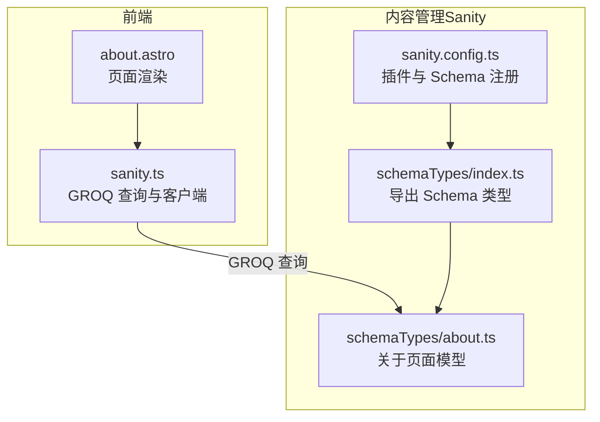
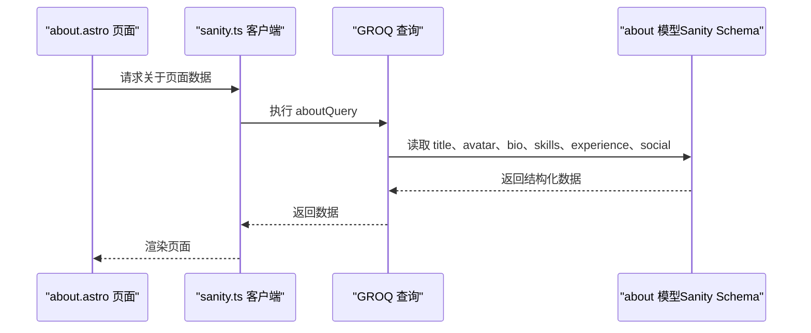
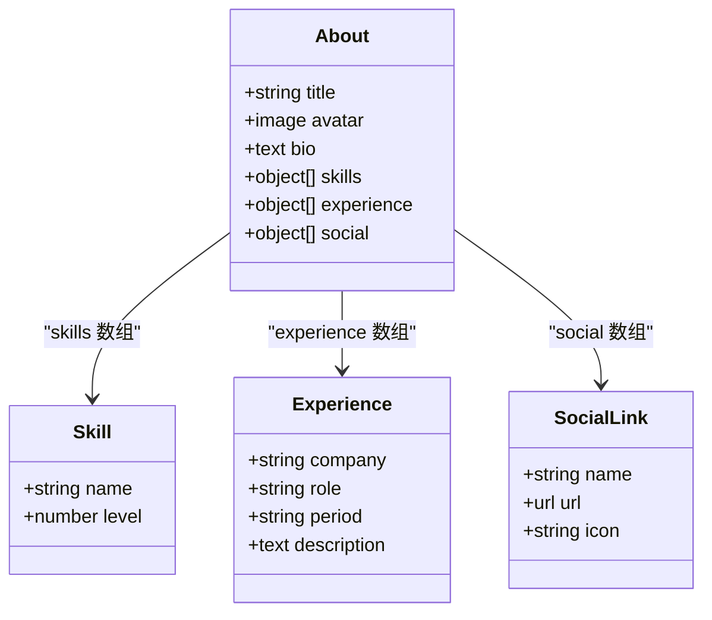
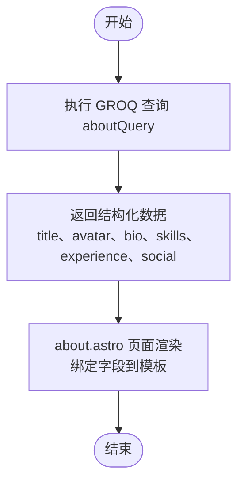
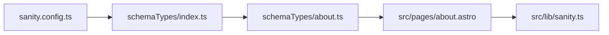

# 关于页面模型

<cite>
**本文引用的文件**
- [sanity/schemaTypes/about.ts](file://sanity/schemaTypes/about.ts)
- [sanity/schemaTypes/index.ts](file://sanity/schemaTypes/index.ts)
- [sanity/sanity.config.ts](file://sanity/sanity.config.ts)
- [sanity/package.json](file://sanity/package.json)
- [src/lib/sanity.ts](file://src/lib/sanity.ts)
- [src/pages/about.astro](file://src/pages/about.astro)
</cite>

## 目录
1. [引言](#引言)
2. [项目结构](#项目结构)
3. [核心组件](#核心组件)
4. [架构总览](#架构总览)
5. [详细组件分析](#详细组件分析)
6. [依赖关系分析](#依赖关系分析)
7. [性能考量](#性能考量)
8. [故障排查指南](#故障排查指南)
9. [结论](#结论)

## 引言
本文件系统化梳理“关于页面”内容模型的复合结构设计，围绕以下关键字段展开：
- title（标题）：页面展示用标题
- avatar（头像）：个人形象展示
- bio（个人简介）：文本描述
- skills（技能列表）：对象数组，包含技能名称与熟练度等级（0-100）
- experience（工作经历）：对象数组，包含公司、职位、时间段和职责描述
- social（社交链接）：对象数组，包含平台名称、URL和图标标识

文档将解释 object 类型在 skills、experience 和社交链接中的结构化数据组织方式，说明 array 字段在 Sanity 编辑器中的布局与交互，并结合代码示例路径展示嵌套对象字段的定义方法，最后阐述该模型如何支撑前端关于页面的动态渲染。

## 项目结构
该项目采用前后端分离的结构：
- 前端（Astro + Vue）位于 src/ 目录，负责页面渲染与交互
- 内容管理（Sanity）位于 sanity/ 目录，负责内容模型与数据查询
- 关于页面的前端渲染逻辑位于 src/pages/about.astro
- 关于页面的数据来源由 src/lib/sanity.ts 中的 GROQ 查询提供

图表来源
- [sanity/sanity.config.ts](file://sanity/sanity.config.ts#L1-L31)
- [sanity/schemaTypes/index.ts](file://sanity/schemaTypes/index.ts#L1-L10)
- [sanity/schemaTypes/about.ts](file://sanity/schemaTypes/about.ts#L1-L70)
- [src/lib/sanity.ts](file://src/lib/sanity.ts#L1-L99)
- [src/pages/about.astro](file://src/pages/about.astro#L1-L321)

章节来源
- [sanity/sanity.config.ts](file://sanity/sanity.config.ts#L1-L31)
- [sanity/schemaTypes/index.ts](file://sanity/schemaTypes/index.ts#L1-L10)
- [sanity/schemaTypes/about.ts](file://sanity/schemaTypes/about.ts#L1-L70)
- [src/lib/sanity.ts](file://src/lib/sanity.ts#L1-L99)
- [src/pages/about.astro](file://src/pages/about.astro#L1-L321)

## 核心组件
本节聚焦“关于页面”模型的核心字段及其数据结构。

- title（字符串）
  - 用途：页面标题
  - 类型：string
  - 示例路径：[字段定义](file://sanity/schemaTypes/about.ts#L8-L12)

- avatar（图像）
  - 用途：个人头像
  - 类型：image，启用热点图（hotspot），便于裁剪与焦点定位
  - 示例路径：[字段定义](file://sanity/schemaTypes/about.ts#L13-L18)

- bio（文本）
  - 用途：个人简介
  - 类型：text
  - 示例路径：[字段定义](file://sanity/schemaTypes/about.ts#L19-L23)

- skills（技能列表，数组）
  - 类型：array，元素为 object
  - 子字段：
    - name（字符串）：技能名称
    - level（数值）：熟练度等级（0-100）
  - 示例路径：[字段定义](file://sanity/schemaTypes/about.ts#L24-L37)

- experience（工作经历，数组）
  - 类型：array，元素为 object
  - 子字段：
    - company（字符串）：公司名称
    - role（字符串）：职位
    - period（字符串）：时间段
    - description（文本）：职责描述
  - 示例路径：[字段定义](file://sanity/schemaTypes/about.ts#L38-L53)

- social（社交链接，数组）
  - 类型：array，元素为 object
  - 子字段：
    - name（字符串）：平台名称
    - url（URL）：链接地址
    - icon（字符串）：图标标识
  - 示例路径：[字段定义](file://sanity/schemaTypes/about.ts#L54-L68)

章节来源
- [sanity/schemaTypes/about.ts](file://sanity/schemaTypes/about.ts#L1-L70)

## 架构总览
下图展示了“关于页面”从前端到内容管理的完整数据流。

图表来源
- [src/pages/about.astro](file://src/pages/about.astro#L1-L321)
- [src/lib/sanity.ts](file://src/lib/sanity.ts#L70-L79)
- [sanity/schemaTypes/about.ts](file://sanity/schemaTypes/about.ts#L1-L70)

## 详细组件分析

### 关于页面模型类图
该类图映射了“关于页面”模型的字段与子对象结构，便于理解嵌套对象字段的组织方式。

图表来源
- [sanity/schemaTypes/about.ts](file://sanity/schemaTypes/about.ts#L1-L70)

章节来源
- [sanity/schemaTypes/about.ts](file://sanity/schemaTypes/about.ts#L1-L70)

### 技能列表（skills）字段的编辑界面布局
- 字段类型：array + object
- 子字段：name（字符串）、level（数值）
- 在 Sanity 编辑器中，数组字段通常以“可增删的条目列表”呈现，每条目包含上述两个子字段。用户可逐条添加、删除或调整顺序，适合维护技能清单与对应熟练度。

章节来源
- [sanity/schemaTypes/about.ts](file://sanity/schemaTypes/about.ts#L24-L37)

### 工作经历（experience）字段的编辑界面布局
- 字段类型：array + object
- 子字段：company、role、period、description
- 在 Sanity 编辑器中，数组字段同样以“可增删的条目列表”呈现，每条目包含公司、职位、时间段与职责描述，便于按时间线组织履历。

章节来源
- [sanity/schemaTypes/about.ts](file://sanity/schemaTypes/about.ts#L38-L53)

### 社交链接（social）字段的编辑界面布局
- 字段类型：array + object
- 子字段：name、url、icon
- 在 Sanity 编辑器中，数组字段以“可增删的条目列表”呈现，每条目包含平台名称、链接与图标标识，便于维护多平台社交入口。

章节来源
- [sanity/schemaTypes/about.ts](file://sanity/schemaTypes/about.ts#L54-L68)

### 嵌套对象字段的定义方法（代码示例路径）
- skills 的对象结构定义：[字段路径](file://sanity/schemaTypes/about.ts#L24-L37)
- experience 的对象结构定义：[字段路径](file://sanity/schemaTypes/about.ts#L38-L53)
- social 的对象结构定义：[字段路径](file://sanity/schemaTypes/about.ts#L54-L68)

章节来源
- [sanity/schemaTypes/about.ts](file://sanity/schemaTypes/about.ts#L24-L68)

### 前端关于页面的动态渲染流程
- 数据来源：通过 GROQ 查询返回的 about 文档数据
- 关键字段映射：
  - title → 页面标题
  - avatar → 头像图片 URL
  - bio → 简介文本
  - skills → 技能列表（名称与等级）
  - experience → 工作经历（公司、职位、时间段、描述）
  - social → 社交链接（平台、URL、图标）
- 渲染位置：about.astro 页面中使用这些字段进行模板绑定与展示

图表来源
- [src/lib/sanity.ts](file://src/lib/sanity.ts#L70-L79)
- [src/pages/about.astro](file://src/pages/about.astro#L1-L321)

章节来源
- [src/lib/sanity.ts](file://src/lib/sanity.ts#L70-L79)
- [src/pages/about.astro](file://src/pages/about.astro#L1-L321)

## 依赖关系分析
- 关于页面模型注册与导出
  - sanity.config.ts 将 schemaTypes 注入到 Sanity Studio
  - schemaTypes/index.ts 导出 about 模型供配置使用
  - about.ts 定义了 about 文档的字段与类型
- 前端依赖
  - src/lib/sanity.ts 提供 aboutQuery 与 sanityClient
  - src/pages/about.astro 通过数据绑定渲染页面

图表来源
- [sanity/sanity.config.ts](file://sanity/sanity.config.ts#L1-L31)
- [sanity/schemaTypes/index.ts](file://sanity/schemaTypes/index.ts#L1-L10)
- [sanity/schemaTypes/about.ts](file://sanity/schemaTypes/about.ts#L1-L70)
- [src/lib/sanity.ts](file://src/lib/sanity.ts#L1-L99)
- [src/pages/about.astro](file://src/pages/about.astro#L1-L321)

章节来源
- [sanity/sanity.config.ts](file://sanity/sanity.config.ts#L1-L31)
- [sanity/schemaTypes/index.ts](file://sanity/schemaTypes/index.ts#L1-L10)
- [sanity/schemaTypes/about.ts](file://sanity/schemaTypes/about.ts#L1-L70)
- [src/lib/sanity.ts](file://src/lib/sanity.ts#L1-L99)
- [src/pages/about.astro](file://src/pages/about.astro#L1-L321)

## 性能考量
- 图片加载优化
  - avatar 使用 image 类型并启用热点图，建议在前端使用合适的尺寸与懒加载策略，减少首屏阻塞
- 查询粒度控制
  - GROQ 查询仅选择必要字段，避免不必要的数据传输
- CDN 使用
  - sanityClient 启用了 CDN，有助于提升静态资源访问速度
- 前端渲染
  - about.astro 为静态页面，结合 GROQ 查询结果进行渲染，有利于 SEO 与首屏性能

章节来源
- [sanity/schemaTypes/about.ts](file://sanity/schemaTypes/about.ts#L13-L18)
- [src/lib/sanity.ts](file://src/lib/sanity.ts#L1-L9)
- [src/pages/about.astro](file://src/pages/about.astro#L1-L321)

## 故障排查指南
- 数据为空或字段缺失
  - 检查 GROQ 查询是否正确返回 about 文档
  - 确认 Sanity Studio 中已创建并保存 about 文档
- 图片无法显示
  - 检查 avatar 字段是否上传了媒体资源
  - 确认 sanityClient 的项目 ID、数据集与 API 版本配置正确
- 字段类型不匹配
  - skills.level 应为数值（0-100）
  - social.url 应为合法 URL
  - experience.period 与 bio/description 为字符串/文本类型
- 编辑器布局异常
  - 确认 Sanity Studio 插件已启用（structureTool、visionTool）
  - 确认 schemaTypes/index.ts 正确导出 about 模型

章节来源
- [sanity/package.json](file://sanity/package.json#L1-L38)
- [sanity/sanity.config.ts](file://sanity/sanity.config.ts#L1-L31)
- [sanity/schemaTypes/about.ts](file://sanity/schemaTypes/about.ts#L1-L70)
- [src/lib/sanity.ts](file://src/lib/sanity.ts#L1-L99)

## 结论
“关于页面”内容模型通过清晰的字段划分与嵌套对象结构，实现了对个人资料、技能、工作经历与社交链接的结构化管理。Sanity 的 array + object 设计使得编辑器具备良好的可扩展性与易用性，前端通过 GROQ 查询与 about.astro 动态渲染，形成高效的内容生产与消费闭环。该模型具备良好的可维护性与扩展性，适合在多场景下复用与演进。