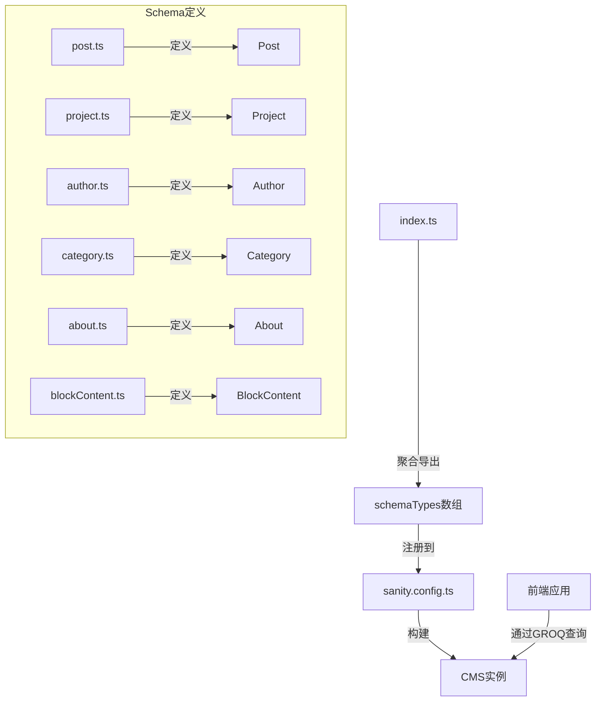
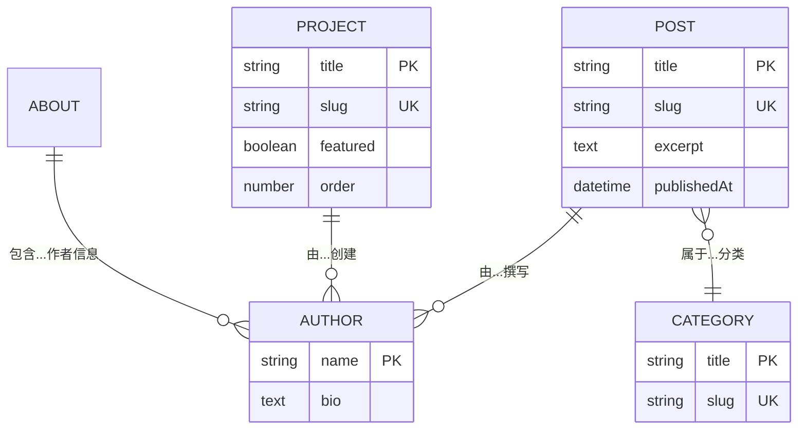
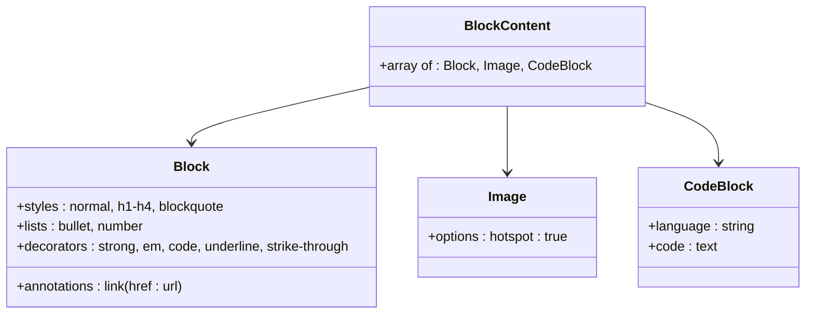

# 内容模型设计

<cite>
**本文档中引用的文件**  
- [post.ts](file://sanity/schemaTypes/post.ts)
- [project.ts](file://sanity/schemaTypes/project.ts)
- [author.ts](file://sanity/schemaTypes/author.ts)
- [category.ts](file://sanity/schemaTypes/category.ts)
- [about.ts](file://sanity/schemaTypes/about.ts)
- [blockContent.ts](file://sanity/schemaTypes/blockContent.ts)
- [index.ts](file://sanity/schemaTypes/index.ts)
- [sanity.config.ts](file://sanity/sanity.config.ts)
- [sanity.ts](file://src/lib/sanity.ts)
</cite>

## 目录
1. [简介](#简介)
2. [内容模型架构](#内容模型架构)
3. [核心内容模型详解](#核心内容模型详解)
4. [实体关系与数据查询](#实体关系与数据查询)
5. [富文本内容结构](#富文本内容结构)
6. [数据验证与约束](#数据验证与约束)
7. [注册与导出机制](#注册与导出机制)
8. [结论](#结论)

## 简介
本文档深入解析Sanity CMS中定义的所有内容模型及其字段结构。系统阐述了博客文章（Post）、项目作品（Project）、作者（Author）、分类（Category）和关于页面（About）等核心内容类型的架构设计、字段定义、数据关系及验证规则。通过分析GROQ查询中的关系映射，揭示了前端如何从CMS获取结构化数据，并说明了这些schema如何通过export机制在CMS中注册和使用。

## 内容模型架构
Sanity CMS的内容模型采用模块化设计，所有schema类型定义在`sanity/schemaTypes/`目录下，并通过`index.ts`文件统一导出。系统通过`sanity.config.ts`配置文件将这些schema类型注册到CMS实例中，形成完整的数据模型体系。



**图示来源**  
- [index.ts](file://sanity/schemaTypes/index.ts)
- [sanity.config.ts](file://sanity/sanity.config.ts)

**本节来源**  
- [sanity.config.ts](file://sanity/sanity.config.ts#L1-L31)
- [index.ts](file://sanity/schemaTypes/index.ts#L1-L10)

## 核心内容模型详解

### 博客文章（Post）模型
博客文章模型是系统的核心内容类型，包含标题、摘要、正文、封面图、作者引用、分类标签和发布时间等关键属性。该模型设计支持丰富的博客内容管理和展示需求。

**字段结构：**
- **标题（title）**: 字符串类型，必填字段，用于文章的主标题
- **Slug（slug）**: Slug类型，基于标题自动生成，用于URL路由，必填
- **摘要（excerpt）**: 文本类型，多行输入，用于文章列表页的简要描述
- **封面图（coverImage）**: 图像类型，支持热点区域选择，用于文章展示的主图
- **作者（author）**: 引用类型，关联到Author文档，建立文章与作者的关系
- **分类（categories）**: 数组类型，包含对Category文档的引用，支持多分类
- **发布时间（publishedAt）**: 日期时间类型，记录文章的发布时刻
- **正文（body）**: 数组类型，使用blockContent结构，支持富文本、图像和代码块

**本节来源**  
- [post.ts](file://sanity/schemaTypes/post.ts#L1-L84)

### 项目作品（Project）模型
项目作品模型用于展示个人或团队的技术项目，包含技术栈、链接、截图和详细描述等字段，支持项目作品的全面展示。

**字段结构：**
- **标题（title）**: 字符串类型，必填，项目名称
- **Slug（slug）**: Slug类型，基于标题生成，用于URL路由，必填
- **描述（description）**: 文本类型，多行输入，项目简要说明
- **缩略图（thumbnail）**: 图像类型，项目主图，支持热点区域
- **图库（gallery）**: 图像数组类型，包含项目的多张截图或展示图
- **技术栈（technologies）**: 字符串数组类型，以标签形式展示使用的技术
- **在线链接（liveUrl）**: URL类型，指向项目在线演示地址
- **代码仓库（githubUrl）**: URL类型，指向项目源码仓库
- **精选（featured）**: 布尔类型，标记是否为精选项目
- **排序（order）**: 数字类型，用于自定义项目展示顺序
- **正文（body）**: 数组类型，使用blockContent结构，支持详细项目说明

**本节来源**  
- [project.ts](file://sanity/schemaTypes/project.ts#L1-L97)

### 作者（Author）模型
作者模型定义了内容创作者的基本信息，用于在博客文章和其他内容中展示作者详情。

**字段结构：**
- **姓名（name）**: 字符串类型，必填，作者全名
- **头像（avatar）**: 图像类型，作者个人头像，支持热点区域
- **简介（bio）**: 文本类型，作者的简短介绍或个人描述

**本节来源**  
- [author.ts](file://sanity/schemaTypes/author.ts#L1-L33)

### 分类（Category）模型
分类模型用于组织和归类内容，建立内容的分类体系，支持内容的结构化管理和导航。

**字段结构：**
- **标题（title）**: 字符串类型，必填，分类名称
- **Slug（slug）**: Slug类型，基于标题生成，用于URL路由
- **描述（description）**: 文本类型，分类的详细说明

**命名规范：**
- 分类标题应简洁明了，准确反映其内容范畴
- Slug自动生成，确保URL友好性和唯一性
- 支持对分类进行描述，提供更详细的分类信息说明

**本节来源**  
- [category.ts](file://sanity/schemaTypes/category.ts#L1-L26)

### 关于页面（About）模型
关于页面模型定义了个人或团队介绍页面的数据结构，包含个人信息、技能、经历和社交链接等综合信息。

**字段结构：**
- **标题（title）**: 字符串类型，页面标题
- **头像（avatar）**: 图像类型，个人或团队头像
- **简介（bio）**: 文本类型，个人或团队简介
- **技能（skills）**: 对象数组类型，包含技能名称和熟练度等级（0-100）
- **经历（experience）**: 对象数组类型，包含公司、职位、时间段和描述
- **社交链接（social）**: 对象数组类型，包含平台名称、URL和图标名称

**本节来源**  
- [about.ts](file://sanity/schemaTypes/about.ts#L1-L70)

## 实体关系与数据查询
系统通过GROQ（Graph-Relational Object Queries）查询语言实现高效的数据获取和关系映射。GROQ查询在`src/lib/sanity.ts`中定义，前端通过这些查询从CMS获取结构化数据。

### 实体关系图


**图示来源**  
- [post.ts](file://sanity/schemaTypes/post.ts)
- [author.ts](file://sanity/schemaTypes/author.ts)
- [category.ts](file://sanity/schemaTypes/category.ts)
- [project.ts](file://sanity/schemaTypes/project.ts)
- [about.ts](file://sanity/schemaTypes/about.ts)

### GROQ查询关系映射
GROQ查询通过引用关系（->）实现数据的关联查询，避免了多次API调用，提高了数据获取效率。

**主要查询示例：**
- **博客文章查询**: 包含作者引用和分类引用，通过`author->{name, "avatar": avatar.asset->url}`和`categories[]->{title, slug}`实现关联数据的嵌套查询
- **项目查询**: 包含图库图像的URL转换，通过`"gallery": gallery[].asset->url`实现图像数组到URL数组的转换
- **关于页面查询**: 聚合个人信息、技能、经历和社交链接，构建完整的个人资料

**本节来源**  
- [sanity.ts](file://src/lib/sanity.ts#L1-L99)

## 富文本内容结构
系统使用blockContent结构来支持富文本内容的编辑和展示，该结构在`blockContent.ts`中定义，可被多个内容模型复用。

### BlockContent结构详解


**功能特性：**
- **样式支持**: 支持段落、标题（H1-H4）和引用等文本样式
- **列表支持**: 支持项目符号列表和编号列表
- **文本装饰**: 支持加粗、斜体、代码、下划线和删除线等行内样式
- **注解支持**: 支持超链接注解，可插入外部链接
- **多媒体支持**: 支持图像插入，带有热点区域选择功能
- **代码块支持**: 支持代码块插入，包含语言选择和代码内容

**本节来源**  
- [blockContent.ts](file://sanity/schemaTypes/blockContent.ts#L1-L90)

## 数据验证与约束
系统在schema定义中内置了数据验证规则，确保内容数据的完整性和一致性。

**主要验证规则：**
- **必填字段验证**: 标题、Slug等关键字段设置为必填，使用`validation: (Rule) => Rule.required()`确保数据完整性
- **类型约束**: 每个字段都有明确的类型定义，如字符串、文本、图像、引用等，防止数据类型错误
- **选项约束**: 技术栈字段使用标签布局（`layout: 'tags'`），提供友好的多标签输入体验
- **初始值设置**: 精选项目字段设置初始值为`false`，确保新创建的项目默认不为精选

**本节来源**  
- [post.ts](file://sanity/schemaTypes/post.ts#L1-L84)
- [project.ts](file://sanity/schemaTypes/project.ts#L1-L97)
- [author.ts](file://sanity/schemaTypes/author.ts#L1-L33)

## 注册与导出机制
Sanity CMS的内容模型通过模块化的export机制进行注册，确保schema的可维护性和可扩展性。

### 注册流程
1. 每个内容模型在独立的TypeScript文件中定义，使用`defineType`创建schema
2. 在`index.ts`文件中导入所有schema类型，并通过`export const schemaTypes`导出为数组
3. 在`sanity.config.ts`中导入`schemaTypes`数组，并在配置中注册到CMS实例

```typescript
// schemaTypes/index.ts
import { project } from './project'
import { about } from './about'
export const schemaTypes = [post, author, category, blockContent, project, about]

// sanity.config.ts
import {schemaTypes} from './schemaTypes'
export default defineConfig({
  schema: {
    types: schemaTypes,
  },
})
```

**本节来源**  
- [index.ts](file://sanity/schemaTypes/index.ts#L1-L10)
- [sanity.config.ts](file://sanity/sanity.config.ts#L1-L31)

## 结论
本文档全面解析了Sanity CMS的内容模型设计，涵盖了Post、Project、Author、Category和About等核心内容类型的字段结构、数据关系和验证规则。通过模块化的schema定义和GROQ查询机制，系统实现了灵活的内容管理和高效的数据获取。这种设计不仅保证了数据的一致性和完整性，还为前端展示提供了结构化的数据支持，形成了完整的头内容管理解决方案。