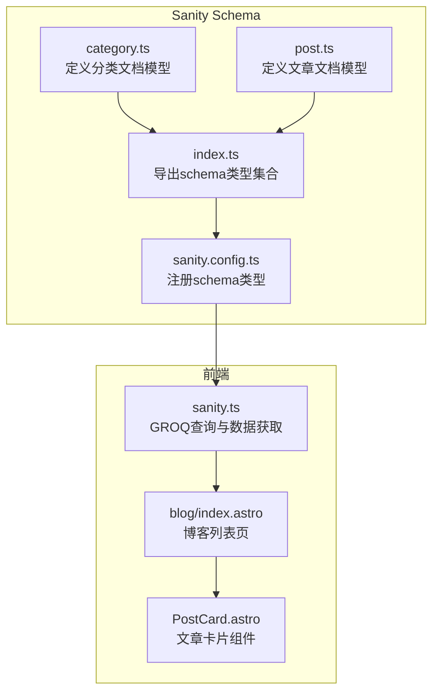
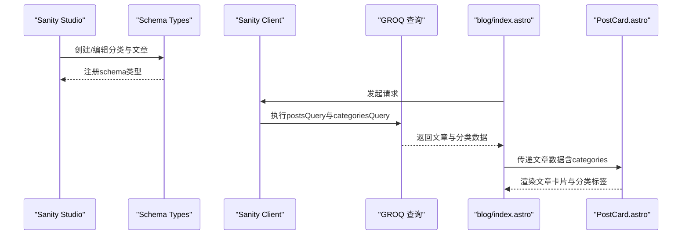
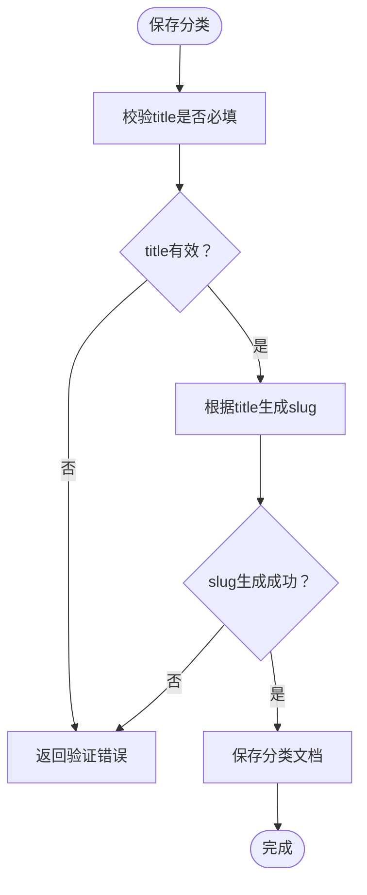
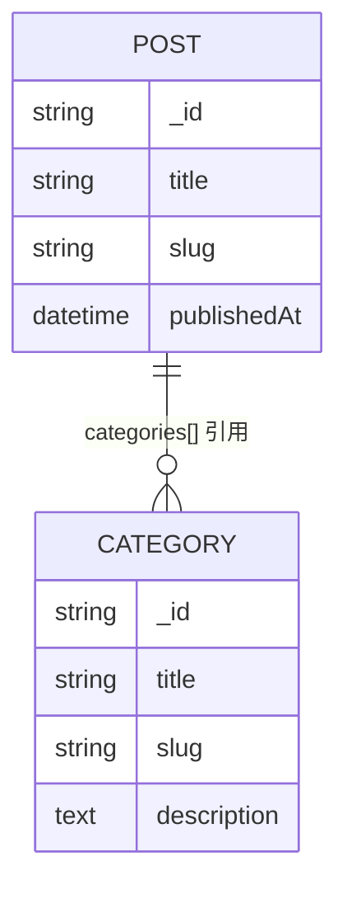
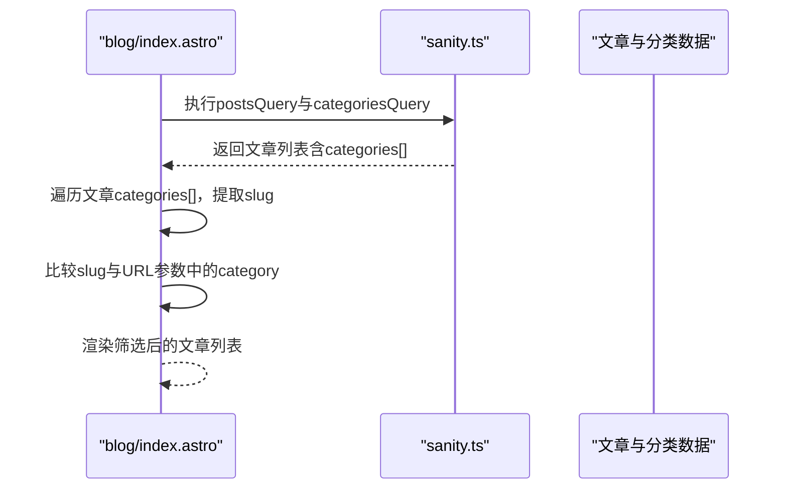
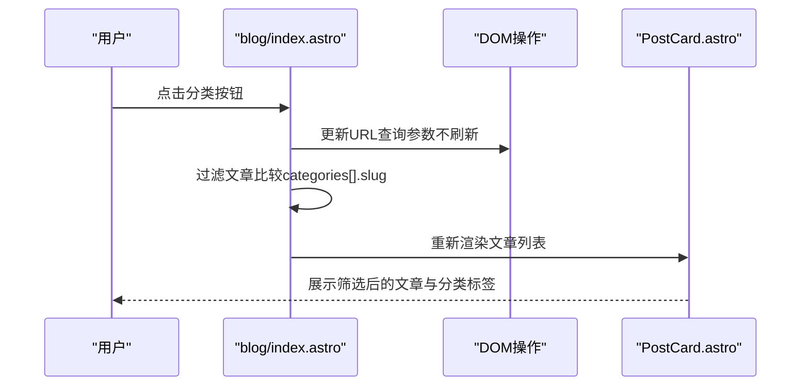
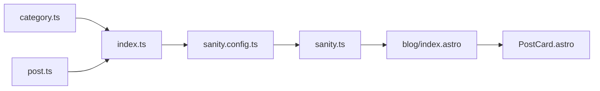

# 分类模型

<cite>
**本文引用的文件**
- [category.ts](file://sanity/schemaTypes/category.ts)
- [post.ts](file://sanity/schemaTypes/post.ts)
- [index.ts](file://sanity/schemaTypes/index.ts)
- [sanity.config.ts](file://sanity/sanity.config.ts)
- [sanity.ts](file://src/lib/sanity.ts)
- [blog.index.astro](file://src/pages/blog/index.astro)
- [PostCard.astro](file://src/components/PostCard.astro)
</cite>

## 目录
1. [简介](#简介)
2. [项目结构](#项目结构)
3. [核心组件](#核心组件)
4. [架构总览](#架构总览)
5. [详细组件分析](#详细组件分析)
6. [依赖分析](#依赖分析)
7. [性能考虑](#性能考虑)
8. [故障排查指南](#故障排查指南)
9. [结论](#结论)
10. [附录](#附录)

## 简介
本文件系统化文档化分类（Category）内容模型的设计原理与应用方式，重点说明：
- title（标题）为必填字段并作为主要标识；
- slug（别名）根据标题自动生成，用于URL路由；
- description（描述）提供分类的补充说明；
- 分类与博客文章通过数组引用建立多对多关系，支持内容的灵活归类；
- 解释slug字段的options配置中source属性的作用机制；
- 说明slug在GROQ查询中的过滤与连接查询模式；
- 提供前端页面中标签渲染与筛选功能的实际使用场景示例。

## 项目结构
本项目的分类模型位于Sanity Schema Types目录，前端通过Astro页面与组件消费数据，Sanity Studio负责内容编辑与发布。

图表来源
- [category.ts](file://sanity/schemaTypes/category.ts#L1-L26)
- [post.ts](file://sanity/schemaTypes/post.ts#L1-L84)
- [index.ts](file://sanity/schemaTypes/index.ts#L1-L10)
- [sanity.config.ts](file://sanity/sanity.config.ts#L1-L31)
- [sanity.ts](file://src/lib/sanity.ts#L1-L99)
- [blog.index.astro](file://src/pages/blog/index.astro#L1-L320)
- [PostCard.astro](file://src/components/PostCard.astro#L1-L71)

章节来源
- [sanity.config.ts](file://sanity/sanity.config.ts#L1-L31)
- [index.ts](file://sanity/schemaTypes/index.ts#L1-L10)

## 核心组件
- 分类模型（Category）
  - 字段：title（必填）、slug（基于title自动生成）、description（可选）
  - 设计要点：title作为主标识，slug用于URL路由，description提供补充说明
- 文章模型（Post）
  - 字段：title（必填）、slug（必填）、categories（数组引用至category）
  - 设计要点：categories为数组，元素为对category的引用，形成多对多关系

章节来源
- [category.ts](file://sanity/schemaTypes/category.ts#L1-L26)
- [post.ts](file://sanity/schemaTypes/post.ts#L1-L84)

## 架构总览
从内容创建到前端展示的端到端流程如下：

图表来源
- [sanity.config.ts](file://sanity/sanity.config.ts#L1-L31)
- [sanity.ts](file://src/lib/sanity.ts#L1-L99)
- [blog.index.astro](file://src/pages/blog/index.astro#L1-L320)
- [PostCard.astro](file://src/components/PostCard.astro#L1-L71)

## 详细组件分析

### 分类模型（Category）设计与验证
- 字段设计
  - title：字符串，必填，作为分类的主要标识
  - slug：slug类型，options.source指向title，自动从title生成，maxLength限制长度
  - description：文本，提供分类说明
- 作用机制
  - source属性使slug字段在保存时依据title自动生成，避免重复与不一致
  - 自动生成的slug在前端用于URL路由与筛选匹配

图表来源
- [category.ts](file://sanity/schemaTypes/category.ts#L1-L26)

章节来源
- [category.ts](file://sanity/schemaTypes/category.ts#L1-L26)

### 文章模型（Post）与分类的多对多关系
- 关系建模
  - categories字段为数组，元素为对category的引用，支持一篇文章归属多个分类
  - 通过数组引用实现多对多：一个分类可对应多篇文章
- 数据结构
  - categories[]包含title与slug，便于前端直接渲染与筛选

图表来源
- [post.ts](file://sanity/schemaTypes/post.ts#L1-L84)
- [category.ts](file://sanity/schemaTypes/category.ts#L1-L26)

章节来源
- [post.ts](file://sanity/schemaTypes/post.ts#L1-L84)

### GROQ查询中的slug过滤与连接查询模式
- 查询模式
  - categories[]->{title, slug}：连接查询，取出关联分类的title与slug
  - categories[]->slug.current：在前端筛选时使用slug.current进行匹配
- 过滤逻辑
  - 前端通过比较post.categories[]中的slug与目标分类slug实现筛选
  - 支持slug为对象（含current）或字符串两种形态，兼容不同数据结构

图表来源
- [sanity.ts](file://src/lib/sanity.ts#L1-L99)
- [blog.index.astro](file://src/pages/blog/index.astro#L1-L320)

章节来源
- [sanity.ts](file://src/lib/sanity.ts#L1-L99)
- [blog.index.astro](file://src/pages/blog/index.astro#L1-L320)

### 前端标签渲染与筛选功能
- 标签渲染
  - PostCard组件接收categories数组，渲染分类标题为标签
  - 仅显示前两个分类标签，保持卡片简洁
- 筛选功能
  - blog/index.astro渲染分类按钮，点击后更新URL查询参数
  - 通过filterByCategory函数按slug筛选文章
  - 支持slug为对象或字符串的兼容处理

图表来源
- [blog.index.astro](file://src/pages/blog/index.astro#L1-L320)
- [PostCard.astro](file://src/components/PostCard.astro#L1-L71)

章节来源
- [blog.index.astro](file://src/pages/blog/index.astro#L1-L320)
- [PostCard.astro](file://src/components/PostCard.astro#L1-L71)

## 依赖分析
- 模型依赖
  - post.ts依赖category.ts（categories字段引用）
  - sanity.config.ts注册schemaTypes（包含category与post）
- 前端依赖
  - blog/index.astro依赖sanity.ts提供的查询与数据获取
  - PostCard.astro依赖blog/index.astro传入的数据

图表来源
- [category.ts](file://sanity/schemaTypes/category.ts#L1-L26)
- [post.ts](file://sanity/schemaTypes/post.ts#L1-L84)
- [index.ts](file://sanity/schemaTypes/index.ts#L1-L10)
- [sanity.config.ts](file://sanity/sanity.config.ts#L1-L31)
- [sanity.ts](file://src/lib/sanity.ts#L1-L99)
- [blog.index.astro](file://src/pages/blog/index.astro#L1-L320)
- [PostCard.astro](file://src/components/PostCard.astro#L1-L71)

章节来源
- [index.ts](file://sanity/schemaTypes/index.ts#L1-L10)
- [sanity.config.ts](file://sanity/sanity.config.ts#L1-L31)
- [sanity.ts](file://src/lib/sanity.ts#L1-L99)

## 性能考虑
- GROQ查询优化
  - categories[]->{title, slug}仅选择必要字段，减少传输体积
  - 对文章按发布时间排序，有利于前端分页与懒加载
- 前端筛选优化
  - 仅在用户交互时执行筛选，避免不必要的重渲染
  - 限制文章卡片中显示的分类标签数量，降低DOM复杂度
- 缓存策略
  - 使用CDN加速静态资源与API响应（Sanity Client配置）

## 故障排查指南
- slug未生成或为空
  - 检查分类title是否填写；source依赖title生成
  - 确认categories[]中slug字段是否正确映射为slug.current
- 筛选无效
  - 确认URL查询参数category与分类slug一致
  - 检查categories[]中slug可能是对象或字符串，需兼容处理
- 数据不一致
  - 确认Sanity Studio已注册schemaTypes
  - 检查GROQ查询是否包含categories[]->slug.current

章节来源
- [category.ts](file://sanity/schemaTypes/category.ts#L1-L26)
- [post.ts](file://sanity/schemaTypes/post.ts#L1-L84)
- [sanity.ts](file://src/lib/sanity.ts#L1-L99)
- [blog.index.astro](file://src/pages/blog/index.astro#L1-L320)

## 结论
本分类模型通过title作为主标识、slug基于title自动生成、description提供补充说明，结合文章模型的数组引用，实现了灵活的多对多内容归类。GROQ查询与前端筛选逻辑共同确保了分类体系在URL路由与页面渲染中的可用性与一致性。通过合理的字段选择与兼容处理，系统在性能与用户体验之间取得平衡。

## 附录
- 实际使用场景示例
  - 新增分类：在Sanity Studio创建分类，填写title，slug自动从title生成
  - 归类文章：在文章编辑器中将分类添加到categories数组
  - 前端展示：博客列表页渲染分类按钮与文章卡片，点击按钮按slug筛选文章
  - URL路由：分类筛选通过URL查询参数实现，利于分享与SEO