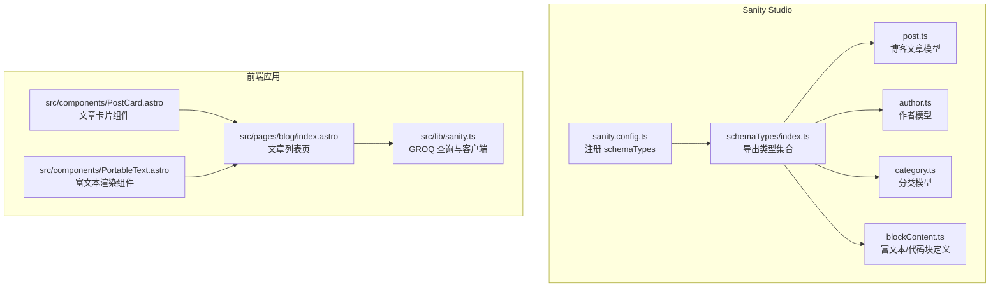
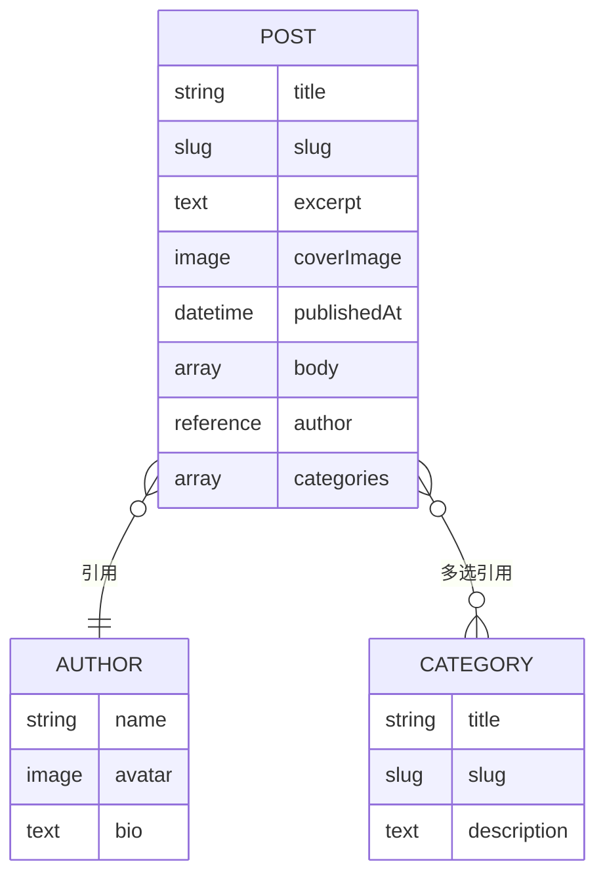
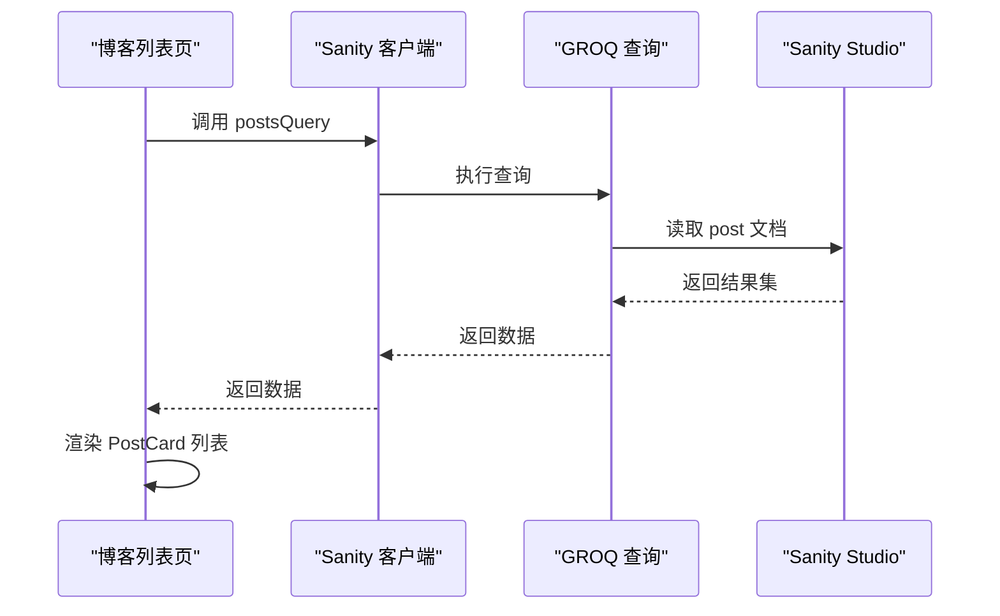
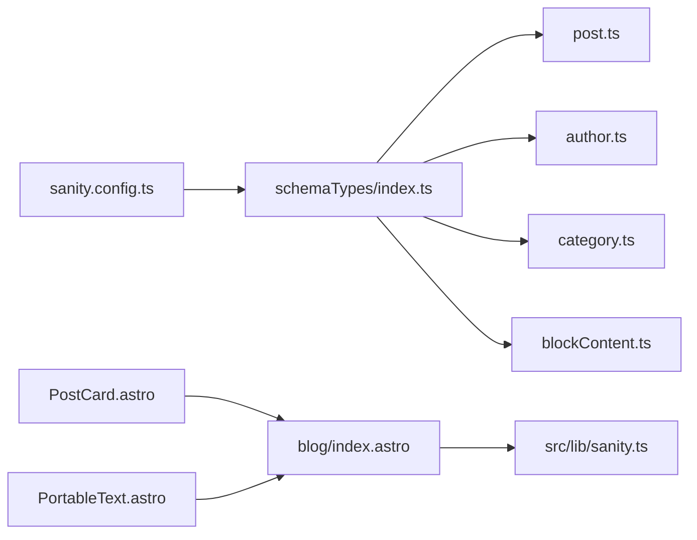

# 博客文章模型

<cite>
**本文引用的文件**
- [sanity/schemaTypes/post.ts](file://sanity/schemaTypes/post.ts)
- [sanity/schemaTypes/author.ts](file://sanity/schemaTypes/author.ts)
- [sanity/schemaTypes/category.ts](file://sanity/schemaTypes/category.ts)
- [sanity/schemaTypes/blockContent.ts](file://sanity/schemaTypes/blockContent.ts)
- [sanity/schemaTypes/index.ts](file://sanity/schemaTypes/index.ts)
- [sanity/sanity.config.ts](file://sanity/sanity.config.ts)
- [src/lib/sanity.ts](file://src/lib/sanity.ts)
- [src/pages/blog/index.astro](file://src/pages/blog/index.astro)
- [src/components/PostCard.astro](file://src/components/PostCard.astro)
- [src/components/PortableText.astro](file://src/components/PortableText.astro)
</cite>

## 目录
1. [简介](#简介)
2. [项目结构](#项目结构)
3. [核心组件](#核心组件)
4. [架构总览](#架构总览)
5. [详细组件分析](#详细组件分析)
6. [依赖分析](#依赖分析)
7. [性能考虑](#性能考虑)
8. [故障排查指南](#故障排查指南)
9. [结论](#结论)
10. [附录](#附录)

## 简介
本文件系统化文档化了 Sanity CMS 中“博客文章（post）”内容模型的设计与实现，覆盖字段结构、验证规则、预览配置、与其他模型的关系以及在前端的查询与渲染流程。重点说明：
- 字段语义与约束：title（必填）、slug（自动生成且唯一）、excerpt（列表页摘要）、coverImage（支持热点区域选择）、author（引用 author 文档）、categories（多选引用数组，关联 category）、publishedAt（发布时间）、body（blockContent 结构，支持富文本、图片与自定义代码块）。
- 预览配置：如何在 CMS 界面中显示标题与封面图等关键信息。
- GROQ 查询：post 模型与 author、category 的关联取数方式。
- 数据完整性保障：字段验证、引用关系约束与前端渲染容错策略。

## 项目结构
Sanity Studio 的内容模型位于 sanity/schemaTypes 下，入口配置在 sanity/sanity.config.ts 中注册 schemaTypes。前端通过 src/lib/sanity.ts 提供的 GROQ 查询获取数据，并在页面组件中消费。

图表来源
- [sanity/sanity.config.ts](file://sanity/sanity.config.ts#L1-L31)
- [sanity/schemaTypes/index.ts](file://sanity/schemaTypes/index.ts#L1-L10)
- [sanity/schemaTypes/post.ts](file://sanity/schemaTypes/post.ts#L1-L84)
- [sanity/schemaTypes/author.ts](file://sanity/schemaTypes/author.ts#L1-L33)
- [sanity/schemaTypes/category.ts](file://sanity/schemaTypes/category.ts#L1-L26)
- [sanity/schemaTypes/blockContent.ts](file://sanity/schemaTypes/blockContent.ts#L1-L90)
- [src/lib/sanity.ts](file://src/lib/sanity.ts#L1-L99)
- [src/pages/blog/index.astro](file://src/pages/blog/index.astro#L1-L42)
- [src/components/PostCard.astro](file://src/components/PostCard.astro#L1-L71)
- [src/components/PortableText.astro](file://src/components/PortableText.astro#L1-L107)

章节来源
- [sanity/sanity.config.ts](file://sanity/sanity.config.ts#L1-L31)
- [sanity/schemaTypes/index.ts](file://sanity/schemaTypes/index.ts#L1-L10)

## 核心组件
本节聚焦博客文章模型的字段设计与验证规则，以及预览配置。

- 字段与约束
  - title：字符串，必填。
  - slug：URL 别名，基于标题自动生成，最大长度限制，必填。
  - excerpt：文本，用于列表页摘要展示。
  - coverImage：图片，启用热点区域选择，便于裁剪适配。
  - author：引用 author 文档类型。
  - categories：数组，元素为对 category 文档类型的引用，支持多选。
  - publishedAt：时间戳，用于控制文章可见性与排序。
  - body：数组，包含 block（富文本）、image（带热点）、自定义 code 对象（含 language 与 code 字段）。

- 预览配置
  - preview.select 指定在 CMS 列表中显示的标题与媒体字段，分别来自 title 与 coverImage，确保编辑器能直观看到文章的关键信息。

章节来源
- [sanity/schemaTypes/post.ts](file://sanity/schemaTypes/post.ts#L1-L84)

## 架构总览
下图展示了 CMS 内容模型之间的关系与前端取数路径。

图表来源
- [sanity/schemaTypes/post.ts](file://sanity/schemaTypes/post.ts#L1-L84)
- [sanity/schemaTypes/author.ts](file://sanity/schemaTypes/author.ts#L1-L33)
- [sanity/schemaTypes/category.ts](file://sanity/schemaTypes/category.ts#L1-L26)

## 详细组件分析

### 博客文章模型（post）
- 字段解析
  - title：必填，作为 slug 的生成源与预览标题。
  - slug：由 source: 'title' 自动生成，maxLength 限制，保证 URL 友好与唯一性。
  - excerpt：短文本摘要，适合列表页展示。
  - coverImage：图片字段，options 启用热点区域选择，便于在不同断点下精准裁剪。
  - author：引用 author 类型，支持在 CMS 中直接选择作者并获取其头像等信息。
  - categories：数组引用，支持多分类，便于聚合与筛选。
  - publishedAt：时间戳，常用于排序与可见性控制。
  - body：采用数组结构，包含 block、image 与自定义 code 对象，满足富文本、图片与代码高亮需求。

- 预览配置
  - preview.select 指定 title 与 coverImage，使列表视图可快速识别文章封面与标题。

- 关联取数（GROQ）
  - 列表页查询：返回文章基础信息、作者简要信息与分类列表。
  - 单篇文章查询：返回完整 body，便于前端渲染富文本与代码块。

- 前端渲染
  - 列表页：使用 PostCard 组件展示封面、标题、摘要、日期与分类标签。
  - 正文页：使用 PortableText 组件渲染 body 中的 block 内容，支持标题、段落、引用、列表、内联样式与链接等。

章节来源
- [sanity/schemaTypes/post.ts](file://sanity/schemaTypes/post.ts#L1-L84)
- [src/lib/sanity.ts](file://src/lib/sanity.ts#L1-L99)
- [src/pages/blog/index.astro](file://src/pages/blog/index.astro#L1-L42)
- [src/components/PostCard.astro](file://src/components/PostCard.astro#L1-L71)
- [src/components/PortableText.astro](file://src/components/PortableText.astro#L1-L107)

### 作者模型（author）
- 字段与约束
  - name：字符串，必填。
  - avatar：图片，启用热点区域选择。
  - bio：文本，可选。

- 预览配置
  - preview.select 指定 name 与 avatar，便于在 CMS 中快速识别作者。

章节来源
- [sanity/schemaTypes/author.ts](file://sanity/schemaTypes/author.ts#L1-L33)

### 分类模型（category）
- 字段与约束
  - title：字符串，必填。
  - slug：URL 别名，基于标题自动生成。
  - description：文本，可选。

章节来源
- [sanity/schemaTypes/category.ts](file://sanity/schemaTypes/category.ts#L1-L26)

### 富文本与代码块（blockContent）
- 设计要点
  - 支持多种标题、列表样式与内联装饰（粗体、斜体、代码、下划线、删除线）。
  - 支持链接注解，便于插入外部链接。
  - 支持图片（hotspot），与文章封面一致的裁剪体验。
  - 自定义 code 对象：包含 language 与 code 字段，便于前端进行语法高亮渲染。

章节来源
- [sanity/schemaTypes/blockContent.ts](file://sanity/schemaTypes/blockContent.ts#L1-L90)

### GROQ 查询与数据流
- 查询概览
  - 所有文章：按发布时间倒序，返回基础字段、作者简要与分类列表。
  - 单篇文章：按 slug.current 精确匹配，返回完整 body。
  - 分类列表：按标题升序，返回 slug.current。
  - 首页精选：返回最近若干文章与精选项目。

- 调用流程（序列图）

图表来源
- [src/lib/sanity.ts](file://src/lib/sanity.ts#L1-L99)
- [src/pages/blog/index.astro](file://src/pages/blog/index.astro#L1-L42)

- 关联取数要点
  - 作者：author->{name, bio, "avatar": avatar.asset->url}
  - 分类：categories[]->{title, slug}
  - 图片：coverImage.asset->url

章节来源
- [src/lib/sanity.ts](file://src/lib/sanity.ts#L1-L99)

### 预览配置与 CMS 展示
- CMS 列表预览
  - post.preview.select 指定 title 与 coverImage，使列表项显示文章标题与封面缩略图。
- 作者与分类预览
  - author.preview.select 指定 name 与 avatar。
  - category.preview.select 未显式指定时，默认使用默认字段（如 title）。

章节来源
- [sanity/schemaTypes/post.ts](file://sanity/schemaTypes/post.ts#L76-L84)
- [sanity/schemaTypes/author.ts](file://sanity/schemaTypes/author.ts#L25-L32)
- [sanity/schemaTypes/category.ts](file://sanity/schemaTypes/category.ts#L1-L26)

### 数据完整性保障机制
- 字段验证
  - title、slug、author、categories[]、publishedAt 等字段在后端 schema 中设置必填或引用约束，防止空值写入。
- 引用一致性
  - author 与 categories 为引用类型，CMS 侧保证引用对象存在且有效。
- 前端容错
  - PostCard 对 categories 做空值过滤与数组校验，避免渲染异常。
  - PortableText 对 block 结构做类型检查，缺失时显示占位提示。

章节来源
- [sanity/schemaTypes/post.ts](file://sanity/schemaTypes/post.ts#L1-L84)
- [sanity/schemaTypes/author.ts](file://sanity/schemaTypes/author.ts#L1-L33)
- [sanity/schemaTypes/category.ts](file://sanity/schemaTypes/category.ts#L1-L26)
- [src/components/PostCard.astro](file://src/components/PostCard.astro#L1-L71)
- [src/components/PortableText.astro](file://src/components/PortableText.astro#L1-L107)

## 依赖分析
- 模型依赖
  - post 依赖 author 与 category 的引用关系。
  - body 可复用 blockContent 定义，统一富文本与代码块结构。
- 注册与加载
  - sanity.config.ts 注册 schemaTypes，index.ts 统一导出，确保 Studio 加载顺序正确。
- 前端依赖
  - 页面通过 src/lib/sanity.ts 的查询函数获取数据，组件负责渲染。

图表来源
- [sanity/sanity.config.ts](file://sanity/sanity.config.ts#L1-L31)
- [sanity/schemaTypes/index.ts](file://sanity/schemaTypes/index.ts#L1-L10)
- [sanity/schemaTypes/post.ts](file://sanity/schemaTypes/post.ts#L1-L84)
- [sanity/schemaTypes/author.ts](file://sanity/schemaTypes/author.ts#L1-L33)
- [sanity/schemaTypes/category.ts](file://sanity/schemaTypes/category.ts#L1-L26)
- [sanity/schemaTypes/blockContent.ts](file://sanity/schemaTypes/blockContent.ts#L1-L90)
- [src/lib/sanity.ts](file://src/lib/sanity.ts#L1-L99)
- [src/pages/blog/index.astro](file://src/pages/blog/index.astro#L1-L42)
- [src/components/PostCard.astro](file://src/components/PostCard.astro#L1-L71)
- [src/components/PortableText.astro](file://src/components/PortableText.astro#L1-L107)

章节来源
- [sanity/sanity.config.ts](file://sanity/sanity.config.ts#L1-L31)
- [sanity/schemaTypes/index.ts](file://sanity/schemaTypes/index.ts#L1-L10)

## 性能考虑
- 查询优化
  - 列表页仅取必要字段，减少网络传输与渲染压力。
  - 使用 publishedAt 排序，避免前端二次排序。
- 图片处理
  - coverImage 通过 asset->url 获取，建议在前端按需懒加载与尺寸裁剪。
- 富文本渲染
  - PortableText 仅渲染 block 类型，避免冗余节点，提升首屏渲染速度。

## 故障排查指南
- 字段缺失或为空
  - 现象：列表卡片不显示封面或分类。
  - 排查：确认 post.coverImage 是否存在，categories 是否为非空数组。
  - 参考：PostCard 组件对 categories 的空值过滤逻辑。
- slug 重复或无效
  - 现象：文章详情页无法按 slug 访问。
  - 排查：确认 slug.source 来源于 title 且未重复；查询中使用 slug.current。
  - 参考：post.ts 中 slug 配置与查询中 slug.current 的使用。
- 富文本渲染异常
  - 现象：正文空白或样式错乱。
  - 排查：确认 body 中 block 的 _type 与 style 字段是否正确；PortableText 组件对 block 的类型判断。
- 作者或分类引用失效
  - 现象：作者头像或分类标题为空。
  - 排查：确认引用对象存在且字段有效；查询中使用 author->{...} 与 categories[]->{...}。

章节来源
- [sanity/schemaTypes/post.ts](file://sanity/schemaTypes/post.ts#L1-L84)
- [src/components/PostCard.astro](file://src/components/PostCard.astro#L1-L71)
- [src/components/PortableText.astro](file://src/components/PortableText.astro#L1-L107)
- [src/lib/sanity.ts](file://src/lib/sanity.ts#L1-L99)

## 结论
博客文章模型通过严谨的字段设计、引用关系与预览配置，在 Sanity CMS 中实现了清晰的内容管理体验。配合 GROQ 查询与前端组件，能够高效地渲染列表与详情页内容。建议在新增字段或调整样式时，同步更新 schema 与前端渲染逻辑，确保数据一致性与用户体验。

## 附录
- 实际代码示例（以路径代替具体代码）
  - 字段验证与选项配置：[字段定义与验证](file://sanity/schemaTypes/post.ts#L8-L20)
  - slug 自动生成与唯一性：[slug 配置](file://sanity/schemaTypes/post.ts#L14-L20)
  - coverImage 热点区域选择：[图片选项](file://sanity/schemaTypes/post.ts#L27-L32)
  - author 引用关系：[作者引用](file://sanity/schemaTypes/post.ts#L33-L44)
  - categories 多选引用：[分类引用](file://sanity/schemaTypes/post.ts#L39-L44)
  - body 富文本与代码块：[body 结构](file://sanity/schemaTypes/post.ts#L50-L75)
  - 预览配置：[预览选择](file://sanity/schemaTypes/post.ts#L76-L84)
  - GROQ 查询（列表与详情）：[查询集合](file://src/lib/sanity.ts#L1-L99)
  - 前端渲染（列表卡片）：[PostCard 组件](file://src/components/PostCard.astro#L1-L71)
  - 前端渲染（富文本）：[PortableText 组件](file://src/components/PortableText.astro#L1-L107)