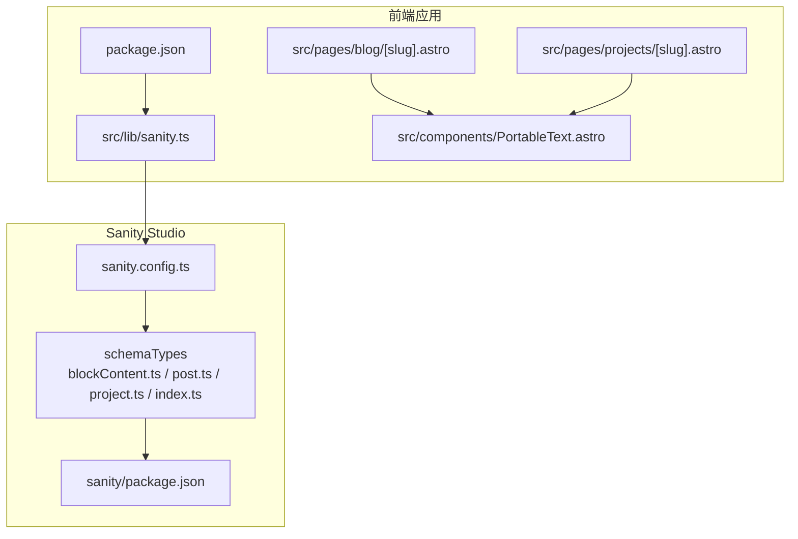
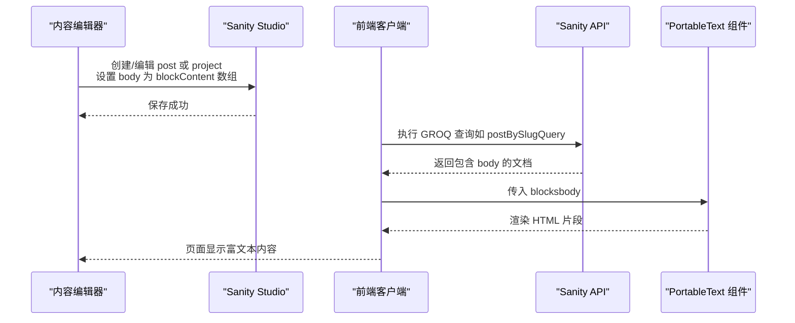
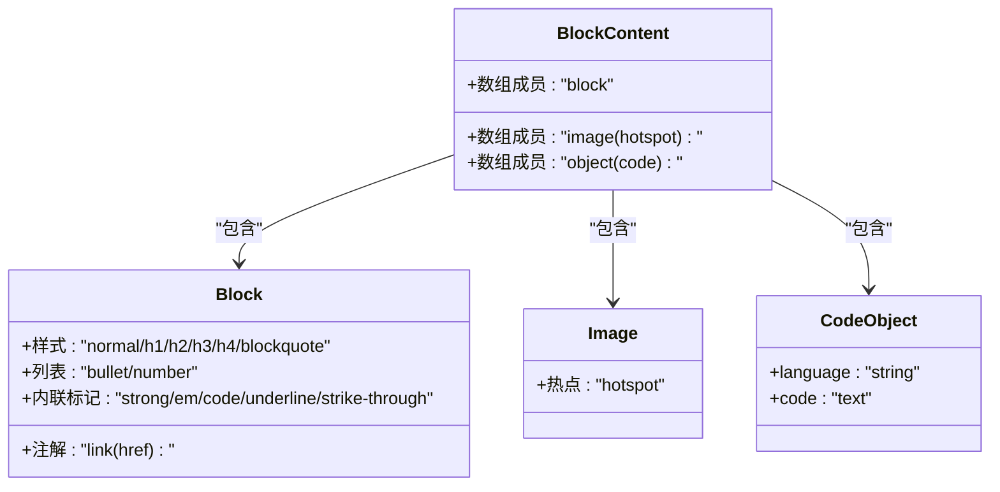
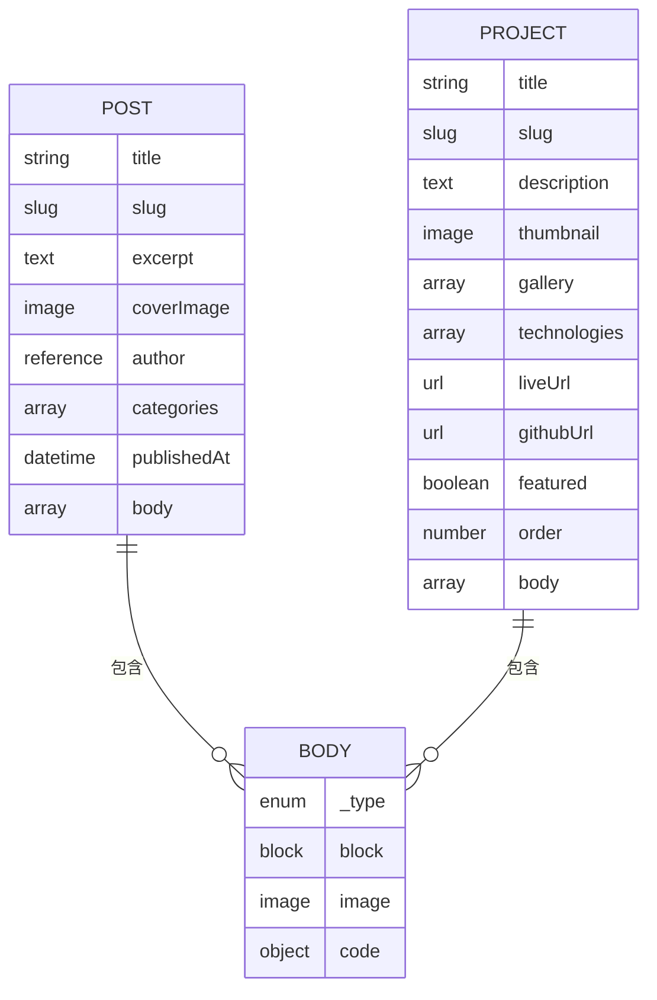
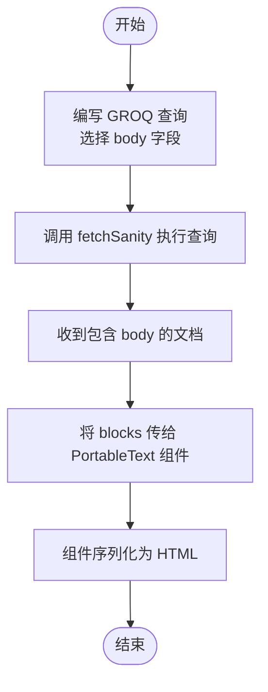
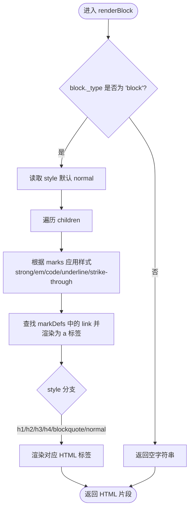
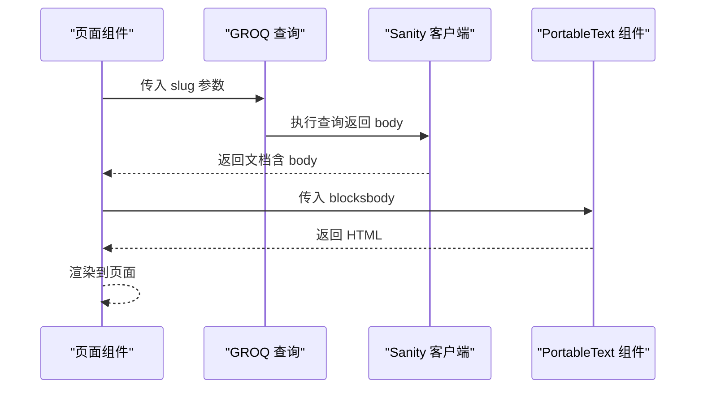
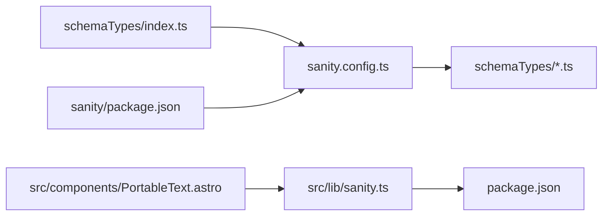

# 富文本内容模型

<cite>
**本文引用的文件**
- [sanity/schemaTypes/blockContent.ts](file://sanity/schemaTypes/blockContent.ts)
- [sanity/schemaTypes/post.ts](file://sanity/schemaTypes/post.ts)
- [sanity/schemaTypes/project.ts](file://sanity/schemaTypes/project.ts)
- [sanity/schemaTypes/index.ts](file://sanity/schemaTypes/index.ts)
- [sanity/sanity.config.ts](file://sanity/sanity.config.ts)
- [sanity/package.json](file://sanity/package.json)
- [src/lib/sanity.ts](file://src/lib/sanity.ts)
- [src/components/PortableText.astro](file://src/components/PortableText.astro)
- [src/pages/blog/[slug].astro](file://src/pages/blog/[slug].astro)
- [src/pages/projects/[slug].astro](file://src/pages/projects/[slug].astro)
- [package.json](file://package.json)
</cite>

## 目录
1. [简介](#简介)
2. [项目结构](#项目结构)
3. [核心组件](#核心组件)
4. [架构总览](#架构总览)
5. [详细组件分析](#详细组件分析)
6. [依赖关系分析](#依赖关系分析)
7. [性能考量](#性能考量)
8. [故障排查指南](#故障排查指南)
9. [结论](#结论)
10. [附录](#附录)

## 简介
本文件系统性地文档化了 blockContent（富文本内容）可复用类型的设计与功能，重点说明其在 Sanity 内容模型中的角色，以及在 GROQ 查询与前端 PortableText 组件中的渲染流程。blockContent 作为可组合的内容块数组，支持：
- 标准 block（段落、标题等富文本格式）
- 带热点的图片嵌入 image
- 自定义 code 对象（包含 language 和 code 字段的代码块）

该模型同时应用于 post 和 project 等文档的 body 字段，使内容作者可以在同一编辑器中自由混合多种内容类型，提升内容创作效率与一致性。

## 项目结构
该项目采用前后端分离的结构：
- 后端（Sanity Studio）：定义 schema 类型与数据模型，包括 blockContent 可复用类型、post 与 project 文档模型。
- 前端（Astro + Vue）：通过 Sanity 客户端拉取数据，使用 PortableText 组件渲染富文本内容。

图表来源
- [sanity/sanity.config.ts](file://sanity/sanity.config.ts#L1-L31)
- [sanity/schemaTypes/index.ts](file://sanity/schemaTypes/index.ts#L1-L10)
- [sanity/schemaTypes/blockContent.ts](file://sanity/schemaTypes/blockContent.ts#L1-L90)
- [sanity/schemaTypes/post.ts](file://sanity/schemaTypes/post.ts#L1-L84)
- [sanity/schemaTypes/project.ts](file://sanity/schemaTypes/project.ts#L1-L97)
- [src/lib/sanity.ts](file://src/lib/sanity.ts#L1-L99)
- [src/components/PortableText.astro](file://src/components/PortableText.astro#L1-L107)
- [src/pages/blog/[slug].astro](file://src/pages/blog/[slug].astro#L1-L127)
- [src/pages/projects/[slug].astro](file://src/pages/projects/[slug].astro#L1-L162)
- [package.json](file://package.json#L1-L28)

章节来源
- [sanity/sanity.config.ts](file://sanity/sanity.config.ts#L1-L31)
- [sanity/schemaTypes/index.ts](file://sanity/schemaTypes/index.ts#L1-L10)
- [sanity/schemaTypes/blockContent.ts](file://sanity/schemaTypes/blockContent.ts#L1-L90)
- [sanity/schemaTypes/post.ts](file://sanity/schemaTypes/post.ts#L1-L84)
- [sanity/schemaTypes/project.ts](file://sanity/schemaTypes/project.ts#L1-L97)
- [src/lib/sanity.ts](file://src/lib/sanity.ts#L1-L99)
- [src/components/PortableText.astro](file://src/components/PortableText.astro#L1-L107)
- [src/pages/blog/[slug].astro](file://src/pages/blog/[slug].astro#L1-L127)
- [src/pages/projects/[slug].astro](file://src/pages/projects/[slug].astro#L1-L162)
- [package.json](file://package.json#L1-L28)

## 核心组件
- blockContent（可复用富文本类型）
  - 类型：数组（array），成员类型包括 block、image、自定义 code 对象
  - 支持的 block 样式：normal、h1、h2、h3、h4、blockquote
  - 支持的列表：bullet、number
  - 支持的内联标记：strong、em、code、underline、strike-through
  - 支持的注解：link（含 href 字段）
  - 图片支持热点（hotspot）配置
  - 自定义 code 对象包含 language 与 code 字段

- post.body 与 project.body
  - 均使用 blockContent 的数组类型，允许混合 block、image、code
  - 通过 GROQ 查询直接返回 body 字段，前端以 PortableText 组件渲染

- PortableText 组件
  - 接收 blocks 数组，按 block 类型与样式渲染为 HTML
  - 支持内联标记 strong/em/code/underline/strike-through
  - 支持通过 markDefs 渲染链接（link 注解）

章节来源
- [sanity/schemaTypes/blockContent.ts](file://sanity/schemaTypes/blockContent.ts#L1-L90)
- [sanity/schemaTypes/post.ts](file://sanity/schemaTypes/post.ts#L50-L75)
- [sanity/schemaTypes/project.ts](file://sanity/schemaTypes/project.ts#L67-L92)
- [src/components/PortableText.astro](file://src/components/PortableText.astro#L1-L107)

## 架构总览
下图展示了从 Sanity Studio 到前端渲染的整体流程：Sanity Studio 定义 blockContent 类型与 post/project 模型；前端通过 Sanity 客户端执行 GROQ 查询获取 body 数据；最后由 PortableText 组件序列化为 HTML 并渲染到页面。

图表来源
- [sanity/schemaTypes/blockContent.ts](file://sanity/schemaTypes/blockContent.ts#L1-L90)
- [sanity/schemaTypes/post.ts](file://sanity/schemaTypes/post.ts#L50-L75)
- [sanity/schemaTypes/project.ts](file://sanity/schemaTypes/project.ts#L67-L92)
- [src/lib/sanity.ts](file://src/lib/sanity.ts#L29-L40)
- [src/components/PortableText.astro](file://src/components/PortableText.astro#L1-L107)

## 详细组件分析

### blockContent 类型定义与扩展点
- 类型结构
  - 数组（array），成员类型：
    - block：支持多级样式与列表，支持内联装饰器与注解
    - image：支持 hotspot
    - object：自定义 code，包含 language 与 code 字段
- 设计要点
  - 通过 defineArrayMember 组合多种内容类型，保证编辑器统一体验
  - block 的 styles/lists/marks 与 annotations 提供丰富的排版与交互能力
  - code 对象独立于 block，便于后续在前端进行语法高亮等处理

图表来源
- [sanity/schemaTypes/blockContent.ts](file://sanity/schemaTypes/blockContent.ts#L1-L90)

章节来源
- [sanity/schemaTypes/blockContent.ts](file://sanity/schemaTypes/blockContent.ts#L1-L90)

### post.body 与 project.body 的模型集成
- post.body
  - 类型：数组，成员类型与 blockContent 一致
  - 通过 GROQ 查询返回 body 字段，前端在文章详情页渲染
- project.body
  - 类型：数组，成员类型与 blockContent 一致
  - 通过 GROQ 查询返回 body 字段，前端在项目详情页渲染

图表来源
- [sanity/schemaTypes/post.ts](file://sanity/schemaTypes/post.ts#L50-L75)
- [sanity/schemaTypes/project.ts](file://sanity/schemaTypes/project.ts#L67-L92)

章节来源
- [sanity/schemaTypes/post.ts](file://sanity/schemaTypes/post.ts#L50-L75)
- [sanity/schemaTypes/project.ts](file://sanity/schemaTypes/project.ts#L67-L92)

### GROQ 查询与数据提取
- 查询策略
  - 使用 GROQ 直接选择 body 字段，返回 blockContent 数组
  - 前端组件接收 blocks 并交由 PortableText 渲染
- 关键查询示例
  - 单篇文章查询：包含 body 字段
  - 单个项目查询：包含 body 字段
- 数据形态
  - blocks 数组中的每个元素具有 _type 字段，用于区分 block、image、code
  - block 元素包含 style、children、markDefs 等字段，用于序列化

图表来源
- [src/lib/sanity.ts](file://src/lib/sanity.ts#L29-L40)
- [src/lib/sanity.ts](file://src/lib/sanity.ts#L55-L68)
- [src/components/PortableText.astro](file://src/components/PortableText.astro#L1-L107)

章节来源
- [src/lib/sanity.ts](file://src/lib/sanity.ts#L29-L40)
- [src/lib/sanity.ts](file://src/lib/sanity.ts#L55-L68)

### 前端 PortableText 组件渲染流程
- 输入接口
  - blocks: Block[] | null
  - Block 接口包含 _type、style、children、markDefs 等字段
- 渲染逻辑
  - 遍历 blocks，仅对 _type 为 block 的元素进行渲染
  - children 中的文本根据 marks 应用内联样式
  - 通过 markDefs 解析链接注解
  - 根据 style 渲染为 h1/h2/h3/h4/blockquote/normal 段落
- 输出
  - 返回 HTML 字符串，通过 Astro 的 Fragment set:html 渲染

图表来源
- [src/components/PortableText.astro](file://src/components/PortableText.astro#L1-L107)

章节来源
- [src/components/PortableText.astro](file://src/components/PortableText.astro#L1-L107)

### 页面集成与用户体验
- 博客文章详情页
  - 通过 getStaticPaths 生成静态路由
  - 使用 postBySlugQuery 获取文章数据，包含 body
  - 将 post.body 传给 PortableText 组件渲染
- 项目详情页
  - 通过 GROQ 查询获取项目数据，包含 body
  - 将 project.body 传给 PortableText 组件渲染
- 用户体验设计
  - 编辑器侧：blockContent 支持标题、段落、列表、内联样式与链接，图片支持热点裁剪
  - 前端渲染：PortableText 组件将富文本转换为语义化 HTML，配合 prose 样式增强可读性

图表来源
- [src/pages/blog/[slug].astro](file://src/pages/blog/[slug].astro#L1-L127)
- [src/pages/projects/[slug].astro](file://src/pages/projects/[slug].astro#L1-L162)
- [src/lib/sanity.ts](file://src/lib/sanity.ts#L29-L40)

章节来源
- [src/pages/blog/[slug].astro](file://src/pages/blog/[slug].astro#L1-L127)
- [src/pages/projects/[slug].astro](file://src/pages/projects/[slug].astro#L1-L162)

## 依赖关系分析
- Sanity Studio
  - schemaTypes/index.ts 导出 blockContent、post、project 等类型
  - sanity.config.ts 配置 schema.types 为 schemaTypes
  - sanity/package.json 指定 Sanity v5 依赖
- 前端应用
  - src/lib/sanity.ts 使用 @sanity/client 与 GROQ 查询
  - src/components/PortableText.astro 负责富文本序列化
  - package.json 指定 Astro、@astrojs/vue、@sanity/client 等依赖

图表来源
- [sanity/schemaTypes/index.ts](file://sanity/schemaTypes/index.ts#L1-L10)
- [sanity/sanity.config.ts](file://sanity/sanity.config.ts#L1-L31)
- [sanity/package.json](file://sanity/package.json#L1-L38)
- [src/lib/sanity.ts](file://src/lib/sanity.ts#L1-L99)
- [package.json](file://package.json#L1-L28)

章节来源
- [sanity/schemaTypes/index.ts](file://sanity/schemaTypes/index.ts#L1-L10)
- [sanity/sanity.config.ts](file://sanity/sanity.config.ts#L1-L31)
- [sanity/package.json](file://sanity/package.json#L1-L38)
- [src/lib/sanity.ts](file://src/lib/sanity.ts#L1-L99)
- [package.json](file://package.json#L1-L28)

## 性能考量
- GROQ 查询
  - 仅选择 body 字段，避免不必要的数据传输
  - 使用索引字段（如 slug）进行过滤，减少扫描范围
- 前端渲染
  - PortableText 组件按需渲染 block，跳过非 block 元素
  - 对 children 的 marks 进行一次遍历，复杂度 O(n)
- 图片与热点
  - 图片通过 asset->url 获取 URL，避免在前端做额外解析
- 建议
  - 对大量内容的页面启用分页或懒加载
  - 对高频访问的页面考虑缓存策略（CDN/SSR）

## 故障排查指南
- 查询不到 body 数据
  - 检查 GROQ 查询是否包含 body 字段
  - 确认文档中 body 字段已正确填充
- 富文本不显示
  - 确认 blocks 参数非空且包含 _type 为 block 的元素
  - 检查 style 是否为受支持的值
- 链接未生效
  - 确认 children 中的 marks 包含 link 注解的 _key
  - 确认 block.markDefs 中存在对应 _key 的 link 对象且包含 href
- 图片显示异常
  - 确认 image 成员的 hotspot 配置正确
  - 检查 asset->url 是否返回有效 URL

章节来源
- [src/lib/sanity.ts](file://src/lib/sanity.ts#L29-L40)
- [src/lib/sanity.ts](file://src/lib/sanity.ts#L55-L68)
- [src/components/PortableText.astro](file://src/components/PortableText.astro#L1-L107)

## 结论
blockContent 作为可复用的富文本内容模型，为 post 与 project 等文档提供了统一、灵活的内容编辑与渲染能力。通过 Sanity Studio 的 blockContent 类型定义与 PortableText 组件的序列化渲染，实现了从内容创作到页面展示的完整链路。该方案具备良好的扩展性：可在 blockContent 中继续添加新的成员类型（如 video、table 等），并在前端组件中相应扩展渲染逻辑。

## 附录
- 实际代码示例路径（不展示具体代码内容）
  - blockContent 类型定义：[sanity/schemaTypes/blockContent.ts](file://sanity/schemaTypes/blockContent.ts#L1-L90)
  - post.body 模型定义：[sanity/schemaTypes/post.ts](file://sanity/schemaTypes/post.ts#L50-L75)
  - project.body 模型定义：[sanity/schemaTypes/project.ts](file://sanity/schemaTypes/project.ts#L67-L92)
  - GROQ 查询（文章）：[src/lib/sanity.ts](file://src/lib/sanity.ts#L29-L40)
  - GROQ 查询（项目）：[src/lib/sanity.ts](file://src/lib/sanity.ts#L55-L68)
  - PortableText 组件渲染逻辑：[src/components/PortableText.astro](file://src/components/PortableText.astro#L1-L107)
  - 博客详情页集成：[src/pages/blog/[slug].astro](file://src/pages/blog/[slug].astro#L1-L127)
  - 项目详情页集成：[src/pages/projects/[slug].astro](file://src/pages/projects/[slug].astro#L1-L162)