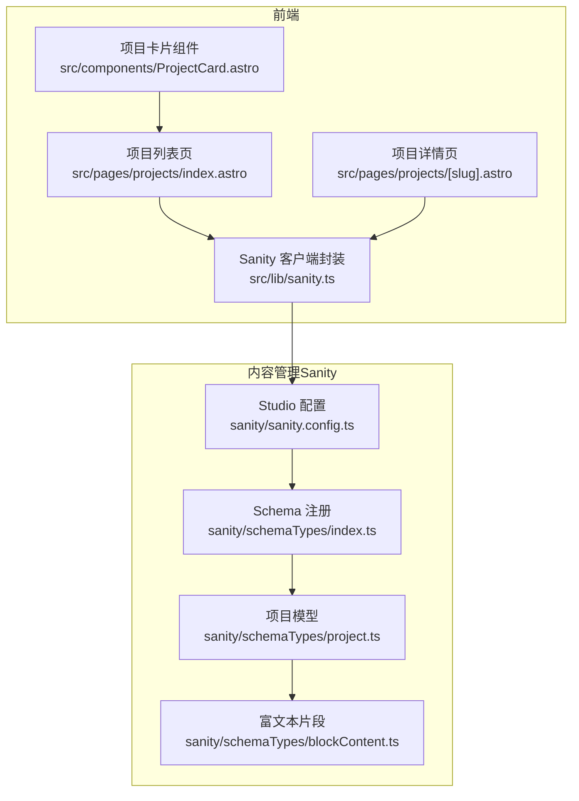
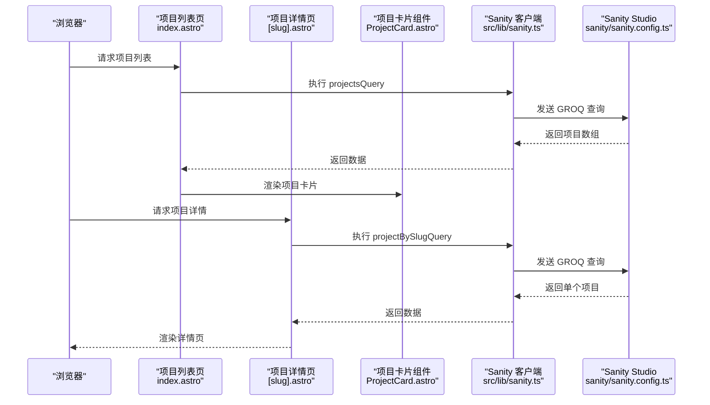
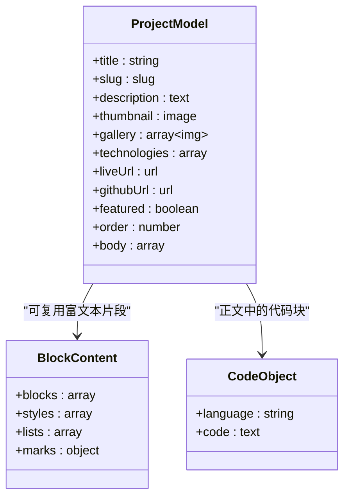
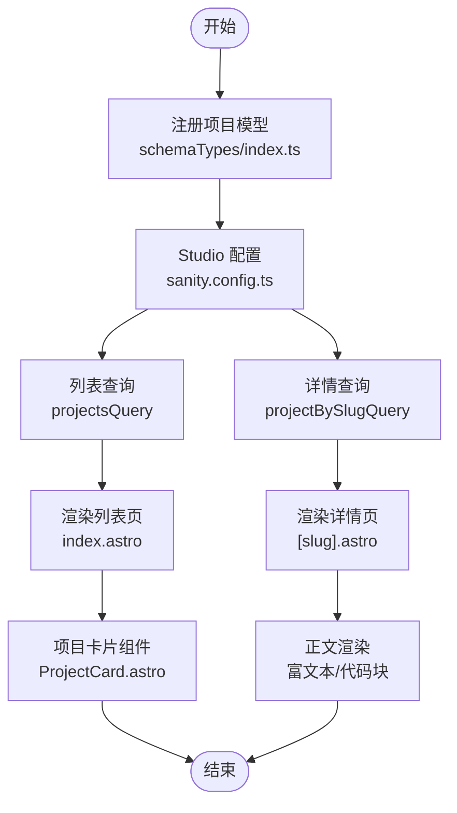
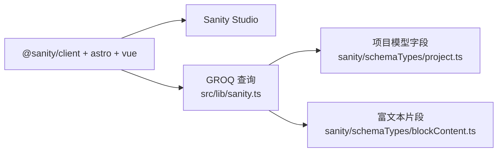

# 项目作品模型

<cite>
**本文引用的文件**
- [sanity/schemaTypes/project.ts](file://sanity/schemaTypes/project.ts)
- [sanity/schemaTypes/index.ts](file://sanity/schemaTypes/index.ts)
- [sanity/sanity.config.ts](file://sanity/sanity.config.ts)
- [sanity/schemaTypes/blockContent.ts](file://sanity/schemaTypes/blockContent.ts)
- [src/lib/sanity.ts](file://src/lib/sanity.ts)
- [src/pages/projects/index.astro](file://src/pages/projects/index.astro)
- [src/pages/projects/[slug].astro](file://src/pages/projects/[slug].astro)
- [src/components/ProjectCard.astro](file://src/components/ProjectCard.astro)
- [package.json](file://package.json)
</cite>

## 目录
1. [简介](#简介)
2. [项目结构](#项目结构)
3. [核心组件](#核心组件)
4. [架构总览](#架构总览)
5. [详细组件分析](#详细组件分析)
6. [依赖分析](#依赖分析)
7. [性能考虑](#性能考虑)
8. [故障排查指南](#故障排查指南)
9. [结论](#结论)
10. [附录](#附录)

## 简介
本文件系统性地文档化“项目作品”内容模型的设计与实现，覆盖字段定义、验证策略、数据映射与协作关系，并结合实际代码示例路径说明数组与对象复合类型的使用方式。重点包括：
- 基础必填项：title（标题）、slug（URL别名）
- 辅助信息：description（描述）、technologies（技术栈标签）
- 媒体资源：thumbnail（封面图）、gallery（图集），二者均支持图像热点
- 外链地址：liveUrl（在线预览）、githubUrl（源码仓库）
- 展示控制：featured（是否推荐）、order（排序值）
- 正文内容：body（富文本与代码块嵌入）
- CMS 预览映射：preview 中 media 字段的映射逻辑
- 数据验证与查询：GROQ 查询与前端渲染

## 项目结构
项目采用前后端分离的结构：
- 前端（Astro + Vue）负责页面渲染与交互
- 内容管理（Sanity）负责内容模型与数据存储
- 通过 @sanity/client 与 Sanity API 通信，使用 GROQ 查询数据

图表来源
- [sanity/sanity.config.ts](file://sanity/sanity.config.ts#L1-L31)
- [sanity/schemaTypes/index.ts](file://sanity/schemaTypes/index.ts#L1-L10)
- [sanity/schemaTypes/project.ts](file://sanity/schemaTypes/project.ts#L1-L97)
- [sanity/schemaTypes/blockContent.ts](file://sanity/schemaTypes/blockContent.ts#L1-L90)
- [src/lib/sanity.ts](file://src/lib/sanity.ts#L1-L99)
- [src/pages/projects/index.astro](file://src/pages/projects/index.astro#L1-L171)
- [src/pages/projects/[slug].astro](file://src/pages/projects/[slug].astro#L1-L162)
- [src/components/ProjectCard.astro](file://src/components/ProjectCard.astro#L1-L80)

章节来源
- [sanity/sanity.config.ts](file://sanity/sanity.config.ts#L1-L31)
- [sanity/schemaTypes/index.ts](file://sanity/schemaTypes/index.ts#L1-L10)
- [sanity/schemaTypes/project.ts](file://sanity/schemaTypes/project.ts#L1-L97)
- [sanity/schemaTypes/blockContent.ts](file://sanity/schemaTypes/blockContent.ts#L1-L90)
- [src/lib/sanity.ts](file://src/lib/sanity.ts#L1-L99)
- [src/pages/projects/index.astro](file://src/pages/projects/index.astro#L1-L171)
- [src/pages/projects/[slug].astro](file://src/pages/projects/[slug].astro#L1-L162)
- [src/components/ProjectCard.astro](file://src/components/ProjectCard.astro#L1-L80)
- [package.json](file://package.json#L1-L28)

## 核心组件
- 项目模型（project）：定义标题、URL 别名、描述、封面图、图集、技术栈、外链、推荐与排序、正文等字段，并在 preview 中将媒体字段映射为 thumbnail，便于在 Sanity 结构工具中直观预览。
- 富文本片段（blockContent）：提供块级内容、样式、列表、内联标记与链接注解，作为可复用的富文本片段类型。
- 前端查询与渲染：通过 GROQ 查询获取项目列表与详情，前端页面组件负责展示与交互。
- 项目卡片组件：负责在列表页渲染项目卡片，包含精选徽标、缩略图、技术标签等。

章节来源
- [sanity/schemaTypes/project.ts](file://sanity/schemaTypes/project.ts#L1-L97)
- [sanity/schemaTypes/blockContent.ts](file://sanity/schemaTypes/blockContent.ts#L1-L90)
- [src/lib/sanity.ts](file://src/lib/sanity.ts#L1-L99)
- [src/components/ProjectCard.astro](file://src/components/ProjectCard.astro#L1-L80)

## 架构总览
下图展示了从前端到内容管理系统的数据流与职责分工。

图表来源
- [src/lib/sanity.ts](file://src/lib/sanity.ts#L1-L99)
- [src/pages/projects/index.astro](file://src/pages/projects/index.astro#L1-L171)
- [src/pages/projects/[slug].astro](file://src/pages/projects/[slug].astro#L1-L162)
- [src/components/ProjectCard.astro](file://src/components/ProjectCard.astro#L1-L80)
- [sanity/sanity.config.ts](file://sanity/sanity.config.ts#L1-L31)

## 详细组件分析

### 项目模型字段与验证策略
- 必填项
  - title：字符串类型，必填
  - slug：slug 类型，基于 title 自动生成，必填
- 媒体字段
  - thumbnail：图片类型，启用热点（hotspot），用于封面图
  - gallery：数组类型，元素为图片类型，启用热点，用于图集
- 元信息
  - description：文本类型，用于简要介绍
  - technologies：数组类型，元素为字符串，布局为标签，便于分类筛选
- 外链
  - liveUrl：URL 类型，指向在线预览
  - githubUrl：URL 类型，指向源码仓库
- 展示控制
  - featured：布尔类型，默认初始值为 false，用于首页优先展示
  - order：数字类型，用于手动排序
- 正文
  - body：数组类型，元素可为 block、image 或自定义 object（code），支持富文本与代码块嵌入
- 预览映射
  - preview.select.media 指向 thumbnail，使结构工具在列表中以缩略图预览项目

章节来源
- [sanity/schemaTypes/project.ts](file://sanity/schemaTypes/project.ts#L1-L97)

### 富文本与代码块复合类型
- blockContent 类型（可复用）
  - 支持块级内容、标题层级、列表、内联样式与链接注解
  - 支持插入图片与自定义对象（如代码块）
- 项目正文（body）
  - 采用数组类型，元素可为 block、image 或 object（code）
  - code 对象包含 language 与 code 字段，便于渲染高亮

图表来源
- [sanity/schemaTypes/project.ts](file://sanity/schemaTypes/project.ts#L1-L97)
- [sanity/schemaTypes/blockContent.ts](file://sanity/schemaTypes/blockContent.ts#L1-L90)

章节来源
- [sanity/schemaTypes/project.ts](file://sanity/schemaTypes/project.ts#L1-L97)
- [sanity/schemaTypes/blockContent.ts](file://sanity/schemaTypes/blockContent.ts#L1-L90)

### 数据映射与协作关系
- Sanity Studio 注册
  - 项目模型通过 schemaTypes/index.ts 注册并导出
  - sanity.config.ts 中声明 schema.types 为 schemaTypes，确保 Studio 加载项目模型
- 前端查询
  - src/lib/sanity.ts 提供 projectsQuery 与 projectBySlugQuery，分别用于列表与详情
  - 列表查询中对 thumbnail、gallery、technologies、liveUrl、githubUrl、featured 等字段进行选择
  - 详情查询中对 body、gallery、thumbnail、technologies、liveUrl、githubUrl、featured 等字段进行选择
- 前端渲染
  - 项目列表页 index.astro 使用 ProjectCard 组件渲染卡片
  - 项目详情页 [slug].astro 渲染标题、描述、技术标签、按钮、封面图与正文
  - ProjectCard 组件接收 thumbnail、technologies、featured 等属性，用于展示

图表来源
- [sanity/schemaTypes/index.ts](file://sanity/schemaTypes/index.ts#L1-L10)
- [sanity/sanity.config.ts](file://sanity/sanity.config.ts#L1-L31)
- [src/lib/sanity.ts](file://src/lib/sanity.ts#L1-L99)
- [src/pages/projects/index.astro](file://src/pages/projects/index.astro#L1-L171)
- [src/pages/projects/[slug].astro](file://src/pages/projects/[slug].astro#L1-L162)
- [src/components/ProjectCard.astro](file://src/components/ProjectCard.astro#L1-L80)

章节来源
- [sanity/schemaTypes/index.ts](file://sanity/schemaTypes/index.ts#L1-L10)
- [sanity/sanity.config.ts](file://sanity/sanity.config.ts#L1-L31)
- [src/lib/sanity.ts](file://src/lib/sanity.ts#L1-L99)
- [src/pages/projects/index.astro](file://src/pages/projects/index.astro#L1-L171)
- [src/pages/projects/[slug].astro](file://src/pages/projects/[slug].astro#L1-L162)
- [src/components/ProjectCard.astro](file://src/components/ProjectCard.astro#L1-L80)

### 预览配置与媒体字段映射
- preview.select.title 指向项目 title，preview.select.media 指向 thumbnail
- 在 Sanity 结构工具中，列表项将以 thumbnail 作为媒体预览，提升编辑体验
- 该映射仅影响后台预览，不影响前端查询与渲染

章节来源
- [sanity/schemaTypes/project.ts](file://sanity/schemaTypes/project.ts#L93-L97)

### 数据验证策略
- 必填校验
  - title 与 slug 字段在模型层设置为必填
- 自动化生成
  - slug 通过 source: 'title' 自动生成，maxLength 限制为 96
- 图片热点
  - thumbnail 与 gallery 中的图片均启用 hotspot，便于在编辑器中精确定位裁剪焦点
- 技术栈标签
  - technologies 以标签布局呈现，便于快速选择与筛选
- URL 类型
  - liveUrl 与 githubUrl 为 URL 类型，保证输入格式正确

章节来源
- [sanity/schemaTypes/project.ts](file://sanity/schemaTypes/project.ts#L1-L97)

### 数组与对象复合类型应用场景
- technologies（数组<string>）
  - 场景：技术栈筛选与标签展示
  - 实现：数组类型 + 标签布局
- gallery（数组<image>）
  - 场景：项目图集展示
  - 实现：数组元素为图片类型，启用热点
- body（数组）
  - 场景：富文本正文与代码块
  - 实现：元素可为 block、image 或 object（code），其中 code 对象包含 language 与 code 字段
- code 对象（object）
  - 场景：在富文本中嵌入代码块
  - 实现：定义 language 与 code 字段，便于渲染高亮

章节来源
- [sanity/schemaTypes/project.ts](file://sanity/schemaTypes/project.ts#L1-L97)
- [sanity/schemaTypes/blockContent.ts](file://sanity/schemaTypes/blockContent.ts#L1-L90)

## 依赖分析
- 前端依赖
  - @sanity/client：与 Sanity API 通信
  - astro：静态站点生成与页面渲染
  - vue：Vue 组件集成
- 后端依赖
  - Sanity Studio：内容模型与数据管理
- 关键耦合点
  - 前端通过 GROQ 查询与 Sanity API 交互
  - 项目模型字段与查询字段需保持一致，否则会出现字段缺失或类型不匹配

图表来源
- [package.json](file://package.json#L1-L28)
- [src/lib/sanity.ts](file://src/lib/sanity.ts#L1-L99)
- [sanity/schemaTypes/project.ts](file://sanity/schemaTypes/project.ts#L1-L97)
- [sanity/schemaTypes/blockContent.ts](file://sanity/schemaTypes/blockContent.ts#L1-L90)

章节来源
- [package.json](file://package.json#L1-L28)
- [src/lib/sanity.ts](file://src/lib/sanity.ts#L1-L99)
- [sanity/schemaTypes/project.ts](file://sanity/schemaTypes/project.ts#L1-L97)
- [sanity/schemaTypes/blockContent.ts](file://sanity/schemaTypes/blockContent.ts#L1-L90)

## 性能考虑
- CDN 使用：前端客户端启用 CDN，减少网络延迟
- 图片优化：thumbnail 与 gallery 使用 Sanity 资产 URL，建议在前端按需加载与懒加载
- 查询粒度：仅选择所需字段，避免传输冗余数据
- 排序与筛选：列表页按 order 升序排序，详情页按 slug 查询，减少不必要的计算

章节来源
- [src/lib/sanity.ts](file://src/lib/sanity.ts#L1-L99)

## 故障排查指南
- 字段缺失或类型不匹配
  - 确认前端查询字段与项目模型字段一致
  - 检查 GROQ 查询中是否遗漏 thumbnail、gallery、technologies 等字段
- 预览媒体未显示
  - 确认 preview.select.media 指向 thumbnail
  - 确保 thumbnail 已上传并有效
- 技术栈标签未显示
  - 确认 technologies 为数组<string>，并在前端组件中正确遍历
- 代码块渲染异常
  - 确认 body 中的 code 对象包含 language 与 code 字段
  - 确认前端渲染逻辑正确解析并渲染代码块
- 排序与筛选问题
  - 确认 order 字段存在且为数字类型
  - 确认列表查询中使用 order asc 排序

章节来源
- [sanity/schemaTypes/project.ts](file://sanity/schemaTypes/project.ts#L1-L97)
- [src/lib/sanity.ts](file://src/lib/sanity.ts#L1-L99)
- [src/pages/projects/index.astro](file://src/pages/projects/index.astro#L1-L171)
- [src/pages/projects/[slug].astro](file://src/pages/projects/[slug].astro#L1-L162)
- [src/components/ProjectCard.astro](file://src/components/ProjectCard.astro#L1-L80)

## 结论
项目作品模型围绕“可编辑、可展示、可筛选”的目标设计，通过 Sanity 的强类型模型与 Astro 的静态渲染能力，实现了从内容创作到页面展示的完整闭环。字段层面强调必填与验证，媒体层面支持热点裁剪，正文层面支持富文本与代码块，前端通过 GROQ 查询与组件渲染实现高性能展示。推荐在后续迭代中持续完善字段约束与前端渲染策略，以进一步提升内容质量与用户体验。

## 附录
- 关键实现路径参考
  - 项目模型定义：[sanity/schemaTypes/project.ts](file://sanity/schemaTypes/project.ts#L1-L97)
  - 富文本片段定义：[sanity/schemaTypes/blockContent.ts](file://sanity/schemaTypes/blockContent.ts#L1-L90)
  - Studio 配置与注册：[sanity/sanity.config.ts](file://sanity/sanity.config.ts#L1-L31)、[sanity/schemaTypes/index.ts](file://sanity/schemaTypes/index.ts#L1-L10)
  - 前端查询封装：[src/lib/sanity.ts](file://src/lib/sanity.ts#L1-L99)
  - 列表页渲染：[src/pages/projects/index.astro](file://src/pages/projects/index.astro#L1-L171)
  - 详情页渲染：[src/pages/projects/[slug].astro](file://src/pages/projects/[slug].astro#L1-L162)
  - 项目卡片组件：[src/components/ProjectCard.astro](file://src/components/ProjectCard.astro#L1-L80)
  - 依赖声明：[package.json](file://package.json#L1-L28)