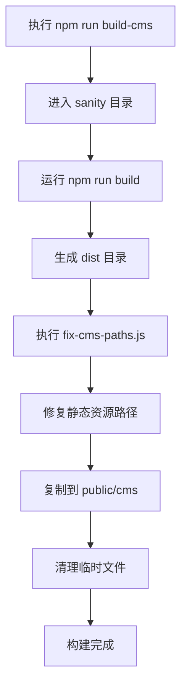
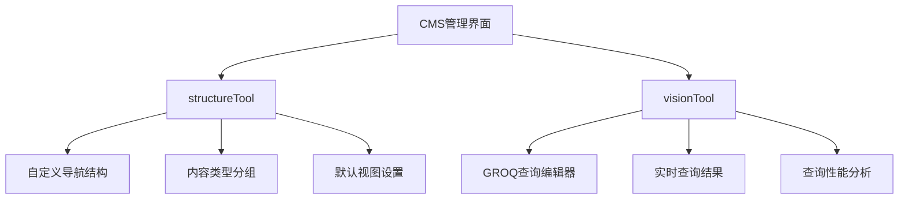
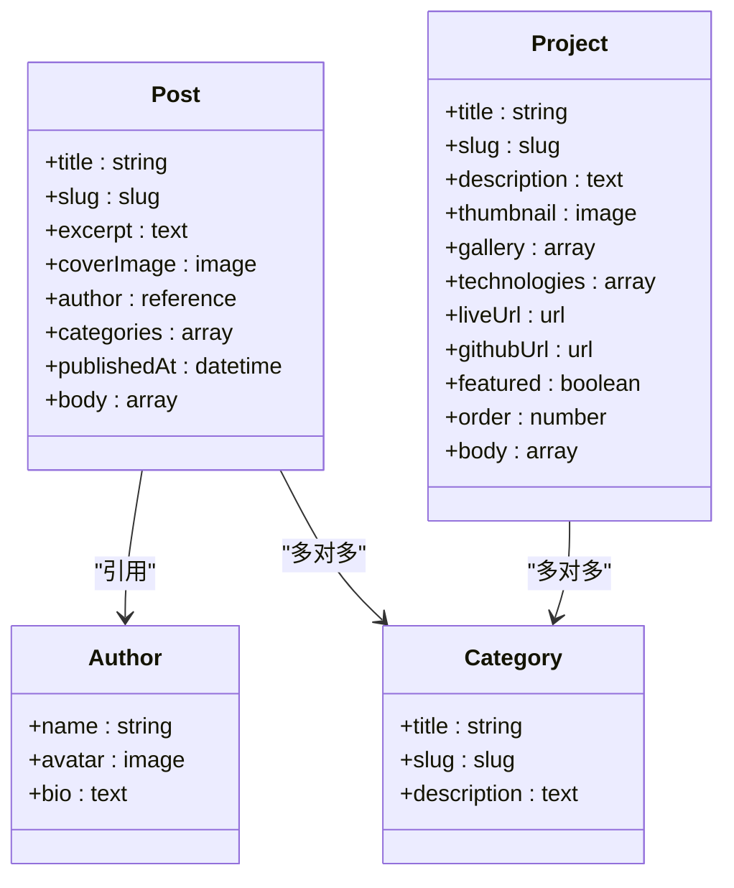

# CMS配置

<cite>
**本文档中引用的文件**  
- [sanity.config.ts](file://sanity/sanity.config.ts)
- [sanity.cli.ts](file://sanity/sanity.cli.ts)
- [schemaTypes/index.ts](file://sanity/schemaTypes/index.ts)
- [schemaTypes/post.ts](file://sanity/schemaTypes/post.ts)
- [schemaTypes/author.ts](file://sanity/schemaTypes/author.ts)
- [schemaTypes/category.ts](file://sanity/schemaTypes/category.ts)
- [schemaTypes/project.ts](file://sanity/schemaTypes/project.ts)
- [package.json](file://sanity/package.json)
- [build-cms.bat](file://scripts/build-cms.bat)
- [fix-cms-paths.js](file://scripts/fix-cms-paths.js)
- [cms.astro](file://src/pages/cms.astro)
- [sanity.ts](file://src/lib/sanity.ts)
</cite>

## 目录
1. [简介](#简介)
2. [核心配置项详解](#核心配置项详解)
3. [basePath配置与部署协同](#basepath配置与部署协同)
4. [插件功能说明](#插件功能说明)
5. [内容模型注册机制](#内容模型注册机制)
6. [CLI命令解析](#cli命令解析)
7. [配置安全建议](#配置安全建议)

## 简介
本项目采用Sanity作为无头CMS（Headless CMS），通过`sanity.config.ts`和`sanity.cli.ts`两个核心配置文件实现内容管理系统的定制化配置。系统包含博客文章、作者、分类、项目等多类型内容模型，并通过CLI工具链实现本地开发、构建与部署的完整流程。前端使用Astro框架集成CMS内容，形成完整的全栈解决方案。

## 核心配置项详解

`sanity.config.ts`文件中的`projectId`、`dataset`和`apiVersion`是连接Sanity后端服务的核心参数，直接影响数据存储、访问和版本兼容性。

### projectId
`projectId`是Sanity项目在云端的唯一标识符，用于定位特定的数据存储实例。在当前配置中，`projectId: 'k2j30muc'`将前端应用与Sanity云平台上的特定项目关联。该ID在所有与Sanity API的交互中都是必需的，包括数据查询、内容创建和管理界面访问。

### dataset
`dataset`定义了数据的逻辑分区，当前配置为`dataset: 'production'`，表示使用生产环境的数据集。Sanity允许在同一项目中创建多个数据集（如`staging`、`development`），便于实现多环境隔离。生产数据集通常包含正式发布的内容，具有严格的访问控制和备份策略。

### apiVersion
虽然`sanity.config.ts`中未显式定义`apiVersion`，但在前端数据访问层`src/lib/sanity.ts`中明确指定了`apiVersion: '2024-01-01'`。此版本号确保客户端使用特定日期的API契约，避免因后端API变更导致的兼容性问题。固定API版本是生产环境的最佳实践，可防止意外的破坏性更新影响应用稳定性。

**Section sources**
- [sanity.config.ts](file://sanity/sanity.config.ts#L10-L11)
- [sanity.ts](file://src/lib/sanity.ts#L6)

## basePath配置与部署协同

`basePath`配置项在`sanity.config.ts`中设置为`'/cms'`，这一配置决定了CMS管理界面的访问路径和静态资源的引用方式。

### 访问路径影响
设置`basePath: '/cms'`后，CMS管理界面将通过`/cms`路径访问，而非根路径。例如，在本地开发环境中，用户需访问`http://localhost:3333/cms`才能进入内容管理后台。这一配置避免了与前端应用根路径的冲突，实现了CMS与前端站点的路径隔离。

### 构建部署协同
`basePath`配置与前端构建流程紧密协同。`package.json`中的构建脚本`"build": "sanity build --base-path /cms"`明确传递了基础路径参数，确保生成的静态文件使用正确的资源引用。构建后的文件通过`build-cms.bat`脚本复制到`public/cms`目录，并由`fix-cms-paths.js`脚本进行路径修复，确保所有静态资源（JS、CSS、图片）的引用路径正确指向`/cms/static/`。

**Diagram sources**
- [sanity.config.ts](file://sanity/sanity.config.ts#L15)
- [package.json](file://sanity/package.json#L10)
- [build-cms.bat](file://scripts/build-cms.bat)
- [fix-cms-paths.js](file://scripts/fix-cms-paths.js)

**Section sources**
- [sanity.config.ts](file://sanity/sanity.config.ts#L13-L15)
- [package.json](file://sanity/package.json#L10)
- [build-cms.bat](file://scripts/build-cms.bat)
- [fix-cms-paths.js](file://scripts/fix-cms-paths.js)

## 插件功能说明

Sanity通过插件系统扩展核心功能，当前配置中启用了`structureTool`和`visionTool`两个关键插件。

### structureTool
`structureTool`提供了CMS内容结构的可视化管理界面，允许管理员自定义内容类型在管理面板中的组织方式。通过该插件，可以创建自定义的导航结构、分组内容类型、设置默认视图等，提升内容管理的效率和用户体验。

### visionTool
`visionTool`是Sanity的查询调试工具，集成在CMS管理界面中。它提供了一个交互式的GROQ（Graph-Relational Object Queries）查询编辑器，允许开发者实时测试和调试数据查询。该工具对于开发阶段的数据模型验证和前端数据获取逻辑调试至关重要。

**Diagram sources**
- [sanity.config.ts](file://sanity/sanity.config.ts#L2-L3)
- [sanity.config.ts](file://sanity/sanity.config.ts#L22)

**Section sources**
- [sanity.config.ts](file://sanity/sanity.config.ts#L2-L3)
- [sanity.config.ts](file://sanity/sanity.config.ts#L22)

## 内容模型注册机制

内容模型通过`schemaTypes`机制注册到CMS中，实现数据结构的定义和管理。

### 模型定义
每个内容类型（如博客文章、作者、项目）在`schemaTypes`目录下有独立的TypeScript文件。这些文件使用`defineType`和`defineField`函数定义数据结构。例如，`post.ts`定义了博客文章的标题、摘要、封面图、作者引用、分类数组、发布时间和正文等字段。

### 模型注册
`schemaTypes/index.ts`文件负责将所有内容模型聚合并导出。通过`import`语句引入各个模型文件，并在`schemaTypes`数组中注册。`sanity.config.ts`通过`import {schemaTypes} from './schemaTypes'`引入该数组，并在`schema.types`配置项中使用，完成模型到CMS的注册。

**Diagram sources**
- [schemaTypes/index.ts](file://sanity/schemaTypes/index.ts)
- [schemaTypes/post.ts](file://sanity/schemaTypes/post.ts)
- [schemaTypes/author.ts](file://sanity/schemaTypes/author.ts)
- [schemaTypes/category.ts](file://sanity/schemaTypes/category.ts)
- [schemaTypes/project.ts](file://sanity/schemaTypes/project.ts)

**Section sources**
- [schemaTypes/index.ts](file://sanity/schemaTypes/index.ts)
- [schemaTypes/post.ts](file://sanity/schemaTypes/post.ts)
- [schemaTypes/author.ts](file://sanity/schemaTypes/author.ts)
- [schemaTypes/category.ts](file://sanity/schemaTypes/category.ts)
- [schemaTypes/project.ts](file://sanity/schemaTypes/project.ts)
- [sanity.config.ts](file://sanity/sanity.config.ts#L4)
- [sanity.config.ts](file://sanity/sanity.config.ts#L25-L26)

## CLI命令解析

`sanity.cli.ts`文件定义了CLI工具的配置，支持项目初始化、配置验证和脚本扩展。

### API配置
`api`对象在CLI配置中重复定义了`projectId`和`dataset`，确保CLI命令（如`sanity deploy`、`sanity graphql deploy`）能够正确连接到指定的Sanity项目。这种配置冗余是必要的，因为CLI工具需要独立于运行时配置进行操作。

### 部署配置
`deployment`对象配置了自动更新功能（`autoUpdates: true`），允许Sanity Studio在部署后自动接收官方更新。`appId`字段被注释，提示在实际部署时需要提供有效的应用ID，用于标识和管理部署的Studio实例。

### 脚本集成
CLI命令通过`package.json`中的脚本与项目构建流程集成。例如，`"dev": "sanity dev"`启动本地开发服务器，`"build": "sanity build --base-path /cms"`执行带路径参数的构建，`"deploy": "sanity deploy"`将CMS部署到云端。这些脚本简化了开发和部署操作，提高了工作效率。

**Section sources**
- [sanity.cli.ts](file://sanity/sanity.cli.ts)
- [package.json](file://sanity/package.json#L8-L12)

## 配置安全建议

为确保系统安全，应遵循以下配置管理最佳实践。

### 环境变量管理
敏感信息如`projectId`和`dataset`虽非机密，但仍建议通过环境变量管理。创建`.env`文件存储这些配置，并在`sanity.config.ts`和`sanity.cli.ts`中通过`process.env`读取。这样可以避免在代码中硬编码配置，便于在不同环境中切换。

### 访问控制
生产环境的`dataset`应配置严格的访问控制策略，限制数据读写权限。使用Sanity的身份验证机制，确保只有授权用户才能访问CMS管理界面和API端点。

### 版本锁定
在生产环境中，应锁定`apiVersion`并定期评估是否升级。避免使用最新版本的API，以防止意外的破坏性变更影响系统稳定性。

**Section sources**
- [sanity.config.ts](file://sanity/sanity.config.ts)
- [sanity.cli.ts](file://sanity/sanity.cli.ts)
- [sanity.ts](file://src/lib/sanity.ts#L6)