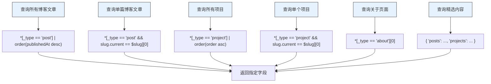
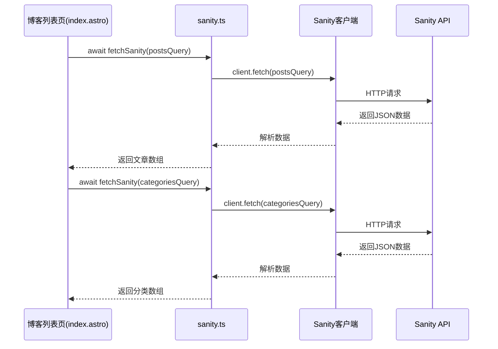

# 内容管理

<cite>
**本文档中引用的文件**  
- [sanity.config.ts](file://sanity/sanity.config.ts)
- [sanity.cli.ts](file://sanity/sanity.cli.ts)
- [sanity.ts](file://src/lib/sanity.ts)
- [index.astro](file://src/pages/blog/index.astro)
- [post.ts](file://sanity/schemaTypes/post.ts)
- [project.ts](file://sanity/schemaTypes/project.ts)
- [about.ts](file://sanity/schemaTypes/about.ts)
- [package.json](file://sanity/package.json)
- [package.json](file://package.json)
- [blog/[slug].astro](file://src/pages/blog/[slug].astro)
- [projects/[slug].astro](file://src/pages/projects/[slug].astro)
</cite>

## 目录
1. [项目结构](#项目结构)
2. [Sanity 配置详解](#sanity-配置详解)
3. [Sanity CLI 配置](#sanity-cli-配置)
4. [Sanity 客户端初始化与数据获取](#sanity-客户端初始化与数据获取)
5. [GROQ 查询封装](#groq-查询封装)
6. [数据获取流程](#数据获取流程)
7. [错误处理与缓存策略](#错误处理与缓存策略)
8. [前端展示链路](#前端展示链路)
9. [安全与最佳实践](#安全与最佳实践)

## 项目结构

本项目采用模块化架构，分为CMS管理后台和前端展示两大部分。Sanity CMS位于`sanity/`目录下，包含schema定义和配置文件；前端应用位于`src/`目录下，使用Astro框架构建。`public/cms/`目录存放构建后的CMS静态资源，通过`/cms`路径访问。

```mermaid
graph TB
subgraph "CMS 后端"
A[sanity.config.ts] --> B[schemaTypes]
C[sanity.cli.ts] --> A
D[package.json] --> C
end
subgraph "前端展示"
E[sanity.ts] --> F[Sanity Client]
G[blog/index.astro] --> E
H[blog/[slug].astro] --> E
I[projects/index.astro] --> E
J[projects/[slug].astro] --> E
end
F --> |API 调用| K[(Sanity Cloud)]
A --> |配置| F
C --> |部署配置| A
style A fill:#f9f,stroke:#333
style C fill:#f9f,stroke:#333
style E fill:#5bc0de,stroke:#333
```

**图示来源**
- [sanity.config.ts](file://sanity/sanity.config.ts#L1-L31)
- [sanity.cli.ts](file://sanity/sanity.cli.ts#L1-L20)
- [sanity.ts](file://src/lib/sanity.ts#L1-L99)

**本节来源**
- [sanity.config.ts](file://sanity/sanity.config.ts#L1-L31)
- [sanity.cli.ts](file://sanity/sanity.cli.ts#L1-L20)
- [sanity/package.json](file://sanity/package.json#L1-L38)
- [package.json](file://package.json#L1-L28)

## Sanity 配置详解

`sanity.config.ts`文件定义了CMS的核心配置，包括项目ID、数据集、基础路径等关键信息。`projectId`和`dataset`是连接到Sanity云端服务的唯一标识，必须与Sanity项目设置保持一致。`basePath`配置为`/cms`，确保CMS管理界面在正确路径下运行。`schemaTypes`导入了所有内容模型定义，构成了CMS的数据结构基础。

**本节来源**
- [sanity.config.ts](file://sanity/sanity.config.ts#L1-L31)
- [sanity/schemaTypes/index.ts](file://sanity/schemaTypes/index.ts#L1-L10)

## Sanity CLI 配置

`sanity.cli.ts`文件配置了CLI工具的行为，主要用于本地开发和部署。`api`部分的`projectId`和`dataset`必须与`sanity.config.ts`保持一致，确保CLI命令能正确连接到指定项目。`deployment.autoUpdates`设置为`true`，启用自动更新功能，确保CMS管理界面始终保持最新版本。

**本节来源**
- [sanity.cli.ts](file://sanity/sanity.cli.ts#L1-L20)
- [sanity/package.json](file://sanity/package.json#L8-L12)

## Sanity 客户端初始化与数据获取

`src/lib/sanity.ts`文件初始化Sanity客户端，配置了与CMS后端通信所需的所有参数。`projectId`和`dataset`与配置文件保持一致，`apiVersion`固定为`2024-01-01`，确保API行为的稳定性。`useCdn`设置为`true`，启用CDN缓存，提高数据获取性能。客户端通过`fetchSanity`函数封装了错误处理逻辑，确保在API调用失败时能正确捕获和处理异常。

```mermaid
classDiagram
class SanityClient {
+projectId : string
+dataset : string
+apiVersion : string
+useCdn : boolean
+fetch~T~(query : string, params : object) : Promise~T~
}
class fetchSanity {
+fetchSanity~T~(query : string, params : object) : Promise~T~
}
fetchSanity --> SanityClient : "使用"
note right of SanityClient
初始化配置 :
- projectId : k2j30muc
- dataset : production
- apiVersion : 2024-01-01
- useCdn : true
end note
```

**图示来源**
- [sanity.ts](file://src/lib/sanity.ts#L1-L99)

**本节来源**
- [sanity.ts](file://src/lib/sanity.ts#L1-L99)

## GROQ 查询封装

`src/lib/sanity.ts`文件封装了多个GROQ查询，用于获取不同类型的内容。`postsQuery`获取所有博客文章，按发布时间倒序排列；`postBySlugQuery`通过slug获取单篇博客文章；`projectsQuery`获取所有项目，按顺序字段排序；`projectBySlugQuery`通过slug获取单个项目；`aboutQuery`获取关于页面内容；`featuredContentQuery`获取首页展示的精选内容。这些查询使用了Sanity的投影语法，精确控制返回的字段，减少数据传输量。



**图示来源**
- [sanity.ts](file://src/lib/sanity.ts#L10-L90)

**本节来源**
- [sanity.ts](file://src/lib/sanity.ts#L10-L90)
- [post.ts](file://sanity/schemaTypes/post.ts#L1-L84)
- [project.ts](file://sanity/schemaTypes/project.ts#L1-L97)

## 数据获取流程

数据获取流程从前端页面发起，通过封装的Sanity客户端与CMS后端通信。以博客列表页为例，`src/pages/blog/index.astro`文件在构建时通过`fetchSanity`函数执行`postsQuery`和`categoriesQuery`，获取所有博客文章和分类数据。这些数据在构建时被序列化为JSON，注入到页面中，实现静态生成。单篇文章页使用动态路由`[slug].astro`，通过`getStaticPaths`预生成所有文章路径，确保SEO友好。



**图示来源**
- [index.astro](file://src/pages/blog/index.astro#L7-L8)
- [sanity.ts](file://src/lib/sanity.ts#L92-L99)

**本节来源**
- [index.astro](file://src/pages/blog/index.astro#L1-L321)
- [sanity.ts](file://src/lib/sanity.ts#L92-L99)

## 错误处理与缓存策略

系统实现了完善的错误处理机制。`fetchSanity`函数使用try-catch捕获所有API调用异常，记录错误日志后重新抛出，确保调用方能正确处理错误。`useCdn: true`配置启用了Sanity的CDN缓存，显著提高数据获取性能，减少API调用延迟。对于实时性要求高的场景，可临时设置`useCdn: false`获取最新数据。

**本节来源**
- [sanity.ts](file://src/lib/sanity.ts#L92-L98)
- [index.astro](file://src/pages/blog/index.astro#L7-L8)

## 前端展示链路

从CMS后端到前端展示的完整链路包括：内容创作者在CMS管理界面编辑内容 → Sanity保存数据到云端 → 前端构建时通过GROQ查询获取数据 → Astro框架生成静态页面 → CDN分发页面内容。博客文章页通过`PortableText`组件渲染富文本内容，支持代码块、图片等复杂格式。项目展示页使用卡片布局，突出显示项目缩略图和技术栈。

**本节来源**
- [index.astro](file://src/pages/blog/index.astro#L1-L321)
- [blog/[slug].astro](file://src/pages/blog/[slug].astro#L1-L127)
- [projects/index.astro](file://src/pages/projects/index.astro#L1-L171)
- [projects/[slug].astro](file://src/pages/projects/[slug].astro#L1-L162)

## 安全与最佳实践

为安全高效地与CMS API交互，建议遵循以下最佳实践：始终使用环境变量管理敏感配置，避免硬编码；合理使用CDN缓存提高性能；通过GROQ查询精确控制返回字段，减少数据传输；在生产环境启用API版本锁定，避免意外变更；定期审查API调用日志，监控异常访问。项目ID和数据集名称在代码中直接使用，因为它们不构成安全风险，且需要在构建时确定。

**本节来源**
- [sanity.config.ts](file://sanity/sanity.config.ts#L10-L11)
- [sanity.cli.ts](file://sanity/sanity.cli.ts#L5-L6)
- [sanity.ts](file://src/lib/sanity.ts#L4-L6)