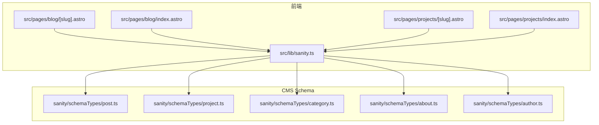
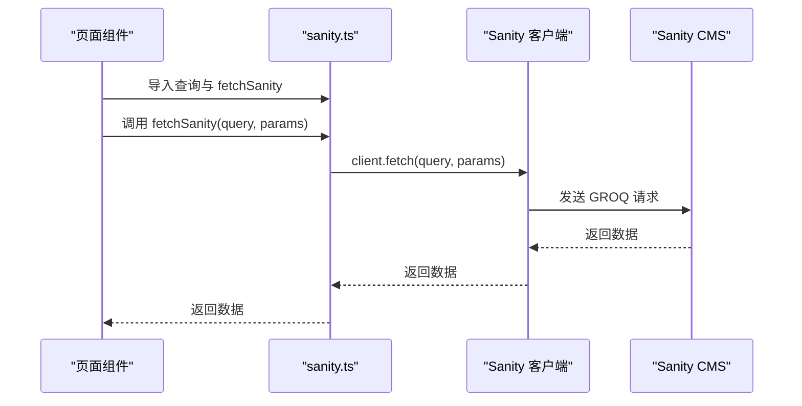
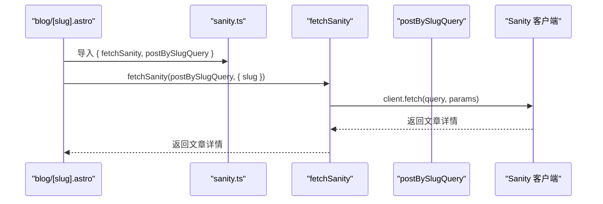
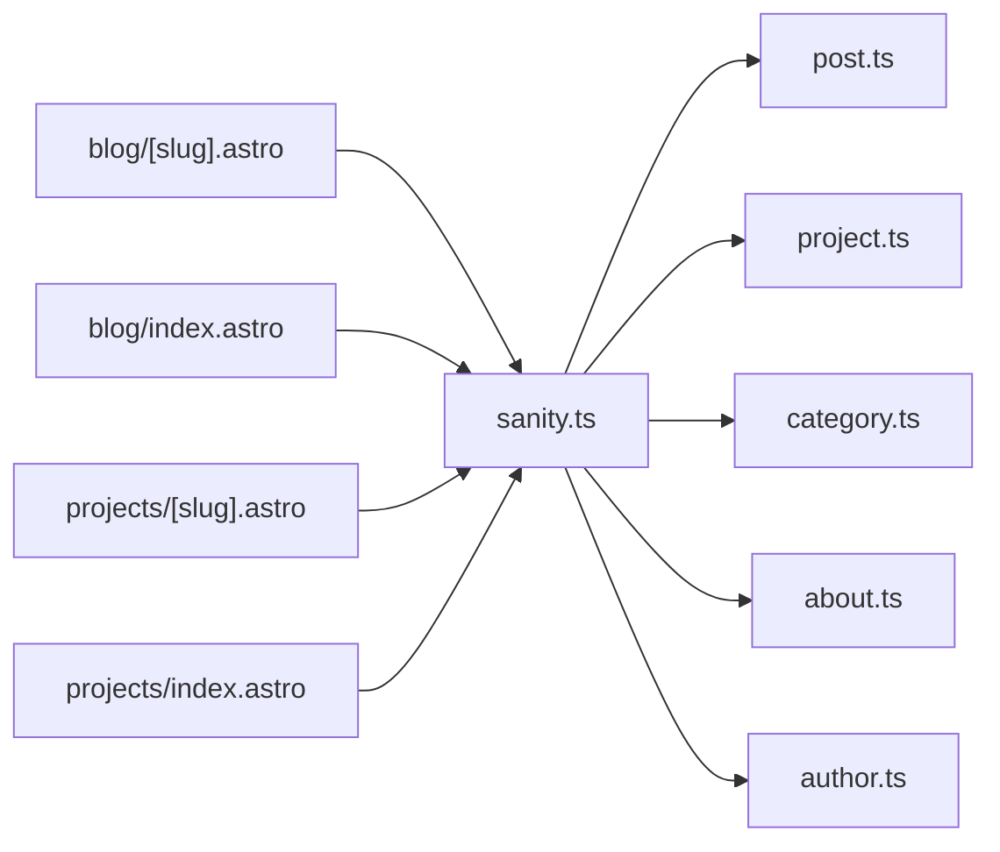

# GROQ查询定义

<cite>
**本文引用的文件**
- [sanity.ts](file://src/lib/sanity.ts)
- [post.ts](file://sanity/schemaTypes/post.ts)
- [project.ts](file://sanity/schemaTypes/project.ts)
- [category.ts](file://sanity/schemaTypes/category.ts)
- [about.ts](file://sanity/schemaTypes/about.ts)
- [author.ts](file://sanity/schemaTypes/author.ts)
- [blog-[slug].astro](file://src/pages/blog/[slug].astro)
- [blog-index.astro](file://src/pages/blog/index.astro)
- [projects-[slug].astro](file://src/pages/projects/[slug].astro)
- [projects-index.astro](file://src/pages/projects/index.astro)
</cite>

## 目录
1. [简介](#简介)
2. [项目结构](#项目结构)
3. [核心组件](#核心组件)
4. [架构总览](#架构总览)
5. [详细组件分析](#详细组件分析)
6. [依赖分析](#依赖分析)
7. [性能考虑](#性能考虑)
8. [故障排查指南](#故障排查指南)
9. [结论](#结论)
10. [附录](#附录)

## 简介
本文件系统性梳理并文档化 src/lib/sanity.ts 中定义的全部 GROQ 查询，包括：
- postsQuery：列出博客文章摘要
- postBySlugQuery：按 slug 获取单篇博客文章详情
- projectsQuery：列出项目摘要
- projectBySlugQuery：按 slug 获取单个项目详情
- categoriesQuery：列出分类
- aboutQuery：获取关于页面内容
- featuredContentQuery：首页精选内容聚合

文档将逐项解析查询结构、投影策略、关联遍历（->）、参数化（$slug）的安全性、字段选择优化、数据模型映射、调试技巧与性能优化建议。

## 项目结构
- 查询定义集中于前端库文件，负责构建 GROQ 查询字符串与统一的数据获取辅助函数
- 数据模型定义位于 sanity/schemaTypes 下，用于理解字段类型与关联关系
- 页面层通过导入查询与辅助函数进行数据拉取与渲染

**图表来源**
- [sanity.ts](file://src/lib/sanity.ts#L1-L99)
- [post.ts](file://sanity/schemaTypes/post.ts#L1-L84)
- [project.ts](file://sanity/schemaTypes/project.ts#L1-L97)
- [category.ts](file://sanity/schemaTypes/category.ts#L1-L26)
- [about.ts](file://sanity/schemaTypes/about.ts#L1-L70)
- [author.ts](file://sanity/schemaTypes/author.ts#L1-L33)
- [blog-[slug].astro](file://src/pages/blog/[slug].astro#L1-L127)
- [blog-index.astro](file://src/pages/blog/index.astro#L1-L321)
- [projects-[slug].astro](file://src/pages/projects/[slug].astro#L1-L162)
- [projects-index.astro](file://src/pages/projects/index.astro#L1-L171)

**章节来源**
- [sanity.ts](file://src/lib/sanity.ts#L1-L99)

## 核心组件
- 客户端初始化：创建 Sanity 客户端实例，配置项目 ID、数据集、API 版本与 CDN 开关
- 查询常量：定义各业务查询字符串
- 辅助函数：统一的 fetchSanity<T>，封装客户端 fetch 并捕获错误

关键点：
- API 版本固定，确保查询行为稳定
- 使用 CDN 提升读取性能
- 参数化查询通过 $slug 防止注入风险
- 严格类型约束 T，便于上层消费时的类型推断

**章节来源**
- [sanity.ts](file://src/lib/sanity.ts#L1-L99)

## 架构总览
查询调用链路如下：

**图表来源**
- [sanity.ts](file://src/lib/sanity.ts#L92-L99)
- [blog-[slug].astro](file://src/pages/blog/[slug].astro#L1-L127)
- [blog-index.astro](file://src/pages/blog/index.astro#L1-L321)

## 详细组件分析

### postsQuery：博客文章列表摘要
- 查询目标：获取所有类型为 post 的文档，按发布时间降序排列
- 投影字段：
  - 基础字段：_id、title、slug、excerpt、publishedAt
  - 关联字段：封面图 -> asset.url；作者 -> name 与头像 -> avatar.asset.url；分类数组 -> title 与 slug
- 结构设计要点：
  - 使用 | order(publishedAt desc) 实现时间倒序
  - categories[]->{} 展开数组关联，仅投影所需字段
  - coverImage.asset->url 直接取媒体 URL，避免多余元数据
- 类型结构（简化）：
  - 数组元素包含：基础字段 + author 对象（name、avatar.url）+ categories 数组（title、slug）
- 性能优化：
  - 仅请求必要字段，减少网络与序列化开销
  - 通过排序与限制数量（见 featuredContentQuery）控制返回规模

**章节来源**
- [sanity.ts](file://src/lib/sanity.ts#L10-L20)
- [post.ts](file://sanity/schemaTypes/post.ts#L1-L84)
- [author.ts](file://sanity/schemaTypes/author.ts#L1-L33)
- [category.ts](file://sanity/schemaTypes/category.ts#L1-L26)

### postBySlugQuery：按 slug 获取单篇博客文章
- 查询目标：根据 slug.current 精确匹配单篇 post
- 参数化：$slug 作为参数传入，避免拼接注入风险
- 投影字段：
  - 基础字段：_id、title、slug、excerpt、body、publishedAt
  - 关联字段：封面图 URL、作者（含 bio）、分类数组
- 结构设计要点：
  - [0] 限定返回单条记录，若无匹配则返回空值
  - author->{} 与 categories[]->{} 展开关联，投影必要字段
- 类型结构（简化）：
  - 单个对象包含：基础字段 + author 对象（name、bio、avatar.url）+ categories 数组（title、slug）

**章节来源**
- [sanity.ts](file://src/lib/sanity.ts#L29-L40)
- [post.ts](file://sanity/schemaTypes/post.ts#L1-L84)
- [author.ts](file://sanity/schemaTypes/author.ts#L1-L33)
- [category.ts](file://sanity/schemaTypes/category.ts#L1-L26)

### projectsQuery：项目列表摘要
- 查询目标：获取所有类型为 project 的文档，按 order 字段升序排列
- 投影字段：
  - 基础字段：_id、title、slug、description、technologies、liveUrl、githubUrl、featured
  - 关联字段：缩略图 -> asset.url
- 结构设计要点：
  - 使用 | order(order asc) 控制展示顺序
  - 仅投影必要字段，避免传输冗余内容
- 类型结构（简化）：
  - 数组元素包含：基础字段 + thumbnail.url

**章节来源**
- [sanity.ts](file://src/lib/sanity.ts#L42-L53)
- [project.ts](file://sanity/schemaTypes/project.ts#L1-L97)

### projectBySlugQuery：按 slug 获取单个项目
- 查询目标：根据 slug.current 精确匹配单个 project
- 参数化：$slug 作为参数传入
- 投影字段：
  - 基础字段：_id、title、slug、description、body、technologies、liveUrl、githubUrl、featured
  - 关联字段：缩略图 URL、画廊数组 -> asset.url
- 结构设计要点：
  - [0] 限定返回单条记录
  - gallery[].asset->url 展开数组媒体 URL
- 类型结构（简化）：
  - 单个对象包含：基础字段 + thumbnail.url + gallery 数组（url）

**章节来源**
- [sanity.ts](file://src/lib/sanity.ts#L55-L68)
- [project.ts](file://sanity/schemaTypes/project.ts#L1-L97)

### categoriesQuery：分类列表
- 查询目标：获取所有类型为 category 的文档，按标题升序排列
- 投影字段：
  - 基础字段：_id、title
  - slug：使用 slug.current
- 结构设计要点：
  - 仅投影必要字段，便于前端筛选与导航
- 类型结构（简化）：
  - 数组元素包含：_id、title、slug

**章节来源**
- [sanity.ts](file://src/lib/sanity.ts#L22-L27)
- [category.ts](file://sanity/schemaTypes/category.ts#L1-L26)

### aboutQuery：关于页面内容
- 查询目标：获取唯一类型为 about 的文档
- 投影字段：
  - 基础字段：title、bio
  - 关联字段：头像 URL
  - 其他字段：skills、experience、education、social
- 结构设计要点：
  - [0] 保证返回单条记录
  - 社交链接等数组字段保持原样，便于前端渲染
- 类型结构（简化）：
  - 单个对象包含：title、bio、avatar.url、skills、experience、education、social

**章节来源**
- [sanity.ts](file://src/lib/sanity.ts#L70-L79)
- [about.ts](file://sanity/schemaTypes/about.ts#L1-L70)

### featuredContentQuery：首页精选内容聚合
- 查询目标：一次性返回精选文章与精选项目
- 结构设计：
  - posts 子查询：按发布时间降序，限制返回 3 条，投影必要字段
  - projects 子查询：按 featured == true 且 order 升序，限制返回 3 条，投影必要字段
- 结构设计要点：
  - 使用 [0...3] 限制数量，提升首屏性能
  - 将两类内容聚合在一个对象中，减少多次请求
- 类型结构（简化）：
  - 对象包含：posts 数组（每项含 _id、title、slug、excerpt、publishedAt、coverImage.url）与 projects 数组（每项含 _id、title、slug、description、thumbnail.url、technologies）

**章节来源**
- [sanity.ts](file://src/lib/sanity.ts#L81-L89)

### 参数化查询与安全性
- 使用 $slug 作为参数，避免字符串拼接导致的注入风险
- fetchSanity<T> 通过客户端 fetch 传参，确保参数被正确序列化与校验
- 优点：
  - 防止 SQL 注入风格的 GROQ 注入
  - 明确边界，便于审计与测试

**章节来源**
- [sanity.ts](file://src/lib/sanity.ts#L29-L40)
- [sanity.ts](file://src/lib/sanity.ts#L55-L68)
- [sanity.ts](file://src/lib/sanity.ts#L92-L99)

### 关联遍历与投影策略
- -> 操作符用于展开引用字段，直接访问关联文档的字段
- []->{} 用于数组引用，对每个元素执行投影
- 优化原则：
  - 仅投影需要的字段，避免返回大体量内容（如 body）
  - 对媒体字段使用 asset->url 直接取 URL，减少嵌套层级

**章节来源**
- [sanity.ts](file://src/lib/sanity.ts#L10-L20)
- [sanity.ts](file://src/lib/sanity.ts#L29-L40)
- [sanity.ts](file://src/lib/sanity.ts#L42-L68)

### 数据模型映射与类型结构
- post 文档：
  - 字段：title、slug、excerpt、coverImage（image）、author（reference）、categories（array of reference）、publishedAt、body（array）
  - 关联：author->name、avatar；categories[]->title、slug
- project 文档：
  - 字段：title、slug、description、thumbnail（image）、gallery（array of image）、technologies（array of string）、liveUrl、githubUrl、featured、order、body（array）
- category 文档：
  - 字段：title、slug、description
- about 文档：
  - 字段：title、avatar（image）、bio、skills（array of object）、experience（array of object）、social（array of object）
- author 文档：
  - 字段：name、avatar（image）、bio

这些映射帮助理解查询投影字段与最终返回数据结构的关系。

**章节来源**
- [post.ts](file://sanity/schemaTypes/post.ts#L1-L84)
- [project.ts](file://sanity/schemaTypes/project.ts#L1-L97)
- [category.ts](file://sanity/schemaTypes/category.ts#L1-L26)
- [about.ts](file://sanity/schemaTypes/about.ts#L1-L70)
- [author.ts](file://sanity/schemaTypes/author.ts#L1-L33)

### 页面使用示例与调用流程
- 博客详情页：动态路由参数 slug，调用 postBySlugQuery 获取详情
- 博客列表页：调用 postsQuery 与 categoriesQuery 获取列表与分类
- 项目详情页：当前实现使用静态示例数据，但结构与查询一致
- 项目列表页：当前实现使用静态示例数据，但结构与查询一致

**图表来源**
- [blog-[slug].astro](file://src/pages/blog/[slug].astro#L1-L127)
- [sanity.ts](file://src/lib/sanity.ts#L92-L99)

**章节来源**
- [blog-[slug].astro](file://src/pages/blog/[slug].astro#L1-L127)
- [blog-index.astro](file://src/pages/blog/index.astro#L1-L321)
- [projects-[slug].astro](file://src/pages/projects/[slug].astro#L1-L162)
- [projects-index.astro](file://src/pages/projects/index.astro#L1-L171)

## 依赖分析
- 组件耦合：
  - sanity.ts 与 sanity/schemaTypes 存在逻辑耦合：查询投影依赖 schema 字段名与类型
  - 页面层与 sanity.ts 强耦合：页面通过导入查询与 fetchSanity 使用数据
- 关联关系：
  - post -> author（one-to-one）
  - post -> categories（many-to-many）
  - project -> gallery（one-to-many）
  - about -> avatar（one-to-one）
- 潜在循环依赖：
  - 未发现循环依赖，模块间为单向依赖（页面 -> sanity.ts -> Sanity）

**图表来源**
- [sanity.ts](file://src/lib/sanity.ts#L1-L99)
- [blog-[slug].astro](file://src/pages/blog/[slug].astro#L1-L127)
- [blog-index.astro](file://src/pages/blog/index.astro#L1-L321)
- [projects-[slug].astro](file://src/pages/projects/[slug].astro#L1-L162)
- [projects-index.astro](file://src/pages/projects/index.astro#L1-L171)
- [post.ts](file://sanity/schemaTypes/post.ts#L1-L84)
- [project.ts](file://sanity/schemaTypes/project.ts#L1-L97)
- [category.ts](file://sanity/schemaTypes/category.ts#L1-L26)
- [about.ts](file://sanity/schemaTypes/about.ts#L1-L70)
- [author.ts](file://sanity/schemaTypes/author.ts#L1-L33)

**章节来源**
- [sanity.ts](file://src/lib/sanity.ts#L1-L99)

## 性能考虑
- 字段选择优化：
  - 仅投影必要字段，避免传输大体量内容（如 body），降低带宽与序列化成本
  - 对媒体字段使用 asset->url 直接取 URL，减少嵌套层级
- 排序与限制：
  - 使用 | order(...) 控制排序，避免前端二次排序
  - 使用 [0...N] 限制返回数量，提升首屏性能（如 featuredContentQuery）
- CDN 使用：
  - 客户端启用 CDN，减少读取延迟
- 参数化查询：
  - 使用 $slug 避免字符串拼接，提高查询稳定性与安全性

**章节来源**
- [sanity.ts](file://src/lib/sanity.ts#L10-L20)
- [sanity.ts](file://src/lib/sanity.ts#L29-L40)
- [sanity.ts](file://src/lib/sanity.ts#L42-L68)
- [sanity.ts](file://src/lib/sanity.ts#L81-L89)

## 故障排查指南
- 常见问题：
  - slug 不匹配：确认 slug.current 是否与数据库一致
  - 关联字段为空：检查引用是否有效，如 author、categories、gallery
  - 字段缺失：确认 schema 是否新增字段，同步更新查询投影
- 调试技巧：
  - 在页面层打印查询结果，核对字段与类型
  - 使用最小投影验证查询是否返回数据
  - 对数组字段进行空值与类型检查（如 categories）
- 错误处理：
  - fetchSanity<T> 已捕获异常并抛出，可在页面层进行友好提示或重定向

**章节来源**
- [sanity.ts](file://src/lib/sanity.ts#L92-L99)
- [blog-[slug].astro](file://src/pages/blog/[slug].astro#L1-L127)
- [blog-index.astro](file://src/pages/blog/index.astro#L1-L321)

## 结论
本文系统梳理了 src/lib/sanity.ts 中的七条 GROQ 查询，覆盖博客、项目、分类、关于页面与首页精选内容。通过对投影策略、关联遍历、参数化与性能优化的分析，明确了查询的设计权衡与最佳实践。建议在新增字段或调整结构时，同步更新查询投影，确保前后端一致性与性能最优。

## 附录
- GROQ 语法要点速查：
  - 条件过滤：[_type == "post" && slug.current == $slug]
  - 排序：| order(field desc/asc)
  - 限制数量：[0...N]
  - 关联展开：->field 或 []->{}
  - 参数化：$param
- 页面与查询对应关系：
  - 博客详情：postBySlugQuery
  - 博客列表：postsQuery、categoriesQuery
  - 项目详情：projectBySlugQuery
  - 项目列表：projectsQuery
  - 首页精选：featuredContentQuery
  - 关于页面：aboutQuery