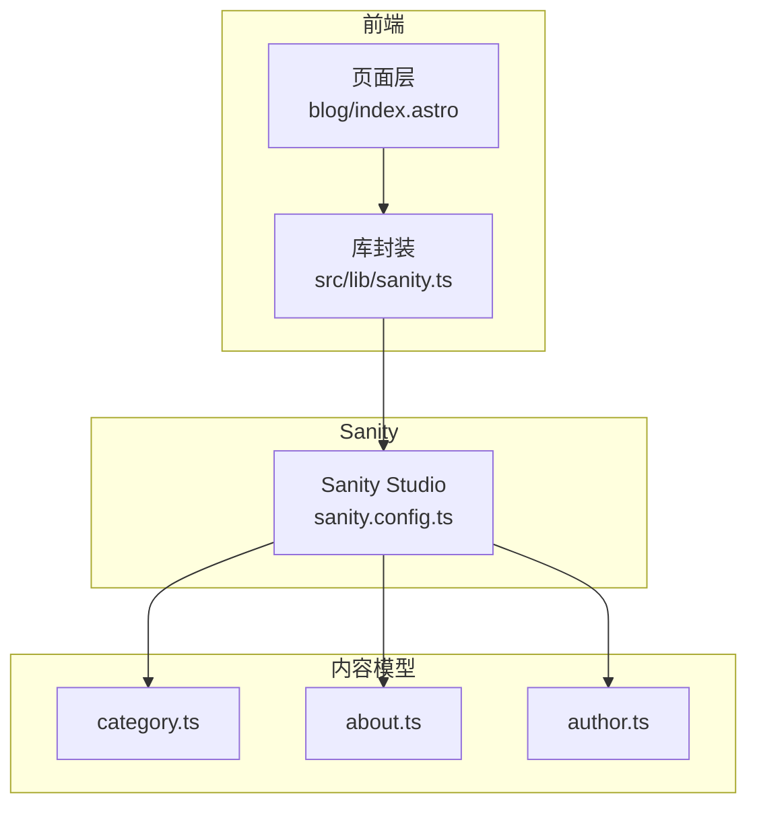
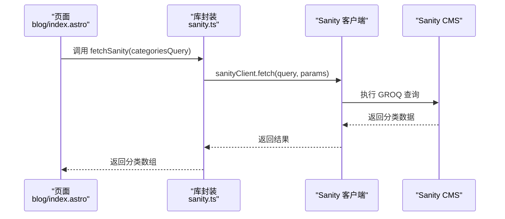
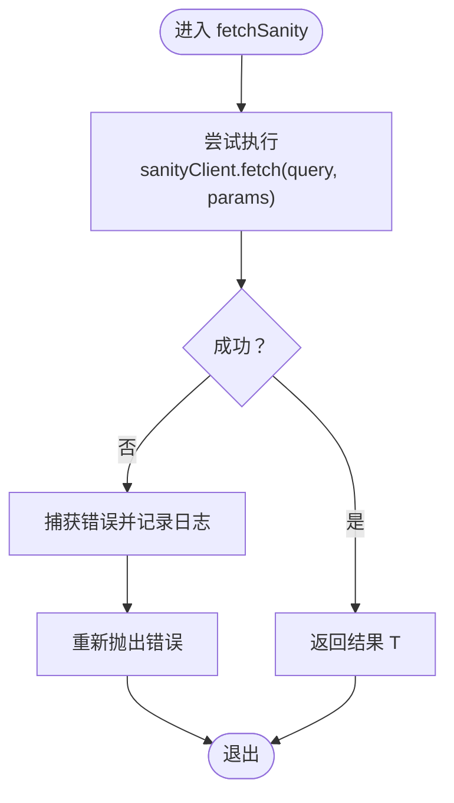
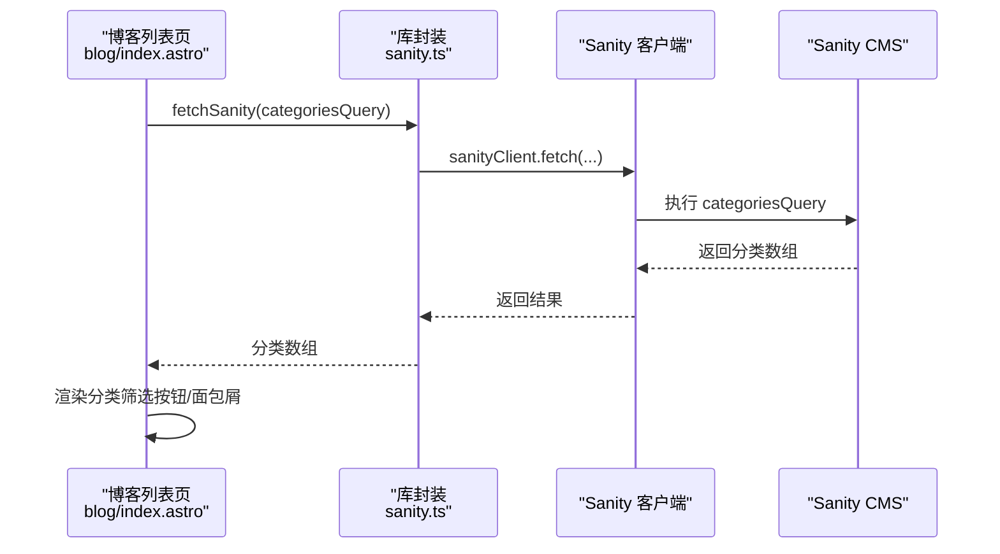
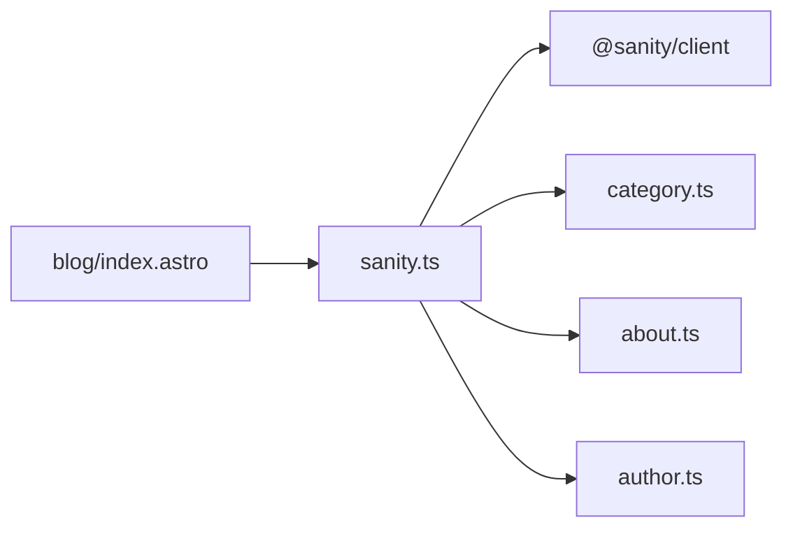

# 其他查询

<cite>
**本文引用的文件**
- [sanity.ts](file://src/lib/sanity.ts)
- [category.ts](file://sanity/schemaTypes/category.ts)
- [about.ts](file://sanity/schemaTypes/about.ts)
- [author.ts](file://sanity/schemaTypes/author.ts)
- [blog/index.astro](file://src/pages/blog/index.astro)
- [sanity.config.ts](file://sanity/sanity.config.ts)
</cite>

## 目录
1. [引言](#引言)
2. [项目结构](#项目结构)
3. [核心组件](#核心组件)
4. [架构总览](#架构总览)
5. [详细组件分析](#详细组件分析)
6. [依赖关系分析](#依赖关系分析)
7. [性能考量](#性能考量)
8. [故障排查指南](#故障排查指南)
9. [结论](#结论)

## 引言
本章节系统化梳理 src/lib/sanity.ts 中除博客与项目之外的其他 GROQ 查询与辅助函数，重点覆盖：
- categoriesQuery：如何通过类型过滤与排序，以及“slug”别名语法的含义
- aboutQuery：单例内容模型的设计理念与字段投影
- fetchSanity<T>：泛型封装、错误处理与可扩展性建议
并结合实际调用场景（如博客列表页获取分类、关于页面获取个人信息）给出集成思路，附带调试技巧（Sanity Vision 工具验证查询）。

## 项目结构
- 前端查询与客户端封装位于 src/lib/sanity.ts
- 内容模型定义位于 sanity/schemaTypes 下（category、about、author 等）
- 页面层调用示例位于 src/pages/blog/index.astro（博客列表页）



图表来源
- [sanity.ts](file://src/lib/sanity.ts#L1-L99)
- [category.ts](file://sanity/schemaTypes/category.ts#L1-L26)
- [about.ts](file://sanity/schemaTypes/about.ts#L1-L70)
- [author.ts](file://sanity/schemaTypes/author.ts#L1-L33)
- [sanity.config.ts](file://sanity/sanity.config.ts#L1-L31)

章节来源
- [sanity.ts](file://src/lib/sanity.ts#L1-L99)
- [sanity.config.ts](file://sanity/sanity.config.ts#L1-L31)

## 核心组件
- categoriesQuery：获取所有分类，按名称升序排列，投影标题与 slug 别名
- aboutQuery：单例内容模型，投影标题、个人简介、头像、技能、经验、教育、社交链接等
- fetchSanity<T>：统一的查询封装，提供类型安全与错误处理

章节来源
- [sanity.ts](file://src/lib/sanity.ts#L22-L27)
- [sanity.ts](file://src/lib/sanity.ts#L70-L79)
- [sanity.ts](file://src/lib/sanity.ts#L92-L99)

## 架构总览
前端页面通过库封装发起查询，Sanity 客户端执行 GROQ，返回结构化数据；页面层再进行渲染或二次处理。



图表来源
- [blog/index.astro](file://src/pages/blog/index.astro#L1-L40)
- [sanity.ts](file://src/lib/sanity.ts#L92-L99)

## 详细组件分析

### categoriesQuery：类型过滤与排序、slug 别名
- 类型过滤：通过 [_type == "category"] 精确筛选分类文档
- 排序规则：使用 order(title asc) 按标题字母顺序升序排列
- 字段投影：包含 _id、title、slug 别名
- 别名语法说明：“slug” 字段在 GROQ 中通过 "slug": slug.current 定义别名，表示取 slug 文档字段的 current 值（即最终可用的字符串 slug）

```mermaid
flowchart TD
Start(["开始"]) --> Filter["类型过滤<br/>[_type == \"category\"]"]
Filter --> Order["排序<br/>order(title asc)"]
Order --> Select["投影字段<br/>_id, title, \"slug\": slug.current"]
Select --> End(["结束"])
```

图表来源
- [sanity.ts](file://src/lib/sanity.ts#L22-L27)

章节来源
- [sanity.ts](file://src/lib/sanity.ts#L22-L27)
- [category.ts](file://sanity/schemaTypes/category.ts#L1-L26)

### aboutQuery：单例内容模型与字段投影
- 单例设计：通过 [0] 限定只返回第一条匹配记录，适配“关于”页面通常只有一条内容的场景
- 字段投影：title、bio、avatar（头像）、skills、experience、education、social 等
- 与作者模型的关系：作者模型（author.ts）用于文章作者关联，而 about.ts 是关于页面的独立内容模型

```mermaid
flowchart TD
Start(["开始"]) --> Match["类型匹配<br/>[_type == \"about\"]"]
Match --> First["取第一条<br/>[0]"]
First --> Project["投影字段<br/>title, bio, avatar, skills, experience, education, social"]
Project --> End(["结束"])
```

图表来源
- [sanity.ts](file://src/lib/sanity.ts#L70-L79)
- [about.ts](file://sanity/schemaTypes/about.ts#L1-L70)
- [author.ts](file://sanity/schemaTypes/author.ts#L1-L33)

章节来源
- [sanity.ts](file://src/lib/sanity.ts#L70-L79)
- [about.ts](file://sanity/schemaTypes/about.ts#L1-L70)
- [author.ts](file://sanity/schemaTypes/author.ts#L1-L33)

### fetchSanity<T>：泛型封装、错误处理与扩展
- 泛型约束：通过 fetchSanity<T> 保证返回值类型安全，便于上层直接消费
- 错误处理：try/catch 包裹，捕获异常后打印错误并重新抛出，便于上层统一处理
- 可扩展性：当前未内置重试机制，可在现有封装基础上增加指数退避、最大重试次数等策略，以提升网络不稳定场景下的健壮性



图表来源
- [sanity.ts](file://src/lib/sanity.ts#L92-L99)

章节来源
- [sanity.ts](file://src/lib/sanity.ts#L92-L99)

### 实际调用场景与集成示例
- 博客列表页（Header 组件联动）：页面层通过 categoriesQuery 获取分类列表，用于渲染分类筛选按钮与面包屑等
- 关于页面：页面层可直接消费 aboutQuery 的结果，渲染个人信息、技能、社交链接等



图表来源
- [blog/index.astro](file://src/pages/blog/index.astro#L1-L40)
- [sanity.ts](file://src/lib/sanity.ts#L22-L27)
- [sanity.ts](file://src/lib/sanity.ts#L92-L99)

章节来源
- [blog/index.astro](file://src/pages/blog/index.astro#L1-L40)
- [sanity.ts](file://src/lib/sanity.ts#L22-L27)
- [sanity.ts](file://src/lib/sanity.ts#L92-L99)

## 依赖关系分析
- 页面层依赖库封装：博客列表页导入 sanity.ts 中的 categoriesQuery 与 fetchSanity
- 库封装依赖 Sanity 客户端：通过 createClient 创建客户端实例并执行 fetch
- 内容模型依赖：categoriesQuery 依赖 category 文档模型；aboutQuery 依赖 about 文档模型



图表来源
- [blog/index.astro](file://src/pages/blog/index.astro#L1-L40)
- [sanity.ts](file://src/lib/sanity.ts#L1-L99)
- [category.ts](file://sanity/schemaTypes/category.ts#L1-L26)
- [about.ts](file://sanity/schemaTypes/about.ts#L1-L70)
- [author.ts](file://sanity/schemaTypes/author.ts#L1-L33)

章节来源
- [blog/index.astro](file://src/pages/blog/index.astro#L1-L40)
- [sanity.ts](file://src/lib/sanity.ts#L1-L99)
- [category.ts](file://sanity/schemaTypes/category.ts#L1-L26)
- [about.ts](file://sanity/schemaTypes/about.ts#L1-L70)
- [author.ts](file://sanity/schemaTypes/author.ts#L1-L33)

## 性能考量
- CDN 使用：客户端初始化时启用 useCdn，有助于降低查询延迟
- 查询粒度：categoriesQuery 仅投影必要字段，避免传输冗余数据
- 上层缓存：可在页面层对分类列表进行内存缓存，减少重复请求
- 批量查询：若后续需要同时获取多个集合，可考虑合并查询或并行请求以减少往返

章节来源
- [sanity.ts](file://src/lib/sanity.ts#L1-L10)

## 故障排查指南
- 使用 Sanity Vision 工具验证查询
  - 在 Sanity Studio 中安装并启用 Vision 插件（已在配置中启用）
  - 在 Studio 中打开 Vision 面板，粘贴目标 GROQ 查询，查看返回结构与字段映射，确认别名与投影是否符合预期
- 日志定位
  - fetchSanity<T> 捕获异常后会打印错误日志，便于快速定位问题
- 字段一致性
  - 若发现 slug 类型不一致（对象或字符串），需在页面层做兼容处理（例如从 slug.current 或直接使用 slug）
- 模型变更
  - 当内容模型新增字段或调整字段类型时，需同步更新对应 GROQ 投影，避免运行时报错

章节来源
- [sanity.config.ts](file://sanity/sanity.config.ts#L1-L31)
- [sanity.ts](file://src/lib/sanity.ts#L92-L99)
- [blog/index.astro](file://src/pages/blog/index.astro#L130-L160)

## 结论
- categoriesQuery 采用类型过滤与排序，配合 slug 别名，确保前端稳定消费
- aboutQuery 以单例模型满足“关于”页面唯一内容的诉求，字段投影清晰
- fetchSanity<T> 提供类型安全与错误处理，具备良好的扩展空间
- 建议在现有基础上引入重试与缓存策略，进一步提升稳定性与性能