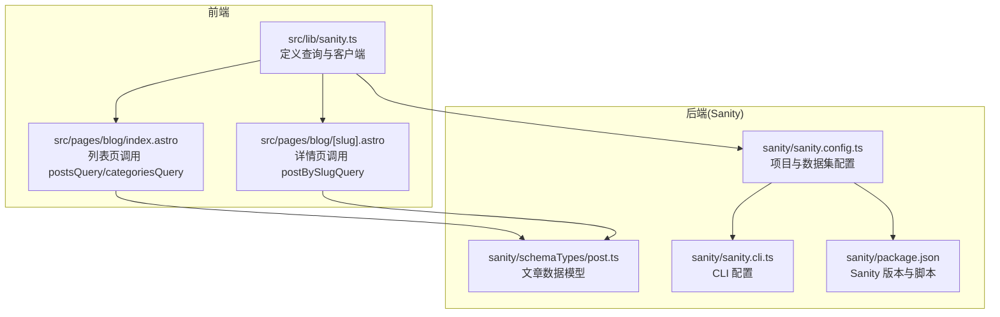
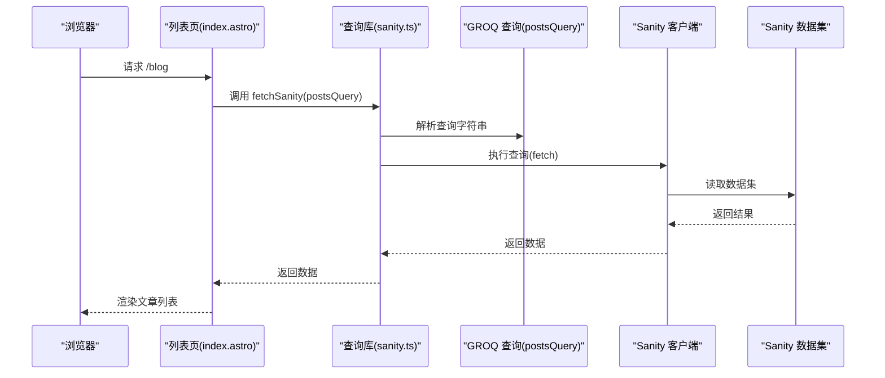
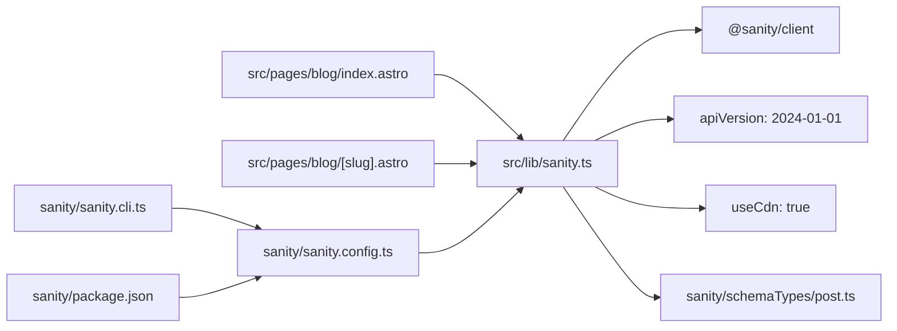

# 博客查询

<cite>
**本文引用的文件**
- [src/lib/sanity.ts](file://src/lib/sanity.ts)
- [sanity/schemaTypes/post.ts](file://sanity/schemaTypes/post.ts)
- [src/pages/blog/index.astro](file://src/pages/blog/index.astro)
- [src/pages/blog/[slug].astro](file://src/pages/blog/[slug].astro)
- [sanity/sanity.config.ts](file://sanity/sanity.config.ts)
- [sanity/sanity.cli.ts](file://sanity/sanity.cli.ts)
- [sanity/package.json](file://sanity/package.json)
</cite>

## 目录
1. [简介](#简介)
2. [项目结构](#项目结构)
3. [核心组件](#核心组件)
4. [架构总览](#架构总览)
5. [详细组件分析](#详细组件分析)
6. [依赖关系分析](#依赖关系分析)
7. [性能考量](#性能考量)
8. [故障排查指南](#故障排查指南)
9. [结论](#结论)
10. [附录](#附录)

## 简介
本文件聚焦于博客相关的 GROQ 查询，系统性解析以下三个查询：
- postsQuery：列出博客文章，按发布时间降序排序，并通过投影仅选择必要字段以降低网络传输。
- postBySlugQuery：根据文章 slug 获取单篇文章，采用参数化查询与严格字段投影，确保安全性与性能。
- featuredContentQuery：首页精选内容聚合查询，限定返回数量以提升性能。

同时，文档说明如何通过 [_type == "post"] 过滤文档类型、使用 order(publishedAt desc) 实现时间倒序、通过 [0...3] 限制返回数量，以及参数化查询的安全机制（$slug）如何防止恶意输入导致的数据泄露。最后给出在 Astro 页面中调用这些查询的实际代码示例与常见问题排查清单。

## 项目结构
博客查询位于前端侧的通用库中，配合 Astro 页面进行数据拉取与渲染；Sanity 后端的 schema 定义了文章数据模型，确保查询字段与数据结构一致。

图表来源
- [src/lib/sanity.ts](file://src/lib/sanity.ts#L1-L99)
- [src/pages/blog/index.astro](file://src/pages/blog/index.astro#L1-L120)
- [src/pages/blog/[slug].astro](file://src/pages/blog/[slug].astro#L1-L40)
- [sanity/schemaTypes/post.ts](file://sanity/schemaTypes/post.ts#L1-L84)
- [sanity/sanity.config.ts](file://sanity/sanity.config.ts#L1-L31)
- [sanity/sanity.cli.ts](file://sanity/sanity.cli.ts#L1-L20)
- [sanity/package.json](file://sanity/package.json#L1-L38)

章节来源
- [src/lib/sanity.ts](file://src/lib/sanity.ts#L1-L99)
- [sanity/schemaTypes/post.ts](file://sanity/schemaTypes/post.ts#L1-L84)
- [src/pages/blog/index.astro](file://src/pages/blog/index.astro#L1-L120)
- [src/pages/blog/[slug].astro](file://src/pages/blog/[slug].astro#L1-L40)
- [sanity/sanity.config.ts](file://sanity/sanity.config.ts#L1-L31)
- [sanity/sanity.cli.ts](file://sanity/sanity.cli.ts#L1-L20)
- [sanity/package.json](file://sanity/package.json#L1-L38)

## 核心组件
- 博客查询集合：在通用库中集中定义，便于复用与维护。
- 数据模型：Sanity 文章类型定义字段，确保查询投影与后端一致。
- 页面调用：列表页与详情页分别调用不同查询，参数化查询保障安全。

章节来源
- [src/lib/sanity.ts](file://src/lib/sanity.ts#L1-L99)
- [sanity/schemaTypes/post.ts](file://sanity/schemaTypes/post.ts#L1-L84)
- [src/pages/blog/index.astro](file://src/pages/blog/index.astro#L1-L40)
- [src/pages/blog/[slug].astro](file://src/pages/blog/[slug].astro#L1-L40)

## 架构总览
前端通过统一的查询库向 Sanity 发起请求，列表页与详情页分别消费不同的查询结果，形成“查询定义—页面调用—数据渲染”的清晰分层。

图表来源
- [src/pages/blog/index.astro](file://src/pages/blog/index.astro#L1-L20)
- [src/lib/sanity.ts](file://src/lib/sanity.ts#L92-L99)

章节来源
- [src/pages/blog/index.astro](file://src/pages/blog/index.astro#L1-L40)
- [src/lib/sanity.ts](file://src/lib/sanity.ts#L92-L99)

## 详细组件分析

### postsQuery：博客文章列表查询
- 结构设计
  - 过滤：通过 [_type == "post"] 精确筛选文章文档类型，避免混入其他类型。
  - 排序：使用 order(publishedAt desc) 按发布时间降序排列，确保最新文章优先展示。
  - 投影：仅选择必要的字段（如 _id、title、slug、excerpt、publishedAt、封面图、作者、分类），减少网络传输与前端处理负担。
  - 性能：未显式限制返回数量，但列表页通常会做前端分页或懒加载，避免一次性渲染过多内容。
- 字段投影策略
  - 仅选择前端实际需要的字段，避免不必要的 body、大字段或冗余元数据，降低带宽与渲染成本。
- 类型结构参考
  - 基于文章数据模型，返回数组元素包含：标识、标题、slug、摘要、发布时间、封面图 URL、作者信息（含头像）、分类数组（含标题与 slug）等。

章节来源
- [src/lib/sanity.ts](file://src/lib/sanity.ts#L10-L20)
- [sanity/schemaTypes/post.ts](file://sanity/schemaTypes/post.ts#L1-L84)
- [src/pages/blog/index.astro](file://src/pages/blog/index.astro#L1-L40)

### postBySlugQuery：按 slug 获取单篇文章
- 结构设计
  - 过滤：[_type == "post"] 确保只查询文章类型。
  - 匹配：slug.current == $slug 使用参数化查询，避免拼接字符串带来的注入风险。
  - 限制：[0] 确保最多返回一条记录，若不存在则返回空值，便于页面进行 404 跳转。
  - 投影：选择更丰富的字段（如 body、作者完整信息、分类等），满足详情页渲染需求。
- 安全机制
  - 参数化查询：$slug 由调用方传入，Sanity 客户端负责安全绑定，防止恶意输入导致数据泄露或越权访问。
  - 仅返回必要字段：避免暴露敏感字段，进一步降低风险。
- 类型结构参考
  - 返回单篇文章对象，包含标识、标题、slug、摘要、正文、发布时间、封面图 URL、作者信息（含简介与头像）、分类数组等。

章节来源
- [src/lib/sanity.ts](file://src/lib/sanity.ts#L29-L40)
- [src/pages/blog/[slug].astro](file://src/pages/blog/[slug].astro#L1-L40)
- [sanity/schemaTypes/post.ts](file://sanity/schemaTypes/post.ts#L1-L84)

### featuredContentQuery：首页精选内容聚合
- 结构设计
  - 聚合：在同一查询中返回两部分数据：精选文章与精选项目。
  - 文章部分：[_type == "post"] 过滤，按发布时间降序，[0...3] 限制返回数量，投影必要字段。
  - 项目部分：[_type == "project" && featured == true] 过滤，按顺序升序，[0...3] 限制返回数量，投影必要字段。
- 性能：通过 [0...3] 限制返回条数，显著降低网络传输与渲染压力，适合首页快速加载。
- 类型结构参考
  - 返回对象包含两个键："posts" 与 "projects"，分别对应各自的投影结果数组。

章节来源
- [src/lib/sanity.ts](file://src/lib/sanity.ts#L81-L90)
- [sanity/schemaTypes/post.ts](file://sanity/schemaTypes/post.ts#L1-L84)

### 参数化查询与安全机制
- 安全要点
  - 使用 $slug 作为参数，避免字符串拼接，防止注入攻击。
  - 调用方在页面中传入 Astro.params.slug，Sanity 客户端负责安全绑定。
- 实际调用
  - 详情页在 getStaticPaths 中获取所有文章 slug，再在页面运行时通过 postBySlugQuery({ slug }) 传参。

章节来源
- [src/lib/sanity.ts](file://src/lib/sanity.ts#L29-L40)
- [src/pages/blog/[slug].astro](file://src/pages/blog/[slug].astro#L1-L40)

### 字段投影策略与性能优化
- 仅选择必要字段：列表页与首页精选仅投影少量字段，详情页才投影更丰富字段，平衡性能与体验。
- 限制返回数量：通过 [0...3] 控制首页与列表的初始渲染量，配合前端分页或懒加载进一步优化。
- CDN 与 API 版本：客户端启用 CDN 并指定 API 版本，有助于缓存与稳定性。

章节来源
- [src/lib/sanity.ts](file://src/lib/sanity.ts#L1-L9)
- [src/lib/sanity.ts](file://src/lib/sanity.ts#L81-L90)

### Astro 页面中的调用示例（代码片段路径）
- 列表页调用
  - 调用 postsQuery 与 categoriesQuery，并将结果传递给客户端脚本。
  - 示例路径：[src/pages/blog/index.astro](file://src/pages/blog/index.astro#L1-L20)
- 详情页调用
  - 在 getStaticPaths 中获取所有文章 slug，页面运行时调用 postBySlugQuery({ slug })。
  - 示例路径：[src/pages/blog/[slug].astro](file://src/pages/blog/[slug].astro#L1-L40)
- 查询库与客户端
  - 查询定义与 fetch 封装：[src/lib/sanity.ts](file://src/lib/sanity.ts#L1-L99)

章节来源
- [src/pages/blog/index.astro](file://src/pages/blog/index.astro#L1-L40)
- [src/pages/blog/[slug].astro](file://src/pages/blog/[slug].astro#L1-L40)
- [src/lib/sanity.ts](file://src/lib/sanity.ts#L1-L99)

## 依赖关系分析
- 前端查询库依赖 Sanity 客户端与 API 版本配置。
- 页面依赖查询库与数据模型，确保字段一致性。
- Sanity Studio 配置影响静态资源路径与部署行为。

图表来源
- [src/lib/sanity.ts](file://src/lib/sanity.ts#L1-L9)
- [src/pages/blog/index.astro](file://src/pages/blog/index.astro#L1-L20)
- [src/pages/blog/[slug].astro](file://src/pages/blog/[slug].astro#L1-L40)
- [sanity/schemaTypes/post.ts](file://sanity/schemaTypes/post.ts#L1-L84)
- [sanity/sanity.config.ts](file://sanity/sanity.config.ts#L1-L31)
- [sanity/sanity.cli.ts](file://sanity/sanity.cli.ts#L1-L20)
- [sanity/package.json](file://sanity/package.json#L1-L38)

章节来源
- [src/lib/sanity.ts](file://src/lib/sanity.ts#L1-L9)
- [sanity/sanity.config.ts](file://sanity/sanity.config.ts#L1-L31)
- [sanity/sanity.cli.ts](file://sanity/sanity.cli.ts#L1-L20)
- [sanity/package.json](file://sanity/package.json#L1-L38)

## 性能考量
- 仅投影必要字段：减少网络传输与前端渲染开销。
- 限制返回数量：首页与列表使用 [0...3]，避免一次性加载过多数据。
- 启用 CDN：useCdn 提升静态资源与查询响应速度。
- API 版本：固定 apiVersion 保证查询行为稳定，利于缓存与性能预测。
- 前端分页/懒加载：列表页可结合前端逻辑进一步控制渲染量。

章节来源
- [src/lib/sanity.ts](file://src/lib/sanity.ts#L1-L9)
- [src/lib/sanity.ts](file://src/lib/sanity.ts#L81-L90)

## 故障排查指南
- 查询返回空数组
  - 检查数据是否存在：确认 Sanity 数据集中存在 [_type == "post"] 的文档。
  - 检查 slug 匹配：确认文章 slug.current 是否与页面传入的 slug 完全一致（大小写、特殊字符）。
  - 检查 API 版本兼容性：确认 apiVersion 与 Sanity 后端支持情况一致。
  - 检查数据集与项目 ID：确认客户端配置的 projectId 与 dataset 与 Studio 配置一致。
  - 检查字段投影：确认查询投影字段与数据模型一致，避免因字段缺失导致渲染异常。
- 详情页 404
  - 若 postBySlugQuery 返回空值，页面应重定向至 404，检查 getStaticPaths 与 params 传递是否正确。
- 首页精选内容为空
  - 检查文章与项目是否满足过滤条件（如文章发布时间、项目 featured 标记）。
  - 检查 [0...3] 限制是否导致数据被截断。

章节来源
- [src/lib/sanity.ts](file://src/lib/sanity.ts#L1-L9)
- [src/pages/blog/[slug].astro](file://src/pages/blog/[slug].astro#L1-L40)

## 结论
博客相关查询通过明确的过滤、排序与投影策略，结合参数化查询与数量限制，在保证功能完整性的同时兼顾性能与安全。前端页面通过统一的查询库进行调用，形成清晰的职责分离。建议在后续迭代中持续监控查询性能与字段投影，确保与数据模型保持同步。

## 附录
- 文章数据模型字段概览（来源于 schemaTypes/post.ts）：标题、slug、摘要、封面图、作者引用、分类数组、发布时间、正文等。
- 页面调用示例路径：
  - 列表页：[src/pages/blog/index.astro](file://src/pages/blog/index.astro#L1-L40)
  - 详情页：[src/pages/blog/[slug].astro](file://src/pages/blog/[slug].astro#L1-L40)
  - 查询库：[src/lib/sanity.ts](file://src/lib/sanity.ts#L1-L99)