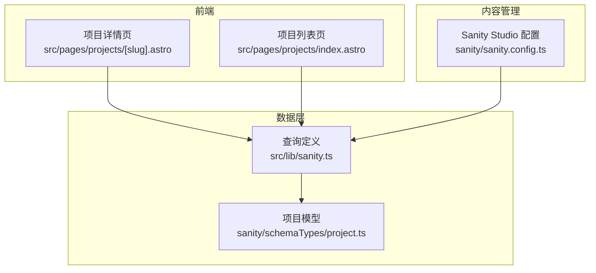
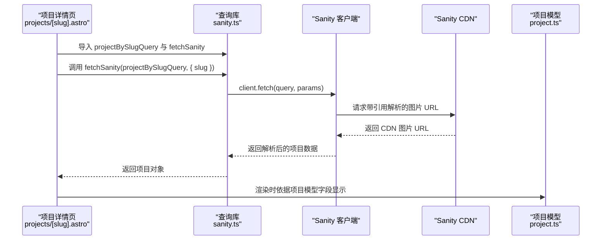
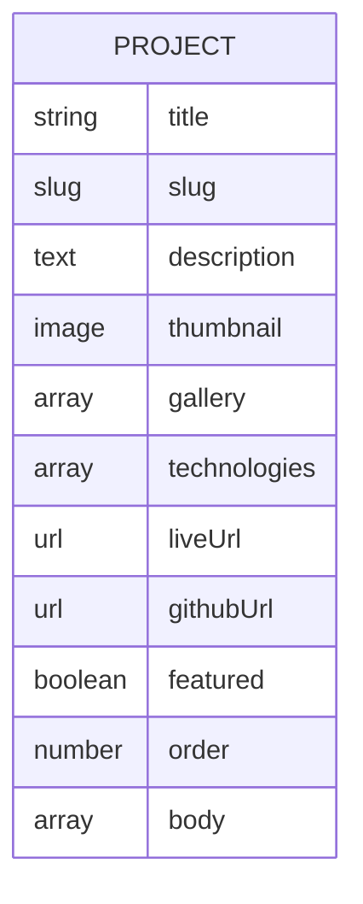
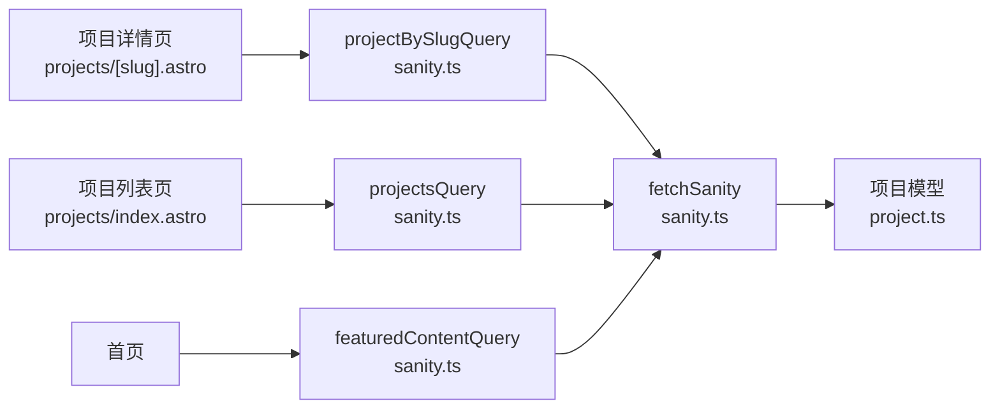

# 项目查询

<cite>
**本文引用的文件**
- [sanity.ts](file://src/lib/sanity.ts)
- [project.ts](file://sanity/schemaTypes/project.ts)
- [projects-[slug].astro](file://src/pages/projects/[slug].astro)
- [projects-index.astro](file://src/pages/projects/index.astro)
- [sanity.config.ts](file://sanity/sanity.config.ts)
</cite>

## 目录
1. [简介](#简介)
2. [项目结构](#项目结构)
3. [核心组件](#核心组件)
4. [架构总览](#架构总览)
5. [详细组件分析](#详细组件分析)
6. [依赖关系分析](#依赖关系分析)
7. [性能考量](#性能考量)
8. [故障排查指南](#故障排查指南)
9. [结论](#结论)
10. [附录](#附录)

## 简介
本文件围绕 src/lib/sanity.ts 中与“项目”相关的 GROQ 查询进行系统化文档化，重点覆盖以下查询：
- projectsQuery：获取所有项目并按自定义顺序字段升序排列
- projectBySlugQuery：按 slug 获取单个项目，支持参数化查询
- featuredContentQuery：首页精选内容，其中项目部分筛选出“精选”项目并限制数量

同时，本文将深入解析查询语法要点，例如复合条件过滤 [_type == "project" && featured == true]、排序 order(order asc)、分页切片 [0...3]，以及引用字段解析 -> 操作符如何获取 CDN 图片 URL。最后结合项目数据模型与实际页面调用场景，给出字段选择优化策略与性能调优建议。

## 项目结构
- 客户端与查询定义位于 src/lib/sanity.ts，提供 Sanity 客户端实例与一组 GROQ 查询常量
- 项目数据模型定义位于 sanity/schemaTypes/project.ts，描述项目文档的字段结构
- 项目详情页位于 src/pages/projects/[slug].astro，当前使用静态数据；项目列表页位于 src/pages/projects/index.astro，同样使用静态数据
- Sanity Studio 配置位于 sanity/sanity.config.ts，用于管理项目 ID、数据集与 Studio 基础路径等

**图表来源**
- [sanity.ts](file://src/lib/sanity.ts#L1-L99)
- [project.ts](file://sanity/schemaTypes/project.ts#L1-L97)
- [projects-[slug].astro](file://src/pages/projects/[slug].astro#L1-L162)
- [projects-index.astro](file://src/pages/projects/index.astro#L1-L171)
- [sanity.config.ts](file://sanity/sanity.config.ts#L1-L30)

**章节来源**
- [sanity.ts](file://src/lib/sanity.ts#L1-L99)
- [project.ts](file://sanity/schemaTypes/project.ts#L1-L97)
- [projects-[slug].astro](file://src/pages/projects/[slug].astro#L1-L162)
- [projects-index.astro](file://src/pages/projects/index.astro#L1-L171)
- [sanity.config.ts](file://sanity/sanity.config.ts#L1-L30)

## 核心组件
- Sanity 客户端与查询常量
  - 客户端初始化包含项目 ID、数据集、API 版本与 CDN 开关
  - 提供 projectsQuery、projectBySlugQuery、featuredContentQuery 等查询常量
- 辅助函数 fetchSanity<T>：封装客户端 fetch，统一错误处理
- 项目数据模型 project：定义项目文档的字段类型与约束

关键点：
- 使用 CDN 加速图片访问（useCdn: true），通过 ->url 解析引用字段获取 CDN URL
- 参数化查询 projectBySlugQuery 使用 $slug，避免注入风险
- 字段选择仅包含前端展示所需字段，减少网络与序列化开销

**章节来源**
- [sanity.ts](file://src/lib/sanity.ts#L1-L99)
- [project.ts](file://sanity/schemaTypes/project.ts#L1-L97)

## 架构总览
下图展示了项目查询在前端页面中的调用流程与数据流向：

**图表来源**
- [sanity.ts](file://src/lib/sanity.ts#L56-L68)
- [sanity.ts](file://src/lib/sanity.ts#L92-L99)
- [project.ts](file://sanity/schemaTypes/project.ts#L1-L97)
- [projects-[slug].astro](file://src/pages/projects/[slug].astro#L1-L162)

## 详细组件分析

### projectsQuery：项目列表查询
- 查询目标：获取所有项目文档
- 排序规则：按自定义字段 order 升序排列
- 字段选择：仅包含前端展示所需的字段，避免冗余数据传输
- 结果用途：项目列表页与精选内容中的项目列表

查询要点：
- 复合条件过滤：[_type == "project"] 精确限定文档类型
- 排序：order(order asc) 按自定义顺序字段升序排列
- 字段选择优化：仅请求前端渲染所需字段，降低带宽与解析成本

**章节来源**
- [sanity.ts](file://src/lib/sanity.ts#L43-L53)

### projectBySlugQuery：按 slug 获取单个项目
- 查询目标：根据 slug.current 精确匹配单个项目
- 参数化：使用 $slug 作为参数，防止注入攻击
- 引用解析：thumbnail.asset->url 与 gallery[].asset->url 将引用字段解析为 CDN 图片 URL
- 字段选择：仅请求详情页所需字段，避免一次性拉取整条文档的 body 或其他大字段

查询要点：
- 参数化优势：通过参数绑定，避免字符串拼接导致的注入风险
- 引用解析：-> 操作符自动解析 asset 引用并提取 url 字段，返回 CDN 托管地址
- 结果结构：返回项目对象，包含标题、描述、缩略图、技术栈、链接、精选标记等

**章节来源**
- [sanity.ts](file://src/lib/sanity.ts#L56-L68)

### featuredContentQuery：首页精选内容（项目部分）
- 查询目标：首页精选内容聚合，其中项目部分筛选精选项目并限制数量
- 条件过滤：[_type == "project" && featured == true] 仅返回精选项目
- 排序：order(order asc) 保持一致的展示顺序
- 分页机制：[0...3] 限制返回数量为 3 条
- 字段选择：仅包含首页展示所需字段，避免多余字段

查询要点：
- 复合条件：featured == true 用于筛选精选项目
- 切片分页：[0...3] 实现简单分页，避免一次性返回大量数据
- 字段裁剪：仅请求缩略图与技术栈等必要字段，提升首屏性能

**章节来源**
- [sanity.ts](file://src/lib/sanity.ts#L82-L89)

### 引用字段解析与 CDN URL 获取
- 语法：thumbnail.asset->url 与 gallery[].asset->url
- 作用：将引用类型的 asset 字段解析为 CDN 托管的图片 URL
- 性能：配合 useCdn: true，减少跨域与额外代理层，提升加载速度

注意：
- 若项目模型中存在数组型 gallery 字段，需确保 gallery[].asset->url 正确映射
- 若引用缺失，解析结果可能为空或报错，应在页面层做好容错处理

**章节来源**
- [sanity.ts](file://src/lib/sanity.ts#L43-L68)
- [project.ts](file://sanity/schemaTypes/project.ts#L1-L97)

### 参数化查询与安全性
- 项目详情页按 slug 查询使用 $slug 参数绑定
- 优势：避免字符串拼接与注入风险，提高查询安全性
- 建议：在调用处严格传入 slug 参数，避免外部输入直接拼接到查询中

**章节来源**
- [sanity.ts](file://src/lib/sanity.ts#L56-L68)

### 字段选择优化策略
- 仅请求前端展示所需字段，避免一次性拉取整条文档
- 对于详情页，若 body 等字段较大，可在列表页不请求该字段，详情页单独请求
- 对于图片字段，优先使用 CDN URL，减少二次处理与转换

**章节来源**
- [sanity.ts](file://src/lib/sanity.ts#L43-L68)

### 项目数据模型与返回结构
- 文档类型：project
- 关键字段：title、slug、description、thumbnail、gallery、technologies、liveUrl、githubUrl、featured、order、body
- 返回结构：查询返回的对象包含上述字段，页面据此渲染

**图表来源**
- [project.ts](file://sanity/schemaTypes/project.ts#L1-L97)

**章节来源**
- [project.ts](file://sanity/schemaTypes/project.ts#L1-L97)

### 在页面中的实际调用与建议
- 当前项目详情页与列表页使用静态数据，未直接调用 Sanity 查询
- 建议在项目详情页的 getStaticPaths 或运行时逻辑中：
  - 使用 fetchSanity(projectBySlugQuery, { slug }) 获取单个项目
  - 使用 fetchSanity(projectsQuery) 获取项目列表
  - 使用 fetchSanity(featuredContentQuery) 获取首页精选内容
- 项目列表页可使用 projectsQuery 并按 technologies 进行前端筛选
- 首页可使用 featuredContentQuery 的 projects 字段快速渲染精选项目

提示：
- 由于当前页面使用静态数据，若要启用动态数据，请在页面中导入 sanity.ts 并调用 fetchSanity
- 请确保在调用处对 slug 参数进行校验与容错处理

**章节来源**
- [sanity.ts](file://src/lib/sanity.ts#L43-L68)
- [sanity.ts](file://src/lib/sanity.ts#L82-L89)
- [sanity.ts](file://src/lib/sanity.ts#L92-L99)
- [projects-[slug].astro](file://src/pages/projects/[slug].astro#L1-L162)
- [projects-index.astro](file://src/pages/projects/index.astro#L1-L171)

## 依赖关系分析
- 项目详情页依赖 sanity.ts 中的 projectBySlugQuery 与 fetchSanity
- 项目列表页与首页依赖 sanity.ts 中的 projectsQuery 与 featuredContentQuery
- 项目模型 project.ts 定义了字段结构，影响查询字段选择与页面渲染

**图表来源**
- [sanity.ts](file://src/lib/sanity.ts#L43-L68)
- [sanity.ts](file://src/lib/sanity.ts#L82-L89)
- [sanity.ts](file://src/lib/sanity.ts#L92-L99)
- [project.ts](file://sanity/schemaTypes/project.ts#L1-L97)
- [projects-[slug].astro](file://src/pages/projects/[slug].astro#L1-L162)
- [projects-index.astro](file://src/pages/projects/index.astro#L1-L171)

**章节来源**
- [sanity.ts](file://src/lib/sanity.ts#L43-L68)
- [sanity.ts](file://src/lib/sanity.ts#L82-L89)
- [sanity.ts](file://src/lib/sanity.ts#L92-L99)
- [project.ts](file://sanity/schemaTypes/project.ts#L1-L97)
- [projects-[slug].astro](file://src/pages/projects/[slug].astro#L1-L162)
- [projects-index.astro](file://src/pages/projects/index.astro#L1-L171)

## 性能考量
- 启用 CDN：客户端初始化已开启 useCdn: true，结合 ->url 自动解析 CDN 地址，减少跨域与中间层
- 字段裁剪：仅请求前端展示所需字段，避免一次性拉取大字段（如 body）
- 分页与切片：使用 [0...3] 控制返回数量，降低网络与渲染压力
- 排序与索引：order(order asc) 与 order 字段配合，保证稳定顺序，减少前端二次排序
- 缓存策略：利用 CDN 缓存图片资源，减少重复请求

建议：
- 列表页不请求 body 等大字段，详情页单独请求
- 首页精选内容使用 featuredContentQuery，避免重复查询
- 对 gallery 数组字段，按需请求 URL 列表，避免一次性渲染过多图片

**章节来源**
- [sanity.ts](file://src/lib/sanity.ts#L1-L9)
- [sanity.ts](file://src/lib/sanity.ts#L43-L68)
- [sanity.ts](file://src/lib/sanity.ts#L82-L89)

## 故障排查指南
- 查询无结果
  - 检查 slug 是否正确传入，确认数据库中是否存在对应项目
  - 确认项目文档类型为 project，且 slug.current 与传入值一致
- 图片 URL 为空
  - 检查 thumbnail 或 gallery 引用是否为空
  - 确认 CDN 已启用且网络正常
- 注入风险
  - 确保使用参数化查询 projectBySlugQuery，不要拼接字符串
- 错误处理
  - fetchSanity 内部已捕获异常并抛出，可在页面层进行统一错误处理与降级渲染

**章节来源**
- [sanity.ts](file://src/lib/sanity.ts#L56-L68)
- [sanity.ts](file://src/lib/sanity.ts#L92-L99)

## 结论
本文系统梳理了 src/lib/sanity.ts 中与“项目”相关的 GROQ 查询，解析了复合条件过滤、排序与分页切片的语法与性能意义，并重点说明了引用字段解析与 CDN URL 获取机制。结合项目数据模型与页面调用现状，给出了字段选择优化与性能调优建议。建议在项目详情页与列表页中引入 fetchSanity 与相应查询，以实现动态数据驱动的页面渲染。

## 附录
- 术语说明
  - GROQ：Sanity 的查询语言
  - CDN：内容分发网络，用于加速静态资源访问
  - -> 操作符：引用字段解析，提取关联对象的指定字段
  - [0...3]：切片语法，限制返回记录数量