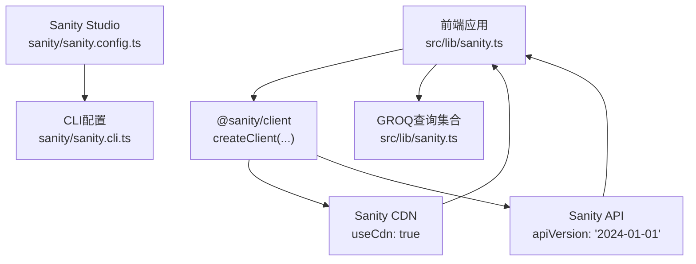
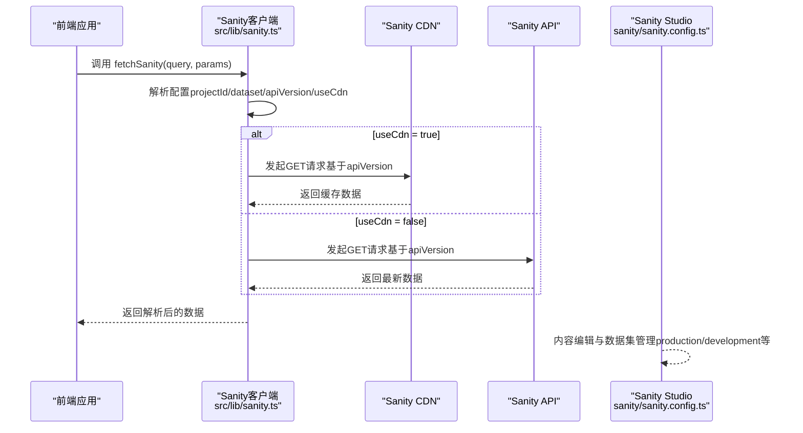
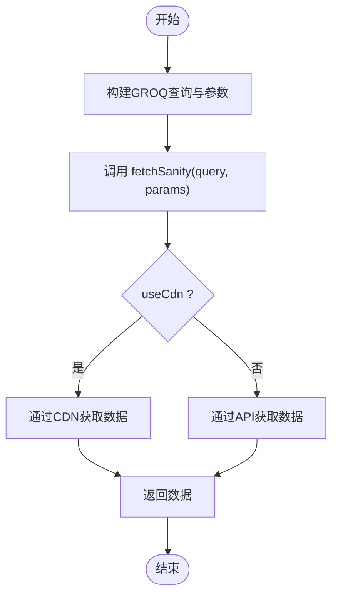
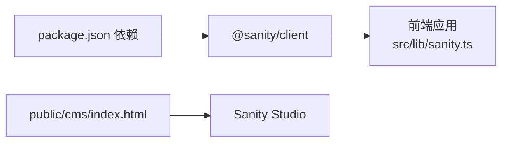

# Sanity客户端配置

<cite>
**本文引用的文件**
- [src/lib/sanity.ts](file://src/lib/sanity.ts)
- [sanity/sanity.config.ts](file://sanity/sanity.config.ts)
- [sanity/sanity.cli.ts](file://sanity/sanity.cli.ts)
- [package.json](file://package.json)
- [public/cms/index.html](file://public/cms/index.html)
</cite>

## 目录
1. [简介](#简介)
2. [项目结构](#项目结构)
3. [核心组件](#核心组件)
4. [架构总览](#架构总览)
5. [详细组件分析](#详细组件分析)
6. [依赖分析](#依赖分析)
7. [性能考量](#性能考量)
8. [故障排查指南](#故障排查指南)
9. [结论](#结论)

## 简介
本文件围绕前端应用中的Sanity客户端初始化配置进行深入解析，重点说明以下参数的含义与影响：
- projectId：唯一标识CMS项目的标识符，决定访问哪个远程项目空间
- dataset：数据集，用于区分开发、预发布与生产环境的数据
- apiVersion：API版本，采用语义化版本控制，确保客户端与后端接口兼容
- useCdn：是否启用CDN缓存，影响读取性能与数据实时性

同时，结合项目当前配置值（如 projectId: 'k2j30muc'），解释其与远程CMS服务的映射关系，并给出配置安全性最佳实践（避免敏感信息硬编码、使用环境变量等）。最后提供常见配置错误（如404、401）的表现与排查方法。

## 项目结构
前端应用通过一个独立的Sanity Studio目录管理内容创作工作流，前端代码通过Sanity客户端读取内容数据。关键文件如下：
- 前端Sanity客户端配置：src/lib/sanity.ts
- 后端Sanity Studio配置：sanity/sanity.config.ts
- CLI配置（含项目ID与数据集）：sanity/sanity.cli.ts
- 依赖声明：package.json
- 构建产物入口（包含Sanity Studio静态资源）：public/cms/index.html

图表来源
- [src/lib/sanity.ts](file://src/lib/sanity.ts#L1-L99)
- [sanity/sanity.config.ts](file://sanity/sanity.config.ts#L1-L31)
- [sanity/sanity.cli.ts](file://sanity/sanity.cli.ts#L1-L20)
- [package.json](file://package.json#L1-L28)

章节来源
- [src/lib/sanity.ts](file://src/lib/sanity.ts#L1-L99)
- [sanity/sanity.config.ts](file://sanity/sanity.config.ts#L1-L31)
- [sanity/sanity.cli.ts](file://sanity/sanity.cli.ts#L1-L20)
- [package.json](file://package.json#L1-L28)

## 核心组件
本节聚焦前端Sanity客户端初始化与查询封装，说明各参数的作用与影响。

- 客户端初始化
  - 使用 @sanity/client 的 createClient 创建客户端实例，传入 projectId、dataset、apiVersion、useCdn 等参数
  - 该客户端用于后续所有数据读取请求

- 查询封装
  - 提供多条GROQ查询常量，覆盖博客文章、项目、分类、关于页等场景
  - 提供统一的 fetchSanity 辅助函数，负责执行查询并处理异常

章节来源
- [src/lib/sanity.ts](file://src/lib/sanity.ts#L1-L99)

## 架构总览
前端通过Sanity客户端访问Sanity服务，可选择走CDN或直连API；Studio侧负责内容编辑与数据集管理。

图表来源
- [src/lib/sanity.ts](file://src/lib/sanity.ts#L1-L99)
- [sanity/sanity.config.ts](file://sanity/sanity.config.ts#L1-L31)

## 详细组件分析

### 客户端初始化与参数详解
- projectId
  - 作用：唯一标识一个Sanity项目空间，决定访问哪个远程CMS实例
  - 影响：若与Studio或CLI配置不一致，将无法正确读取数据
  - 映射关系：当前配置为 'k2j30muc'，表示访问该项目空间下的指定数据集
- dataset
  - 作用：区分不同环境的数据集合（如 production、development）
  - 影响：切换数据集会导致读取到不同的内容与状态
  - 当前值：'production'，表示读取生产环境数据
- apiVersion
  - 作用：指定API版本，采用语义化版本控制（YYYY-MM-DD）
  - 影响：确保客户端与后端接口兼容；变更版本可能影响查询语法或返回字段
  - 当前值：'2024-01-01'
- useCdn
  - 作用：是否启用CDN缓存
  - 影响：true时读取更快但可能延迟看到最新内容；false时实时但带宽与延迟更高
  - 当前值：true

章节来源
- [src/lib/sanity.ts](file://src/lib/sanity.ts#L1-L99)

### 查询封装与调用流程
- 查询封装
  - 提供多条GROQ查询常量，涵盖文章列表、文章详情、项目列表、项目详情、分类、关于页、精选内容等
  - 通过 fetchSanity 统一执行，内部捕获异常并抛出，便于上层处理
- 调用流程
  - 应用发起查询调用
  - 客户端根据配置决定走CDN或API
  - 返回数据供页面渲染

图表来源
- [src/lib/sanity.ts](file://src/lib/sanity.ts#L1-L99)

章节来源
- [src/lib/sanity.ts](file://src/lib/sanity.ts#L1-L99)

### 与Studio与CLI的配置一致性
- Studio配置
  - sanity/sanity.config.ts 中同样定义了 projectId 与 dataset，用于Studio运行与构建
- CLI配置
  - sanity/sanity.cli.ts 中也包含 api 下的 projectId 与 dataset，用于CLI工具链
- 一致性要求
  - 前端、Studio、CLI三处的 projectId 与 dataset 必须保持一致，否则会出现读取不到数据或权限问题

章节来源
- [sanity/sanity.config.ts](file://sanity/sanity.config.ts#L1-L31)
- [sanity/sanity.cli.ts](file://sanity/sanity.cli.ts#L1-L20)

### 与远程CMS服务的映射关系
- 项目ID映射
  - 前端与Studio/CLI均使用 projectId: 'k2j30muc'，表示访问同一项目空间
- 数据集映射
  - 前端与Studio/CLI均使用 dataset: 'production'，表示访问生产数据集
- API版本映射
  - 前端使用 apiVersion: '2024-01-01'，Studio/CLI未显式设置时默认遵循CLI配置；建议保持一致以避免兼容性问题

章节来源
- [src/lib/sanity.ts](file://src/lib/sanity.ts#L1-L99)
- [sanity/sanity.config.ts](file://sanity/sanity.config.ts#L1-L31)
- [sanity/sanity.cli.ts](file://sanity/sanity.cli.ts#L1-L20)

### 配置安全性最佳实践
- 避免硬编码敏感信息
  - 前端不应暴露写入凭据；当前配置仅包含只读参数（projectId、dataset、apiVersion、useCdn）
- 使用环境变量
  - 将 projectId、dataset 等参数从环境变量注入，避免提交到仓库
  - 在构建阶段或运行时注入，确保本地与CI环境一致
- 限制权限范围
  - 若需写入能力，应通过后端代理或受控API端点提供，而非直接在前端暴露写入凭据
- 版本管理
  - apiVersion 作为接口契约，变更时需同步更新查询与客户端逻辑

章节来源
- [src/lib/sanity.ts](file://src/lib/sanity.ts#L1-L99)
- [package.json](file://package.json#L1-L28)

## 依赖分析
- 前端依赖
  - @sanity/client：提供Sanity客户端能力
- 构建产物
  - public/cms/index.html：包含Sanity Studio静态资源与错误通道脚本，用于内容管理界面

图表来源
- [package.json](file://package.json#L1-L28)
- [src/lib/sanity.ts](file://src/lib/sanity.ts#L1-L99)
- [public/cms/index.html](file://public/cms/index.html#L1-L272)

章节来源
- [package.json](file://package.json#L1-L28)
- [public/cms/index.html](file://public/cms/index.html#L1-L272)

## 性能考量
- useCdn 的权衡
  - 启用CDN可显著降低延迟与带宽消耗，适合读多写少的场景
  - 关闭CDN可获得更强的实时性，适合需要即时展示最新内容的场景
- apiVersion 的影响
  - 固定版本有助于稳定接口契约，避免因后端变更导致查询失败
  - 如需新特性，应在可控环境下先验证兼容性再升级版本

章节来源
- [src/lib/sanity.ts](file://src/lib/sanity.ts#L1-L99)

## 故障排查指南
- 常见错误表现
  - 404 Not Found：通常由 projectId 或 dataset 不匹配导致，或URL路径错误
  - 401 Unauthorized：通常由缺少有效凭据或权限不足导致（前端只读配置一般不会出现此错误）
- 排查步骤
  - 核对 projectId 与 dataset 是否与Studio/CLI一致
  - 确认 apiVersion 与后端支持的版本兼容
  - 检查 useCdn 配置是否符合预期（如需实时数据可临时关闭CDN）
  - 查看网络面板与浏览器控制台错误日志
  - 在Studio中确认数据集内是否存在目标内容
- 参考实现
  - 前端fetchSanity已对异常进行记录与抛出，便于定位问题

章节来源
- [src/lib/sanity.ts](file://src/lib/sanity.ts#L1-L99)

## 结论
本文件系统梳理了前端Sanity客户端的初始化配置，明确了 projectId、dataset、apiVersion、useCdn 的语义与影响，并结合项目当前配置值解释了与远程CMS服务的映射关系。同时给出了安全性最佳实践与常见错误的排查方法。建议在团队内统一配置来源（环境变量）、保持前端与Studio/CLI配置一致，并在变更apiVersion前做好兼容性测试。