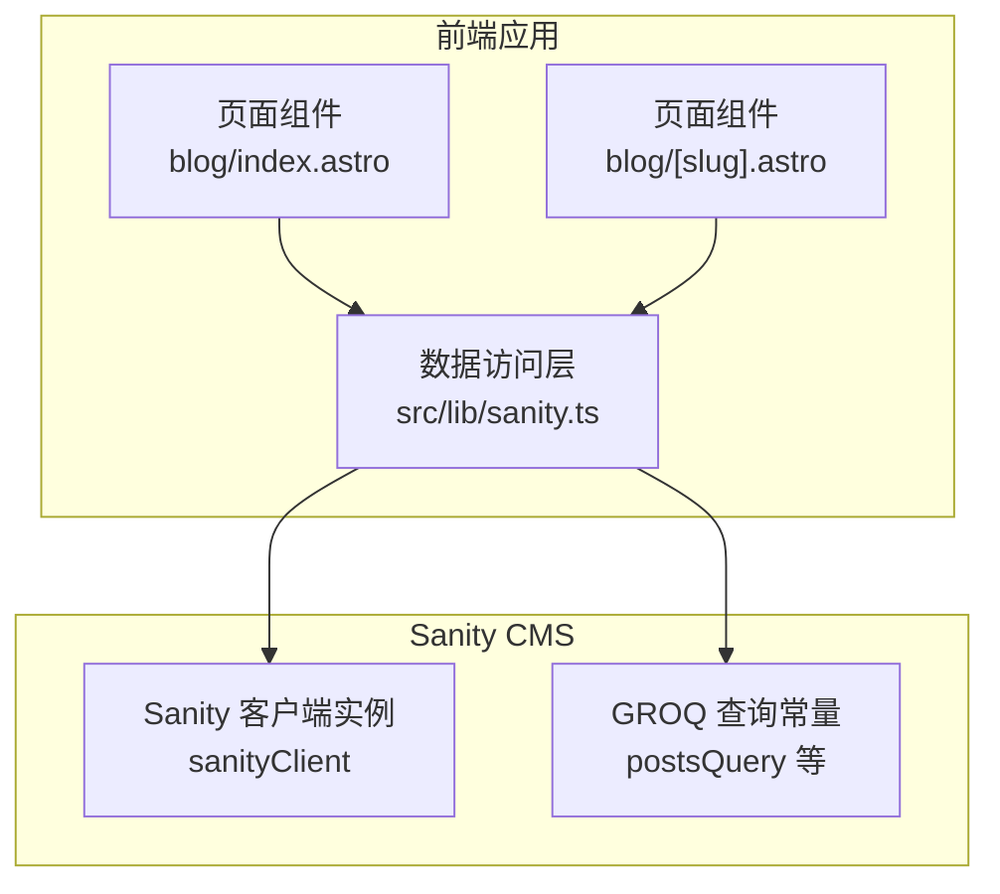
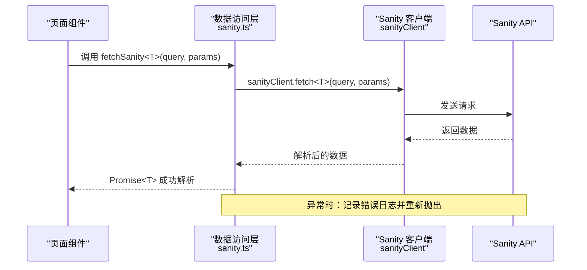
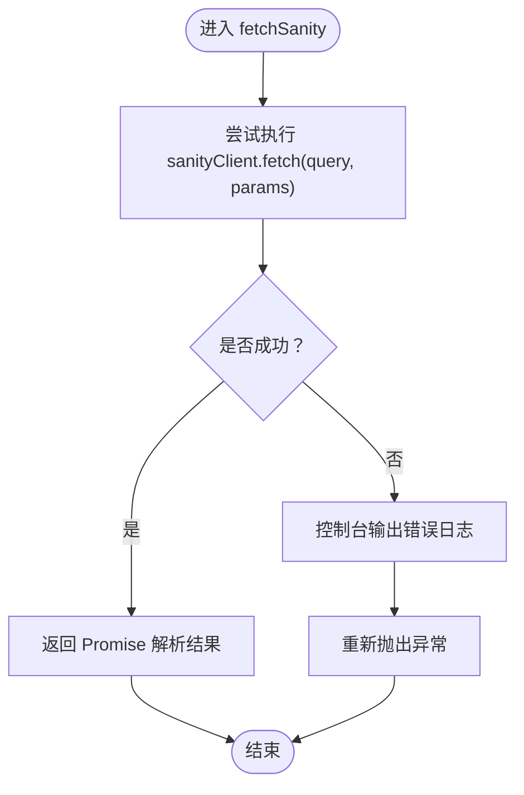
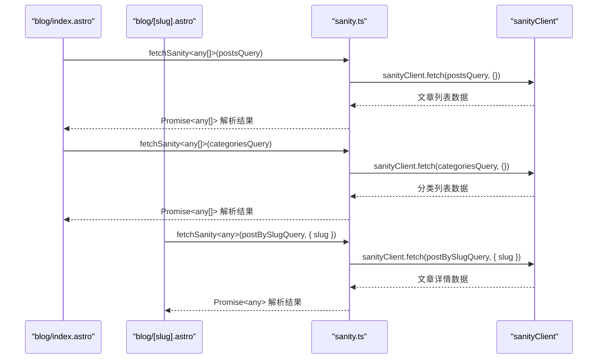
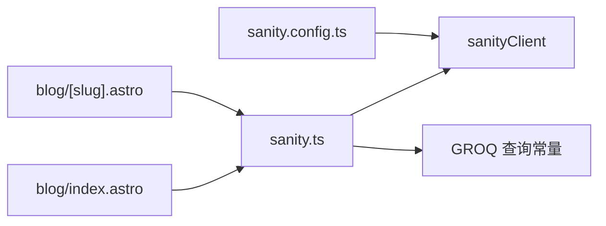

# 数据获取机制

<cite>
**本文引用的文件**
- [src/lib/sanity.ts](file://src/lib/sanity.ts)
- [src/pages/blog/[slug].astro](file://src/pages/blog/[slug].astro)
- [src/pages/blog/index.astro](file://src/pages/blog/index.astro)
- [sanity/sanity.config.ts](file://sanity/sanity.config.ts)
</cite>

## 目录
1. [引言](#引言)
2. [项目结构](#项目结构)
3. [核心组件](#核心组件)
4. [架构总览](#架构总览)
5. [详细组件分析](#详细组件分析)
6. [依赖关系分析](#依赖关系分析)
7. [性能考量](#性能考量)
8. [故障排查指南](#故障排查指南)
9. [结论](#结论)
10. [附录](#附录)

## 引言
本文件围绕 fetchSanity<T> 泛型函数展开，系统性阐述其设计原理、运行机制与在数据访问中的统一入口角色。重点包括：
- 如何封装 sanityClient.fetch 调用，实现类型安全的 Promise 返回值（Promise<T>）。
- 错误处理逻辑：try-catch 捕获、控制台错误日志输出、异常重新抛出。
- 泛型 T 在确保类型安全方面的作用，使调用方可获得精确的返回类型推断。
- 结合页面组件（如 blog/[slug].astro）的实际调用示例，展示参数传递与结果处理流程。
- 提供超时处理、重试机制等高级用法的扩展建议。

## 项目结构
本项目的数据访问层位于 src/lib/sanity.ts，其中包含：
- 用于创建 Sanity 客户端的配置与实例。
- 若干 GROQ 查询常量，用于不同页面的数据需求。
- fetchSanity<T> 泛型函数，作为统一的数据获取入口。

页面组件通过导入这些查询与 fetch 函数，完成数据拉取与渲染。

图表来源
- [src/lib/sanity.ts](file://src/lib/sanity.ts#L1-L99)
- [src/pages/blog/index.astro](file://src/pages/blog/index.astro#L1-L40)
- [src/pages/blog/[slug].astro](file://src/pages/blog/[slug].astro#L1-L30)

章节来源
- [src/lib/sanity.ts](file://src/lib/sanity.ts#L1-L99)
- [src/pages/blog/index.astro](file://src/pages/blog/index.astro#L1-L40)
- [src/pages/blog/[slug].astro](file://src/pages/blog/[slug].astro#L1-L30)

## 核心组件
- Sanity 客户端实例：在数据访问层创建并导出，负责与 Sanity API 交互。
- GROQ 查询常量：集中定义常用查询，便于复用与维护。
- fetchSanity<T> 泛型函数：封装 fetch 调用，提供类型安全的 Promise 返回值，并统一错误处理。

章节来源
- [src/lib/sanity.ts](file://src/lib/sanity.ts#L1-L99)

## 架构总览
fetchSanity<T> 作为统一入口，向上游页面组件提供类型安全的数据获取能力；向下游封装对 sanityClient.fetch 的调用，并在发生异常时进行日志记录与重新抛出，保证调用链路的可控性。

图表来源
- [src/lib/sanity.ts](file://src/lib/sanity.ts#L92-L99)
- [sanity/sanity.config.ts](file://sanity/sanity.config.ts#L1-L31)

## 详细组件分析

### fetchSanity<T> 泛型函数
- 设计目标
  - 统一数据访问入口，隐藏底层客户端细节。
  - 通过泛型 T 实现类型安全，使调用方获得精确的返回类型推断。
  - 统一错误处理策略，便于集中监控与调试。
- 运行机制
  - 接收两个参数：query（GROQ 字符串）与 params（查询参数对象，默认空对象）。
  - 内部调用 sanityClient.fetch<T>(query, params)，利用 TypeScript 泛型约束返回值类型为 Promise<T>。
  - 使用 try-catch 包裹 fetch 调用，捕获异常后输出控制台错误日志，并将异常重新抛出，保持调用方的错误感知。
- 类型安全
  - 泛型 T 由调用方显式指定或由 TypeScript 推断，确保返回值类型与预期一致，避免运行时类型不匹配问题。
- 错误处理
  - 捕获异常并打印错误日志，便于定位问题。
  - 将异常重新抛出，交由调用方决定后续处理（如重试、降级、错误页跳转等）。

图表来源
- [src/lib/sanity.ts](file://src/lib/sanity.ts#L92-L99)

章节来源
- [src/lib/sanity.ts](file://src/lib/sanity.ts#L92-L99)

### 页面组件中的实际调用示例
- 博客列表页（blog/index.astro）
  - 导入 fetchSanity 与 postsQuery、categoriesQuery。
  - 通过 fetchSanity<any[]>(postsQuery) 获取文章列表，fetchSanity<any[]>(categoriesQuery) 获取分类列表。
  - 对返回数据进行二次处理（如分类去重、合并），再传递给客户端渲染。
- 单篇文章页（blog/[slug].astro）
  - 导入 fetchSanity 与 postBySlugQuery。
  - 从动态路由参数中读取 slug，调用 fetchSanity<any>(postBySlugQuery, { slug }) 获取文章详情。
  - 若未找到文章，进行 404 跳转；否则格式化日期、过滤分类等，最终渲染页面。

图表来源
- [src/pages/blog/index.astro](file://src/pages/blog/index.astro#L1-L40)
- [src/pages/blog/[slug].astro](file://src/pages/blog/[slug].astro#L1-L30)
- [src/lib/sanity.ts](file://src/lib/sanity.ts#L1-L99)

章节来源
- [src/pages/blog/index.astro](file://src/pages/blog/index.astro#L1-L40)
- [src/pages/blog/[slug].astro](file://src/pages/blog/[slug].astro#L1-L30)
- [src/lib/sanity.ts](file://src/lib/sanity.ts#L1-L99)

### GROQ 查询与客户端配置
- GROQ 查询常量：集中定义了文章列表、分类、单篇文章、项目等常用查询，便于页面组件按需导入与使用。
- 客户端配置：在 sanity.config.ts 中设置项目 ID、数据集、基础路径等，确保前端与 Sanity Studio 的资源路径一致。

章节来源
- [src/lib/sanity.ts](file://src/lib/sanity.ts#L1-L99)
- [sanity/sanity.config.ts](file://sanity/sanity.config.ts#L1-L31)

## 依赖关系分析
- 页面组件依赖数据访问层（sanity.ts）提供的 fetchSanity<T> 与查询常量。
- 数据访问层依赖 sanityClient 实例与 GROQ 查询常量。
- sanityClient 实例由 Sanity SDK 创建，受 sanity.config.ts 中的配置影响。

图表来源
- [src/pages/blog/index.astro](file://src/pages/blog/index.astro#L1-L40)
- [src/pages/blog/[slug].astro](file://src/pages/blog/[slug].astro#L1-L30)
- [src/lib/sanity.ts](file://src/lib/sanity.ts#L1-L99)
- [sanity/sanity.config.ts](file://sanity/sanity.config.ts#L1-L31)

章节来源
- [src/pages/blog/index.astro](file://src/pages/blog/index.astro#L1-L40)
- [src/pages/blog/[slug].astro](file://src/pages/blog/[slug].astro#L1-L30)
- [src/lib/sanity.ts](file://src/lib/sanity.ts#L1-L99)
- [sanity/sanity.config.ts](file://sanity/sanity.config.ts#L1-L31)

## 性能考量
- CDN 使用：客户端配置启用 CDN，有助于降低网络延迟，提升数据获取速度。
- 查询优化：通过 GROQ 查询裁剪字段，减少传输体积，提高首屏渲染效率。
- 并发策略：页面组件可按需并发发起多个 fetch 请求，但需注意服务端限流与缓存策略。
- 缓存策略：可考虑在 fetch 层增加本地缓存或内存缓存，以减少重复请求。

章节来源
- [src/lib/sanity.ts](file://src/lib/sanity.ts#L1-L20)
- [sanity/sanity.config.ts](file://sanity/sanity.config.ts#L1-L31)

## 故障排查指南
- 控制台错误日志
  - fetchSanity<T> 在捕获异常后会输出错误日志，便于快速定位问题。
- 常见问题
  - 查询参数缺失：确认传入的 params 是否与 GROQ 查询占位符一致。
  - 数据类型不匹配：检查返回值类型与页面组件的消费方式是否一致。
  - 网络异常：检查客户端配置与网络连通性。
- 建议
  - 在调用方增加重试与降级逻辑，提升用户体验。
  - 对关键查询增加超时控制，避免长时间阻塞。

章节来源
- [src/lib/sanity.ts](file://src/lib/sanity.ts#L92-L99)

## 结论
fetchSanity<T> 通过泛型封装与统一错误处理，为页面组件提供了类型安全、可维护的数据访问入口。配合 GROQ 查询常量与客户端配置，实现了清晰的职责分离与良好的扩展性。未来可在现有基础上引入超时与重试等高级特性，进一步增强稳定性与用户体验。

## 附录

### 高级用法扩展建议
- 超时处理
  - 在 fetchSanity<T> 内部增加超时控制，超过阈值则抛出超时异常，便于上层进行重试或降级。
- 重试机制
  - 对幂等请求增加指数退避重试，结合错误分类（如网络错误、429/5xx）选择合适的重试策略。
- 缓存策略
  - 增加内存缓存或本地存储缓存，针对静态或低频更新数据进行缓存命中，减少请求次数。
- 日志与监控
  - 在错误日志中附加上下文信息（如查询摘要、参数摘要、时间戳），便于问题追踪与性能分析。
- 类型增强
  - 为常用查询定义专用接口类型，结合 Partial/Required 等工具类型，进一步细化返回值约束。