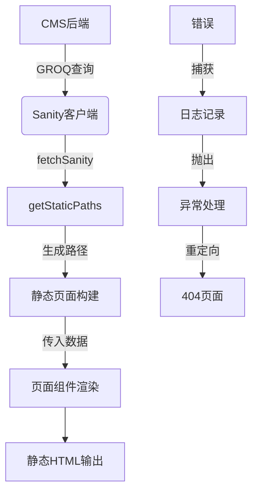

# 数据访问层

<cite>
**本文档引用的文件**
- [sanity.ts](file://src/lib/sanity.ts)
- [post.ts](file://sanity/schemaTypes/post.ts)
- [project.ts](file://sanity/schemaTypes/project.ts)
- [about.ts](file://sanity/schemaTypes/about.ts)
- [author.ts](file://sanity/schemaTypes/author.ts)
- [category.ts](file://sanity/schemaTypes/category.ts)
- [blockContent.ts](file://sanity/schemaTypes/blockContent.ts)
- [index.astro](file://src/pages/index.astro)
- [blog/index.astro](file://src/pages/blog/index.astro)
- [blog/[slug].astro](file://src/pages/blog/[slug].astro)
- [projects/index.astro](file://src/pages/projects/index.astro)
- [projects/[slug].astro](file://src/pages/projects/[slug].astro)
- [about.astro](file://src/pages/about.astro)
- [index.html](file://public/cms/index.html)
</cite>

## 目录
1. [Sanity客户端初始化](#sanity客户端初始化)
2. [GROQ查询设计与数据投影](#groq查询设计与数据投影)
3. [参数化查询与安全性](#参数化查询与安全性)
4. [数据获取辅助函数](#数据获取辅助函数)
5. [从CMS到前端的完整数据链路](#从cms到前端的完整数据链路)
6. [CMS管理界面入口](#cms管理界面入口)

## Sanity客户端初始化

Sanity客户端的初始化配置了与CMS后端通信的关键参数。`projectId` 'k2j30muc' 是项目在Sanity平台上的唯一标识符，用于路由所有API请求到正确的后端实例。`dataset` 'production' 指定了要访问的数据集，这允许在开发、预发布和生产环境之间进行数据隔离。`apiVersion` '2024-01-01' 确保了API请求与特定版本的后端接口兼容，防止因后端更新导致的意外行为变化。`useCdn` 选项设置为 `true`，这显著提升了性能，因为从CDN缓存中获取数据比直接查询数据库要快得多，特别适合内容不频繁变化的静态网站。

**Section sources**
- [sanity.ts](file://src/lib/sanity.ts#L3-L8)

## GROQ查询设计与数据投影

GROQ查询采用了精心设计的结构和数据投影策略，以优化性能和减少数据传输量。`postsQuery` 查询所有博客文章，按发布时间降序排列，并通过投影只选择必要的字段，如 `_id`、`title`、`slug` 和 `publishedAt`。对于关联数据，使用了引用解析语法：`"coverImage": coverImage.asset->url` 将封面图片的引用解析为实际的URL，`"author": author->{name, "avatar": avatar.asset->url}` 则内联解析作者信息及其头像URL。`categories[]->{title, slug}` 对分类数组中的每个元素进行投影，只获取标题和slug。`projectsQuery` 和 `projectBySlugQuery` 采用了类似的策略，针对项目数据选择了特定字段，如 `technologies`、`liveUrl` 和 `githubUrl`。`featuredContentQuery` 是一个复合查询，同时获取精选文章和项目，用于首页展示，通过 `[0...3]` 语法限制结果数量。

**Section sources**
- [sanity.ts](file://src/lib/sanity.ts#L11-L89)

## 参数化查询与安全性

参数化查询是确保数据访问安全的关键机制。`postBySlugQuery` 和 `projectBySlugQuery` 都使用了 `$slug` 参数，这是一种占位符，其实际值在查询执行时通过 `params` 对象传入。这种设计将查询结构与用户输入完全分离，从根本上防止了GROQ注入攻击。例如，`*[_type == "post" && slug.current == $slug][0]` 中的 `$slug` 不会被直接拼接到查询字符串中，而是由Sanity客户端安全地处理。这不仅保证了安全性，还允许Sanity后端对参数化查询进行缓存优化，因为查询结构是固定的，只有参数值变化。

**Section sources**
- [sanity.ts](file://src/lib/sanity.ts#L30-L40)
- [sanity.ts](file://src/lib/sanity.ts#L56-L68)

## 数据获取辅助函数

`fetchSanity` 辅助函数封装了错误处理和日志记录的最佳实践。该函数是一个泛型函数，通过 `<T>` 类型参数保证了类型安全，调用者可以明确指定期望返回的数据类型。在 `try` 块中，它调用 `sanityClient.fetch<T>(query, params)` 执行查询。如果发生错误，`catch` 块会捕获异常，使用 `console.error` 记录详细的错误信息（包括错误对象），然后重新抛出错误。这种模式允许上层代码（如页面组件）根据需要处理错误（例如重定向到404页面），同时确保所有错误都被记录下来，便于调试和监控。

**Section sources**
- [sanity.ts](file://src/lib/sanity.ts#L92-L98)

## 从CMS到前端的完整数据链路

从CMS获取数据到前端页面渲染的完整链路是一个在构建时（build time）完成的静态生成过程。以 `blog/[slug].astro` 页面为例，其 `getStaticPaths` 函数首先执行一个GROQ查询来获取所有博客文章的slug，为每个slug生成一个静态路径。当构建特定页面时，`fetchSanity` 函数使用 `postBySlugQuery` 和当前slug参数从CMS获取文章数据。这个过程利用了泛型 `<T>` 来保证返回数据的类型安全。如果查询失败或未找到文章，会通过 `Astro.redirect('/404')` 进行异常处理。获取到的数据随后被传递给页面组件，用于渲染HTML。`PortableText` 组件负责将Sanity的块内容（block content）安全地渲染为HTML。整个链路确保了最终生成的页面是纯静态的，具有极佳的性能和SEO优势。

**Diagram sources**
- [sanity.ts](file://src/lib/sanity.ts#L92-L98)
- [blog/[slug].astro](file://src/pages/blog/[slug].astro#L9-L28)

**Section sources**
- [sanity.ts](file://src/lib/sanity.ts#L92-L98)
- [blog/[slug].astro](file://src/pages/blog/[slug].astro#L9-L127)
- [projects/[slug].astro](file://src/pages/projects/[slug].astro#L8-L71)
- [index.astro](file://src/pages/index.astro#L1-L242)

## CMS管理界面入口

CMS管理界面的入口是 `public/cms/index.html` 文件，这是一个静态的HTML文件，作为Sanity Studio的单页应用（SPA）的入口点。该文件通过CDN加载Sanity Studio的核心JavaScript库（`/cms/static/sanity-Bvxx0R8f.js`）和依赖项。静态资源（如图标、字体和manifest文件）位于 `public/cms/static/` 目录下。`index.html` 中的脚本和样式确保了Studio应用的正确加载和错误处理。当用户访问 `/cms` 路径时，服务器会直接提供这个HTML文件，从而启动CMS管理界面。`scripts/fix-cms-paths.js` 脚本用于在构建过程中修复静态资源的路径，确保它们正确地指向 `/cms/static/` 路径。

**Section sources**
- [index.html](file://public/cms/index.html#L1-L272)
- [fix-cms-paths.js](file://scripts/fix-cms-paths.js#L1-L33)