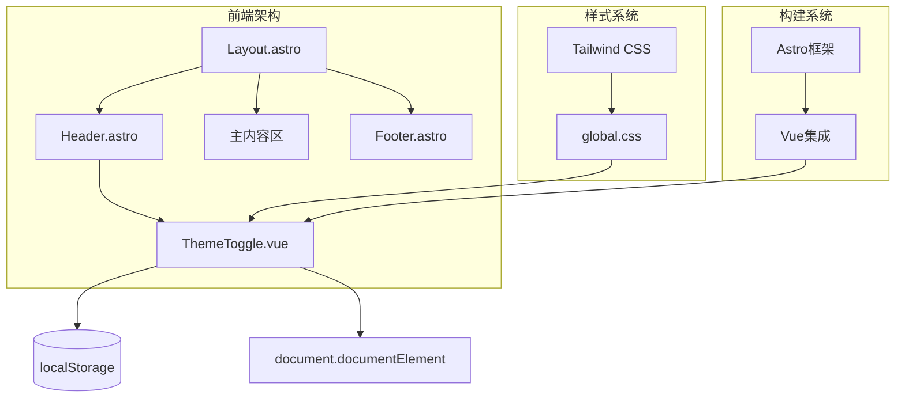
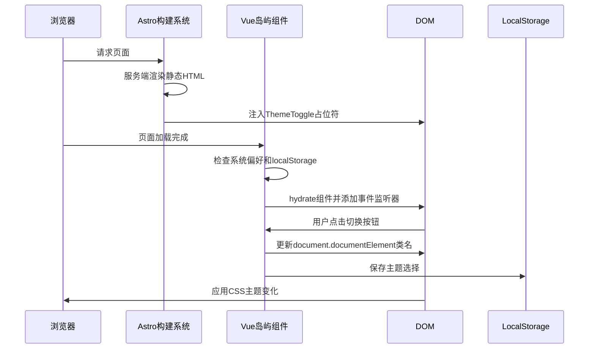
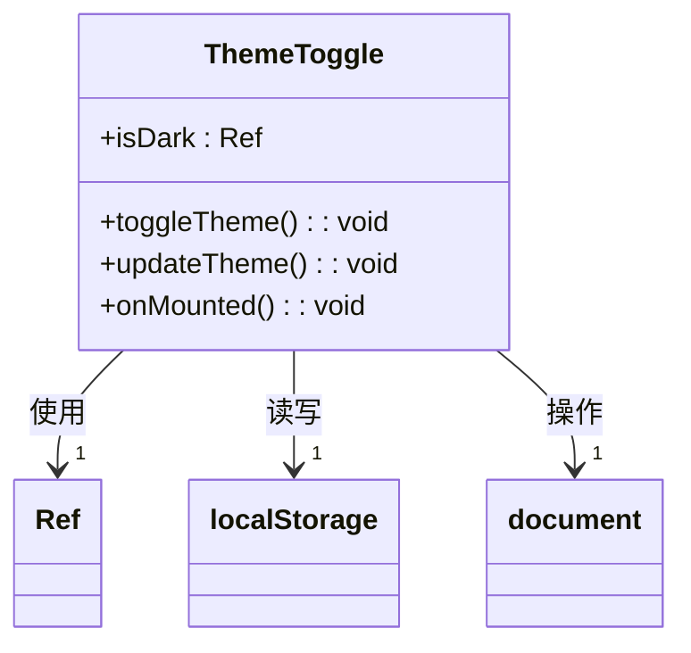
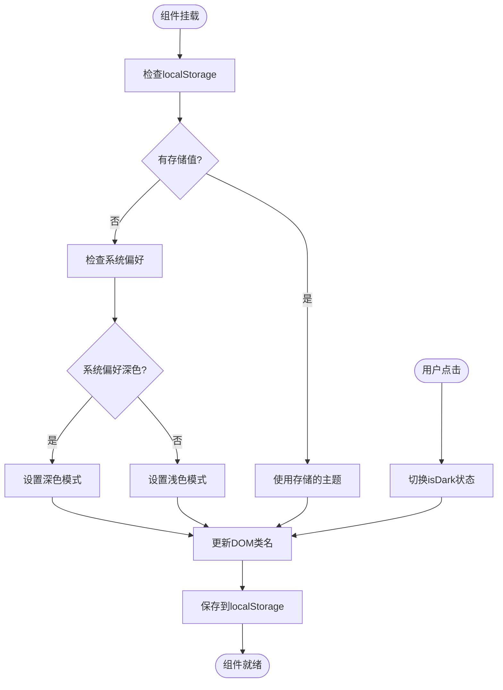
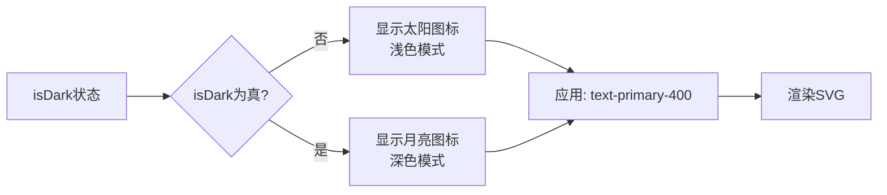
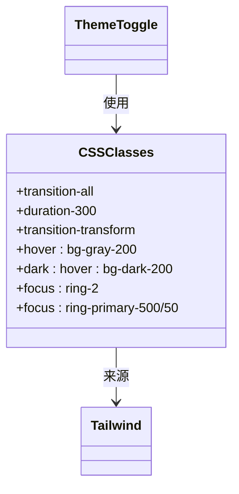
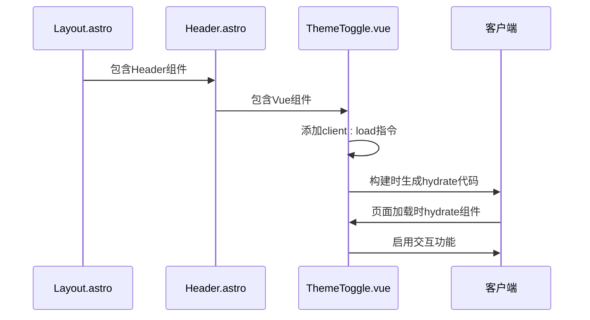
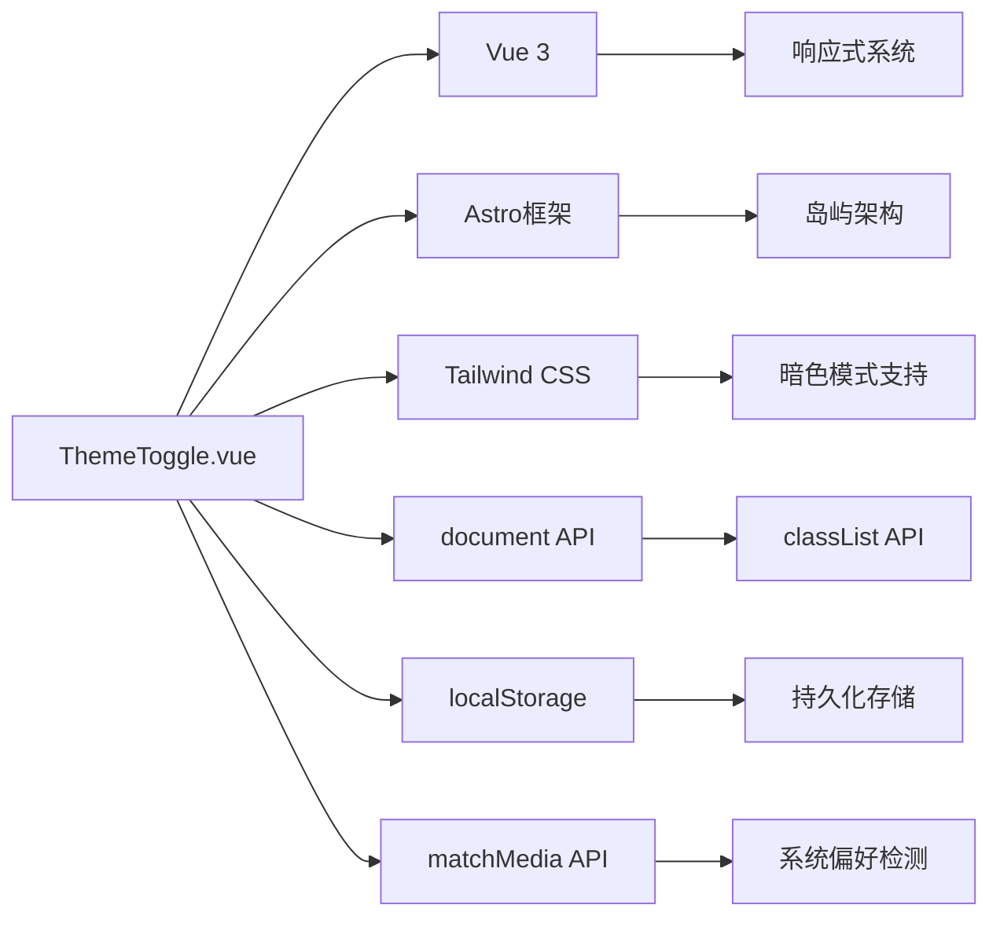

# 交互式组件

<cite>
**本文档引用的文件**
- [ThemeToggle.vue](file://src/components/ThemeToggle.vue)
- [Header.astro](file://src/components/Header.astro)
- [Layout.astro](file://src/layouts/Layout.astro)
- [global.css](file://src/styles/global.css)
- [astro.config.mjs](file://astro.config.mjs)
</cite>

## 目录
1. [简介](#简介)
2. [项目结构](#项目结构)
3. [核心组件](#核心组件)
4. [架构概述](#架构概述)
5. [详细组件分析](#详细组件分析)
6. [依赖分析](#依赖分析)
7. [性能考虑](#性能考虑)
8. [故障排除指南](#故障排除指南)
9. [结论](#结论)

## 简介
本文档详细记录了ThemeToggle.vue这一交互式Vue组件的实现原理。该组件作为Astro应用中的一个"岛屿"，实现了深色/浅色主题的切换功能。组件通过响应式状态管理、localStorage持久化和系统偏好检测，为用户提供一致的主题体验。文档将深入分析组件在Astro岛屿架构中的hydrate机制、客户端交互实现、状态管理逻辑以及与其他系统的集成方式。

## 项目结构
项目采用Astro框架构建，结合Vue组件实现交互性。主题切换组件作为独立的交互"岛屿"嵌入到静态布局中，体现了Astro的岛屿架构理念。

**图表来源**
- [Layout.astro](file://src/layouts/Layout.astro#L1-L59)
- [Header.astro](file://src/components/Header.astro#L1-L164)
- [ThemeToggle.vue](file://src/components/ThemeToggle.vue#L1-L79)

**本节来源**
- [src](file://src)
- [astro.config.mjs](file://astro.config.mjs#L1-L34)

## 核心组件
ThemeToggle.vue是实现主题切换功能的核心交互组件。它使用Vue 3的组合式API，通过响应式ref管理主题状态，并在组件挂载时根据系统偏好和本地存储初始化主题。组件通过操作document.documentElement的类名来触发Tailwind CSS的暗色模式，同时将用户选择持久化到localStorage中。

**本节来源**
- [ThemeToggle.vue](file://src/components/ThemeToggle.vue#L43-L78)

## 架构概述
组件在Astro的岛屿架构中作为可交互的"岛屿"存在，仅在需要时进行hydrate和客户端交互。这种架构优化了性能，确保只有交互式组件消耗JavaScript资源。

**图表来源**
- [ThemeToggle.vue](file://src/components/ThemeToggle.vue#L43-L78)
- [astro.config.mjs](file://astro.config.mjs#L1-L34)

## 详细组件分析

### ThemeToggle组件分析
ThemeToggle.vue组件实现了完整的主题切换逻辑，包括状态管理、用户交互和持久化存储。

#### 响应式状态管理
组件使用Vue的ref创建响应式状态isDark，该状态驱动UI的条件渲染和主题切换逻辑。

**图表来源**
- [ThemeToggle.vue](file://src/components/ThemeToggle.vue#L46-L78)

#### 主题切换逻辑
组件实现了完整的主题切换流程，从用户交互到状态持久化。

**图表来源**
- [ThemeToggle.vue](file://src/components/ThemeToggle.vue#L48-L61)
- [ThemeToggle.vue](file://src/components/ThemeToggle.vue#L63-L77)

#### SVG图标切换机制
组件使用条件渲染(v-if/v-else)在太阳和月亮SVG图标之间切换，提供直观的视觉反馈。

**图表来源**
- [ThemeToggle.vue](file://src/components/ThemeToggle.vue#L11-L39)

#### CSS过渡动画实现
组件通过Tailwind CSS的过渡类实现平滑的视觉效果。

**图表来源**
- [ThemeToggle.vue](file://src/components/ThemeToggle.vue#L4-L7)
- [global.css](file://src/styles/global.css#L1-L177)

### 组件集成方法
在Astro页面中集成ThemeToggle.vue组件需要正确配置客户端指令。

**图表来源**
- [Header.astro](file://src/components/Header.astro#L1-L164)
- [ThemeToggle.vue](file://src/components/ThemeToggle.vue#L1-L79)

**本节来源**
- [ThemeToggle.vue](file://src/components/ThemeToggle.vue#L1-L79)
- [Header.astro](file://src/components/Header.astro#L1-L164)

## 依赖分析
ThemeToggle.vue组件依赖于多个系统和库，形成了完整的主题管理解决方案。

**图表来源**
- [ThemeToggle.vue](file://src/components/ThemeToggle.vue#L44-L78)
- [astro.config.mjs](file://astro.config.mjs#L1-L34)
- [global.css](file://src/styles/global.css#L1-L177)

**本节来源**
- [ThemeToggle.vue](file://src/components/ThemeToggle.vue#L44-L78)
- [astro.config.mjs](file://astro.config.mjs#L1-L34)

## 性能考虑
ThemeToggle.vue组件的设计充分考虑了性能优化，符合Astro框架的最佳实践。

- **按需hydrate**: 组件仅在客户端需要交互时进行hydrate，减少JavaScript负载
- **高效的DOM操作**: 直接操作document.documentElement类名，避免复杂的DOM遍历
- **本地存储优化**: 使用localStorage进行持久化，避免网络请求
- **CSS变量利用**: 依赖Tailwind CSS的暗色模式实现，利用CSS的高效渲染机制
- **事件委托最小化**: 组件仅有一个点击事件监听器，减少内存占用

## 故障排除指南
### 常见问题及解决方案

#### 主题不持久化
**问题**: 用户刷新页面后主题恢复默认
**原因**: localStorage未正确写入或读取
**解决方案**:
1. 检查浏览器是否禁用了localStorage
2. 确认updateTheme函数正确调用了localStorage.setItem
3. 验证onMounted生命周期中正确读取了localStorage值

**本节来源**
- [ThemeToggle.vue](file://src/components/ThemeToggle.vue#L56-L59)
- [ThemeToggle.vue](file://src/components/ThemeToggle.vue#L65-L66)

#### 首次加载闪烁
**问题**: 页面首次加载时出现主题闪烁
**原因**: CSS和JavaScript加载顺序导致的渲染不一致
**解决方案**:
1. 在HTML头部添加CSS类名预测
2. 使用服务端渲染预设主题类名
3. 优化hydrate时机，减少视觉不一致

**本节来源**
- [ThemeToggle.vue](file://src/components/ThemeToggle.vue#L63-L77)
- [Layout.astro](file://src/layouts/Layout.astro#L23-L24)

#### 系统偏好检测失效
**问题**: 组件无法正确检测系统深色模式偏好
**原因**: matchMedia API兼容性或使用方式问题
**解决方案**:
1. 确保使用正确的媒体查询语法(prefers-color-scheme: dark)
2. 添加错误处理机制
3. 提供降级方案

**本节来源**
- [ThemeToggle.vue](file://src/components/ThemeToggle.vue#L66-L67)

## 结论
ThemeToggle.vue组件成功实现了Astro应用中的主题切换功能，展示了岛屿架构下交互式组件的最佳实践。通过响应式状态管理、localStorage持久化和系统偏好检测，组件为用户提供了一致且个性化的主题体验。组件的实现充分利用了Vue 3的组合式API和Astro的hydrate机制，在保证交互性的同时优化了性能。建议在实际使用中注意首次加载的闪烁问题，并考虑添加更多的无障碍支持和错误处理机制来提升用户体验。