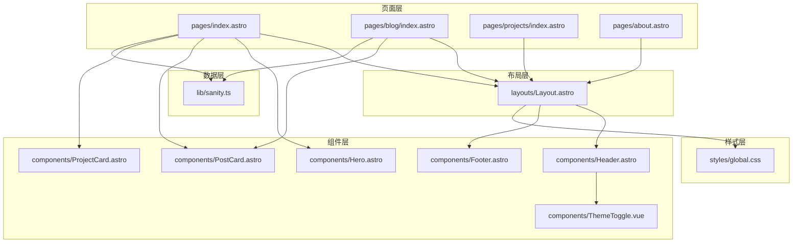
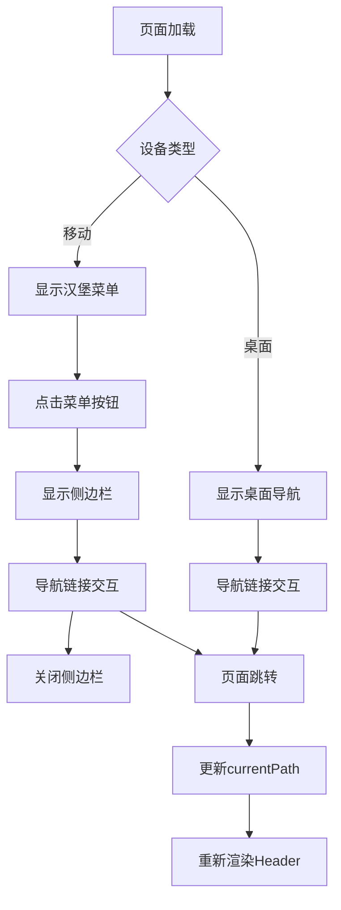
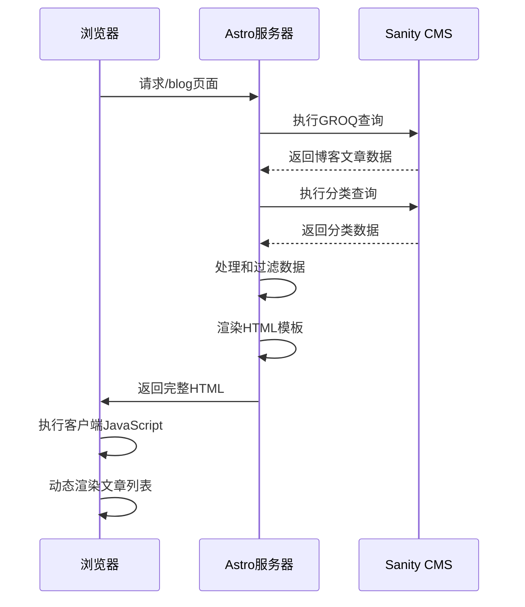
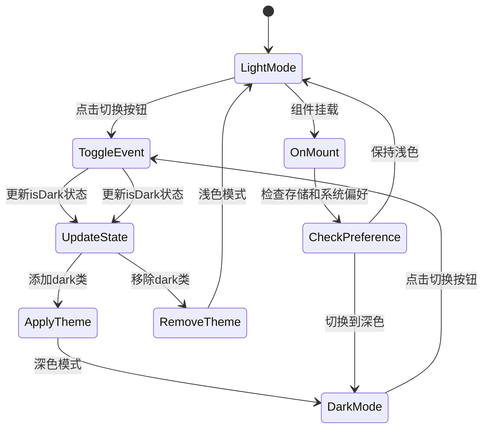
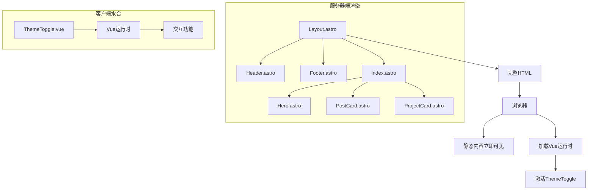
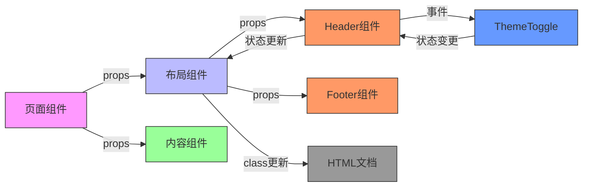
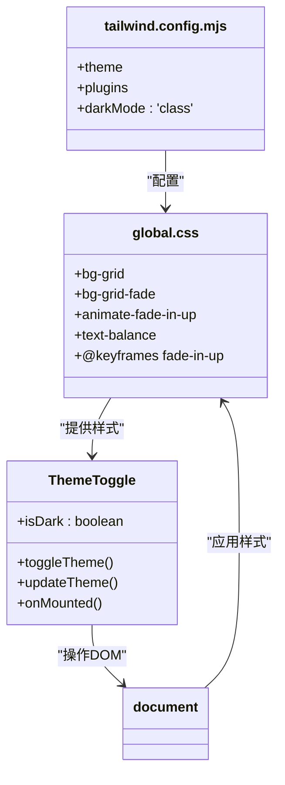
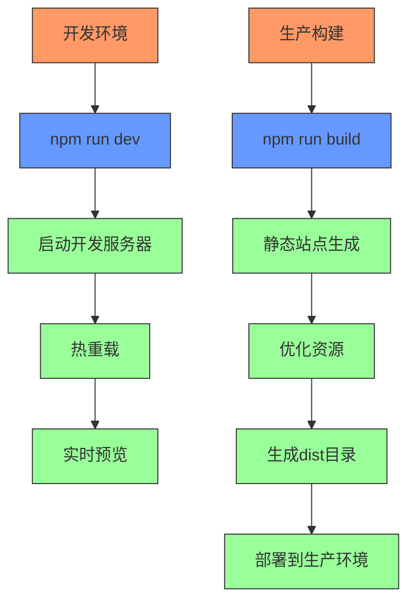

# 前端架构

<cite>
**本文档引用的文件**
- [Layout.astro](file://src/layouts/Layout.astro)
- [Header.astro](file://src/components/Header.astro)
- [Footer.astro](file://src/components/Footer.astro)
- [ThemeToggle.vue](file://src/components/ThemeToggle.vue)
- [index.astro](file://src/pages/index.astro)
- [blog/index.astro](file://src/pages/blog/index.astro)
- [sanity.ts](file://src/lib/sanity.ts)
- [global.css](file://src/styles/global.css)
- [astro.config.mjs](file://astro.config.mjs)
</cite>

## 目录
1. [项目结构](#项目结构)
2. [全局布局系统](#全局布局系统)
3. [导航与SEO组件](#导航与seo组件)
4. [页面结构与数据获取](#页面结构与数据获取)
5. [Vue组件集成与交互](#vue组件集成与交互)
6. [Astro岛屿架构](#astro岛屿架构)
7. [组件间数据传递](#组件间数据传递)
8. [样式与主题系统](#样式与主题系统)
9. [构建与部署配置](#构建与部署配置)

## 项目结构

项目采用模块化架构，主要分为以下几个核心目录：

- **src/layouts**：存放全局布局组件，如 `Layout.astro`
- **src/components**：包含可复用的UI组件，包括Astro组件和Vue组件
- **src/pages**：定义网站的路由和页面结构
- **src/lib**：存放业务逻辑和数据访问层代码
- **src/styles**：全局样式和Tailwind CSS配置

这种结构实现了关注点分离，便于维护和扩展。



**图示来源**
- [Layout.astro](file://src/layouts/Layout.astro)
- [Header.astro](file://src/components/Header.astro)
- [Footer.astro](file://src/components/Footer.astro)
- [ThemeToggle.vue](file://src/components/ThemeToggle.vue)
- [index.astro](file://src/pages/index.astro)
- [blog/index.astro](file://src/pages/blog/index.astro)
- [sanity.ts](file://src/lib/sanity.ts)
- [global.css](file://src/styles/global.css)

## 全局布局系统

`Layout.astro` 作为全局布局容器，封装了网站的整体结构和共享功能。它通过Astro的插槽（slot）机制为所有页面提供一致的HTML结构和元数据管理。

布局组件接收 `title`、`description` 和 `image` 等属性，用于动态生成页面的标题、描述和Open Graph标签，确保每个页面都有独特的SEO元数据。

```mermaid
classDiagram
class Layout {
+title : string
+description : string
+image : string
+currentPath : string
+canonicalURL : URL
}
Layout --> Header : "包含"
Layout --> Footer : "包含"
Layout --> "slot" : "渲染内容"
class Header {
+currentPath : string
+navLinks : Array
}
class Footer {
+currentYear : number
+socialLinks : Array
+footerLinks : Array
}
Header --> ThemeToggle : "包含"
```

**图示来源**
- [Layout.astro](file://src/layouts/Layout.astro)
- [Header.astro](file://src/components/Header.astro)
- [Footer.astro](file://src/components/Footer.astro)
- [ThemeToggle.vue](file://src/components/ThemeToggle.vue)

**本节来源**
- [Layout.astro](file://src/layouts/Layout.astro#L1-L59)
- [Header.astro](file://src/components/Header.astro#L1-L164)
- [Footer.astro](file://src/components/Footer.astro#L1-L86)

## 导航与SEO组件

`Header.astro` 和 `Footer.astro` 组件共同构成了网站的导航系统，提供了完整的用户体验和SEO优化。

### Header组件

`Header.astro` 实现了响应式导航设计，包含：

- **桌面端导航**：居中的导航链接，当前页面高亮显示
- **移动端菜单**：汉堡菜单按钮和滑动侧边栏
- **主题切换**：集成 `ThemeToggle.vue` 组件
- **CTA按钮**：引导用户进行关键操作

组件通过 `currentPath` 属性识别当前页面，并相应地更新导航项的样式状态。

### Footer组件

`Footer.astro` 提供了网站的底部信息，包含：

- **版权信息**：显示当前年份和版权声明
- **导航链接**：重复主要导航，提高可用性
- **社交链接**：连接到外部社交平台
- **品牌标识**：保持品牌一致性

两个组件都实现了完善的SEO功能，包括语义化HTML结构、ARIA标签和无障碍访问支持。



**图示来源**
- [Header.astro](file://src/components/Header.astro#L1-L164)
- [Footer.astro](file://src/components/Footer.astro#L1-L86)

**本节来源**
- [Header.astro](file://src/components/Header.astro#L1-L164)
- [Footer.astro](file://src/components/Footer.astro#L1-L86)

## 页面结构与数据获取

Astro页面组件通过其独特的语法实现数据获取和内容渲染，以 `index.astro` 和 `blog/index.astro` 为例展示了不同的数据处理模式。

### 静态数据页面

`index.astro` 使用静态数据定义，适合内容不频繁变化的页面：

- 在前端直接定义数据数组
- 通过组件属性传递数据
- 实现快速渲染和良好性能

### 动态数据页面

`blog/index.astro` 展示了从CMS获取动态数据的完整流程：

1. **导入数据访问层**：引入 `sanity.ts` 中的查询函数
2. **执行服务器端查询**：使用 `fetchSanity` 获取博客文章和分类
3. **数据处理与过滤**：对获取的数据进行预处理
4. **传递到客户端**：将数据序列化并通过 `define:vars` 传递



**图示来源**
- [index.astro](file://src/pages/index.astro#L1-L242)
- [blog/index.astro](file://src/pages/blog/index.astro#L1-L321)
- [sanity.ts](file://src/lib/sanity.ts#L1-L99)

**本节来源**
- [index.astro](file://src/pages/index.astro#L1-L242)
- [blog/index.astro](file://src/pages/blog/index.astro#L1-L321)
- [sanity.ts](file://src/lib/sanity.ts#L1-L99)

## Vue组件集成与交互

`ThemeToggle.vue` 组件展示了如何在Astro框架中集成Vue组件以实现客户端交互功能。

### 组件结构

Vue组件采用 `<script setup>` 语法，包含：

- **响应式状态**：使用 `ref` 管理深色/浅色模式状态
- **生命周期钩子**：`onMounted` 中初始化主题
- **事件处理**：`toggleTheme` 方法处理点击事件
- **DOM操作**：通过 `document.documentElement.classList` 控制主题

### 主题管理逻辑

组件实现了智能的主题管理策略：

1. **优先级顺序**：
   - 首先检查本地存储中的用户偏好
   - 其次检查系统偏好设置
   - 最后使用默认的浅色模式

2. **状态持久化**：
   - 将用户选择存储在 `localStorage` 中
   - 确保用户下次访问时保持相同主题

3. **CSS类控制**：
   - 通过添加/移除 `dark` 类来切换主题
   - 利用Tailwind CSS的暗色模式支持



**图示来源**
- [ThemeToggle.vue](file://src/components/ThemeToggle.vue#L1-L79)
- [Layout.astro](file://src/layouts/Layout.astro#L1-L59)
- [global.css](file://src/styles/global.css#L1-L177)

**本节来源**
- [ThemeToggle.vue](file://src/components/ThemeToggle.vue#L1-L79)
- [Layout.astro](file://src/layouts/Layout.astro#L1-L59)

## Astro岛屿架构

Astro的岛屿架构（Island Architecture）是本项目的核心技术特点，它巧妙地平衡了静态渲染性能和动态交互需求。

### 架构原理

岛屿架构将页面分解为多个独立的"岛屿"：

- **静态岛屿**：大部分内容以静态HTML形式渲染
- **动态岛屿**：仅在需要交互的组件周围创建"岛屿"
- **按需水合**：只对动态岛屿进行客户端水合

### 本项目实现

在本项目中，岛屿架构的具体体现：

1. **全局布局**：`Layout.astro`、`Header.astro`、`Footer.astro` 作为静态岛屿
2. **内容区域**：`index.astro` 中的大部分内容为静态渲染
3. **交互岛屿**：`ThemeToggle.vue` 是唯一的动态岛屿

这种架构带来了显著的性能优势：

- **快速首屏加载**：用户立即看到完整内容
- **低JavaScript负载**：只加载必要的交互代码
- **良好SEO**：搜索引擎可以轻松抓取静态内容
- **高交互性**：关键功能保持动态响应



**图示来源**
- [Layout.astro](file://src/layouts/Layout.astro)
- [ThemeToggle.vue](file://src/components/ThemeToggle.vue)
- [astro.config.mjs](file://astro.config.mjs)
- [package.json](file://package.json)

**本节来源**
- [Layout.astro](file://src/layouts/Layout.astro#L1-L59)
- [ThemeToggle.vue](file://src/components/ThemeToggle.vue#L1-L79)
- [astro.config.mjs](file://astro.config.mjs#L1-L35)

## 组件间数据传递

项目中的组件间数据传递遵循清晰的模式，确保了数据流的可预测性和可维护性。

### 数据传递模式

1. **属性传递（Props）**：
   - 父组件向子组件传递数据
   - 类型安全的接口定义
   - 单向数据流

2. **插槽机制（Slots）**：
   - `Layout.astro` 使用 `<slot />` 接收页面内容
   - 支持默认插槽和具名插槽

3. **上下文传递**：
   - 通过 `Astro.props` 传递页面级数据
   - 利用 `define:vars` 传递服务器端数据到客户端

### 具体实现



**图示来源**
- [Layout.astro](file://src/layouts/Layout.astro#L1-L59)
- [Header.astro](file://src/components/Header.astro#L1-L164)
- [ThemeToggle.vue](file://src/components/ThemeToggle.vue#L1-L79)
- [index.astro](file://src/pages/index.astro#L1-L242)

**本节来源**
- [Layout.astro](file://src/layouts/Layout.astro#L1-L59)
- [Header.astro](file://src/components/Header.astro#L1-L164)
- [ThemeToggle.vue](file://src/components/ThemeToggle.vue#L1-L79)

## 样式与主题系统

项目采用Tailwind CSS作为样式解决方案，并结合自定义CSS实现完整的视觉系统。

### 样式架构

1. **Tailwind CSS**：
   - 通过 `@astrojs/tailwind` 集成
   - 使用JIT模式实现按需生成
   - 支持暗色模式

2. **自定义CSS**：
   - `global.css` 定义全局样式
   - 包含动画、网格背景等自定义效果
   - 扩展Tailwind的功能

### 主题系统

主题系统通过以下方式实现：

- **CSS类切换**：`dark` 类控制暗色模式
- **本地存储**：持久化用户偏好
- **系统偏好**：尊重用户的操作系统设置
- **平滑过渡**：CSS过渡效果确保视觉流畅



**图示来源**
- [global.css](file://src/styles/global.css#L1-L177)
- [ThemeToggle.vue](file://src/components/ThemeToggle.vue#L1-L79)
- [astro.config.mjs](file://astro.config.mjs#L1-L35)

**本节来源**
- [global.css](file://src/styles/global.css#L1-L177)
- [ThemeToggle.vue](file://src/components/ThemeToggle.vue#L1-L79)

## 构建与部署配置

项目的构建和部署配置通过 `astro.config.mjs` 文件进行管理，确保了开发和生产环境的一致性。

### 核心配置

1. **集成插件**：
   - `@astrojs/vue`：支持Vue组件集成
   - `@astrojs/tailwind`：集成Tailwind CSS

2. **输出模式**：
   - 静态站点生成（SSG）
   - 适合内容为主的网站

3. **自定义插件**：
   - `cms-redirect`：处理CMS路径重定向
   - 确保CMS页面正确访问

### 构建流程



**图示来源**
- [astro.config.mjs](file://astro.config.mjs#L1-L35)
- [package.json](file://package.json#L1-L28)

**本节来源**
- [astro.config.mjs](file://astro.config.mjs#L1-L35)
- [package.json](file://package.json#L1-L28)