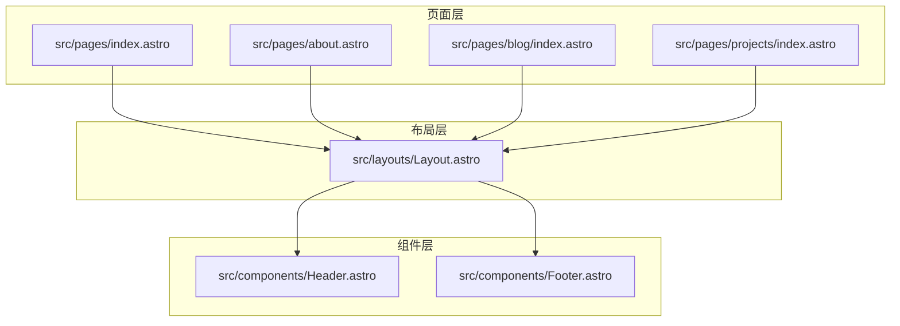
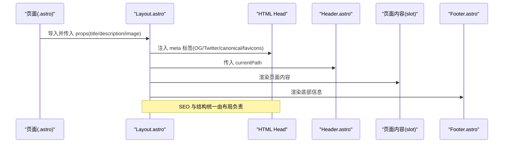
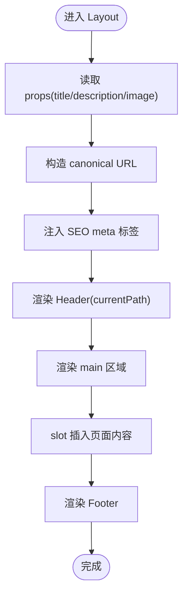
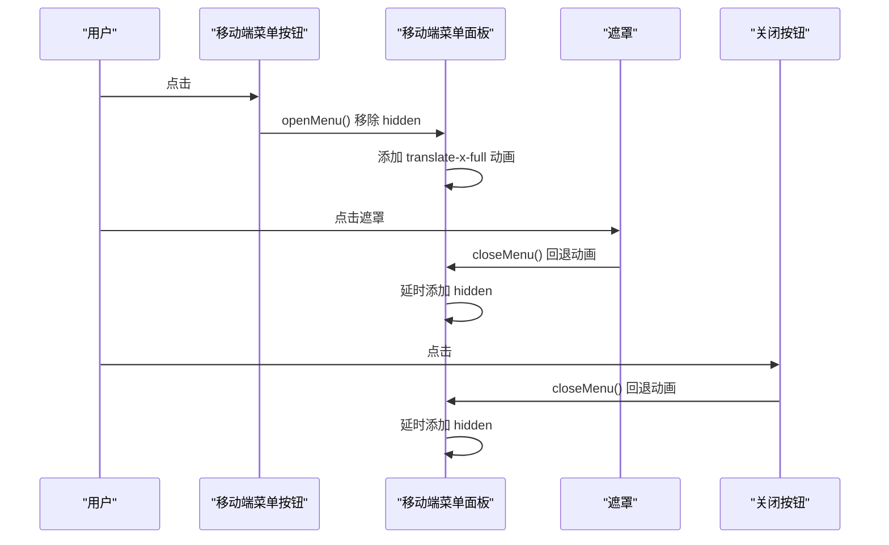
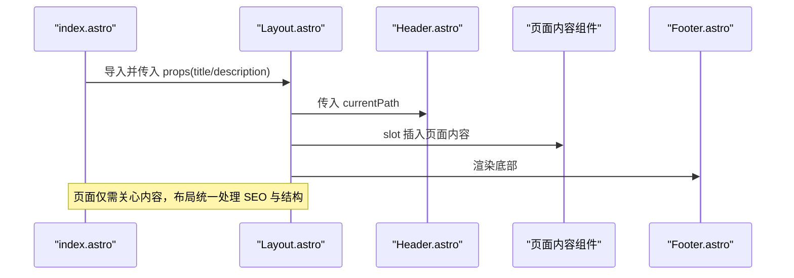
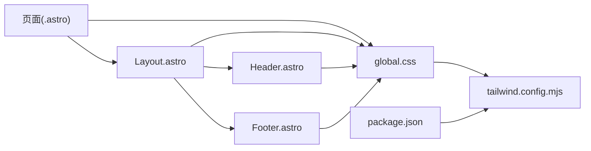

# 布局系统

<cite>
**本文引用的文件**
- [src/layouts/Layout.astro](file://src/layouts/Layout.astro)
- [src/components/Header.astro](file://src/components/Header.astro)
- [src/components/Footer.astro](file://src/components/Footer.astro)
- [src/pages/index.astro](file://src/pages/index.astro)
- [src/pages/about.astro](file://src/pages/about.astro)
- [src/pages/blog/index.astro](file://src/pages/blog/index.astro)
- [src/pages/projects/index.astro](file://src/pages/projects/index.astro)
- [src/styles/global.css](file://src/styles/global.css)
- [tailwind.config.mjs](file://tailwind.config.mjs)
- [package.json](file://package.json)
</cite>

## 目录
1. [简介](#简介)
2. [项目结构](#项目结构)
3. [核心组件](#核心组件)
4. [架构总览](#架构总览)
5. [详细组件分析](#详细组件分析)
6. [依赖关系分析](#依赖关系分析)
7. [性能考量](#性能考量)
8. [故障排查指南](#故障排查指南)
9. [结论](#结论)
10. [附录](#附录)

## 简介
本文件系统性阐述网站的布局系统，重点围绕 Layout.astro 作为全局布局组件的实现机制展开。内容涵盖：
- 如何通过 Astro 的 Props 接收页面标题、描述等元数据，并集成 SEO 优化的 meta 标签（Open Graph、Twitter Card、canonical、favicon 等）
- Header 与 Footer 在布局中的角色，包括 Header 的响应式导航设计（桌面端与移动端菜单）、Footer 的全局信息展示
- 布局组件如何使用 Tailwind CSS 实现现代化视觉设计（背景透明、阴影、固定定位等）
- 在新页面中使用该布局的具体示例，以及 slot 机制如何实现内容的动态插入
- 常见问题解答（如元数据配置错误或移动端菜单失效的解决方案）

## 项目结构
布局系统由三层组成：
- 页面层：各页面文件（如首页、关于页、博客页、作品页）通过导入 Layout.astro 并传入标题等元数据
- 布局层：Layout.astro 负责统一的 HTML 结构、SEO 元数据注入、头部与底部组件挂载、内容插槽渲染
- 组件层：Header.astro 与 Footer.astro 提供导航与全局信息展示

**图表来源**
- [src/pages/index.astro](file://src/pages/index.astro#L1-L242)
- [src/pages/about.astro](file://src/pages/about.astro#L1-L321)
- [src/pages/blog/index.astro](file://src/pages/blog/index.astro#L1-L128)
- [src/pages/projects/index.astro](file://src/pages/projects/index.astro#L1-L171)
- [src/layouts/Layout.astro](file://src/layouts/Layout.astro#L1-L59)
- [src/components/Header.astro](file://src/components/Header.astro#L1-L164)
- [src/components/Footer.astro](file://src/components/Footer.astro#L1-L86)

**章节来源**
- [src/pages/index.astro](file://src/pages/index.astro#L1-L242)
- [src/pages/about.astro](file://src/pages/about.astro#L1-L321)
- [src/pages/blog/index.astro](file://src/pages/blog/index.astro#L1-L128)
- [src/pages/projects/index.astro](file://src/pages/projects/index.astro#L1-L171)
- [src/layouts/Layout.astro](file://src/layouts/Layout.astro#L1-L59)

## 核心组件
- Layout.astro：全局布局，负责注入 SEO 元数据、渲染 Header/Footer、承载页面内容（slot）
- Header.astro：响应式导航，桌面端居中导航与移动端抽屉菜单
- Footer.astro：全局信息展示，包含导航、版权与社交链接

**章节来源**
- [src/layouts/Layout.astro](file://src/layouts/Layout.astro#L1-L59)
- [src/components/Header.astro](file://src/components/Header.astro#L1-L164)
- [src/components/Footer.astro](file://src/components/Footer.astro#L1-L86)

## 架构总览
整体架构采用“页面 -> 布局 -> 组件”的层次化组织，页面通过 Astro 的组件导入与 props 传参，布局统一注入 SEO 与通用 UI，组件模块化复用。

**图表来源**
- [src/layouts/Layout.astro](file://src/layouts/Layout.astro#L1-L59)
- [src/components/Header.astro](file://src/components/Header.astro#L1-L164)
- [src/components/Footer.astro](file://src/components/Footer.astro#L1-L86)
- [src/pages/index.astro](file://src/pages/index.astro#L80-L86)

## 详细组件分析

### Layout.astro：全局布局与 SEO
- Props 接收
  - title：页面标题
  - description：页面描述（默认值）
  - image：OG 图片（默认值）
- SEO 注入
  - 生成 canonical URL（基于 Astro.site 与 Astro.url.pathname）
  - 写入 meta description、generator、Open Graph、Twitter Card、favicon
- 结构与样式
  - body 使用 Flex 布局，Header 固定定位，main 区域通过 flex-1 自适应高度
  - 通过全局样式引入 Tailwind，实现背景、阴影、圆角等视觉效果
- 内容插槽
  - 使用 <slot /> 动态插入页面内容

**图表来源**
- [src/layouts/Layout.astro](file://src/layouts/Layout.astro#L1-L59)

**章节来源**
- [src/layouts/Layout.astro](file://src/layouts/Layout.astro#L1-L59)

### Header.astro：响应式导航与移动端菜单
- 导航数据
  - navLinks：包含首页、博客、作品、关于等链接
  - currentPath：用于高亮当前页
- 桌面端导航
  - 居中布局，根据 currentPath 切换高亮样式
- 移动端菜单
  - 固定定位、半透明遮罩、右侧滑出面板
  - 打开/关闭动画通过 transform 与过渡类实现
  - 通过原生 JS 事件绑定控制显示隐藏
- 交互细节
  - 打开菜单：移除 hidden，延时添加平移动画
  - 关闭菜单：先回退平移，再延迟隐藏容器
  - 点击遮罩或关闭按钮均可关闭

**图表来源**
- [src/components/Header.astro](file://src/components/Header.astro#L138-L164)

**章节来源**
- [src/components/Header.astro](file://src/components/Header.astro#L1-L164)

### Footer.astro：全局信息展示
- 信息构成
  - Logo 与导航：博客、作品、关于
  - 版权与社交：当前年份、GitHub/Twitter/LinkedIn
- 响应式布局
  - 在小屏下垂直堆叠，大屏下水平排列
- 可访问性
  - 社交链接使用 target="_blank" 与 rel="noopener noreferrer"
  - aria-label 提升可访问性

**章节来源**
- [src/components/Footer.astro](file://src/components/Footer.astro#L1-L86)

### 页面使用示例与 slot 机制
- 首页示例
  - 页面导入 Layout，传入 title；在 Layout 内部通过 <Hero>、<SectionTitle>、<PostCard>、<ProjectCard> 等组件组合内容
  - 内容通过 <slot /> 动态插入到 main 区域
- 关于页示例
  - 同样传入 title 与 description，内部使用多个区块组件
- 博客/作品页示例
  - 传入 title 与 description，内部使用卡片组件与交互脚本

**图表来源**
- [src/pages/index.astro](file://src/pages/index.astro#L80-L86)
- [src/layouts/Layout.astro](file://src/layouts/Layout.astro#L49-L57)
- [src/components/Header.astro](file://src/components/Header.astro#L1-L164)
- [src/components/Footer.astro](file://src/components/Footer.astro#L1-L86)

**章节来源**
- [src/pages/index.astro](file://src/pages/index.astro#L80-L86)
- [src/pages/about.astro](file://src/pages/about.astro#L85-L90)
- [src/pages/blog/index.astro](file://src/pages/blog/index.astro#L42-L45)
- [src/pages/projects/index.astro](file://src/pages/projects/index.astro#L67-L70)

## 依赖关系分析
- 布局与组件
  - Layout 依赖 Header 与 Footer
  - 页面依赖 Layout
- 样式与主题
  - 全局样式通过 global.css 引入 Tailwind，定义基础、组件与工具层
  - Tailwind 配置扩展了颜色、字体、圆角、阴影、动画与背景图案
- 依赖声明
  - package.json 显示项目使用 Astro 与 Tailwind 插件

**图表来源**
- [src/pages/index.astro](file://src/pages/index.astro#L1-L242)
- [src/layouts/Layout.astro](file://src/layouts/Layout.astro#L1-L59)
- [src/components/Header.astro](file://src/components/Header.astro#L1-L164)
- [src/components/Footer.astro](file://src/components/Footer.astro#L1-L86)
- [src/styles/global.css](file://src/styles/global.css#L1-L177)
- [tailwind.config.mjs](file://tailwind.config.mjs#L1-L119)
- [package.json](file://package.json#L1-L28)

**章节来源**
- [src/styles/global.css](file://src/styles/global.css#L1-L177)
- [tailwind.config.mjs](file://tailwind.config.mjs#L1-L119)
- [package.json](file://package.json#L1-L28)

## 性能考量
- 布局轻量：仅负责结构与 SEO，不包含重型逻辑
- 组件内联：Header 的移动端菜单交互使用原生 JS，避免额外依赖
- 样式按需：Tailwind 通过 content 范围扫描，减少未使用样式体积
- 图片与 CDN：页面中使用外部图片资源，建议结合懒加载与合适的尺寸策略

[本节为通用指导，无需特定文件引用]

## 故障排查指南
- 元数据配置错误
  - 症状：Open Graph 或 Twitter Card 未正确显示
  - 排查要点：
    - 确认 Layout.astro 中 title/description/image 是否传入
    - 确认 canonical URL 构造是否正确（Astro.site 与 pathname）
    - 确认 meta 标签是否写入到 head
  - 参考路径
    - [src/layouts/Layout.astro](file://src/layouts/Layout.astro#L12-L46)
- 移动端菜单失效
  - 症状：点击菜单按钮无反应
  - 排查要点：
    - 确认移动端菜单按钮、遮罩、关闭按钮的 ID 与事件绑定一致
    - 确认 openMenu/closeMenu 函数在 DOM 加载后执行
    - 确认移动端断点样式（md:hidden）与面板样式（transform/transition）生效
  - 参考路径
    - [src/components/Header.astro](file://src/components/Header.astro#L72-L135)
    - [src/components/Header.astro](file://src/components/Header.astro#L138-L164)
- SEO 标签缺失
  - 症状：页面在社交平台预览异常
  - 排查要点：
    - 检查 head 中是否包含 og:title、og:description、og:image、twitter:* 等
    - 检查 favicon 链接是否正确
  - 参考路径
    - [src/layouts/Layout.astro](file://src/layouts/Layout.astro#L24-L46)
- 样式未生效
  - 症状：背景透明、阴影、圆角等样式不出现
  - 排查要点：
    - 确认 global.css 已被导入
    - 确认 Tailwind 配置已启用并扫描到对应文件
  - 参考路径
    - [src/layouts/Layout.astro](file://src/layouts/Layout.astro#L1-L5)
    - [src/styles/global.css](file://src/styles/global.css#L1-L10)
    - [tailwind.config.mjs](file://tailwind.config.mjs#L1-L119)
    - [package.json](file://package.json#L1-L28)

**章节来源**
- [src/layouts/Layout.astro](file://src/layouts/Layout.astro#L12-L46)
- [src/components/Header.astro](file://src/components/Header.astro#L72-L135)
- [src/components/Header.astro](file://src/components/Header.astro#L138-L164)
- [src/styles/global.css](file://src/styles/global.css#L1-L10)
- [tailwind.config.mjs](file://tailwind.config.mjs#L1-L119)
- [package.json](file://package.json#L1-L28)

## 结论
该布局系统以 Layout.astro 为核心，通过 Astro 的 props 与 slot 机制，实现了统一的 SEO 元数据注入、响应式导航与全局信息展示。Header 的桌面端与移动端导航设计兼顾可用性与美观，Footer 提供清晰的信息层级。配合 Tailwind CSS 的主题扩展与全局样式，整体视觉风格统一且现代化。新页面只需导入 Layout 并传入必要的元数据，即可快速获得一致的站点体验。

[本节为总结性内容，无需特定文件引用]

## 附录

### 在新页面中使用布局的步骤
- 导入 Layout 组件
- 在 Layout 上传入 title（可选传入 description/image）
- 在 Layout 内部放置页面内容组件
- 通过 <slot /> 实现内容动态插入

参考路径
- [src/pages/index.astro](file://src/pages/index.astro#L80-L86)
- [src/pages/about.astro](file://src/pages/about.astro#L85-L90)
- [src/pages/blog/index.astro](file://src/pages/blog/index.astro#L42-L45)
- [src/pages/projects/index.astro](file://src/pages/projects/index.astro#L67-L70)

**章节来源**
- [src/pages/index.astro](file://src/pages/index.astro#L80-L86)
- [src/pages/about.astro](file://src/pages/about.astro#L85-L90)
- [src/pages/blog/index.astro](file://src/pages/blog/index.astro#L42-L45)
- [src/pages/projects/index.astro](file://src/pages/projects/index.astro#L67-L70)