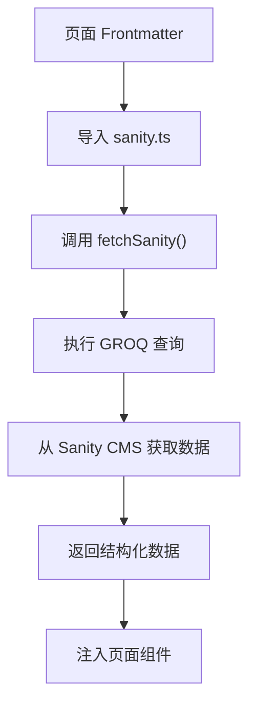
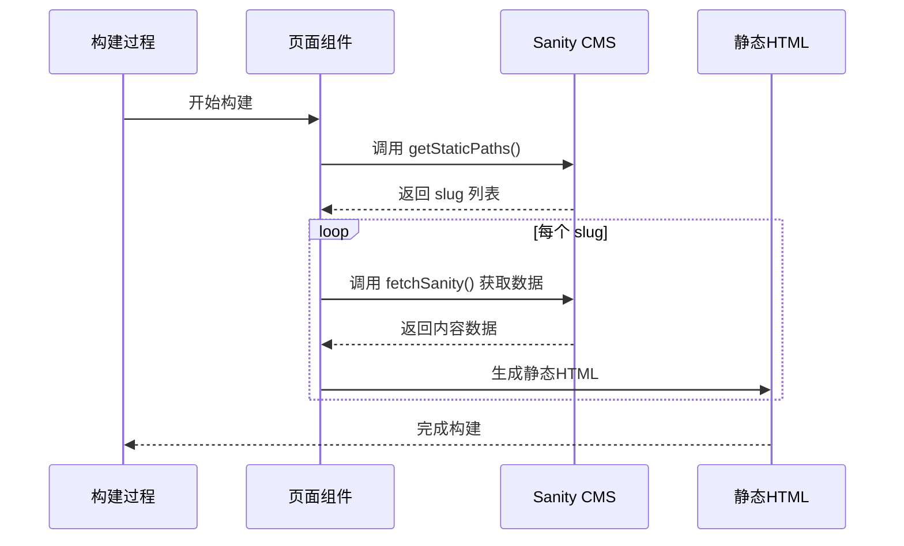
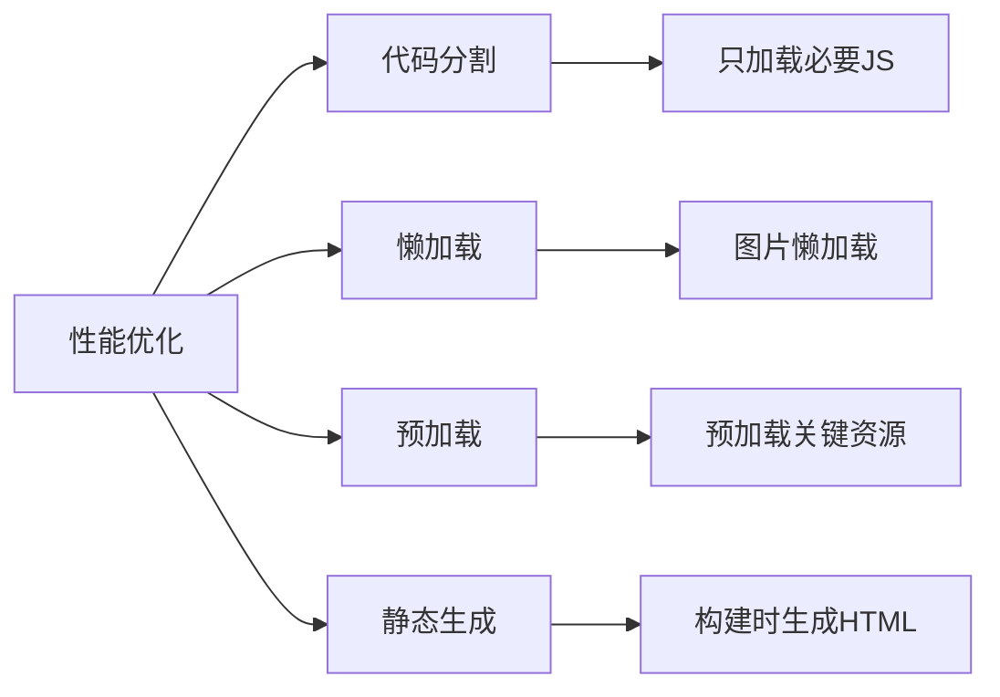

# 页面架构

<cite>
**本文档引用的文件**  
- [sanity.ts](file://src/lib/sanity.ts)
- [index.astro](file://src/pages/index.astro)
- [blog/index.astro](file://src/pages/blog/index.astro)
- [blog/[slug].astro](file://src/pages/blog/[slug].astro)
- [projects/index.astro](file://src/pages/projects/index.astro)
- [projects/[slug].astro](file://src/pages/projects/[slug].astro)
- [about.astro](file://src/pages/about.astro)
- [Layout.astro](file://src/layouts/Layout.astro)
- [PostCard.astro](file://src/components/PostCard.astro)
- [ProjectCard.astro](file://src/components/ProjectCard.astro)
- [Header.astro](file://src/components/Header.astro)
- [Footer.astro](file://src/components/Footer.astro)
- [astro.config.mjs](file://astro.config.mjs)
- [package.json](file://package.json)
</cite>

## 目录
1. [项目结构概述](#项目结构概述)
2. [核心数据获取机制](#核心数据获取机制)
3. [静态生成（SSG）流程](#静态生成ssg流程)
4. [页面组件与路由机制](#页面组件与路由机制)
5. [性能优化策略](#性能优化策略)
6. [页面架构图](#页面架构图)
7. [创建新内容页面的实践](#创建新内容页面的实践)
8. [总结](#总结)

## 项目结构概述

Astro页面架构采用模块化设计，将页面、组件、布局和工具函数分离到不同的目录中。`src/pages`目录包含所有页面入口，包括首页、博客列表、作品集和关于页面。`src/components`目录存放可复用的UI组件，如卡片、按钮和布局元素。`src/layouts`目录定义了全局布局，而`src/lib`目录包含与Sanity CMS交互的核心逻辑。

**Section sources**
- [index.astro](file://src/pages/index.astro)
- [Layout.astro](file://src/layouts/Layout.astro)

## 核心数据获取机制

Astro页面通过前端Matter（frontmatter）语法定义数据获取逻辑，利用`src/lib/sanity.ts`中的客户端从Sanity CMS获取内容。该文件导出一个配置好的`sanityClient`实例和多个GROQ查询，用于获取博客文章、分类、项目和关于页面内容。

数据获取通过`fetchSanity`辅助函数实现，该函数封装了错误处理逻辑。在页面的前端Matter中，通过`await`调用这些查询来获取数据，这些数据在构建时被预取并注入到页面中。



**Diagram sources**
- [sanity.ts](file://src/lib/sanity.ts)
- [blog/index.astro](file://src/pages/blog/index.astro)

**Section sources**
- [sanity.ts](file://src/lib/sanity.ts)
- [blog/index.astro](file://src/pages/blog/index.astro)

## 静态生成（SSG）流程

Astro的静态生成过程包括数据预取、HTML生成和性能优化。在构建时，Astro会执行页面的前端Matter代码，预取所有必要的数据。对于动态路由如`[slug].astro`，`getStaticPaths`函数会从Sanity CMS获取所有可能的slug值，为每个slug生成对应的静态页面。

HTML生成过程中，Astro将预取的数据与页面模板结合，生成静态HTML文件。这个过程在构建时完成，确保了页面的快速加载和SEO友好性。



**Diagram sources**
- [blog/[slug].astro](file://src/pages/blog/[slug].astro)
- [projects/[slug].astro](file://src/pages/projects/[slug].astro)

**Section sources**
- [blog/[slug].astro](file://src/pages/blog/[slug].astro)
- [projects/[slug].astro](file://src/pages/projects/[slug].astro)

## 页面组件与路由机制

页面架构实现了清晰的路由机制和组件化设计。首页`index.astro`展示精选内容，博客和作品集页面分别通过`blog/index.astro`和`projects/index.astro`实现。动态路由`[slug].astro`处理单篇博客文章和项目详情。

每个页面使用`Layout.astro`作为基础布局，确保一致的页眉、页脚和元数据。组件如`PostCard.astro`和`ProjectCard.astro`实现了内容卡片的复用，通过props接收数据并渲染。

```mermaid
graph TD
A[Layout.astro] --> B[index.astro]
A --> C[blog/index.astro]
A --> D[blog/[slug].astro]
A --> E[projects/index.astro]
A --> F[projects/[slug].astro]
A --> G[about.astro]
B --> H[Hero.astro]
C --> I[PostCard.astro]
D --> I
E --> J[ProjectCard.astro]
F --> J
K[Header.astro] --> A
L[Footer.astro] --> A
```

**Diagram sources**
- [Layout.astro](file://src/layouts/Layout.astro)
- [PostCard.astro](file://src/components/PostCard.astro)
- [ProjectCard.astro](file://src/components/ProjectCard.astro)

**Section sources**
- [Layout.astro](file://src/layouts/Layout.astro)
- [PostCard.astro](file://src/components/PostCard.astro)
- [ProjectCard.astro](file://src/components/ProjectCard.astro)

## 性能优化策略

页面架构实施了多项性能优化策略。通过Astro的岛屿架构，只在需要时激活交互式组件，减少了JavaScript的加载量。图片使用懒加载（`loading="lazy"`），并且在`PostCard`和`ProjectCard`组件中应用了悬停缩放效果。

对于动态内容，博客列表页面在客户端实现了分类筛选功能，避免了为每个分类生成单独的静态页面。这种混合方法平衡了静态生成的性能优势和动态交互的灵活性。



**Diagram sources**
- [PostCard.astro](file://src/components/PostCard.astro)
- [blog/index.astro](file://src/pages/blog/index.astro)

**Section sources**
- [PostCard.astro](file://src/components/PostCard.astro)
- [blog/index.astro](file://src/pages/blog/index.astro)

## 页面架构图

```mermaid
graph TD
A[Sanity CMS] --> |GROQ 查询| B[sanity.ts]
B --> C[index.astro]
B --> D[blog/index.astro]
B --> E[blog/[slug].astro]
B --> F[projects/index.astro]
B --> G[projects/[slug].astro]
C --> H[Layout.astro]
D --> H
E --> H
F --> H
G --> H
H --> I[Header.astro]
H --> J[Footer.astro]
D --> K[PostCard.astro]
E --> K
F --> L[ProjectCard.astro]
G --> L
style A fill:#f9f,stroke:#333
style B fill:#bbf,stroke:#333
style C fill:#f96,stroke:#333
style D fill:#f96,stroke:#333
style E fill:#f96,stroke:#333
style F fill:#f96,stroke:#333
style G fill:#f96,stroke:#333
```

**Diagram sources**
- [sanity.ts](file://src/lib/sanity.ts)
- [index.astro](file://src/pages/index.astro)
- [Layout.astro](file://src/layouts/Layout.astro)

## 创建新内容页面的实践

要创建新的内容页面，首先在`src/pages`目录下创建新的`.astro`文件。然后在前端Matter中导入`sanity.ts`的查询和`fetchSanity`函数，定义数据获取逻辑。使用`Layout.astro`作为布局，并根据需要组合现有组件或创建新组件。

对于动态内容，实现`getStaticPaths`函数以支持静态生成。确保新页面的元数据（标题、描述、图片）通过`Layout`的props正确传递，以保持SEO一致性。

**Section sources**
- [blog/[slug].astro](file://src/pages/blog/[slug].astro)
- [projects/[slug].astro](file://src/pages/projects/[slug].astro)

## 总结

Astro页面架构通过结合静态生成和动态交互，实现了高性能和灵活性的平衡。利用Sanity CMS作为内容源，通过GROQ查询获取数据，并在构建时生成静态HTML。组件化设计和清晰的路由机制使得页面易于维护和扩展。性能优化策略如代码分割、懒加载和预加载进一步提升了用户体验。

**Section sources**
- [sanity.ts](file://src/lib/sanity.ts)
- [Layout.astro](file://src/layouts/Layout.astro)
- [astro.config.mjs](file://astro.config.mjs)