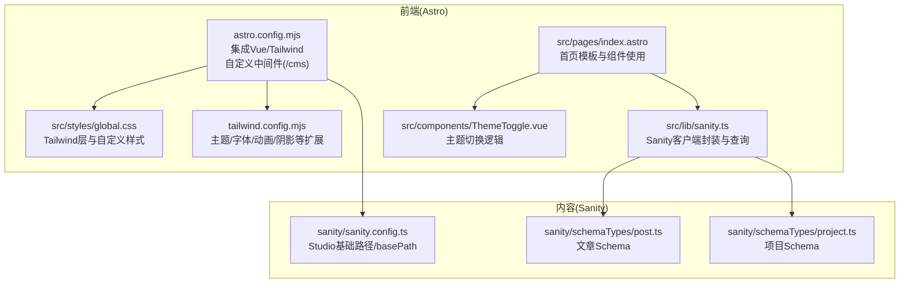
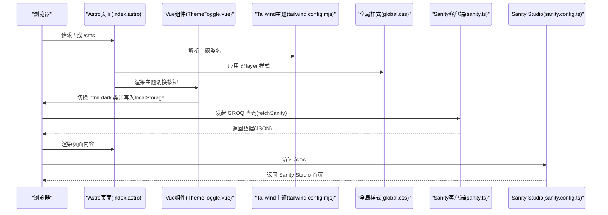
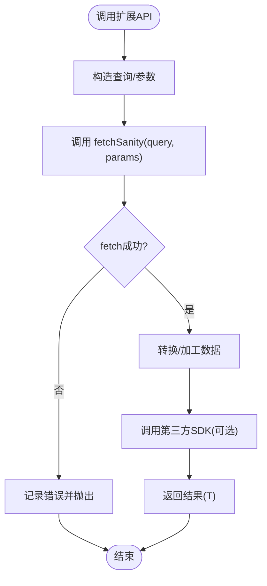
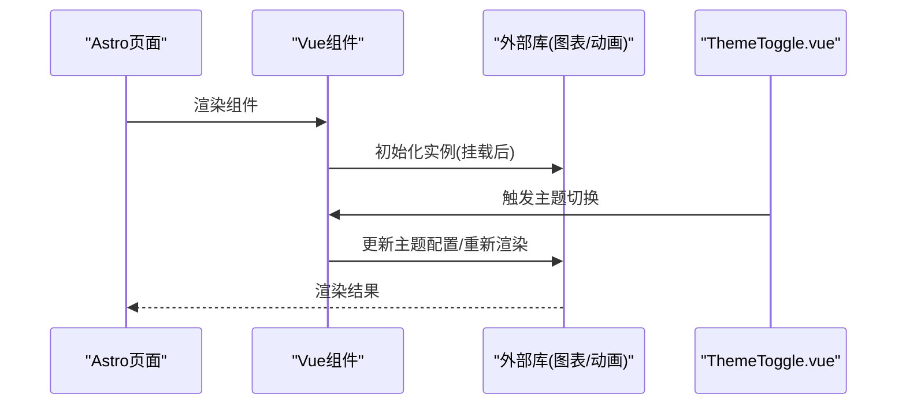
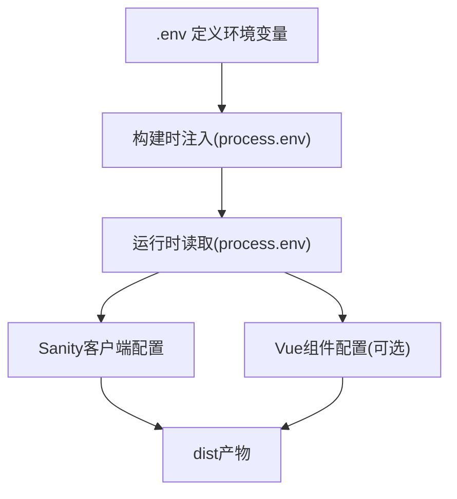
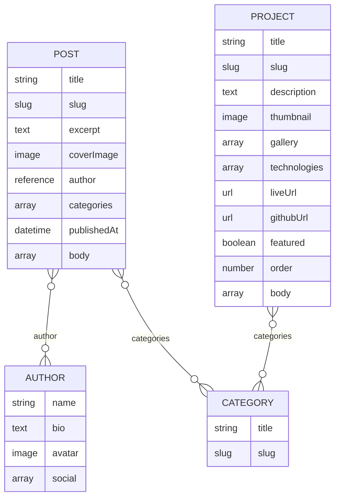
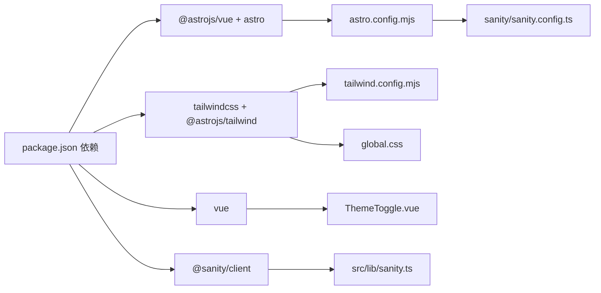

# 主题与集成扩展

<cite>
**本文引用的文件**
- [tailwind.config.mjs](file://tailwind.config.mjs)
- [global.css](file://src/styles/global.css)
- [ThemeToggle.vue](file://src/components/ThemeToggle.vue)
- [sanity.ts](file://src/lib/sanity.ts)
- [sanity.config.ts](file://sanity/sanity.config.ts)
- [astro.config.mjs](file://astro.config.mjs)
- [package.json](file://package.json)
- [index.astro](file://src/pages/index.astro)
- [Header.astro](file://src/components/Header.astro)
- [post.ts](file://sanity/schemaTypes/post.ts)
- [project.ts](file://sanity/schemaTypes/project.ts)
- [README.md](file://README.md)
</cite>

## 目录
1. [引言](#引言)
2. [项目结构](#项目结构)
3. [核心组件](#核心组件)
4. [架构总览](#架构总览)
5. [详细组件分析](#详细组件分析)
6. [依赖关系分析](#依赖关系分析)
7. [性能考虑](#性能考虑)
8. [故障排查指南](#故障排查指南)
9. [结论](#结论)
10. [附录](#附录)

## 引言
本文件面向希望在现有 Astro + Sanity + Tailwind + Vue 基础上进行“主题与集成扩展”的工程师与内容运营人员。内容覆盖：
- 如何通过 tailwind.config.mjs 实现主题颜色、字体与布局间距的全局定制
- 如何扩展 sanityClient 以支持新的 API 端点或第三方服务（如评论系统、分析工具）
- 如何集成外部库（如图表或动画库）并与 Vue 组件交互
- 环境变量配置、构建时注入与类型安全的最佳实践，确保扩展不影响现有功能稳定性

## 项目结构
该项目采用“前端（Astro + Vue + Tailwind）+ 内容（Sanity Studio）”双仓结构：
- 前端位于根目录，使用 Astro 作为静态站点生成器，集成 Vue 与 Tailwind
- Sanity 位于 sanity 子目录，提供内容模型与可视化编辑能力
- 通过 astro.config.mjs 的自定义中间件将 Sanity Studio 部署在 /cms 路径下

**图表来源**
- [astro.config.mjs](file://astro.config.mjs#L1-L35)
- [global.css](file://src/styles/global.css#L1-L177)
- [tailwind.config.mjs](file://tailwind.config.mjs#L1-L119)
- [sanity.ts](file://src/lib/sanity.ts#L1-L99)
- [sanity.config.ts](file://sanity/sanity.config.ts#L1-L31)
- [post.ts](file://sanity/schemaTypes/post.ts#L1-L84)
- [project.ts](file://sanity/schemaTypes/project.ts#L1-L97)
- [index.astro](file://src/pages/index.astro#L1-L242)

**章节来源**
- [astro.config.mjs](file://astro.config.mjs#L1-L35)
- [README.md](file://README.md#L1-L185)

## 核心组件
- Tailwind 主题配置：通过 tailwind.config.mjs 扩展颜色、字体、字号、间距、圆角、阴影、动画、关键帧、背景图案等，统一全局视觉语言
- 全局样式层：global.css 中使用 @layer base/components/utilities 定义基础排版、组件样式与工具类，配合 Tailwind 类名实现一致风格
- 主题切换：ThemeToggle.vue 通过 DOM 操作切换 html 的 dark 类，并持久化用户偏好
- Sanity 客户端：sanity.ts 封装 createClient 与常用 GROQ 查询，提供 fetchSanity 泛型封装，便于类型安全地消费数据
- Astro 集成：astro.config.mjs 集成 Vue 与 Tailwind，并通过自定义中间件将 /cms 重定向至 Studio 首页；noExternal 配置保证 @sanity/client 在 SSR 中可用

**章节来源**
- [tailwind.config.mjs](file://tailwind.config.mjs#L1-L119)
- [global.css](file://src/styles/global.css#L1-L177)
- [ThemeToggle.vue](file://src/components/ThemeToggle.vue#L1-L79)
- [sanity.ts](file://src/lib/sanity.ts#L1-L99)
- [astro.config.mjs](file://astro.config.mjs#L1-L35)

## 架构总览
前端与内容系统的交互链路如下：

**图表来源**
- [index.astro](file://src/pages/index.astro#L1-L242)
- [ThemeToggle.vue](file://src/components/ThemeToggle.vue#L1-L79)
- [tailwind.config.mjs](file://tailwind.config.mjs#L1-L119)
- [global.css](file://src/styles/global.css#L1-L177)
- [sanity.ts](file://src/lib/sanity.ts#L1-L99)
- [sanity.config.ts](file://sanity/sanity.config.ts#L1-L31)
- [astro.config.mjs](file://astro.config.mjs#L1-L35)

## 详细组件分析

### 主题颜色、字体与布局间距定制
- 颜色体系：通过 tailwind.config.mjs 的 theme.extend.colors 定义主强调色 primary、浅色/深色背景 light/dark、强调色 accent，满足明暗模式一致性
- 字体与字号：在 theme.extend.fontFamily 与 theme.extend.fontSize 中定义 sans/mono 字体族与标题层级字号，结合 global.css 的 @layer base 与 @layer components，确保全局排版一致
- 间距与圆角：在 theme.extend.spacing 与 theme.extend.borderRadius 中新增自定义步进值，配合 Section、容器等组件样式，形成统一的留白与边角风格
- 阴影与背景：在 theme.extend.boxShadow 与 theme.extend.backgroundImage 中定义卡片阴影与网格背景，提升层次感与质感
- 动画与关键帧：在 theme.extend.animation 与 theme.extend.keyframes 中定义浮动、脉冲、淡入等动画，global.css 的 @layer utilities 与 @keyframes 提供补充动画类
- 明暗模式：darkMode: 'class' 与 ThemeToggle.vue 的 html.classList.toggle 结合，实现主题切换与持久化

建议扩展步骤（不直接粘贴代码，仅给出定位路径）：
- 颜色/字体/字号/间距/圆角/阴影/动画/背景：参考 tailwind.config.mjs 的 theme.extend 区域
- 全局样式与 @layer：参考 global.css 的 @layer base/components/utilities
- 明暗模式切换：参考 ThemeToggle.vue 的切换逻辑与 localStorage 持久化

**章节来源**
- [tailwind.config.mjs](file://tailwind.config.mjs#L1-L119)
- [global.css](file://src/styles/global.css#L1-L177)
- [ThemeToggle.vue](file://src/components/ThemeToggle.vue#L1-L79)

### 扩展 sanityClient 以支持新 API 或第三方服务
当前 sanity.ts 已封装 createClient 与多个 GROQ 查询，并提供 fetchSanity 泛型封装用于类型安全地消费数据。若需扩展：
- 新增 API 端点：在 sanity.ts 中新增导出函数，内部调用 fetchSanity 并传入对应 GROQ 查询或外部 API 地址
- 第三方服务：可在同文件中引入第三方 SDK（如分析 SDK），在 fetchSanity 成功后触发埋点上报
- 类型安全：保持返回值使用泛型 T，确保调用方获得正确 TS 类型推断
- 错误处理：沿用现有 try/catch 与 console.error 输出，必要时抛出错误以便上层捕获

**图表来源**
- [sanity.ts](file://src/lib/sanity.ts#L1-L99)

**章节来源**
- [sanity.ts](file://src/lib/sanity.ts#L1-L99)

### 集成外部库并与 Vue 组件交互
- 图表/动画库：在 package.json 中添加依赖后，按需在 Vue 组件中导入并在 mounted 生命周期内初始化实例，避免 SSR 环境下的全局对象缺失问题
- 与 Astro/Vue 集成：由于 astro.config.mjs 已集成 @astrojs/vue，Vue 组件可直接在 Astro 页面中使用
- 主题联动：若外部库支持主题适配，可在 ThemeToggle.vue 的切换逻辑中监听主题变化并重新渲染或更新配置

**图表来源**
- [astro.config.mjs](file://astro.config.mjs#L1-L35)
- [ThemeToggle.vue](file://src/components/ThemeToggle.vue#L1-L79)

**章节来源**
- [astro.config.mjs](file://astro.config.mjs#L1-L35)
- [ThemeToggle.vue](file://src/components/ThemeToggle.vue#L1-L79)

### 环境变量配置、构建时注入与类型安全
- 环境变量：在 Astro 中可通过 process.env 访问环境变量；建议将敏感信息（如 Sanity Project ID、Dataset、API 版本）放入 .env 文件并在构建时注入
- 构建时注入：在 astro.config.mjs 中可通过 Vite 插件或 define 配置注入常量，确保在客户端与服务端均可读取
- 类型安全：在 src/env.d.ts 中声明环境变量类型，避免运行时报错；同时在 sanity.ts 中对 fetchSanity 的返回值使用泛型约束，确保调用方获得正确类型
- Sanity Studio 路径：sanity.config.ts 的 basePath: '/cms' 与 astro.config.mjs 的中间件共同确保 Studio 静态资源路径正确

**图表来源**
- [sanity.config.ts](file://sanity/sanity.config.ts#L1-L31)
- [sanity.ts](file://src/lib/sanity.ts#L1-L99)
- [astro.config.mjs](file://astro.config.mjs#L1-L35)
- [env.d.ts](file://src/env.d.ts#L1-L1)

**章节来源**
- [sanity.config.ts](file://sanity/sanity.config.ts#L1-L31)
- [sanity.ts](file://src/lib/sanity.ts#L1-L99)
- [astro.config.mjs](file://astro.config.mjs#L1-L35)
- [env.d.ts](file://src/env.d.ts#L1-L1)

### 与内容模型的协作
- 文章与项目模型：sanity/schemaTypes/post.ts 与 sanity/schemaTypes/project.ts 定义了字段与预览，前端通过 sanity.ts 的查询获取数据
- 页面消费：src/pages/index.astro 中直接使用 PostCard/ProjectCard 等组件渲染数据，体现了“内容驱动界面”的模式

**图表来源**
- [post.ts](file://sanity/schemaTypes/post.ts#L1-L84)
- [project.ts](file://sanity/schemaTypes/project.ts#L1-L97)

**章节来源**
- [post.ts](file://sanity/schemaTypes/post.ts#L1-L84)
- [project.ts](file://sanity/schemaTypes/project.ts#L1-L97)
- [index.astro](file://src/pages/index.astro#L1-L242)

## 依赖关系分析
- 前端依赖：@astrojs/vue、@sanity/client、astro、vue、@astrojs/tailwind、tailwindcss 等
- 构建与运行：astro.config.mjs 集成 Vue 与 Tailwind；noExternal 配置保证 @sanity/client 在 SSR 中可用；自定义中间件处理 /cms 路由
- 主题与样式：tailwind.config.mjs 与 global.css 形成主题层叠，ThemeToggle.vue 控制明暗模式

**图表来源**
- [package.json](file://package.json#L1-L28)
- [astro.config.mjs](file://astro.config.mjs#L1-L35)
- [tailwind.config.mjs](file://tailwind.config.mjs#L1-L119)
- [global.css](file://src/styles/global.css#L1-L177)
- [ThemeToggle.vue](file://src/components/ThemeToggle.vue#L1-L79)
- [sanity.ts](file://src/lib/sanity.ts#L1-L99)
- [sanity.config.ts](file://sanity/sanity.config.ts#L1-L31)

**章节来源**
- [package.json](file://package.json#L1-L28)
- [astro.config.mjs](file://astro.config.mjs#L1-L35)

## 性能考虑
- Tailwind 体积控制：通过 content 白名单与按需引入组件，减少未使用样式的打包体积
- 动画与阴影：合理使用 keyframes 与 box-shadow，避免过度阴影导致重绘开销
- 明暗模式：使用 class 切换而非频繁重排，ThemeToggle.vue 的切换逻辑应避免不必要的 DOM 操作
- Sanity 查询：尽量使用投影字段与分页，减少传输与解析成本

[本节为通用指导，无需特定文件来源]

## 故障排查指南
- 主题不生效
  - 检查 tailwind.config.mjs 是否正确扩展 colors/fontSize/spacing 等
  - 确认 global.css 的 @layer 顺序与类名拼写
  - ThemeToggle.vue 是否正确写入/移除 html 的 dark 类与 localStorage
- Sanity 查询失败
  - 检查 sanity.ts 的 projectId/dataset/apiVersion/useCdn 配置是否与 sanity.config.ts 一致
  - 确认 fetchSanity 的 try/catch 是否捕获错误并打印日志
- /cms 访问异常
  - 检查 astro.config.mjs 的中间件是否正确将 /cms 重定向到 /cms/index.html
  - Sanity Studio 的 basePath 是否与构建产物路径匹配

**章节来源**
- [tailwind.config.mjs](file://tailwind.config.mjs#L1-L119)
- [global.css](file://src/styles/global.css#L1-L177)
- [ThemeToggle.vue](file://src/components/ThemeToggle.vue#L1-L79)
- [sanity.ts](file://src/lib/sanity.ts#L1-L99)
- [sanity.config.ts](file://sanity/sanity.config.ts#L1-L31)
- [astro.config.mjs](file://astro.config.mjs#L1-L35)

## 结论
通过 tailwind.config.mjs 的主题扩展、global.css 的样式层叠、ThemeToggle.vue 的明暗模式控制，以及 sanity.ts 的类型安全封装，项目已具备良好的主题与内容扩展基础。在此基础上，可按需引入外部库并与 Vue 组件协同工作；同时通过环境变量与构建时注入保障配置安全与类型安全，确保扩展不影响现有功能稳定性。

[本节为总结性内容，无需特定文件来源]

## 附录
- 常用主题扩展位置参考
  - 颜色/字体/字号/间距/圆角/阴影/动画/背景：tailwind.config.mjs 的 theme.extend
  - 全局样式与 @layer：global.css 的 @layer base/components/utilities
  - 明暗模式切换：ThemeToggle.vue
- 常用内容扩展位置参考
  - 新增查询与类型：sanity.ts
  - 内容模型：sanity/schemaTypes 下的 post.ts/project.ts
- 构建与部署
  - 前端构建：npm run build
  - CMS 构建并部署到 /cms：npm run build-cms
  - Sanity Studio 基础路径：sanity/sanity.config.ts 的 basePath

**章节来源**
- [README.md](file://README.md#L1-L185)
- [sanity.config.ts](file://sanity/sanity.config.ts#L1-L31)
- [sanity.ts](file://src/lib/sanity.ts#L1-L99)
- [post.ts](file://sanity/schemaTypes/post.ts#L1-L84)
- [project.ts](file://sanity/schemaTypes/project.ts#L1-L97)