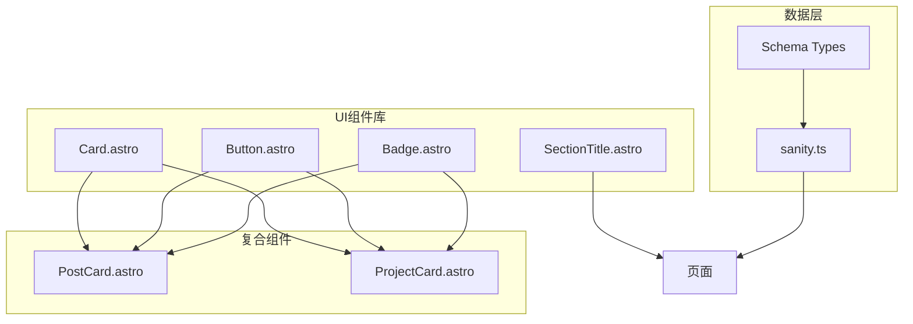
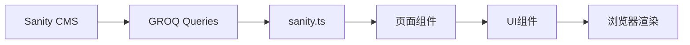
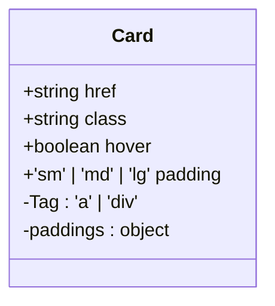
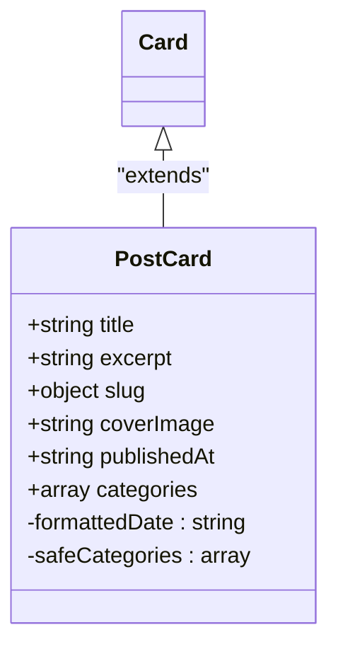
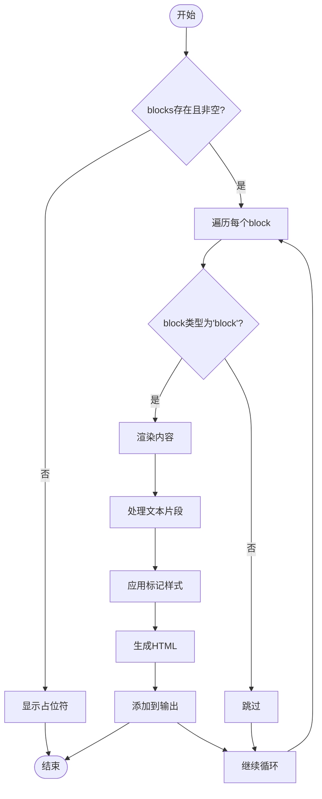

# 创建自定义组件

<cite>
**本文档引用的文件**
- [Card.astro](file://src/components/ui/Card.astro)
- [PortableText.astro](file://src/components/PortableText.astro)
- [PostCard.astro](file://src/components/PostCard.astro)
- [ProjectCard.astro](file://src/components/ProjectCard.astro)
- [Badge.astro](file://src/components/ui/Badge.astro)
- [Button.astro](file://src/components/ui/Button.astro)
- [SectionTitle.astro](file://src/components/ui/SectionTitle.astro)
- [sanity.ts](file://src/lib/sanity.ts)
- [about.ts](file://sanity/schemaTypes/about.ts)
- [project.ts](file://sanity/schemaTypes/project.ts)
- [post.ts](file://sanity/schemaTypes/post.ts)
</cite>

## 目录
1. [简介](#简介)
2. [项目结构](#项目结构)
3. [核心组件](#核心组件)
4. [架构概述](#架构概述)
5. [详细组件分析](#详细组件分析)
6. [依赖分析](#依赖分析)
7. [性能考虑](#性能考虑)
8. [故障排除指南](#故障排除指南)
9. [结论](#结论)

## 简介
本文档旨在阐述如何基于现有UI组件库创建新的展示组件，例如复用`Card.astro`构建`ExperienceCard`或`SkillCard`。文档将详细说明Astro组件的属性传递（props）机制，演示如何接收数据对象并渲染结构化内容。同时，指导如何集成`PortableText.astro`以支持富文本渲染，并确保响应式设计与主题兼容性。此外，提供组件样式隔离、可访问性（a11y）处理和性能优化（如懒加载）的实践建议。

## 项目结构
本项目采用模块化结构，主要分为以下几个部分：
- `public/cms/`: 存放CMS相关的静态资源
- `sanity/`: Sanity CMS配置和schema定义
- `scripts/`: 构建和安装脚本
- `src/`: 源代码目录，包含组件、布局、页面等
- 根目录：配置文件和依赖管理

组件库位于`src/components/ui/`目录下，提供了基础的UI组件，如`Card`、`Button`、`Badge`等，这些组件可以被复用和扩展以创建更复杂的展示组件。



**图示来源**
- [Card.astro](file://src/components/ui/Card.astro)
- [PostCard.astro](file://src/components/PostCard.astro)
- [ProjectCard.astro](file://src/components/ProjectCard.astro)
- [sanity.ts](file://src/lib/sanity.ts)

**本节来源**
- [Card.astro](file://src/components/ui/Card.astro)
- [PostCard.astro](file://src/components/PostCard.astro)
- [ProjectCard.astro](file://src/components/ProjectCard.astro)

## 核心组件
核心组件包括`Card.astro`、`PortableText.astro`以及基于它们构建的`PostCard.astro`和`ProjectCard.astro`。这些组件展示了如何通过属性传递和插槽机制创建可复用的UI元素。

`Card.astro`作为基础容器组件，提供了灵活的样式和交互选项，如悬停效果、内边距控制等。`PortableText.astro`则专门用于渲染来自Sanity CMS的富文本内容，支持标题、引用、代码块等多种格式。

`PostCard.astro`和`ProjectCard.astro`是复合组件的典范，它们通过组合基础UI组件来展示特定类型的数据，体现了组件化开发的优势。

**本节来源**
- [Card.astro](file://src/components/ui/Card.astro)
- [PortableText.astro](file://src/components/PortableText.astro)
- [PostCard.astro](file://src/components/PostCard.astro)
- [ProjectCard.astro](file://src/components/ProjectCard.astro)

## 架构概述
系统架构采用分层设计，前端使用Astro框架，后端集成Sanity CMS作为内容管理系统。数据流从Sanity CMS通过GROQ查询获取，经由`sanity.ts`中的辅助函数处理后，传递给各个页面组件。

页面组件通过导入和使用UI组件库中的基础组件来构建用户界面，实现了关注点分离和代码复用。这种架构确保了系统的可维护性和扩展性。



**图示来源**
- [sanity.ts](file://src/lib/sanity.ts)
- [post.ts](file://sanity/schemaTypes/post.ts)
- [project.ts](file://sanity/schemaTypes/project.ts)

## 详细组件分析

### Card组件分析
`Card.astro`是项目中最基础的UI组件之一，它提供了一个可配置的卡片容器，支持链接、悬停效果和不同大小的内边距。

该组件通过定义`Props`接口来声明可接收的属性，包括`href`（链接地址）、`class`（自定义CSS类）、`hover`（是否启用悬停效果）和`padding`（内边距大小）。这些属性通过`Astro.props`解构赋值获取，并应用于最终的HTML标签。



**图示来源**
- [Card.astro](file://src/components/ui/Card.astro#L3-L15)

**本节来源**
- [Card.astro](file://src/components/ui/Card.astro)

### PostCard组件分析
`PostCard.astro`是一个典型的复合组件，它基于`Card.astro`构建，专门用于展示博客文章的摘要信息。

该组件接收文章标题、摘要、封面图、发布日期和分类等数据，并通过合理的布局和样式展示这些信息。它还集成了图片懒加载和文本截断等性能优化技术。



**图示来源**
- [PostCard.astro](file://src/components/PostCard.astro#L5-L12)
- [Card.astro](file://src/components/ui/Card.astro)

**本节来源**
- [PostCard.astro](file://src/components/PostCard.astro)

### PortableText组件分析
`PortableText.astro`组件负责将Sanity CMS中的富文本内容渲染为HTML。它支持多种文本样式，包括加粗、斜体、代码、下划线和删除线，以及链接和引用等块级元素。

该组件通过递归处理`blocks`数组中的每个块，根据其类型和样式生成相应的HTML标签。这种设计使得它可以灵活地处理各种复杂的富文本结构。



**图示来源**
- [PortableText.astro](file://src/components/PortableText.astro#L22-L103)

**本节来源**
- [PortableText.astro](file://src/components/PortableText.astro)

## 依赖分析
项目依赖主要分为三类：开发依赖、运行时依赖和内容管理依赖。

开发依赖包括Astro框架、Tailwind CSS、TypeScript等，用于构建和样式化应用。运行时依赖主要是@sanity/client，用于与CMS进行数据交互。内容管理依赖则是Sanity CMS本身，提供内容编辑和管理功能。

```mermaid
graph TD
A[Astro框架] --> B[构建系统]
C[Tailwind CSS] --> D[样式系统]
E[TypeScript] --> F[类型检查]
G[@sanity/client] --> H[数据获取]
I[Sanity CMS] --> J[内容管理]
B --> K[最终输出]
D --> K
F --> K
H --> K
J --> H
```

**图示来源**
- [package.json](file://package.json)
- [astro.config.mjs](file://astro.config.mjs)
- [sanity.config.ts](file://sanity/sanity.config.ts)

**本节来源**
- [package.json](file://package.json)
- [astro.config.mjs](file://astro.config.mjs)
- [sanity.config.ts](file://sanity/sanity.config.ts)

## 性能考虑
在创建自定义组件时，需要考虑以下几个性能方面：

1. **图片懒加载**：在`PostCard.astro`和`ProjectCard.astro`中，图片元素使用了`loading="lazy"`属性，确保图片在进入视口时才加载，减少初始页面加载时间。

2. **文本截断**：使用`line-clamp-2`类来限制摘要文本显示两行，避免长文本影响布局性能。

3. **条件渲染**：通过`{condition && <Component />}`语法实现条件渲染，避免不必要的DOM元素创建。

4. **数据预取**：在页面级别预取所需数据，而不是在组件内部进行数据请求，减少组件渲染时的等待时间。

5. **样式隔离**：使用Tailwind CSS的实用类系统，避免全局样式冲突，同时减少CSS文件大小。

这些实践共同确保了应用的高性能和良好的用户体验。

## 故障排除指南
当创建自定义组件遇到问题时，可以参考以下常见问题的解决方案：

1. **属性未生效**：检查属性名称是否正确，确保在`Props`接口中正确定义，并在组件中正确解构。

2. **样式冲突**：使用Tailwind CSS的实用类时，注意类名的优先级，必要时使用`!important`或调整类的顺序。

3. **数据渲染异常**：检查数据结构是否与组件期望的格式匹配，特别是来自CMS的数据可能包含嵌套对象或数组。

4. **响应式设计问题**：利用Tailwind CSS的响应式前缀（如`md:`、`lg:`）来针对不同屏幕尺寸应用不同的样式。

5. **可访问性问题**：确保所有交互元素都有适当的ARIA标签和键盘导航支持，图片有`alt`属性，链接有有意义的文本。

**本节来源**
- [Card.astro](file://src/components/ui/Card.astro)
- [PostCard.astro](file://src/components/PostCard.astro)
- [ProjectCard.astro](file://src/components/ProjectCard.astro)

## 结论
通过分析项目中的组件实现，我们可以看到基于现有UI组件库创建新的展示组件是一种高效且可维护的开发方式。关键在于理解属性传递机制、合理使用插槽、集成富文本渲染组件，并遵循性能优化和可访问性最佳实践。

`Card.astro`作为基础容器组件，提供了高度的灵活性和可配置性，是构建其他复合组件的理想起点。`PortableText.astro`则解决了富文本内容渲染的复杂性，使得从CMS获取的内容能够以美观的方式呈现。

未来在创建`ExperienceCard`或`SkillCard`时，可以借鉴`PostCard.astro`和`ProjectCard.astro`的设计模式，复用`Card.astro`的基础功能，同时根据具体需求添加特定的展示逻辑和样式。