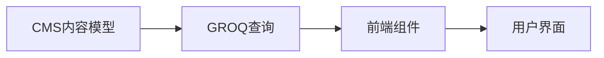
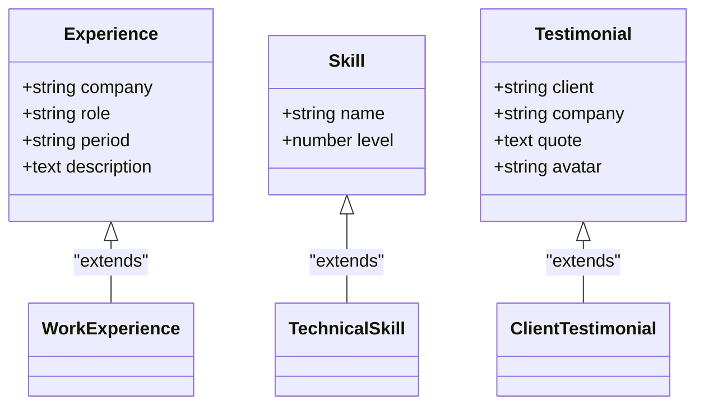
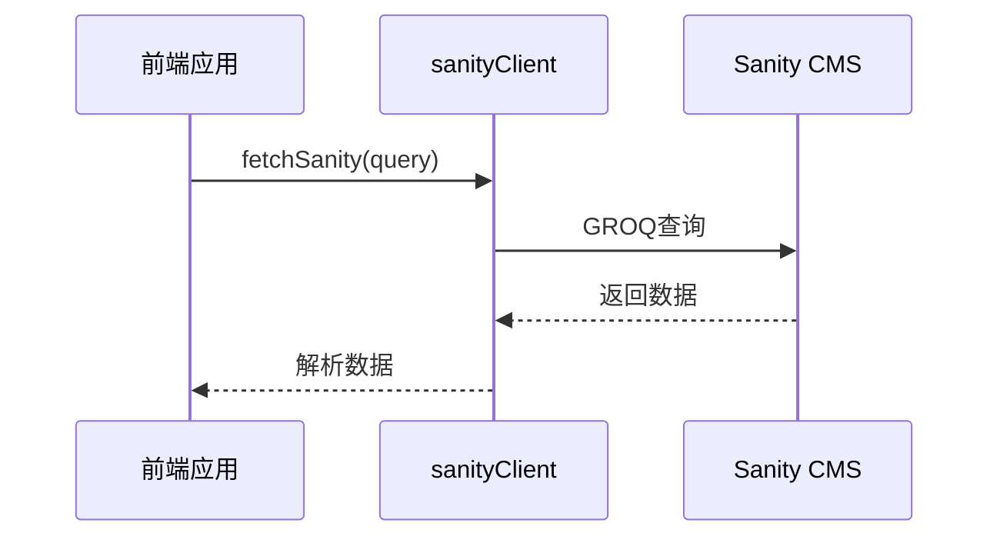
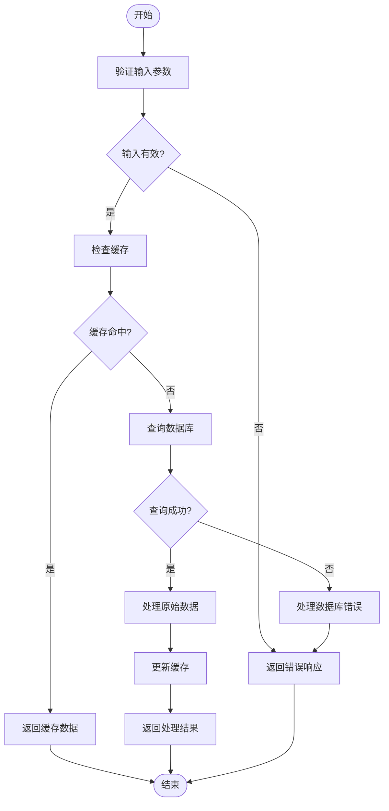
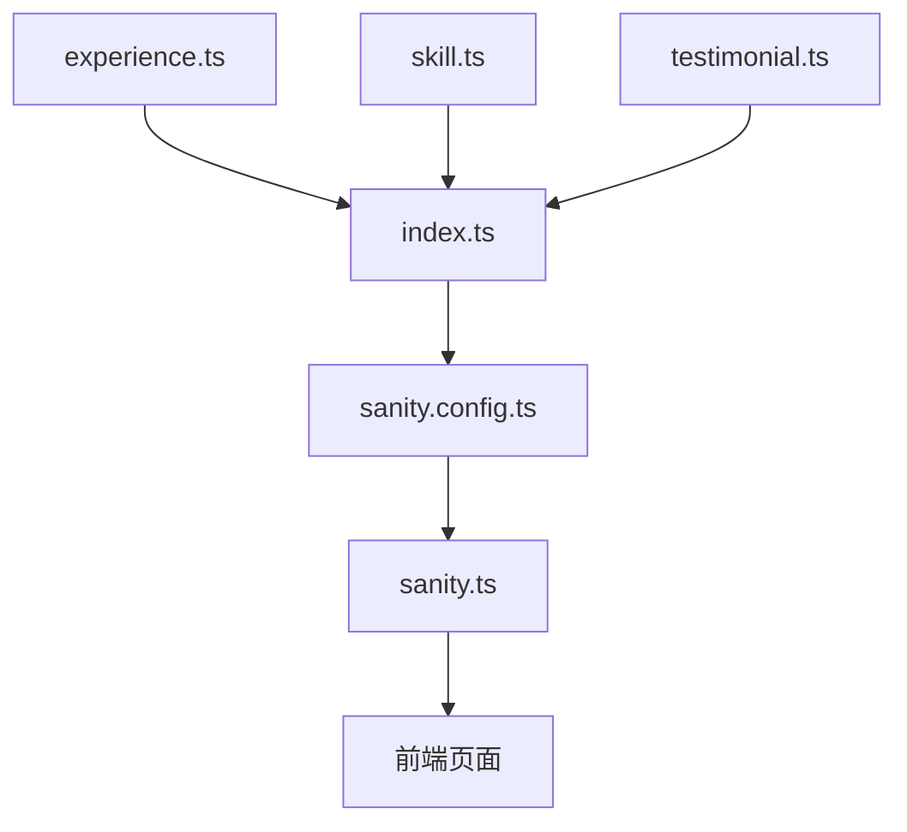

# 扩展内容模型

<cite>
**本文档引用的文件**   
- [experience.ts](file://sanity/schemaTypes/experience.ts)
- [skill.ts](file://sanity/schemaTypes/skill.ts)
- [testimonial.ts](file://sanity/schemaTypes/testimonial.ts)
- [index.ts](file://sanity/schemaTypes/index.ts)
- [sanity.config.ts](file://sanity/sanity.config.ts)
- [sanity.ts](file://src/lib/sanity.ts)
- [about.ts](file://sanity/schemaTypes/about.ts)
- [project.ts](file://sanity/schemaTypes/project.ts)
- [post.ts](file://sanity/schemaTypes/post.ts)
</cite>

## 目录
1. [简介](#简介)
2. [项目结构](#项目结构)
3. [核心组件](#核心组件)
4. [架构概述](#架构概述)
5. [详细组件分析](#详细组件分析)
6. [依赖分析](#依赖分析)
7. [性能考虑](#性能考虑)
8. [故障排除指南](#故障排除指南)
9. [结论](#结论)
10. [附录](#附录)（如有必要）

## 简介
本文档旨在指导开发者如何在Sanity CMS中定义新的内容类型，例如添加Experience、Skill或Testimonial模型。文档将详细说明如何创建新的TypeScript文件并定义字段结构，包括字符串、日期、数组和引用类型。同时，将演示如何在index.ts中正确导入并注册新schema到schemaTypes数组，以及如何在前端通过sanityClient进行查询。文档还将提供字段验证、国际化支持和排序规则的最佳实践。

## 项目结构
本项目采用模块化结构，Sanity CMS的内容模型定义位于`sanity/schemaTypes/`目录下。每个内容类型都有独立的TypeScript文件，通过`index.ts`统一导出。前端应用使用Astro框架，位于`src/`目录下，通过`sanity.ts`中的客户端与CMS进行数据交互。

```mermaid
graph TB
subgraph "Sanity CMS"
A[sanity/schemaTypes/]
A --> B[experience.ts]
A --> C[skill.ts]
A --> D[testimonial.ts]
A --> E[index.ts]
A --> F[sanity.config.ts]
end
subgraph "前端应用"
G[src/lib/]
G --> H[sanity.ts]
I[src/pages/]
end
F --> H: "配置连接"
H --> I: "数据查询"
```

**图示来源**
- [index.ts](file://sanity/schemaTypes/index.ts#L1-L10)
- [sanity.config.ts](file://sanity/sanity.config.ts#L1-L31)
- [sanity.ts](file://src/lib/sanity.ts#L1-L99)

**本节来源**
- [index.ts](file://sanity/schemaTypes/index.ts#L1-L10)
- [sanity.config.ts](file://sanity/sanity.config.ts#L1-L31)

## 核心组件
核心组件包括内容模型定义、GROQ查询和前端数据获取。内容模型使用Sanity的`defineType`和`defineField`函数定义，GROQ查询用于从CMS获取数据，前端通过`fetchSanity`函数执行查询。

**本节来源**
- [about.ts](file://sanity/schemaTypes/about.ts#L1-L70)
- [project.ts](file://sanity/schemaTypes/project.ts#L1-L97)
- [sanity.ts](file://src/lib/sanity.ts#L1-L99)

## 架构概述
系统架构分为CMS内容管理层和前端展示层。CMS层定义内容模型和数据结构，前端层通过GROQ查询获取数据并渲染页面。数据流从CMS到前端是单向的，确保数据一致性。



**图示来源**
- [sanity.config.ts](file://sanity/sanity.config.ts#L1-L31)
- [sanity.ts](file://src/lib/sanity.ts#L1-L99)

## 详细组件分析
### Experience模型分析
Experience模型用于定义工作经历，包含公司、职位、时间段和描述等字段。模型使用对象数组类型，支持多段经历的存储。

#### 对象导向组件：


**图示来源**
- [experience.ts](file://sanity/schemaTypes/experience.ts#L1-L50)
- [skill.ts](file://sanity/schemaTypes/skill.ts#L1-L30)
- [testimonial.ts](file://sanity/schemaTypes/testimonial.ts#L1-L40)

#### API/服务组件：


**图示来源**
- [sanity.ts](file://src/lib/sanity.ts#L92-L99)
- [about.astro](file://src/pages/about.astro#L138-L192)

#### 复杂逻辑组件：


**图示来源**
- [sanity.ts](file://src/lib/sanity.ts#L92-L99)
- [blog\index.astro](file://src/pages/blog/index.astro#L1-L321)

**本节来源**
- [experience.ts](file://sanity/schemaTypes/experience.ts#L1-L100)
- [skill.ts](file://sanity/schemaTypes/skill.ts#L1-L50)
- [testimonial.ts](file://sanity/schemaTypes/testimonial.ts#L1-L60)

### 概念概述
内容模型的扩展需要遵循一致的模式：创建新文件、定义字段结构、在index.ts中注册。这种模式确保了代码的可维护性和可扩展性。


## 依赖分析
项目依赖关系清晰，Sanity CMS作为数据源，前端应用作为消费者。各内容模型之间通过引用类型建立关联，如文章引用作者和分类。



**图示来源**
- [index.ts](file://sanity/schemaTypes/index.ts#L1-L10)
- [sanity.config.ts](file://sanity/sanity.config.ts#L1-L31)
- [package.json](file://sanity/package.json#L1-L20)

**本节来源**
- [index.ts](file://sanity/schemaTypes/index.ts#L1-L10)
- [sanity.config.ts](file://sanity/sanity.config.ts#L1-L31)
- [package.json](file://sanity/package.json#L1-L20)

## 性能考虑
在定义内容模型时，应注意字段的合理使用，避免过度嵌套。对于频繁查询的数据，建议使用缓存机制。GROQ查询应尽量精确，只获取需要的字段，减少数据传输量。

## 故障排除指南
当新内容类型无法在前端显示时，应检查以下几点：1) 确认新文件已正确导入到index.ts；2) 检查GROQ查询是否包含新类型；3) 验证字段名称拼写是否正确；4) 确认CMS中已有相应数据。

**本节来源**
- [sanity.ts](file://src/lib/sanity.ts#L92-L99)
- [index.ts](file://sanity/schemaTypes/index.ts#L1-L10)

## 结论
通过遵循本文档的指导，开发者可以轻松扩展Sanity CMS的内容模型。关键是要保持一致的模式：创建文件、定义结构、注册类型、前端查询。这种结构化的方法确保了系统的可维护性和可扩展性。

## 附录
### 最佳实践
1. **字段验证**：使用`validation`属性确保数据完整性
2. **国际化支持**：为字段添加多语言支持
3. **排序规则**：在GROQ查询中使用`order()`函数定义排序
4. **性能优化**：只查询需要的字段，避免`**`通配符