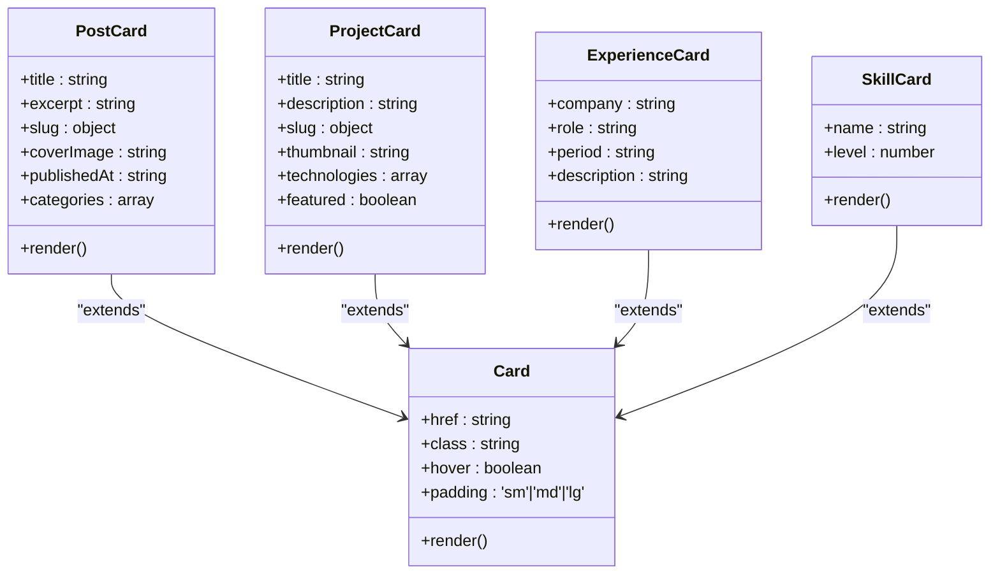
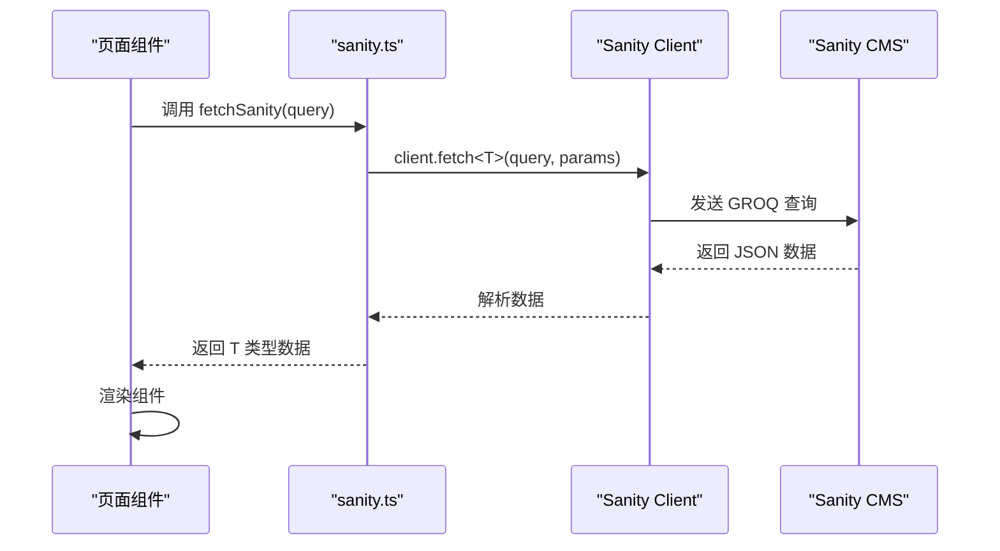
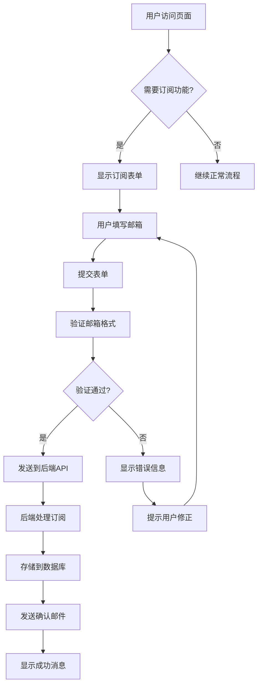
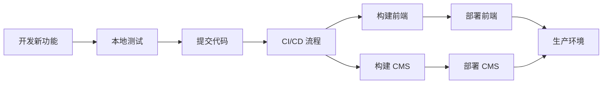

# 扩展指南

<cite>
**本文档中引用的文件**  
- [index.astro](file://src/pages/index.astro)
- [Card.astro](file://src/components/ui/Card.astro)
- [PostCard.astro](file://src/components/PostCard.astro)
- [ProjectCard.astro](file://src/components/ProjectCard.astro)
- [about.ts](file://sanity/schemaTypes/about.ts)
- [project.ts](file://sanity/schemaTypes/project.ts)
- [post.ts](file://sanity/schemaTypes/post.ts)
- [index.ts](file://sanity/schemaTypes/index.ts)
- [sanity.config.ts](file://sanity/sanity.config.ts)
- [sanity.ts](file://src/lib/sanity.ts)
- [Layout.astro](file://src/layouts/Layout.astro)
- [blog/index.astro](file://src/pages/blog/index.astro)
- [projects/index.astro](file://src/pages/projects/index.astro)
</cite>

## 目录
1. [简介](#简介)
2. [路由扩展](#路由扩展)
3. [内容模型扩展](#内容模型扩展)
4. [UI组件复用](#ui组件复用)
5. [API与数据查询](#api与数据查询)
6. [主题与样式定制](#主题与样式定制)
7. [第三方服务集成](#第三方服务集成)
8. [最佳实践与注意事项](#最佳实践与注意事项)

## 简介
本指南旨在为开发者提供向现有项目添加新功能的完整指导。项目基于 Astro 静态站点生成器和 Sanity CMS 内容管理系统构建，采用模块化架构设计。通过本指南，开发者将学习如何扩展路由、定义新的内容类型、复用 UI 组件以及集成第三方服务，确保新功能与现有架构保持一致。

**文档来源**
- [README.md](file://README.md#L1-L185)

## 路由扩展
在 Astro 项目中添加新页面非常简单。只需在 `src/pages` 目录下创建新的 `.astro` 文件，Astro 会自动将其转换为相应的路由。

例如，要创建一个联系页面 `/contact`，只需创建 `src/pages/contact.astro` 文件：

```astro
---
// src/pages/contact.astro
import Layout from '../layouts/Layout.astro';
---

<Layout title="联系我">
  <section class="section">
    <div class="container-custom">
      <h1 class="text-3xl font-bold mb-6">联系我</h1>
      <p>这里是联系页面的内容...</p>
    </div>
  </section>
</Layout>
```

Astro 会自动将此文件映射到 `/contact` 路由。对于动态路由，可以使用方括号语法，如 `src/pages/blog/[slug].astro` 用于博客文章详情页。

**Section sources**
- [index.astro](file://src/pages/index.astro#L1-L242)
- [Layout.astro](file://src/layouts/Layout.astro#L1-L59)

## 内容模型扩展
Sanity CMS 使用 schema 定义内容模型。要添加新的内容类型，需要在 `sanity/schemaTypes` 目录下创建新的 TypeScript 文件，并在 `index.ts` 中导出。

### 定义新的内容类型
以添加 "Experience"（工作经验）类型为例：

1. 创建 `sanity/schemaTypes/experience.ts` 文件：

```typescript
import { defineField, defineType } from 'sanity'

export const experience = defineType({
  name: 'experience',
  title: '工作经验',
  type: 'document',
  fields: [
    defineField({
      name: 'company',
      title: '公司',
      type: 'string',
      validation: (Rule) => Rule.required(),
    }),
    defineField({
      name: 'role',
      title: '职位',
      type: 'string',
      validation: (Rule) => Rule.required(),
    }),
    defineField({
      name: 'period',
      title: '时间段',
      type: 'string',
    }),
    defineField({
      name: 'description',
      title: '描述',
      type: 'text',
    }),
  ],
})
```

2. 在 `sanity/schemaTypes/index.ts` 中导入并导出新类型：

```typescript
import blockContent from './blockContent'
import category from './category'
import post from './post'
import author from './author'
import { project } from './project'
import { about } from './about'
// 新增导入
import { experience } from './experience'

export const schemaTypes = [
  post, 
  author, 
  category, 
  blockContent, 
  project, 
  about,
  experience // 添加到导出数组
]
```

### 更新关于页面模型
如果需要在关于页面中包含工作经验，可以更新 `about.ts` 模型：

```typescript
defineField({
  name: 'experience',
  title: '工作经验',
  type: 'array',
  of: [
    {
      type: 'object',
      fields: [
        { name: 'company', type: 'string', title: '公司' },
        { name: 'role', type: 'string', title: '职位' },
        { name: 'period', type: 'string', title: '时间段' },
        { name: 'description', type: 'text', title: '描述' },
      ],
    },
  ],
}),
```

**Section sources**
- [about.ts](file://sanity/schemaTypes/about.ts#L1-L70)
- [index.ts](file://sanity/schemaTypes/index.ts#L1-L10)
- [sanity.config.ts](file://sanity/sanity.config.ts#L1-L31)

## UI组件复用
项目采用组件化设计，鼓励组件复用。`Card.astro` 是一个基础卡片组件，被 `PostCard.astro` 和 `ProjectCard.astro` 复用。

### 基础卡片组件
`Card.astro` 组件提供了一个可复用的卡片容器，支持链接、悬停效果和内边距配置：

```astro
---
// src/components/ui/Card.astro
interface Props {
  href?: string;
  class?: string;
  hover?: boolean;
  padding?: 'sm' | 'md' | 'lg';
}

const { href, class: className = '', hover = true, padding = 'md' } = Astro.props;
const Tag = href ? 'a' : 'div';

const paddings = {
  sm: 'p-4',
  md: 'p-6',
  lg: 'p-8'
};
---
<Tag
  href={href}
  class:list={[
    'block rounded-2xl transition-all duration-200',
    'bg-white',
    'border border-gray-100',
    'shadow-card',
    hover && 'hover:shadow-card-hover hover:border-gray-200',
    hover && href && 'cursor-pointer',
    paddings[padding],
    className
  ]}
>
  <slot />
</Tag>
```

### 创建新的展示单元
要创建 `ExperienceCard` 组件，可以复用 `Card.astro`：

```astro
---
// src/components/ExperienceCard.astro
import Card from './ui/Card.astro';

interface Props {
  company: string;
  role: string;
  period: string;
  description: string;
}

const { company, role, period, description } = Astro.props;
---
<Card class="overflow-hidden">
  <div class="p-6">
    <h3 class="text-lg font-semibold text-gray-900 mb-1">{company}</h3>
    <p class="text-primary-600 font-medium mb-2">{role}</p>
    <p class="text-sm text-gray-500 mb-3">{period}</p>
    <p class="text-gray-600 text-sm leading-relaxed">{description}</p>
  </div>
</Card>
```

### 技能卡片示例
类似地，可以创建 `SkillCard` 组件来展示技能：

```astro
---
// src/components/SkillCard.astro
import Card from './ui/Card.astro';

interface Props {
  name: string;
  level: number;
}

const { name, level } = Astro.props;
---
<Card padding="sm" hover={false} class="flex items-center justify-between">
  <span class="font-medium text-gray-900">{name}</span>
  <div class="w-20 bg-gray-200 rounded-full h-2">
    <div 
      class="bg-primary-500 h-2 rounded-full" 
      style={`width: ${level}%`}
    ></div>
  </div>
</Card>
```



**Diagram sources**
- [Card.astro](file://src/components/ui/Card.astro#L1-L41)
- [PostCard.astro](file://src/components/PostCard.astro#L1-L71)
- [ProjectCard.astro](file://src/components/ProjectCard.astro#L1-L80)

**Section sources**
- [Card.astro](file://src/components/ui/Card.astro#L1-L41)
- [PostCard.astro](file://src/components/PostCard.astro#L1-L71)
- [ProjectCard.astro](file://src/components/ProjectCard.astro#L1-L80)

## API与数据查询
项目通过 Sanity Client 从 CMS 获取数据，使用 GROQ 查询语言定义数据获取逻辑。

### 数据查询定义
在 `src/lib/sanity.ts` 中定义了常用的 GROQ 查询：

```typescript
// GROQ 查询：获取所有博客文章
export const postsQuery = `*[_type == "post"] | order(publishedAt desc) {
  _id,
  title,
  slug,
  excerpt,
  publishedAt,
  "coverImage": coverImage.asset->url,
  "author": author->{name, "avatar": avatar.asset->url},
  categories[]->{title, slug}
}`;

// GROQ 查询：获取所有项目
export const projectsQuery = `*[_type == "project"] | order(order asc) {
  _id,
  title,
  slug,
  description,
  "thumbnail": thumbnail.asset->url,
  technologies,
  liveUrl,
  githubUrl,
  featured
}`;
```

### 添加新的查询
当添加了新的内容类型（如 Experience）后，需要在 `sanity.ts` 中添加相应的查询：

```typescript
// GROQ 查询：获取工作经验
export const experienceQuery = `*[_type == "experience"] | order(period desc) {
  _id,
  company,
  role,
  period,
  description
}`;
```

### 在页面中使用查询
在 Astro 页面中，可以使用 `fetchSanity` 函数获取数据：

```astro
---
// src/pages/about.astro
import Layout from '../layouts/Layout.astro';
import ExperienceCard from '../components/ExperienceCard.astro';
import { fetchSanity, experienceQuery } from '../lib/sanity';

// 获取工作经验数据
const experiences = await fetchSanity<any[]>(experienceQuery);
---
<Layout title="关于我">
  <section class="section">
    <div class="container-custom">
      <h1 class="text-3xl font-bold mb-8">工作经验</h1>
      <div class="grid grid-cols-1 md:grid-cols-2 gap-6">
        {experiences.map((exp) => (
          <ExperienceCard
            company={exp.company}
            role={exp.role}
            period={exp.period}
            description={exp.description}
          />
        ))}
      </div>
    </div>
  </section>
</Layout>
```



**Diagram sources**
- [sanity.ts](file://src/lib/sanity.ts#L1-L99)
- [blog/index.astro](file://src/pages/blog/index.astro#L1-L321)

**Section sources**
- [sanity.ts](file://src/lib/sanity.ts#L1-L99)
- [blog/index.astro](file://src/pages/blog/index.astro#L1-L321)

## 主题与样式定制
项目使用 Tailwind CSS 进行样式设计，支持主题定制和样式扩展。

### 全局样式
在 `src/styles/global.css` 中定义了全局样式和自定义主题：

```css
@tailwind base;
@tailwind components;
@tailwind utilities;

/* 自定义变量 */
:root {
  --primary: 0 120 255;
  --primary-light: 0 150 255;
  --primary-dark: 0 90 200;
}

/* 自定义组件样式 */
@layer components {
  .shadow-card {
    @apply shadow-[0_8px_30px_rgb(0,0,0,0.12)];
  }
  
  .shadow-card-hover {
    @apply shadow-[0_35px_60px_-15px_rgba(0,0,0,0.3)];
  }
  
  .container-custom {
    @apply w-full max-w-7xl mx-auto px-6;
  }
  
  .section {
    @apply py-20;
  }
}
```

### 主题切换
项目集成了 Vue.js 的 `ThemeToggle.vue` 组件来实现主题切换：

```vue
<!-- src/components/ThemeToggle.vue -->
<script setup>
const prefersDark = window.matchMedia('(prefers-color-scheme: dark)').matches
const isDark = ref(prefersDark)

function toggleTheme() {
  isDark.value = !isDark.value
  document.documentElement.classList.toggle('dark', isDark.value)
  localStorage.setItem('theme', isDark.value ? 'dark' : 'light')
}

onMounted(() => {
  const savedTheme = localStorage.getItem('theme')
  const systemPrefersDark = window.matchMedia('(prefers-color-scheme: dark)').matches
  
  if (savedTheme) {
    isDark.value = savedTheme === 'dark'
  }
  
  document.documentElement.classList.toggle('dark', isDark.value)
})
</script>
```

### 自定义 Tailwind 配置
在 `tailwind.config.mjs` 中可以扩展主题：

```javascript
/** @type {import('tailwindcss').Config} */
export default {
  content: [
    "./src/**/*.{astro,html,js,jsx,md,ts,tsx,vue}",
  ],
  theme: {
    extend: {
      colors: {
        primary: {
          50: 'var(--primary-50)',
          100: 'var(--primary-100)',
          // ... 其他色阶
        },
        dark: {
          100: '#1a1a1a',
          200: '#2a2a2a',
          300: '#3a3a3a',
        }
      },
      fontFamily: {
        sans: ['Inter', 'system-ui', 'sans-serif'],
      },
    },
  },
  plugins: [],
}
```

**Section sources**
- [global.css](file://src/styles/global.css)
- [ThemeToggle.vue](file://src/components/ThemeToggle.vue)
- [tailwind.config.mjs](file://tailwind.config.mjs)

## 第三方服务集成
项目支持多种第三方服务的集成，包括内容管理、分析和身份验证。

### Sanity CMS 集成
Sanity CMS 已经集成到项目中，通过 `sanity-client` 进行数据交互：

```typescript
// src/lib/sanity.ts
export const sanityClient = createClient({
  projectId: 'k2j30muc',
  dataset: 'production',
  apiVersion: '2024-01-01',
  useCdn: true,
});
```

### 环境变量配置
使用环境变量来管理敏感信息和配置：

```typescript
// src/lib/sanity.ts
export const sanityClient = createClient({
  projectId: import.meta.env.PUBLIC_SANITY_PROJECT_ID,
  dataset: import.meta.env.PUBLIC_SANITY_DATASET,
  apiVersion: import.meta.env.PUBLIC_SANITY_API_VERSION,
  useCdn: import.meta.env.PUBLIC_SANITY_USE_CDN === 'true',
});
```

在 `.env` 文件中定义环境变量：

```env
PUBLIC_SANITY_PROJECT_ID=k2j30muc
PUBLIC_SANITY_DATASET=production
PUBLIC_SANITY_API_VERSION=2024-01-01
PUBLIC_SANITY_USE_CDN=true
```

### 分析服务集成
可以集成 Google Analytics 或其他分析服务：

```astro
---
// src/layouts/Layout.astro
const GA_TRACKING_ID = import.meta.env.PUBLIC_GA_TRACKING_ID;
---
<head>
  <!-- 其他 meta 标签 -->
  {GA_TRACKING_ID && (
    <>
      <script async src={`https://www.googletagmanager.com/gtag/js?id=${GA_TRACKING_ID}`}></script>
      <script>
        window.dataLayer = window.dataLayer || [];
        function gtag(){dataLayer.push(arguments);}
        gtag('js', new Date());
        gtag('config', '${GA_TRACKING_ID}');
      </script>
    </>
  )}
</head>
```

### 订阅功能
在博客页面中集成了邮件订阅功能：

```astro
<!-- src/pages/blog/index.astro -->
<section class="py-20 bg-gray-50/50">
  <div class="container-custom">
    <div class="max-w-2xl mx-auto text-center">
      <h2 class="text-2xl lg:text-3xl font-bold text-gray-900 mb-4">
        订阅我们的通讯
      </h2>
      <p class="text-gray-500 mb-8">
        获取最新文章和洞察，直接发送到您的邮箱。
      </p>
      <form class="flex flex-col sm:flex-row gap-3 max-w-md mx-auto" 
            on:submit={handleSubmit}>
        <input 
          type="email" 
          placeholder="输入您的邮箱"
          class="flex-1 px-5 py-3 rounded-full border border-gray-200 focus:outline-none focus:border-gray-400 transition-colors"
          required
        />
        <button 
          type="submit"
          class="inline-flex items-center justify-center gap-2 bg-dark-100 text-white px-6 py-3 rounded-full font-medium hover:bg-dark-300 transition-colors"
        >
          订阅
          <svg class="w-4 h-4 text-primary-500" fill="none" viewBox="0 0 24 24" stroke="currentColor">
            <path stroke-linecap="round" stroke-linejoin="round" stroke-width="2" d="M17 8l4 4m0 0l-4 4m4-4H3" />
          </svg>
        </button>
      </form>
    </div>
  </div>
</section>
```



**Diagram sources**
- [blog/index.astro](file://src/pages/blog/index.astro#L1-L321)
- [projects/index.astro](file://src/pages/projects/index.astro#L1-L171)

**Section sources**
- [blog/index.astro](file://src/pages/blog/index.astro#L1-L321)
- [projects/index.astro](file://src/pages/projects/index.astro#L1-L171)

## 最佳实践与注意事项
遵循以下最佳实践可以确保新功能与现有架构保持一致，提高代码质量和可维护性。

### 架构一致性
- **遵循现有模式**：新组件应遵循现有的命名约定和目录结构
- **组件复用优先**：尽量复用现有组件（如 Card）而不是创建重复代码
- **单一职责原则**：每个组件应只负责一个功能

### 性能优化
- **懒加载图片**：使用 `loading="lazy"` 属性延迟加载非关键图片
- **CDN 使用**：在生产环境中启用 Sanity CDN 以提高性能
- **代码分割**：Astro 会自动进行代码分割，确保页面加载性能

### 可访问性
- **语义化 HTML**：使用正确的 HTML 元素（如 `<article>`、`<section>`）
- **ARIA 属性**：为交互元素添加适当的 ARIA 属性
- **键盘导航**：确保所有交互元素可通过键盘访问

### 错误处理
- **优雅降级**：当 CMS 数据不可用时，提供默认内容或错误提示
- **加载状态**：在数据获取期间显示加载指示器
- **日志记录**：记录关键错误以便调试

### 部署流程


**Diagram sources**
- [package.json](file://package.json#L1-L28)
- [scripts/build-cms.bat](file://scripts/build-cms.bat)

**Section sources**
- [README.md](file://README.md#L1-L185)
- [package.json](file://package.json#L1-L28)