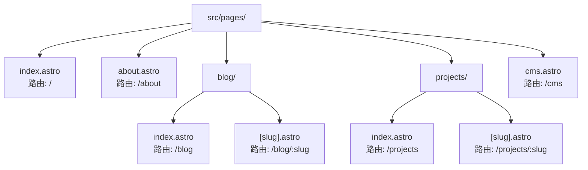
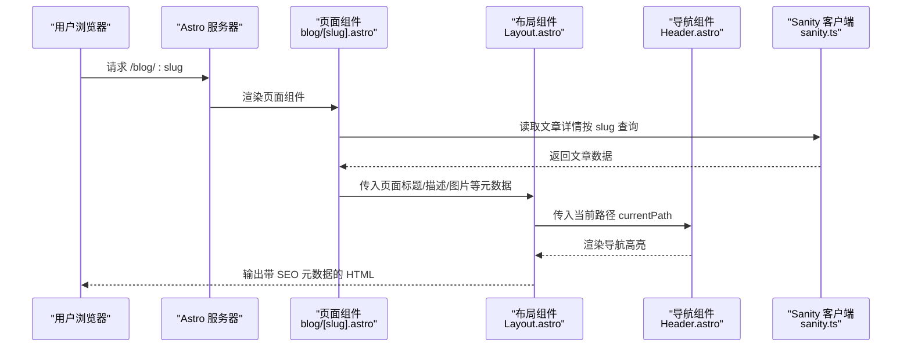
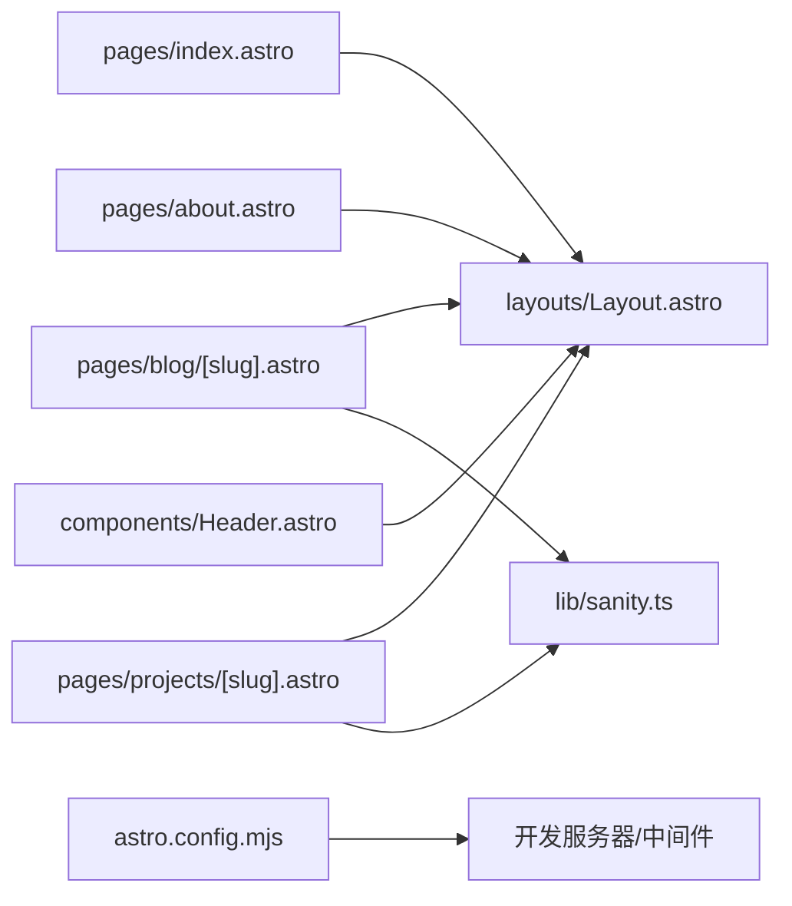

# 添加新页面

<cite>
**本文引用的文件**
- [astro.config.mjs](file://astro.config.mjs)
- [package.json](file://package.json)
- [src/layouts/Layout.astro](file://src/layouts/Layout.astro)
- [src/components/Header.astro](file://src/components/Header.astro)
- [src/lib/sanity.ts](file://src/lib/sanity.ts)
- [src/pages/index.astro](file://src/pages/index.astro)
- [src/pages/about.astro](file://src/pages/about.astro)
- [src/pages/blog/[slug].astro](file://src/pages/blog/[slug].astro)
- [src/pages/projects/[slug].astro](file://src/pages/projects/[slug].astro)
- [src/pages/blog/index.astro](file://src/pages/blog/index.astro)
- [src/pages/projects/index.astro](file://src/pages/projects/index.astro)
- [src/pages/cms.astro](file://src/pages/cms.astro)
- [scripts/fix-current-cms.js](file://scripts/fix-current-cms.js)
</cite>

## 目录
1. [简介](#简介)
2. [项目结构](#项目结构)
3. [核心组件](#核心组件)
4. [架构总览](#架构总览)
5. [详细组件分析](#详细组件分析)
6. [依赖关系分析](#依赖关系分析)
7. [性能考量](#性能考量)
8. [故障排查指南](#故障排查指南)
9. [结论](#结论)
10. [附录](#附录)

## 简介
本指南面向在 Astro 框架中新增页面路由的场景，目标包括：
- 在 src/pages/ 下创建新页面（如 contact.astro 或 resume.astro）并使其自动生成路由
- 继承 Layout.astro 布局并注入页面特定的标题、描述与 Open Graph 图片等元数据
- 结合静态页面与动态数据（如从 Sanity 获取联系信息）的示例
- 在 Header 导航中添加新页面链接
- 常见问题：404 错误处理、路由优先级与嵌套路由注意事项

## 项目结构
Astro 采用约定式路由：将页面文件放置在 src/pages/ 目录下即可自动生成对应 URL。例如：
- src/pages/index.astro → /
- src/pages/about.astro → /about
- src/pages/blog/index.astro → /blog
- src/pages/blog/[slug].astro → /blog/:slug
- src/pages/projects/index.astro → /projects
- src/pages/projects/[slug].astro → /projects/:slug

图表来源
- [src/pages/index.astro](file://src/pages/index.astro#L1-L242)
- [src/pages/about.astro](file://src/pages/about.astro#L1-L321)
- [src/pages/blog/index.astro](file://src/pages/blog/index.astro)
- [src/pages/blog/[slug].astro](file://src/pages/blog/[slug].astro#L1-L127)
- [src/pages/projects/index.astro](file://src/pages/projects/index.astro)
- [src/pages/projects/[slug].astro](file://src/pages/projects/[slug].astro#L1-L162)
- [src/pages/cms.astro](file://src/pages/cms.astro#L1-L19)

章节来源
- [astro.config.mjs](file://astro.config.mjs#L1-L35)
- [src/pages/index.astro](file://src/pages/index.astro#L1-L242)
- [src/pages/about.astro](file://src/pages/about.astro#L1-L321)
- [src/pages/blog/[slug].astro](file://src/pages/blog/[slug].astro#L1-L127)
- [src/pages/projects/[slug].astro](file://src/pages/projects/[slug].astro#L1-L162)

## 核心组件
- 布局组件 Layout.astro：统一注入 SEO 元数据（title/description/image）、Open Graph、Twitter Card、Canonical 链接，并承载 Header/Footer 与主内容 slot
- 导航组件 Header.astro：维护导航链接数组，根据 currentPath 高亮当前页
- 数据层 sanity.ts：封装 Sanity 客户端与常用查询（文章、项目、关于页面、精选内容等）

章节来源
- [src/layouts/Layout.astro](file://src/layouts/Layout.astro#L1-L59)
- [src/components/Header.astro](file://src/components/Header.astro#L1-L164)
- [src/lib/sanity.ts](file://src/lib/sanity.ts#L1-L99)

## 架构总览
下面的序列图展示了“从浏览器访问到页面渲染”的关键流程，以 /blog/:slug 页面为例：

图表来源
- [src/pages/blog/[slug].astro](file://src/pages/blog/[slug].astro#L1-L127)
- [src/layouts/Layout.astro](file://src/layouts/Layout.astro#L1-L59)
- [src/components/Header.astro](file://src/components/Header.astro#L1-L164)
- [src/lib/sanity.ts](file://src/lib/sanity.ts#L1-L99)

## 详细组件分析

### 新增静态页面（如 contact.astro 或 resume.astro）
- 在 src/pages/ 下新建文件，例如 contact.astro 或 resume.astro
- 在页面文件顶部导入 Layout 并包裹内容，向 Layout 注入页面标题与描述
- 若需 SEO 图片，可在 Layout 中传入 image 参数；若无则使用默认值
- 在 Header 导航中添加新链接，确保 href 与页面路由一致

参考示例路径
- [页面模板与注入元数据示例](file://src/pages/about.astro#L84-L120)
- [导航链接定义位置](file://src/components/Header.astro#L9-L14)

章节来源
- [src/pages/about.astro](file://src/pages/about.astro#L84-L120)
- [src/components/Header.astro](file://src/components/Header.astro#L9-L14)

### 新增动态页面（如 /blog/:slug）
- 使用动态路由参数 [slug]，在页面中读取 Astro.params.slug
- 在 getStaticPaths 中返回所有可用的 slug，确保静态预渲染
- 通过 sanity.ts 的 postBySlugQuery 获取文章详情，若不存在则跳转 404
- 向 Layout 注入文章标题、摘要与封面图作为 SEO 元数据

参考示例路径
- [动态路由与 getStaticPaths](file://src/pages/blog/[slug].astro#L1-L30)
- [数据获取与 404 跳转](file://src/pages/blog/[slug].astro#L23-L29)
- [Layout 注入元数据](file://src/pages/blog/[slug].astro#L40-L44)
- [Sanity 查询定义](file://src/lib/sanity.ts#L29-L41)

章节来源
- [src/pages/blog/[slug].astro](file://src/pages/blog/[slug].astro#L1-L127)
- [src/lib/sanity.ts](file://src/lib/sanity.ts#L29-L41)

### 新增动态页面（如 /projects/:slug）
- 使用动态路由参数 [slug]，在 getStaticPaths 中返回所有可用的 slug
- 通过 sanity.ts 的 projectBySlugQuery 获取项目详情
- 向 Layout 注入项目标题、描述与缩略图作为 SEO 元数据

参考示例路径
- [动态路由与 getStaticPaths](file://src/pages/projects/[slug].astro#L1-L33)
- [Layout 注入元数据](file://src/pages/projects/[slug].astro#L76-L80)
- [Sanity 查询定义](file://src/lib/sanity.ts#L55-L68)

章节来源
- [src/pages/projects/[slug].astro](file://src/pages/projects/[slug].astro#L1-L162)
- [src/lib/sanity.ts](file://src/lib/sanity.ts#L55-L68)

### 继承 Layout.astro 并注入页面特定元数据
- 在页面文件顶部导入 Layout
- 通过 Layout 的 props 注入 title、description、image
- Layout 内部会自动注入 Open Graph、Twitter Card、Canonical 等 SEO 元素

参考示例路径
- [Layout 接收元数据并注入](file://src/layouts/Layout.astro#L6-L16)
- [页面向 Layout 注入元数据](file://src/pages/about.astro#L85-L88)

章节来源
- [src/layouts/Layout.astro](file://src/layouts/Layout.astro#L6-L16)
- [src/pages/about.astro](file://src/pages/about.astro#L85-L88)

### 在 Header 导航中添加新页面链接
- 在 Header.astro 的 navLinks 数组中添加新链接对象（href 与 label）
- 通过 currentPath 与 Link 的 href 比较实现高亮
- 如果需要移动端菜单，也请在移动端菜单区域同步添加

参考示例路径
- [桌面端导航链接](file://src/components/Header.astro#L9-L14)
- [移动端导航链接](file://src/components/Header.astro#L107-L119)

章节来源
- [src/components/Header.astro](file://src/components/Header.astro#L9-L14)
- [src/components/Header.astro](file://src/components/Header.astro#L107-L119)

### 静态页面与动态数据结合（以 Sanity 为例）
- 在页面中调用 sanity.ts 的查询函数（如 postsQuery、projectsQuery、aboutQuery）
- 将返回的数据直接渲染到页面组件中
- 对于动态路由页面，先在 getStaticPaths 中列出所有 slug，再在页面中按 slug 查询详情

参考示例路径
- [Sanity 查询与辅助函数](file://src/lib/sanity.ts#L1-L99)
- [首页使用静态数据与组件组合](file://src/pages/index.astro#L1-L242)
- [关于页面使用静态数据](file://src/pages/about.astro#L1-L321)

章节来源
- [src/lib/sanity.ts](file://src/lib/sanity.ts#L1-L99)
- [src/pages/index.astro](file://src/pages/index.astro#L1-L242)
- [src/pages/about.astro](file://src/pages/about.astro#L1-L321)

### 常见问题与注意事项

#### 404 错误处理
- 在动态路由页面中，当未找到对应数据时，应显式跳转到 404 页面或返回 Astro.redirect
- 参考路径：[动态路由中的 404 跳转](file://src/pages/blog/[slug].astro#L23-L29)

章节来源
- [src/pages/blog/[slug].astro](file://src/pages/blog/[slug].astro#L23-L29)

#### 路由优先级
- Astro 的路由匹配遵循“文件系统优先”原则：更具体的路径优先级更高
- 例如 /blog/index.astro 会覆盖 /blog/[slug].astro 的同层级匹配
- 参考路径：[博客索引与动态路由](file://src/pages/blog/index.astro)、[博客动态路由](file://src/pages/blog/[slug].astro#L1-L30)

章节来源
- [src/pages/blog/index.astro](file://src/pages/blog/index.astro)
- [src/pages/blog/[slug].astro](file://src/pages/blog/[slug].astro#L1-L30)

#### 嵌套路由注意事项
- 子目录下的页面会形成嵌套路由，如 /blog/ 与 /blog/:slug
- 确保子目录内存在 index.astro 以便提供列表页
- 参考路径：[项目嵌套路由示例](file://src/pages/projects/index.astro)、[项目动态路由示例](file://src/pages/projects/[slug].astro#L1-L33)

章节来源
- [src/pages/projects/index.astro](file://src/pages/projects/index.astro)
- [src/pages/projects/[slug].astro](file://src/pages/projects/[slug].astro#L1-L33)

#### CMS 路径与重定向
- 本地开发时，/cms 路由通过 Astro Vite 插件重定向到 /cms/index.html
- 若构建后静态资源路径不正确，可使用脚本修复 public/cms/index.html 中的静态资源路径

参考示例路径
- [Vite 插件重定向规则](file://astro.config.mjs#L17-L33)
- [CMS 重定向页面](file://src/pages/cms.astro#L1-L19)
- [修复现有构建中的 CMS 路径脚本](file://scripts/fix-current-cms.js#L1-L33)

章节来源
- [astro.config.mjs](file://astro.config.mjs#L17-L33)
- [src/pages/cms.astro](file://src/pages/cms.astro#L1-L19)
- [scripts/fix-current-cms.js](file://scripts/fix-current-cms.js#L1-L33)

## 依赖关系分析
- 页面组件依赖 Layout 提供统一的 SEO 元数据与结构
- 页面组件通过 sanity.ts 访问 Sanity 数据
- Header 组件依赖 currentPath 实现导航高亮
- Astro 配置控制输出模式、站点地址与开发中间件

图表来源
- [src/pages/index.astro](file://src/pages/index.astro#L1-L242)
- [src/pages/about.astro](file://src/pages/about.astro#L1-L321)
- [src/pages/blog/[slug].astro](file://src/pages/blog/[slug].astro#L1-L127)
- [src/pages/projects/[slug].astro](file://src/pages/projects/[slug].astro#L1-L162)
- [src/layouts/Layout.astro](file://src/layouts/Layout.astro#L1-L59)
- [src/components/Header.astro](file://src/components/Header.astro#L1-L164)
- [src/lib/sanity.ts](file://src/lib/sanity.ts#L1-L99)
- [astro.config.mjs](file://astro.config.mjs#L1-L35)

章节来源
- [src/pages/index.astro](file://src/pages/index.astro#L1-L242)
- [src/pages/about.astro](file://src/pages/about.astro#L1-L321)
- [src/pages/blog/[slug].astro](file://src/pages/blog/[slug].astro#L1-L127)
- [src/pages/projects/[slug].astro](file://src/pages/projects/[slug].astro#L1-L162)
- [src/layouts/Layout.astro](file://src/layouts/Layout.astro#L1-L59)
- [src/components/Header.astro](file://src/components/Header.astro#L1-L164)
- [src/lib/sanity.ts](file://src/lib/sanity.ts#L1-L99)
- [astro.config.mjs](file://astro.config.mjs#L1-L35)

## 性能考量
- 使用 getStaticPaths 预渲染动态路由页面，减少运行时查询开销
- 合理拆分页面组件，避免单页过大导致首屏渲染缓慢
- 利用 Astro 的 Islands 架构，仅在必要处引入交互逻辑
- 通过 Layout 统一注入 SEO 元数据，减少重复计算

## 故障排查指南
- 页面无法访问或 404
  - 检查页面文件是否位于 src/pages/ 下且命名正确
  - 动态路由页面需在 getStaticPaths 中返回所有 slug
  - 参考路径：[动态路由与 404 处理](file://src/pages/blog/[slug].astro#L23-L29)
- 导航高亮不生效
  - 确认 Header 接收 currentPath 并与链接 href 一致
  - 参考路径：[导航高亮逻辑](file://src/components/Header.astro#L44-L57)
- CMS 路由访问异常
  - 本地开发时确认 /cms 重定向已启用
  - 构建后静态资源路径不正确时，使用修复脚本
  - 参考路径：[Vite 插件重定向](file://astro.config.mjs#L17-L33)、[修复脚本](file://scripts/fix-current-cms.js#L1-L33)

章节来源
- [src/pages/blog/[slug].astro](file://src/pages/blog/[slug].astro#L23-L29)
- [src/components/Header.astro](file://src/components/Header.astro#L44-L57)
- [astro.config.mjs](file://astro.config.mjs#L17-L33)
- [scripts/fix-current-cms.js](file://scripts/fix-current-cms.js#L1-L33)

## 结论
通过遵循 Astro 的约定式路由与布局注入机制，可以快速在项目中添加新页面。建议：
- 新页面直接放在 src/pages/ 下，按需继承 Layout 注入 SEO 元数据
- 动态路由页面务必提供 getStaticPaths 与 404 处理
- 导航链接在 Header 中集中维护，保持一致性
- 使用 Sanity 查询实现静态页面与动态数据的无缝结合

## 附录
- 项目脚本与依赖
  - 开发与构建命令参考：[脚本定义](file://package.json#L1-L28)
  - Astro 配置与开发中间件参考：[配置文件](file://astro.config.mjs#L1-L35)

章节来源
- [package.json](file://package.json#L1-L28)
- [astro.config.mjs](file://astro.config.mjs#L1-L35)