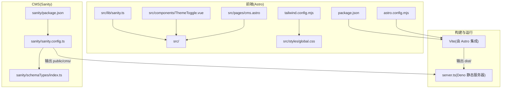
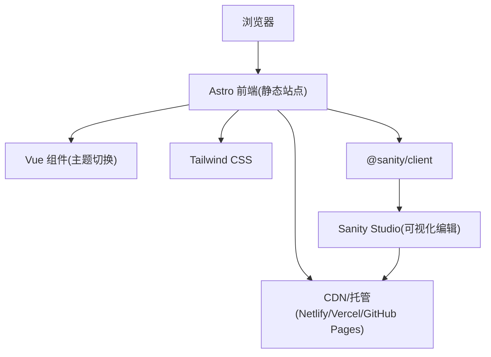
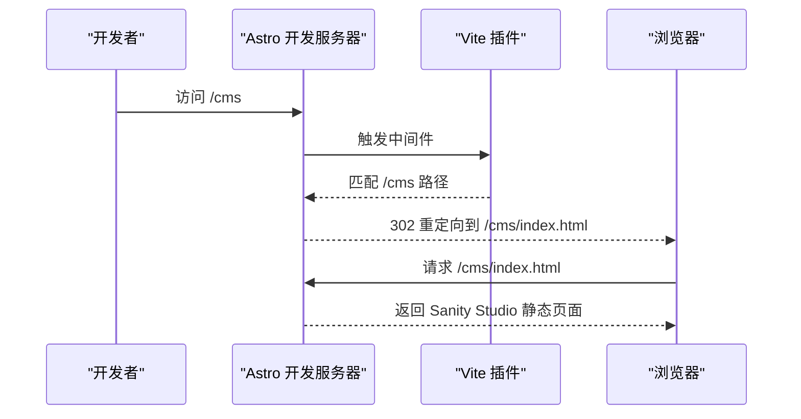
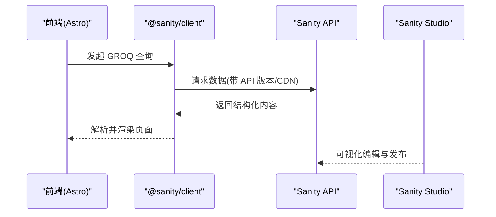
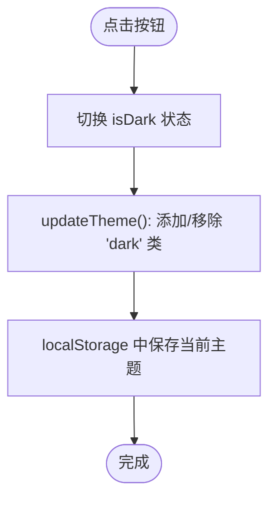
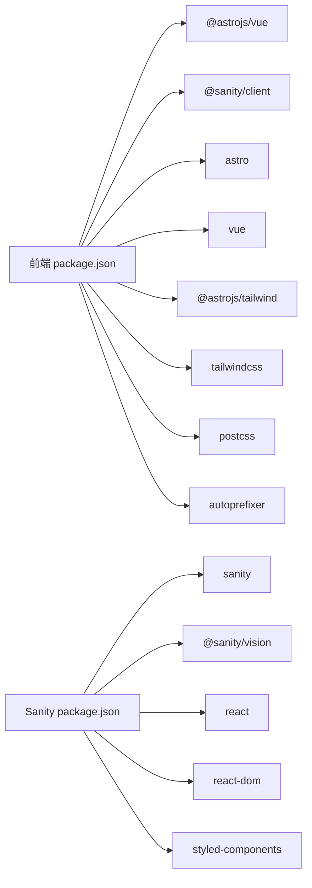

# 技术栈与依赖

<cite>
**本文引用的文件**
- [package.json](file://package.json)
- [astro.config.mjs](file://astro.config.mjs)
- [tailwind.config.mjs](file://tailwind.config.mjs)
- [src/lib/sanity.ts](file://src/lib/sanity.ts)
- [src/components/ThemeToggle.vue](file://src/components/ThemeToggle.vue)
- [src/pages/cms.astro](file://src/pages/cms.astro)
- [sanity/package.json](file://sanity/package.json)
- [sanity/sanity.config.ts](file://sanity/sanity.config.ts)
- [sanity/schemaTypes/index.ts](file://sanity/schemaTypes/index.ts)
- [src/styles/global.css](file://src/styles/global.css)
- [server.ts](file://server.ts)
- [README.md](file://README.md)
</cite>

## 目录
1. [引言](#引言)
2. [项目结构](#项目结构)
3. [核心组件](#核心组件)
4. [架构总览](#架构总览)
5. [详细组件分析](#详细组件分析)
6. [依赖关系分析](#依赖关系分析)
7. [性能考虑](#性能考虑)
8. [故障排查指南](#故障排查指南)
9. [结论](#结论)
10. [附录](#附录)

## 引言
本项目采用“静态站点生成 + 内容管理”的现代工程方案：
- 前端框架：Astro，负责静态站点生成与页面渲染。
- 内容管理：Sanity CMS，提供可视化内容编辑与数据模型管理。
- 样式体系：Tailwind CSS，通过原子化类名实现一致且可维护的设计系统。
- 交互增强：Vue.js，用于实现轻量交互组件（如主题切换）。
- 构建工具：Vite（由 Astro 集成），提供快速开发体验与高效打包能力。

该文档将系统梳理技术栈的职责边界、集成方式、关键依赖与版本兼容性要点，并给出配置建议与扩展思路，帮助开发者理解技术选型的工程考量并指导后续维护与演进。

## 项目结构
项目采用前后端分离但统一构建的组织方式：
- 前端（Astro）位于根目录，包含页面、组件、样式与构建配置。
- Sanity CMS 独立子项目位于 sanity/ 目录，拥有独立的依赖与配置。
- 构建产物 dist/ 为前端静态站点；public/cms/ 为 Sanity Studio 的静态产物。

图表来源
- [package.json](file://package.json#L1-L28)
- [astro.config.mjs](file://astro.config.mjs#L1-L35)
- [tailwind.config.mjs](file://tailwind.config.mjs#L1-L119)
- [src/lib/sanity.ts](file://src/lib/sanity.ts#L1-L99)
- [src/components/ThemeToggle.vue](file://src/components/ThemeToggle.vue#L1-L79)
- [src/pages/cms.astro](file://src/pages/cms.astro#L1-L19)
- [sanity/package.json](file://sanity/package.json#L1-L38)
- [sanity/sanity.config.ts](file://sanity/sanity.config.ts#L1-L31)
- [sanity/schemaTypes/index.ts](file://sanity/schemaTypes/index.ts#L1-L10)
- [server.ts](file://server.ts#L1-L19)

章节来源
- [README.md](file://README.md#L1-L185)

## 核心组件
- Astro 静态站点生成：负责页面路由、布局、组件渲染与构建输出。
- Sanity CMS：提供可视化编辑器、Schema 定义与数据模型，支持 GraphQL API 与 GROQ 查询。
- Vue.js：用于实现轻量交互组件（如主题切换），通过 Astro 的 Vue 集成进行编译与运行。
- Tailwind CSS：通过原子化类名与自定义主题扩展，统一视觉语言与暗色模式支持。
- Vite：由 Astro 集成，提供开发服务器、热更新与生产打包能力。
- 静态服务器：Deno 实现的简单静态文件服务，用于在本地或生产环境分发 dist 与 public/cms。

章节来源
- [package.json](file://package.json#L1-L28)
- [astro.config.mjs](file://astro.config.mjs#L1-L35)
- [sanity/package.json](file://sanity/package.json#L1-L38)
- [src/lib/sanity.ts](file://src/lib/sanity.ts#L1-L99)
- [src/components/ThemeToggle.vue](file://src/components/ThemeToggle.vue#L1-L79)
- [src/styles/global.css](file://src/styles/global.css#L1-L177)
- [server.ts](file://server.ts#L1-L19)

## 架构总览
整体架构围绕“前端静态站点 + 可视化内容管理”展开，前端通过 Sanity SDK 读取数据，Vue 组件提供交互体验，Tailwind 提供样式基底，Vite 提供开发与构建支撑。

图表来源
- [package.json](file://package.json#L1-L28)
- [astro.config.mjs](file://astro.config.mjs#L1-L35)
- [src/lib/sanity.ts](file://src/lib/sanity.ts#L1-L99)
- [sanity/sanity.config.ts](file://sanity/sanity.config.ts#L1-L31)
- [src/components/ThemeToggle.vue](file://src/components/ThemeToggle.vue#L1-L79)
- [src/styles/global.css](file://src/styles/global.css#L1-L177)

## 详细组件分析

### Astro 静态站点生成与构建
- 集成策略
  - 通过 Astro 配置启用 Vue 集成与 Tailwind 集成，确保 Vue 组件与原子化样式正常工作。
  - 输出模式为静态站点，适合部署到任意静态托管平台。
  - 通过 Vite 插件实现 /cms 路径的本地开发重定向，便于同时开发前端与 CMS。
- 关键配置点
  - 输出：静态站点。
  - 站点地址：用于 SEO 与链接生成。
  - SSR 外部化：将 @sanity/client 标记为 noExternal，避免 SSR 打包问题。
  - 自定义中间件：对 /cms 路径进行 302 重定向至 /cms/index.html，保证本地访问正确性。

图表来源
- [astro.config.mjs](file://astro.config.mjs#L1-L35)
- [src/pages/cms.astro](file://src/pages/cms.astro#L1-L19)

章节来源
- [astro.config.mjs](file://astro.config.mjs#L1-L35)
- [README.md](file://README.md#L66-L122)

### Sanity CMS 作为内容管理后端
- 角色与职责
  - 提供可视化编辑界面（Studio），支持多 Schema 类型（文章、项目、作者、分类、关于页等）。
  - 通过 GROQ 查询语言提供结构化数据，前端通过 @sanity/client 读取。
  - 构建产物输出到 public/cms/，部署在 /cms 路径下。
- 配置要点
  - 项目 ID、数据集、API 版本与 CDN 开关在客户端初始化中声明。
  - Studio 基础路径设置为 /cms，确保静态构建资源路径正确。
  - Schema 类型集中导出，便于维护与扩展。

图表来源
- [src/lib/sanity.ts](file://src/lib/sanity.ts#L1-L99)
- [sanity/sanity.config.ts](file://sanity/sanity.config.ts#L1-L31)
- [sanity/schemaTypes/index.ts](file://sanity/schemaTypes/index.ts#L1-L10)

章节来源
- [sanity/package.json](file://sanity/package.json#L1-L38)
- [sanity/sanity.config.ts](file://sanity/sanity.config.ts#L1-L31)
- [sanity/schemaTypes/index.ts](file://sanity/schemaTypes/index.ts#L1-L10)
- [src/lib/sanity.ts](file://src/lib/sanity.ts#L1-L99)

### Vue.js 用于增强交互性组件（主题切换）
- 实现机制
  - 使用 Vue 组合式 API 管理主题状态，切换时更新 documentElement 的 class 并持久化到 localStorage。
  - 通过 Tailwind 的 darkMode: 'class' 配置，自动适配深色模式样式。
  - 组件内使用原子化类名，保持与全局样式的统一。
- 交互流程

图表来源
- [src/components/ThemeToggle.vue](file://src/components/ThemeToggle.vue#L1-L79)
- [tailwind.config.mjs](file://tailwind.config.mjs#L1-L119)

章节来源
- [src/components/ThemeToggle.vue](file://src/components/ThemeToggle.vue#L1-L79)
- [tailwind.config.mjs](file://tailwind.config.mjs#L1-L119)

### Tailwind CSS 驱动原子化样式设计
- 设计理念
  - 通过原子化类名实现高复用、低耦合的样式体系。
  - 自定义主题扩展：颜色、字体、字号、间距、圆角、阴影、动画与背景图案。
  - 暗色模式：基于 class 切换，与 Vue 主题组件协同工作。
- 样式组织
  - 全局样式文件引入 Tailwind 指令与自定义层，统一基础、组件与工具类。
  - 通过 @apply 与自定义动画、网格背景等增强视觉表现。

章节来源
- [tailwind.config.mjs](file://tailwind.config.mjs#L1-L119)
- [src/styles/global.css](file://src/styles/global.css#L1-L177)

### Vite 作为构建工具的集成方式
- 集成方式
  - Astro 内置集成 Vite，提供开发服务器、热更新与生产打包。
  - 通过 Astro 配置中的 vite 字段，设置 noExternal 与自定义中间件，保障 @sanity/client 与 /cms 路由在开发阶段正常工作。
- 适用场景
  - 开发期：快速启动与热更新。
  - 生产期：静态站点构建与优化。

章节来源
- [astro.config.mjs](file://astro.config.mjs#L1-L35)
- [package.json](file://package.json#L1-L28)

## 依赖关系分析
- 前端依赖
  - @astrojs/vue：使 Astro 支持 Vue 组件。
  - @sanity/client：与 Sanity API 通信，读取结构化内容。
  - astro：静态站点生成核心。
  - vue：Vue 3 组件运行时。
  - @astrojs/tailwind：Astro 集成 Tailwind。
  - tailwindcss/postcss/autoprefixer：样式构建与前缀处理。
- CMS 依赖
  - sanity：Sanity Studio 核心。
  - @sanity/vision：可视化查询工具。
  - react/react-dom：Studio 运行时。
  - styled-components：Studio 样式支持。
  - typescript/@types/react：类型与开发体验。

图表来源
- [package.json](file://package.json#L1-L28)
- [sanity/package.json](file://sanity/package.json#L1-L38)

章节来源
- [package.json](file://package.json#L1-L28)
- [sanity/package.json](file://sanity/package.json#L1-L38)

## 性能考虑
- 静态生成优势
  - 页面按需构建，无需运行时渲染，加载速度快，SEO 友好。
- CDN 加速
  - 前端与 CMS 静态资源均可由 CDN 分发，降低延迟。
- 样式体积控制
  - Tailwind 通过 content 白名单与按需扫描减少未使用样式体积。
- 构建优化
  - Vite 提供快速打包与 Tree-shaking，结合静态输出进一步优化。
- 数据获取
  - 使用 CDN 与合理的 API 版本策略，平衡稳定性与性能。

[本节为通用性能讨论，不直接分析具体文件]

## 故障排查指南
- 本地无法访问 /cms
  - 确认 Astro 配置中已启用自定义中间件与 /cms 重定向逻辑。
  - 检查 sanity 构建是否成功生成 public/cms/ 目录。
- Vue 组件未生效
  - 确认已启用 @astrojs/vue 集成，且组件扩展名为 .vue。
  - 检查主题切换逻辑是否正确写入 documentElement 的 class 并持久化到 localStorage。
- 样式异常或暗色模式无效
  - 确认 Tailwind 配置中 darkMode: 'class' 已启用。
  - 检查全局样式文件是否正确引入 Tailwind 指令与自定义层。
- 静态服务器分发问题
  - 确认 server.ts 正确区分 /cms 与其它路径的静态文件根目录。
  - 检查 dist 与 public/cms 是否存在对应构建产物。

章节来源
- [astro.config.mjs](file://astro.config.mjs#L1-L35)
- [src/pages/cms.astro](file://src/pages/cms.astro#L1-L19)
- [src/components/ThemeToggle.vue](file://src/components/ThemeToggle.vue#L1-L79)
- [tailwind.config.mjs](file://tailwind.config.mjs#L1-L119)
- [src/styles/global.css](file://src/styles/global.css#L1-L177)
- [server.ts](file://server.ts#L1-L19)

## 结论
本项目通过 Astro 的静态生成能力、Sanity 的可视化内容管理、Vue 的轻量交互与 Tailwind 的原子化样式体系，形成一套高可维护、高性能且易于扩展的现代前端工程方案。Vite 作为构建工具与开发服务器，提供了流畅的开发体验。遵循本文档的配置要点与版本兼容性建议，可确保项目在不同环境下稳定运行，并为后续扩展与维护提供清晰路径。

[本节为总结性内容，不直接分析具体文件]

## 附录

### 关键依赖与用途
- @astrojs/vue：在 Astro 中启用 Vue 组件支持。
- @sanity/client：与 Sanity API 通信，读取结构化内容。
- astro：静态站点生成核心。
- vue：Vue 3 组件运行时。
- @astrojs/tailwind：Astro 集成 Tailwind。
- tailwindcss/postcss/autoprefixer：样式构建与前缀处理。
- sanity/@sanity/vision：Sanity Studio 与可视化查询工具。
- react/react-dom/styled-components：Sanity Studio 运行时与样式支持。

章节来源
- [package.json](file://package.json#L1-L28)
- [sanity/package.json](file://sanity/package.json#L1-L38)

### 版本兼容性与配置要点
- 环境要求
  - Node.js >= 18.0.0，npm >= 8.0.0。
- Astro 与 Vite
  - 使用 Astro 内置的 Vite 集成，确保开发与生产一致性。
  - 在 vite.noExternal 中声明 @sanity/client，避免 SSR 打包问题。
- Tailwind
  - content 覆盖 src 下所有模板文件扩展名，确保按需扫描。
  - darkMode: 'class' 与 Vue 主题组件协同。
- Sanity
  - Studio 基础路径设置为 /cms，构建时使用 --base-path /cms。
  - 客户端初始化包含 projectId、dataset、apiVersion 与 useCdn。
- 部署
  - 前端构建产物 dist/ 部署到静态托管平台。
  - CMS 构建产物 public/cms/ 部署在 /cms 路径下。

章节来源
- [README.md](file://README.md#L170-L185)
- [astro.config.mjs](file://astro.config.mjs#L1-L35)
- [tailwind.config.mjs](file://tailwind.config.mjs#L1-L119)
- [sanity/sanity.config.ts](file://sanity/sanity.config.ts#L1-L31)
- [src/lib/sanity.ts](file://src/lib/sanity.ts#L1-L99)