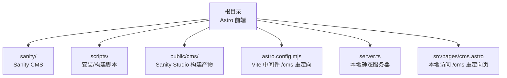
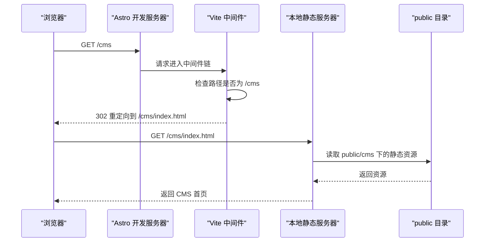
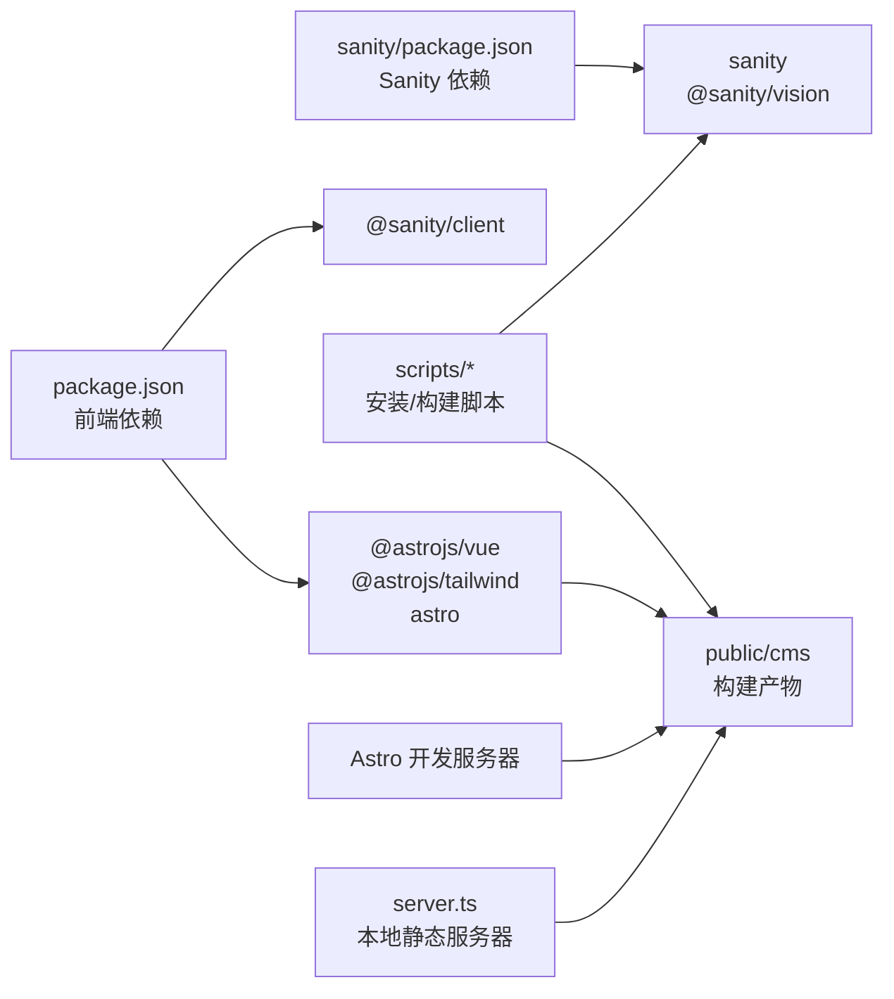

# 本地开发环境

<cite>
**本文引用的文件**
- [README.md](file://README.md)
- [package.json](file://package.json)
- [astro.config.mjs](file://astro.config.mjs)
- [scripts/install-sanity.bat](file://scripts/install-sanity.bat)
- [scripts/build-cms.bat](file://scripts/build-cms.bat)
- [scripts/fix-cms-paths.js](file://scripts/fix-cms-paths.js)
- [sanity/package.json](file://sanity/package.json)
- [sanity/sanity.config.ts](file://sanity/sanity.config.ts)
- [src/pages/cms.astro](file://src/pages/cms.astro)
- [src/lib/sanity.ts](file://src/lib/sanity.ts)
- [server.ts](file://server.ts)
</cite>

## 目录
1. [引言](#引言)
2. [项目结构](#项目结构)
3. [核心组件](#核心组件)
4. [架构总览](#架构总览)
5. [详细组件分析](#详细组件分析)
6. [依赖关系分析](#依赖关系分析)
7. [性能考虑](#性能考虑)
8. [故障排除指南](#故障排除指南)
9. [结论](#结论)
10. [附录](#附录)

## 引言
本指南面向希望在本地搭建并运行该 Astro + Sanity 项目的开发者，覆盖以下要点：
- 如何使用 install-sanity.bat 安装 Sanity CMS 依赖
- 如何运行 npm run dev 启动 Astro 开发服务器
- 环境变量与端口设置建议
- 热重载与静态资源路径重定向的工作机制
- 常见问题排查（依赖安装失败、端口冲突等）
- 对 astro.config.mjs 中 Vite 中间件对 /cms 路径重定向的说明

## 项目结构
该项目采用“前端（Astro）+ 内容管理（Sanity）”双子仓模式：
- 前端位于根目录，使用 Astro 作为静态站点生成器，集成 Vue 与 Tailwind
- Sanity CMS 位于 sanity 子目录，独立管理其依赖与构建
- scripts 目录提供批处理与 Node 脚本，协助安装与构建 Sanity Studio
- public/cms 目录存放构建后的 Sanity Studio 静态资源，供本地预览与开发时访问

图表来源
- [astro.config.mjs](file://astro.config.mjs#L1-L35)
- [sanity/sanity.config.ts](file://sanity/sanity.config.ts#L1-L31)
- [scripts/install-sanity.bat](file://scripts/install-sanity.bat#L1-L14)
- [scripts/build-cms.bat](file://scripts/build-cms.bat#L1-L44)
- [server.ts](file://server.ts#L1-L19)
- [src/pages/cms.astro](file://src/pages/cms.astro#L1-L19)

章节来源
- [README.md](file://README.md#L1-L185)
- [package.json](file://package.json#L1-L28)

## 核心组件
- 安装与构建脚本
  - install-sanity.bat：进入 sanity 目录执行 npm install，并提示后续可执行 build-cms
  - build-cms.bat：构建 Sanity Studio、修复路径、复制到 public/cms、清理临时文件
  - fix-cms-paths.js：修复构建产物中的静态资源路径，确保 /cms 前缀生效
- Astro 配置与中间件
  - astro.config.mjs：启用 Vue 与 Tailwind 集成；配置 Vite 中间件拦截 /cms 请求并重定向至 /cms/index.html
- 本地服务器
  - server.ts：Deno 本地服务器，对 /cms 路径直接从 public 目录提供静态文件
- 页面与数据层
  - src/pages/cms.astro：本地访问 /cms 时的重定向页
  - src/lib/sanity.ts：Sanity 客户端初始化与常用查询

章节来源
- [scripts/install-sanity.bat](file://scripts/install-sanity.bat#L1-L14)
- [scripts/build-cms.bat](file://scripts/build-cms.bat#L1-L44)
- [scripts/fix-cms-paths.js](file://scripts/fix-cms-paths.js#L1-L96)
- [astro.config.mjs](file://astro.config.mjs#L1-L35)
- [server.ts](file://server.ts#L1-L19)
- [src/pages/cms.astro](file://src/pages/cms.astro#L1-L19)
- [src/lib/sanity.ts](file://src/lib/sanity.ts#L1-L99)

## 架构总览
本地开发时，浏览器访问 /cms 实际由 Vite 中间件拦截并重定向到 /cms/index.html，再由本地静态服务器从 public 目录提供静态资源。Astro 开发服务器负责提供前端页面，前端通过 @sanity/client 与 Sanity API 交互。

图表来源
- [astro.config.mjs](file://astro.config.mjs#L14-L33)
- [server.ts](file://server.ts#L1-L19)
- [src/pages/cms.astro](file://src/pages/cms.astro#L1-L19)

## 详细组件分析

### 安装 Sanity 依赖：install-sanity.bat
- 功能概述
  - 切换到 sanity 目录并执行 npm install
  - 失败时返回错误码并退出
  - 成功后提示可执行 npm run build-cms
- 使用建议
  - 首次克隆仓库后，先在根目录执行 npm install 安装前端依赖
  - 再使用 install-sanity.bat 安装 Sanity 依赖
  - 或者直接使用根目录 npm 脚本 sanity-install 来完成相同操作

章节来源
- [scripts/install-sanity.bat](file://scripts/install-sanity.bat#L1-L14)
- [package.json](file://package.json#L1-L28)

### 构建 CMS：build-cms.bat 与 fix-cms-paths.js
- 构建流程
  - sanity/package.json 中的 build 脚本使用 --base-path /cms，使构建产物具备正确的相对路径
  - build-cms.bat 执行以下步骤：
    1) 在 sanity 目录执行 npm run build
    2) 调用 fix-cms-paths.js 修复静态资源路径
    3) 将 sanity/dist 复制到 public/cms
    4) 清理 sanity/dist
  - fix-cms-paths.js 主要替换 href/src 中的 /static/ 与 /vendor/ 为 /cms/static/ 与 /cms/vendor/
- 作用与意义
  - 确保在 /cms 路径下加载静态资源时不会出现 404
  - 保证本地预览与生产部署的一致性

章节来源
- [scripts/build-cms.bat](file://scripts/build-cms.bat#L1-L44)
- [scripts/fix-cms-paths.js](file://scripts/fix-cms-paths.js#L1-L96)
- [sanity/package.json](file://sanity/package.json#L1-L38)
- [sanity/sanity.config.ts](file://sanity/sanity.config.ts#L1-L31)

### Vite 中间件与 /cms 重定向：astro.config.mjs
- 配置要点
  - 在 vite.plugins 中注册自定义中间件
  - 当请求路径为 /cms 或 /cms/ 时，重定向到 /cms/index.html
  - 仅对匹配的路径进行重定向，其余请求交由后续中间件处理
- 与 server.ts 的配合
  - server.ts 对 /cms 路径直接从 public 目录提供静态文件
  - 两者共同保证 /cms/index.html 能被正确返回
- 端口与热重载
  - Astro 开发服务器默认端口通常为 4321（参考 build-cms.bat 输出提示）
  - 热重载由 Astro/Vite 自动处理，修改前端代码会自动刷新

章节来源
- [astro.config.mjs](file://astro.config.mjs#L14-L33)
- [server.ts](file://server.ts#L1-L19)
- [scripts/build-cms.bat](file://scripts/build-cms.bat#L40-L44)

### 本地访问入口：src/pages/cms.astro
- 功能概述
  - 该页面在客户端执行跳转，将用户重定向到 /cms/index.html
  - 便于在本地通过 /cms 访问 Sanity Studio
- 使用场景
  - 在浏览器中直接访问 /cms 时，由该页面触发跳转
  - 与 Vite 中间件的 302 重定向形成互补

章节来源
- [src/pages/cms.astro](file://src/pages/cms.astro#L1-L19)

### Sanity 客户端与查询：src/lib/sanity.ts
- 初始化
  - 使用 @sanity/client 创建客户端实例，指定 projectId、dataset、apiVersion、useCdn
- 查询
  - 提供多条 GROQ 查询常量，用于博客、项目、关于页面等内容获取
  - 提供统一的 fetchSanity 辅助函数，封装 fetch 错误处理
- 与前端页面的结合
  - 前端页面可通过这些查询从 Sanity 获取数据，渲染博客、项目等页面

章节来源
- [src/lib/sanity.ts](file://src/lib/sanity.ts#L1-L99)
- [sanity/sanity.config.ts](file://sanity/sanity.config.ts#L1-L31)

## 依赖关系分析
- 前端依赖
  - @astrojs/vue、@astrojs/tailwind、astro、vue 等
  - @sanity/client 用于与 Sanity API 通信
- Sanity 依赖
  - sanity、@sanity/vision、react、react-dom 等
- 构建与脚本
  - install-sanity.bat、build-cms.bat、fix-cms-paths.js
- 本地服务器
  - server.ts 使用 Deno 的 serveDir 提供静态文件服务

图表来源
- [package.json](file://package.json#L1-L28)
- [sanity/package.json](file://sanity/package.json#L1-L38)
- [scripts/build-cms.bat](file://scripts/build-cms.bat#L1-L44)
- [server.ts](file://server.ts#L1-L19)

章节来源
- [package.json](file://package.json#L1-L28)
- [sanity/package.json](file://sanity/package.json#L1-L38)

## 性能考虑
- 热重载
  - Astro 开发服务器默认启用热重载，修改前端代码会自动刷新
- CDN 与缓存
  - src/lib/sanity.ts 中启用了 CDN，可减少网络延迟
- 构建优化
  - 使用 --base-path /cms 构建 Sanity Studio，避免路径问题导致的重复请求
  - fix-cms-paths.js 保证静态资源路径正确，减少无效请求

## 故障排除指南
- 依赖安装失败
  - 症状：install-sanity.bat 或 sanity/package.json 的 npm install 报错
  - 排查：
    - 确认 Node.js 版本满足要求（参考 README 的环境要求）
    - 清理 npm 缓存并重试
    - 检查网络代理设置
    - 若使用 npm run sanity-install 或 sanity-install 脚本，请确认路径正确
- 端口冲突
  - 症状：启动 Astro 开发服务器时报端口占用
  - 排查：
    - 默认端口为 4321（参考 build-cms.bat 输出），可调整开发服务器端口或释放占用端口
    - 确认未同时运行多个开发服务器实例
- /cms 访问 404 或资源加载失败
  - 症状：访问 /cms 显示空白或资源 404
  - 排查：
    - 确认已执行 npm run build-cms，public/cms 已存在
    - 确认 Vite 中间件已生效（/cms 会被重定向到 /cms/index.html）
    - 确认 server.ts 正在运行并能提供 public 目录下的静态文件
    - 检查 fix-cms-paths.js 是否成功修复路径（/static/ 与 /vendor/ 应替换为 /cms/static/ 与 /cms/vendor/）
- Sanity Studio 无法启动
  - 症状：npm run sanity-dev 报错
  - 排查：
    - 确认 sanity 目录依赖已安装
    - 检查 sanity/sanity.config.ts 中的 projectId 与 dataset 是否正确
    - 确认 Sanity Studio 的端口未被占用（默认端口通常为 3333）

章节来源
- [scripts/install-sanity.bat](file://scripts/install-sanity.bat#L1-L14)
- [scripts/build-cms.bat](file://scripts/build-cms.bat#L1-L44)
- [scripts/fix-cms-paths.js](file://scripts/fix-cms-paths.js#L1-L96)
- [astro.config.mjs](file://astro.config.mjs#L14-L33)
- [server.ts](file://server.ts#L1-L19)
- [sanity/sanity.config.ts](file://sanity/sanity.config.ts#L1-L31)

## 结论
通过 install-sanity.bat 与 build-cms.bat 的组合，可以快速完成 Sanity Studio 的安装与构建，并将产物部署到 public/cms。Astro 开发服务器与 Vite 中间件配合 server.ts，实现了对 /cms 路径的正确重定向与静态资源提供。遵循本文档的步骤与排障建议，开发者可以顺利搭建本地开发环境并高效进行内容与前端开发。

## 附录
- 环境变量与端口设置
  - 端口：Astro 开发服务器默认端口为 4321（参考 build-cms.bat 输出）
  - 环境变量：当前仓库未显式声明额外的环境变量；Sanity 客户端初始化参数在 src/lib/sanity.ts 中硬编码
- 热重载
  - 修改前端代码后，Astro 开发服务器会自动刷新浏览器
- 常用命令
  - 安装前端依赖：npm install
  - 安装 Sanity 依赖：npm run sanity-install 或使用 install-sanity.bat
  - 启动前端开发服务器：npm run dev
  - 启动 Sanity Studio：npm run sanity-dev
  - 构建 CMS 并部署到 public/cms：npm run build-cms

章节来源
- [README.md](file://README.md#L45-L122)
- [package.json](file://package.json#L1-L28)
- [scripts/build-cms.bat](file://scripts/build-cms.bat#L40-L44)
- [src/lib/sanity.ts](file://src/lib/sanity.ts#L1-L99)