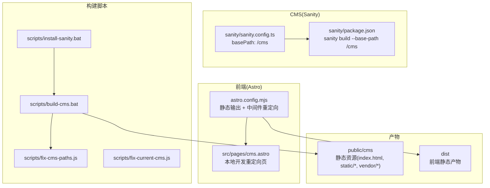
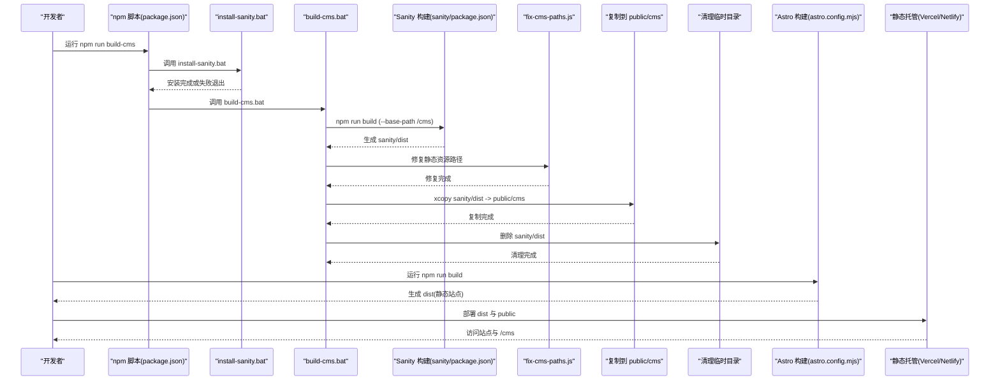
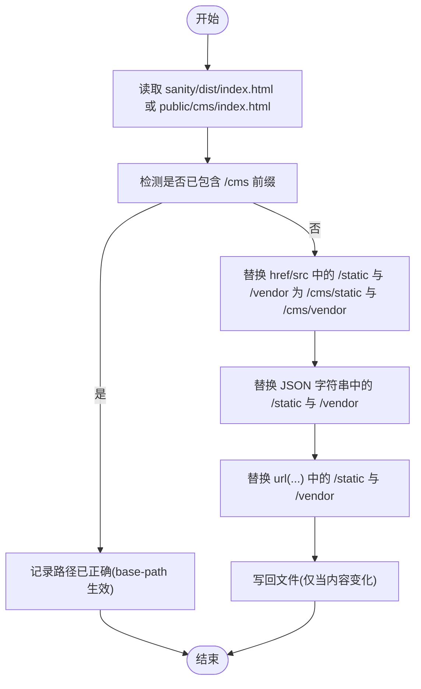
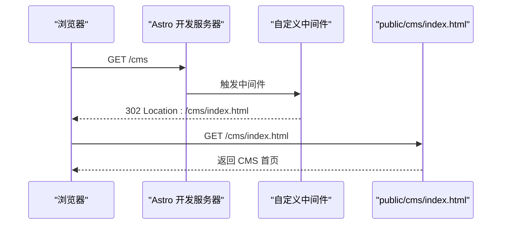
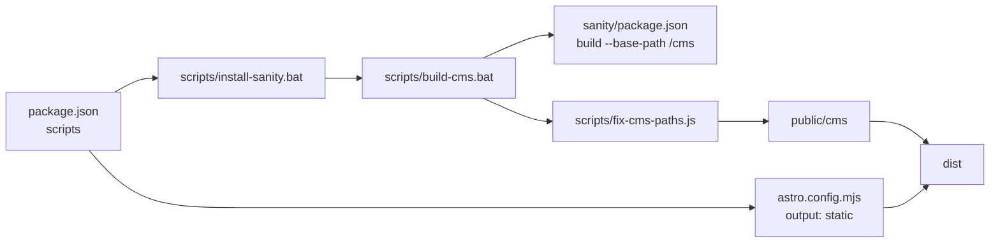

# 构建与部署

<cite>
**本文引用的文件**
- [scripts/install-sanity.bat](file://scripts/install-sanity.bat)
- [scripts/build-cms.bat](file://scripts/build-cms.bat)
- [scripts/fix-cms-paths.js](file://scripts/fix-cms-paths.js)
- [scripts/fix-current-cms.js](file://scripts/fix-current-cms.js)
- [astro.config.mjs](file://astro.config.mjs)
- [package.json](file://package.json)
- [sanity/sanity.config.ts](file://sanity/sanity.config.ts)
- [sanity/package.json](file://sanity/package.json)
- [src/pages/cms.astro](file://src/pages/cms.astro)
- [README.md](file://README.md)
</cite>

## 目录
1. [简介](#简介)
2. [项目结构](#项目结构)
3. [核心组件](#核心组件)
4. [架构总览](#架构总览)
5. [详细组件分析](#详细组件分析)
6. [依赖关系分析](#依赖关系分析)
7. [性能考虑](#性能考虑)
8. [故障排查指南](#故障排查指南)
9. [结论](#结论)
10. [附录](#附录)

## 简介
本指南面向需要完整掌握该网站“构建与部署”流程的读者，重点覆盖：
- 如何使用 install-sanity.bat 与 build-cms.bat 自动化安装与构建 Sanity CMS 管理界面，并将其输出到 public/cms 目录；
- fix-cms-paths.js 与 fix-current-cms.js 在路径修正中的作用与差异；
- Astro 的构建命令如何生成静态文件并集成 CMS 资源；
- 开发环境启动、生产构建优化（如代码分割、资源压缩）、以及部署到静态主机（如 Vercel、Netlify）的步骤；
- 常见构建错误的排查方法与性能调优建议。

## 项目结构
该项目采用“前端静态站点 + 内嵌 CMS”的双层结构：
- 前端基于 Astro，输出静态站点；
- Sanity Studio 作为独立的静态应用，构建后复制到 public/cms 下，通过 /cms 路由访问；
- 本地开发时，Astro 通过自定义中间件将 /cms 重定向至 public/cms/index.html；
- 生产构建时，先构建前端，再构建并复制 CMS 到 public/cms，最终将 dist 与 public 整体部署到静态托管平台。

图表来源
- [astro.config.mjs](file://astro.config.mjs#L1-L35)
- [src/pages/cms.astro](file://src/pages/cms.astro#L1-L19)
- [sanity/sanity.config.ts](file://sanity/sanity.config.ts#L1-L31)
- [sanity/package.json](file://sanity/package.json#L1-L38)
- [scripts/install-sanity.bat](file://scripts/install-sanity.bat#L1-L14)
- [scripts/build-cms.bat](file://scripts/build-cms.bat#L1-L44)
- [scripts/fix-cms-paths.js](file://scripts/fix-cms-paths.js#L1-L96)
- [scripts/fix-current-cms.js](file://scripts/fix-current-cms.js#L1-L34)

章节来源
- [README.md](file://README.md#L1-L185)
- [astro.config.mjs](file://astro.config.mjs#L1-L35)
- [sanity/sanity.config.ts](file://sanity/sanity.config.ts#L1-L31)
- [sanity/package.json](file://sanity/package.json#L1-L38)
- [src/pages/cms.astro](file://src/pages/cms.astro#L1-L19)

## 核心组件
- 安装与构建脚本
  - install-sanity.bat：进入 sanity 子目录执行依赖安装，失败则退出。
  - build-cms.bat：顺序执行 Sanity 构建、路径修复、复制到 public/cms、清理临时目录。
- 路径修复工具
  - fix-cms-paths.js：递归扫描并修复 HTML/JS/CSS 中的静态资源路径，确保以 /cms 前缀开头。
  - fix-current-cms.js：针对已复制到 public/cms 的 index.html 执行更全面的路径替换。
- Astro 配置
  - 输出模式为静态；通过自定义中间件将 /cms 重定向到 /cms/index.html；允许 @sanity/client SSR 外部化。
- Sanity 配置
  - basePath 设为 /cms，使 Sanity 构建产物的资源路径自动带有 /cms 前缀。
  - sanity/package.json 中的 build 脚本显式传入 --base-path /cms。
- 本地重定向页
  - src/pages/cms.astro：在客户端跳转到 /cms/index.html，便于本地开发访问。

章节来源
- [scripts/install-sanity.bat](file://scripts/install-sanity.bat#L1-L14)
- [scripts/build-cms.bat](file://scripts/build-cms.bat#L1-L44)
- [scripts/fix-cms-paths.js](file://scripts/fix-cms-paths.js#L1-L96)
- [scripts/fix-current-cms.js](file://scripts/fix-current-cms.js#L1-L34)
- [astro.config.mjs](file://astro.config.mjs#L1-L35)
- [sanity/sanity.config.ts](file://sanity/sanity.config.ts#L1-L31)
- [sanity/package.json](file://sanity/package.json#L1-L38)
- [src/pages/cms.astro](file://src/pages/cms.astro#L1-L19)

## 架构总览
下图展示了“前端构建 + CMS 构建 + 资源集成 + 部署”的整体流程。

图表来源
- [package.json](file://package.json#L1-L28)
- [scripts/install-sanity.bat](file://scripts/install-sanity.bat#L1-L14)
- [scripts/build-cms.bat](file://scripts/build-cms.bat#L1-L44)
- [sanity/package.json](file://sanity/package.json#L1-L38)
- [scripts/fix-cms-paths.js](file://scripts/fix-cms-paths.js#L1-L96)
- [astro.config.mjs](file://astro.config.mjs#L1-L35)

## 详细组件分析

### 安装与构建脚本
- install-sanity.bat
  - 进入 sanity 子目录执行依赖安装；若失败则返回非零退出码，阻止后续流程继续。
  - 适合首次克隆仓库或依赖变更后重新安装。
- build-cms.bat
  - 步骤分解：
    1) 构建 Sanity Studio（sanity/package.json 中的 build 脚本传入 --base-path /cms）。
    2) 调用 fix-cms-paths.js 修复静态资源路径，确保 /static 与 /vendor 前缀统一为 /cms/static 与 /cms/vendor。
    3) 删除旧的 public/cms 目录，复制 sanity/dist 到 public/cms。
    4) 删除 sanity/dist 临时目录。
  - 最终提示访问 http://localhost:4321/cms 测试本地效果。

章节来源
- [scripts/install-sanity.bat](file://scripts/install-sanity.bat#L1-L14)
- [scripts/build-cms.bat](file://scripts/build-cms.bat#L1-L44)
- [sanity/package.json](file://sanity/package.json#L1-L38)

### 路径修复工具
- fix-cms-paths.js
  - 修复策略：
    - 首先检查 sanity/dist/index.html，若发现未被 base-path 修正的 /static 与 /vendor 引用，则替换为 /cms/static 与 /cms/vendor。
    - 递归遍历目录，对 HTML/JS/CSS 文件中的 url(...)、属性 href/src、JSON 字符串等进行替换。
    - 仅在内容发生变化时写回文件，避免不必要的 I/O。
  - 适用场景：Sanity 构建后仍存在边缘路径问题时的兜底修复。
- fix-current-cms.js
  - 针对 public/cms/index.html 的一次性修复脚本，替换 HTML 属性、JSON 字符串、单引号字符串中的静态资源路径。
  - 适合在复制完成后快速修正 index.html 的路径问题。

图表来源
- [scripts/fix-cms-paths.js](file://scripts/fix-cms-paths.js#L1-L96)
- [scripts/fix-current-cms.js](file://scripts/fix-current-cms.js#L1-L34)

章节来源
- [scripts/fix-cms-paths.js](file://scripts/fix-cms-paths.js#L1-L96)
- [scripts/fix-current-cms.js](file://scripts/fix-current-cms.js#L1-L34)

### Astro 构建与本地重定向
- 静态输出与中间件
  - 输出模式为静态，确保生成 dist 目录供静态托管使用。
  - 自定义中间件在开发时拦截 /cms 请求，若为 /cms 或 /cms/ 则重定向到 /cms/index.html，保证 SPA 风格路由在静态环境下可用。
  - 允许 @sanity/client 作为外部依赖，避免 SSR 打包问题。
- 本地重定向页
  - src/pages/cms.astro 通过客户端跳转到 /cms/index.html，便于本地开发时直接访问 CMS 页面。

图表来源
- [astro.config.mjs](file://astro.config.mjs#L1-L35)
- [src/pages/cms.astro](file://src/pages/cms.astro#L1-L19)

章节来源
- [astro.config.mjs](file://astro.config.mjs#L1-L35)
- [src/pages/cms.astro](file://src/pages/cms.astro#L1-L19)

### Sanity 配置与构建参数
- basePath: /cms
  - 在 sanity/sanity.config.ts 中设置 basePath，使 Sanity 构建产物的资源路径默认带有 /cms 前缀。
- 构建命令
  - sanity/package.json 中的 build 脚本显式传入 --base-path /cms，确保产物与前端路由一致。
- 产物位置
  - 构建输出位于 sanity/dist，随后被复制到 public/cms。

章节来源
- [sanity/sanity.config.ts](file://sanity/sanity.config.ts#L1-L31)
- [sanity/package.json](file://sanity/package.json#L1-L38)

## 依赖关系分析
- npm 脚本
  - package.json 提供 dev、build、sanity-* 等脚本；build-cms 脚本串联 install-sanity.bat 与 build-cms.bat。
- 构建链路
  - install-sanity.bat → build-cms.bat → sanity/package.json(build) → fix-cms-paths.js → public/cms → Astro build → dist
- 运行时依赖
  - @astrojs/vue、@astrojs/tailwind、astro、vue、@sanity/client 等。

图表来源
- [package.json](file://package.json#L1-L28)
- [scripts/install-sanity.bat](file://scripts/install-sanity.bat#L1-L14)
- [scripts/build-cms.bat](file://scripts/build-cms.bat#L1-L44)
- [scripts/fix-cms-paths.js](file://scripts/fix-cms-paths.js#L1-L96)
- [sanity/package.json](file://sanity/package.json#L1-L38)
- [astro.config.mjs](file://astro.config.mjs#L1-L35)

章节来源
- [package.json](file://package.json#L1-L28)
- [scripts/install-sanity.bat](file://scripts/install-sanity.bat#L1-L14)
- [scripts/build-cms.bat](file://scripts/build-cms.bat#L1-L44)
- [scripts/fix-cms-paths.js](file://scripts/fix-cms-paths.js#L1-L96)
- [sanity/package.json](file://sanity/package.json#L1-L38)
- [astro.config.mjs](file://astro.config.mjs#L1-L35)

## 性能考虑
- 代码分割与资源压缩
  - Astro 默认输出静态站点，结合 Tailwind CSS 的按需裁剪与 Vue 组件的懒加载策略，有助于减少初始包体积。
  - 建议在生产环境中启用浏览器缓存与 CDN 加速，以提升静态资源加载速度。
- 资源路径一致性
  - 通过 basePath 与路径修复脚本确保 /static 与 /vendor 资源前缀统一，避免重复请求与 404。
- 构建时间优化
  - 优先复用已安装的 sanity 依赖，避免重复安装；仅在依赖变更时运行 install-sanity.bat。
  - 仅在必要时运行路径修复脚本，减少 I/O 操作。

[本节为通用性能建议，不直接分析具体文件]

## 故障排查指南
- 安装阶段
  - 若 install-sanity.bat 返回错误，请检查 sanity 子目录权限与网络连接；确认 Node.js 版本满足要求。
- 构建阶段
  - 若 build-cms.bat 在 Sanity 构建环节失败，请查看 sanity/package.json 的 build 脚本与 sanity/sanity.config.ts 的 basePath 配置是否一致。
  - 若复制到 public/cms 失败，请检查磁盘空间与目标目录权限。
- 路径修复
  - 若修复后仍出现资源 404，请使用 fix-current-cms.js 对 public/cms/index.html 进行一次性修复。
  - 若存在 url(...) 路径未被替换，检查 fix-cms-paths.js 是否正确识别并替换。
- 本地访问
  - 若 /cms 无法访问，请确认 astro.config.mjs 的中间件是否生效；或使用 src/pages/cms.astro 的客户端重定向页进行验证。
- 生产部署
  - 确保 dist 与 public 目录同时部署；在静态托管平台配置 /cms/index.html 为 SPA 回退页面，避免 404。

章节来源
- [scripts/install-sanity.bat](file://scripts/install-sanity.bat#L1-L14)
- [scripts/build-cms.bat](file://scripts/build-cms.bat#L1-L44)
- [scripts/fix-cms-paths.js](file://scripts/fix-cms-paths.js#L1-L96)
- [scripts/fix-current-cms.js](file://scripts/fix-current-cms.js#L1-L34)
- [astro.config.mjs](file://astro.config.mjs#L1-L35)
- [sanity/sanity.config.ts](file://sanity/sanity.config.ts#L1-L31)
- [sanity/package.json](file://sanity/package.json#L1-L38)
- [src/pages/cms.astro](file://src/pages/cms.astro#L1-L19)

## 结论
该构建与部署体系通过脚本化流程将 Sanity CMS 与 Astro 前端无缝集成，借助 basePath 与路径修复工具确保资源路径一致，配合 Astro 的静态输出与中间件重定向实现本地与生产的稳定访问。遵循本文提供的步骤与排错建议，可高效完成开发、构建与部署全流程。

[本节为总结性内容，不直接分析具体文件]

## 附录

### 开发环境启动
- 启动前端开发服务器：npm run dev
- 启动 Sanity CMS：npm run sanity-dev
- 同时启动：在两个终端分别运行上述命令

章节来源
- [README.md](file://README.md#L66-L93)
- [package.json](file://package.json#L1-L28)

### 生产构建与部署
- 构建前端：npm run build
- 构建并集成 CMS：npm run build-cms
- 部署：将 dist 与 public 目录整体部署到静态托管平台（如 Vercel、Netlify）
- 访问：站点根路径为静态页面，CMS 位于 /cms

章节来源
- [README.md](file://README.md#L94-L170)
- [package.json](file://package.json#L1-L28)
- [scripts/build-cms.bat](file://scripts/build-cms.bat#L1-L44)

### 常用命令清单
- 安装 Sanity 依赖：npm run sanity-install
- 启动 Sanity 开发：npm run sanity-dev
- 构建 Sanity：npm run sanity-build
- 构建并集成 CMS：npm run build-cms

章节来源
- [package.json](file://package.json#L1-L28)
- [sanity/package.json](file://sanity/package.json#L1-L38)