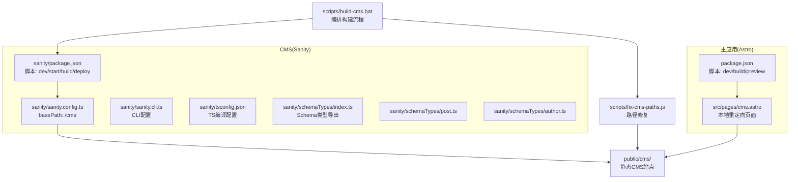
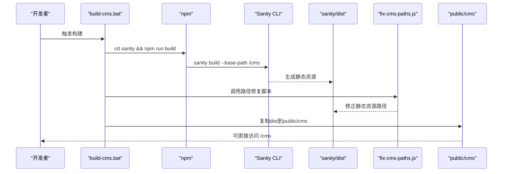
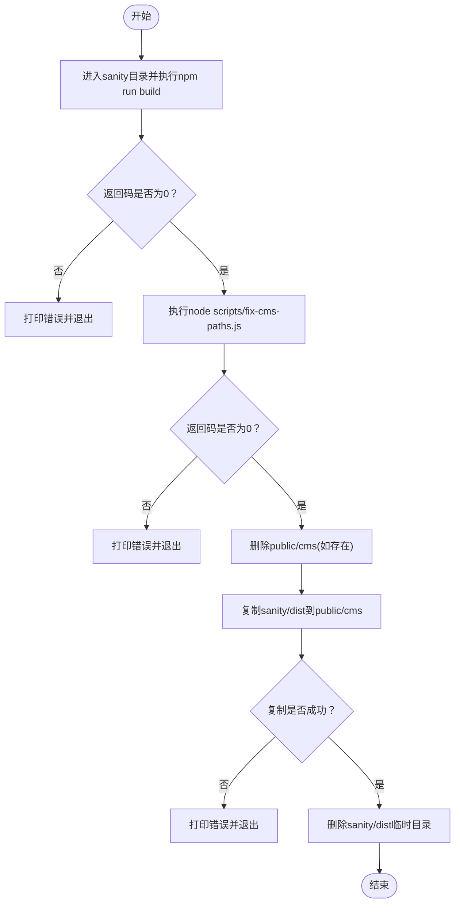
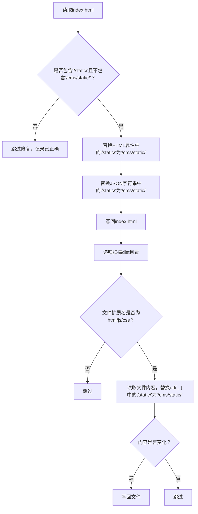
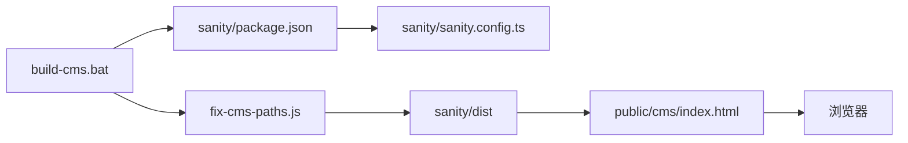

# CMS构建

<cite>
**本文引用的文件**
- [scripts/build-cms.bat](file://scripts/build-cms.bat)
- [scripts/install-sanity.bat](file://scripts/install-sanity.bat)
- [scripts/fix-cms-paths.js](file://scripts/fix-cms-paths.js)
- [sanity/package.json](file://sanity/package.json)
- [sanity/sanity.config.ts](file://sanity/sanity.config.ts)
- [sanity/sanity.cli.ts](file://sanity/sanity.cli.ts)
- [sanity/tsconfig.json](file://sanity/tsconfig.json)
- [sanity/schemaTypes/index.ts](file://sanity/schemaTypes/index.ts)
- [sanity/schemaTypes/post.ts](file://sanity/schemaTypes/post.ts)
- [sanity/schemaTypes/author.ts](file://sanity/schemaTypes/author.ts)
- [src/pages/cms.astro](file://src/pages/cms.astro)
- [package.json](file://package.json)
- [public/cms/index.html](file://public/cms/index.html)
</cite>

## 目录
1. [简介](#简介)
2. [项目结构](#项目结构)
3. [核心组件](#核心组件)
4. [架构总览](#架构总览)
5. [详细组件分析](#详细组件分析)
6. [依赖关系分析](#依赖关系分析)
7. [性能考量](#性能考量)
8. [故障排查指南](#故障排查指南)
9. [结论](#结论)

## 简介
本文件围绕网站工程中的CMS构建流程展开，重点解析build-cms.bat脚本如何驱动Sanity Studio的静态构建与部署，并说明以下关键点：
- build-cms.bat中“cd sanity && npm run build”如何触发Sanity项目的构建流程
- sanity/package.json中的build脚本配置与CLI参数的作用
- 构建产物生成在sanity/dist目录的机制及其作为后续步骤的输入
- 路径修复与资源优化策略
- 错误处理机制（errorlevel检查）如何保障构建流程的健壮性

## 项目结构
该仓库采用“主应用 + Sanity子项目”的双层结构：
- 主应用（Astro）负责网站前端构建与运行
- Sanity子项目负责内容管理系统的静态构建与发布
- scripts目录提供构建与安装脚本，统一编排构建流程
- public/cms目录承载最终可直接由Web服务器提供的静态CMS站点

图表来源
- [package.json](file://package.json#L1-L28)
- [src/pages/cms.astro](file://src/pages/cms.astro#L1-L19)
- [sanity/package.json](file://sanity/package.json#L1-L38)
- [sanity/sanity.config.ts](file://sanity/sanity.config.ts#L1-L31)
- [sanity/sanity.cli.ts](file://sanity/sanity.cli.ts#L1-L20)
- [sanity/tsconfig.json](file://sanity/tsconfig.json#L1-L18)
- [sanity/schemaTypes/index.ts](file://sanity/schemaTypes/index.ts#L1-L10)
- [sanity/schemaTypes/post.ts](file://sanity/schemaTypes/post.ts#L1-L84)
- [sanity/schemaTypes/author.ts](file://sanity/schemaTypes/author.ts#L1-L33)
- [scripts/build-cms.bat](file://scripts/build-cms.bat#L1-L44)
- [scripts/fix-cms-paths.js](file://scripts/fix-cms-paths.js#L1-L96)
- [public/cms/index.html](file://public/cms/index.html#L1-L272)

章节来源
- [package.json](file://package.json#L1-L28)
- [src/pages/cms.astro](file://src/pages/cms.astro#L1-L19)
- [sanity/package.json](file://sanity/package.json#L1-L38)
- [sanity/sanity.config.ts](file://sanity/sanity.config.ts#L1-L31)
- [sanity/sanity.cli.ts](file://sanity/sanity.cli.ts#L1-L20)
- [sanity/tsconfig.json](file://sanity/tsconfig.json#L1-L18)
- [sanity/schemaTypes/index.ts](file://sanity/schemaTypes/index.ts#L1-L10)
- [sanity/schemaTypes/post.ts](file://sanity/schemaTypes/post.ts#L1-L84)
- [sanity/schemaTypes/author.ts](file://sanity/schemaTypes/author.ts#L1-L33)
- [scripts/build-cms.bat](file://scripts/build-cms.bat#L1-L44)
- [scripts/fix-cms-paths.js](file://scripts/fix-cms-paths.js#L1-L96)
- [public/cms/index.html](file://public/cms/index.html#L1-L272)

## 核心组件
- 构建编排脚本：scripts/build-cms.bat
  - 步骤1：进入sanity目录并执行npm run build
  - 步骤2：调用node scripts/fix-cms-paths.js修复静态资源路径
  - 步骤3：复制sanity/dist到public/cms
  - 步骤4：清理临时文件sanity/dist
  - 错误处理：每一步均通过%errorlevel%判断并失败即退出
- Sanity构建配置：sanity/package.json
  - build脚本使用sanity build，并传入--base-path /cms
- 基础路径配置：sanity/sanity.config.ts
  - 设置basePath为/cms，确保构建产物的资源路径与部署路径一致
- 路径修复脚本：scripts/fix-cms-paths.js
  - 读取sanity/dist/index.html，修正HTML属性与JSON字符串中的静态路径
  - 递归扫描dist目录，修复HTML/JS/CSS中的url(...)引用
- Schema定义：sanity/schemaTypes/*
  - 定义文档类型与字段，影响构建产物的模块与资源组织
- 本地重定向页面：src/pages/cms.astro
  - 将本地访问路由重定向至/public/cms/index.html

章节来源
- [scripts/build-cms.bat](file://scripts/build-cms.bat#L1-L44)
- [sanity/package.json](file://sanity/package.json#L1-L38)
- [sanity/sanity.config.ts](file://sanity/sanity.config.ts#L1-L31)
- [scripts/fix-cms-paths.js](file://scripts/fix-cms-paths.js#L1-L96)
- [sanity/schemaTypes/index.ts](file://sanity/schemaTypes/index.ts#L1-L10)
- [sanity/schemaTypes/post.ts](file://sanity/schemaTypes/post.ts#L1-L84)
- [sanity/schemaTypes/author.ts](file://sanity/schemaTypes/author.ts#L1-L33)
- [src/pages/cms.astro](file://src/pages/cms.astro#L1-L19)

## 架构总览
下图展示了从脚本入口到最终静态CMS站点的端到端流程，包括Sanity构建、路径修复与复制部署的关键节点。

图表来源
- [scripts/build-cms.bat](file://scripts/build-cms.bat#L1-L44)
- [sanity/package.json](file://sanity/package.json#L1-L38)
- [sanity/sanity.config.ts](file://sanity/sanity.config.ts#L1-L31)
- [scripts/fix-cms-paths.js](file://scripts/fix-cms-paths.js#L1-L96)
- [public/cms/index.html](file://public/cms/index.html#L1-L272)

## 详细组件分析

### 构建编排脚本：build-cms.bat
- 流程控制
  - 步骤1：进入sanity目录并执行npm run build；若返回码非0则立即失败并退出
  - 步骤2：执行node scripts/fix-cms-paths.js；若返回码非0则失败并退出
  - 步骤3：删除public/cms目录（如存在），然后复制sanity/dist到public/cms；若复制失败则退出
  - 步骤4：删除sanity/dist临时目录
- 错误处理
  - 每一步都通过%errorlevel%进行严格校验，确保任一环节失败都能及时终止，避免产生半成品产物
- 产出与消费
  - sanity/dist作为构建产物目录，供路径修复与复制部署使用
  - public/cms作为最终可直接由Web服务器提供服务的静态站点

图表来源
- [scripts/build-cms.bat](file://scripts/build-cms.bat#L1-L44)

章节来源
- [scripts/build-cms.bat](file://scripts/build-cms.bat#L1-L44)

### Sanity构建脚本：sanity/package.json
- 关键点
  - build脚本使用sanity build，并传入--base-path /cms，确保构建产物的资源路径与部署路径一致
  - 该参数与sanity/sanity.config.ts中的basePath配置共同作用，保证静态资源的相对路径正确
- 影响范围
  - 影响生成的HTML与import map中的资源路径前缀
  - 影响public/cms/index.html中<link>/<script>等资源引用的正确性

章节来源
- [sanity/package.json](file://sanity/package.json#L1-L38)
- [sanity/sanity.config.ts](file://sanity/sanity.config.ts#L1-L31)

### 基础路径配置：sanity/sanity.config.ts
- 关键点
  - 设置basePath为/cms，使构建时生成的静态资源路径与部署路径保持一致
  - 该配置与CLI参数--base-path共同生效，确保最终产物在/public/cms下可正常加载
- 与构建的关系
  - basePath直接影响构建产物的资源前缀，避免运行时路径错误导致的资源404

章节来源
- [sanity/sanity.config.ts](file://sanity/sanity.config.ts#L1-L31)

### 路径修复脚本：scripts/fix-cms-paths.js
- 功能概述
  - 读取sanity/dist/index.html，检测并修复HTML属性与JSON字符串中的静态资源路径
  - 递归遍历dist目录，修复HTML/JS/CSS中的url(...)引用
- 实现要点
  - 仅在检测到“/static/”但未包含“/cms/static/”时才进行修复
  - 对HTML属性(href/src)、JSON字符串以及CSS url(...)进行统一替换
  - 仅在内容发生变化时写回文件，减少不必要的IO
- 适用场景
  - 当Sanity构建未完全覆盖所有路径或存在边缘情况时，提供兜底修复能力

图表来源
- [scripts/fix-cms-paths.js](file://scripts/fix-cms-paths.js#L1-L96)

章节来源
- [scripts/fix-cms-paths.js](file://scripts/fix-cms-paths.js#L1-L96)

### Schema与构建产物的关系
- sanity/schemaTypes/index.ts导出所有文档类型，作为Sanity构建时的类型注册入口
- sanity/schemaTypes/post.ts与sanity/schemaTypes/author.ts定义了博客与作者等文档类型，影响构建时生成的模块与资源组织
- 这些定义参与Sanity Studio的构建与打包，间接影响最终静态资源的体积与加载行为

章节来源
- [sanity/schemaTypes/index.ts](file://sanity/schemaTypes/index.ts#L1-L10)
- [sanity/schemaTypes/post.ts](file://sanity/schemaTypes/post.ts#L1-L84)
- [sanity/schemaTypes/author.ts](file://sanity/schemaTypes/author.ts#L1-L33)

### 本地重定向与最终访问
- src/pages/cms.astro通过客户端脚本将访问重定向到/public/cms/index.html
- public/cms/index.html由Sanity构建生成，包含import map与动态加载逻辑，指向/cms/vendor与/cms/static下的资源

章节来源
- [src/pages/cms.astro](file://src/pages/cms.astro#L1-L19)
- [public/cms/index.html](file://public/cms/index.html#L1-L272)

## 依赖关系分析
- 构建链路依赖
  - scripts/build-cms.bat依赖sanity/package.json中的build脚本与CLI参数
  - sanity/package.json依赖sanity/sanity.config.ts的basePath配置
  - scripts/fix-cms-paths.js依赖sanity/dist目录的存在与结构
  - public/cms/index.html依赖sanity/build生成的import map与静态资源
- 外部依赖
  - Sanity v5与React生态，构建时通过CLI与TS配置进行打包与优化
  - Web服务器需正确提供/public/cms下的静态资源

图表来源
- [scripts/build-cms.bat](file://scripts/build-cms.bat#L1-L44)
- [sanity/package.json](file://sanity/package.json#L1-L38)
- [sanity/sanity.config.ts](file://sanity/sanity.config.ts#L1-L31)
- [scripts/fix-cms-paths.js](file://scripts/fix-cms-paths.js#L1-L96)
- [public/cms/index.html](file://public/cms/index.html#L1-L272)

章节来源
- [scripts/build-cms.bat](file://scripts/build-cms.bat#L1-L44)
- [sanity/package.json](file://sanity/package.json#L1-L38)
- [sanity/sanity.config.ts](file://sanity/sanity.config.ts#L1-L31)
- [scripts/fix-cms-paths.js](file://scripts/fix-cms-paths.js#L1-L96)
- [public/cms/index.html](file://public/cms/index.html#L1-L272)

## 性能考量
- 资源路径优化
  - 通过--base-path与basePath统一前缀，减少运行时路径计算与重定向开销
  - 路径修复脚本仅在必要时修改文件，降低IO成本
- 构建产物体积
  - Sanity构建会根据schema与插件生成必要的模块；合理拆分schema类型有助于控制bundle大小
- 缓存与CDN
  - public/cms/index.html中包含import map与cdn资源引用，建议配合CDN缓存策略提升加载速度

## 故障排查指南
- 构建失败
  - 检查sanity/package.json中的build脚本是否正确传入--base-path /cms
  - 确认sanity/sanity.config.ts的basePath配置与部署路径一致
- 资源404
  - 若出现静态资源路径错误，运行scripts/fix-cms-paths.js进行修复
  - 检查public/cms/index.html中的<link>/<script>与CSS url(...)是否包含/cms前缀
- 复制失败
  - 确认sanity/dist是否存在且可读
  - 检查public/cms目录权限与占用情况
- 本地访问异常
  - 确认src/pages/cms.astro的重定向逻辑是否生效
  - 访问http://localhost:4321/cms确认静态站点可用

章节来源
- [scripts/build-cms.bat](file://scripts/build-cms.bat#L1-L44)
- [scripts/fix-cms-paths.js](file://scripts/fix-cms-paths.js#L1-L96)
- [sanity/package.json](file://sanity/package.json#L1-L38)
- [sanity/sanity.config.ts](file://sanity/sanity.config.ts#L1-L31)
- [src/pages/cms.astro](file://src/pages/cms.astro#L1-L19)
- [public/cms/index.html](file://public/cms/index.html#L1-L272)

## 结论
本构建流程通过脚本编排、Sanity CLI参数与配置、路径修复与复制部署四个关键环节，实现了从Sanity Studio到静态CMS站点的完整交付。其中：
- --base-path与basePath确保资源路径与部署路径一致
- 路径修复脚本提供兜底保障，应对边缘情况
- 错误处理机制通过%errorlevel%实现强健的失败快速反馈
- 最终产物public/cms可直接由Web服务器提供服务，便于部署与访问