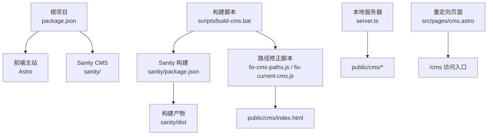
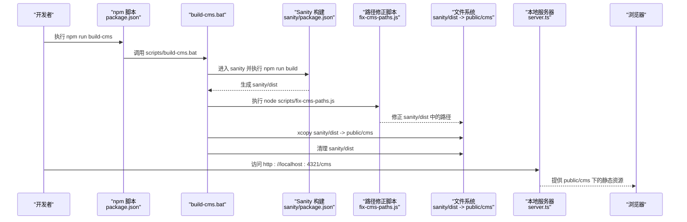
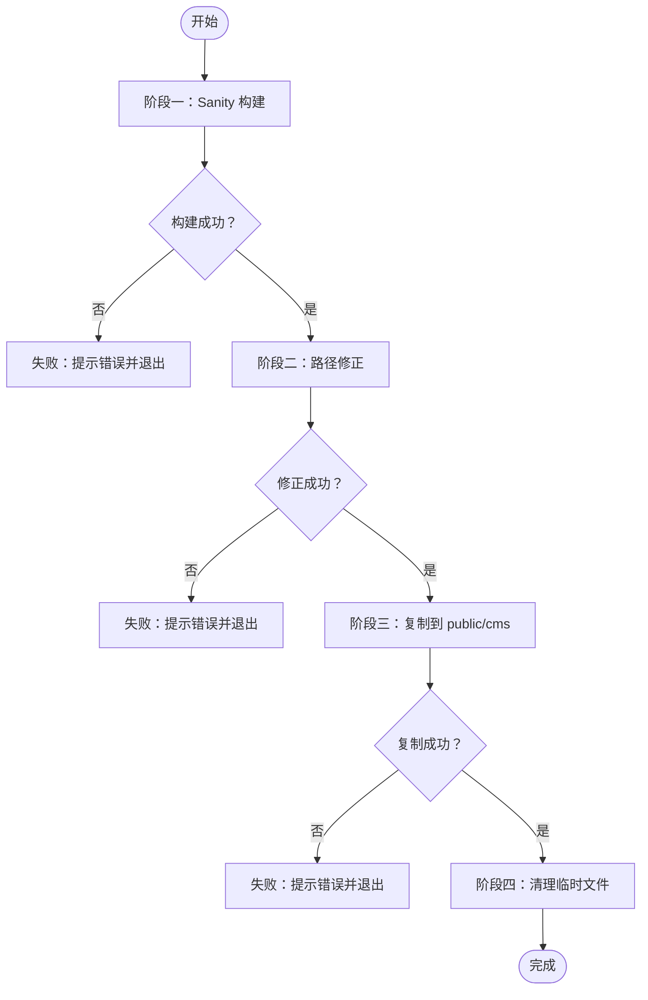
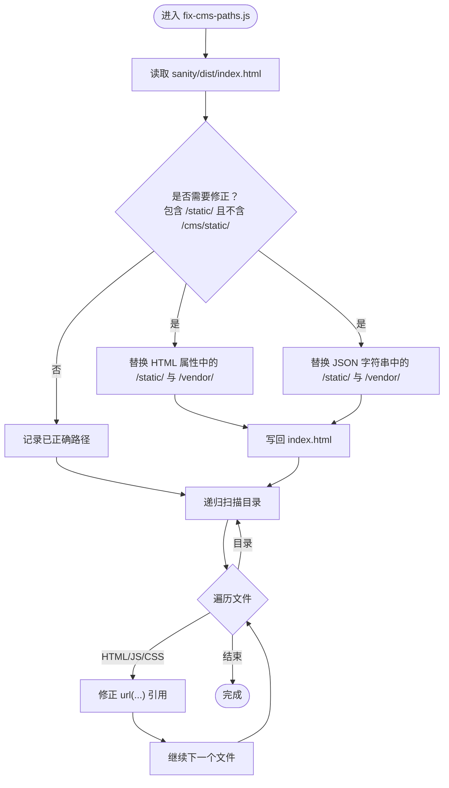
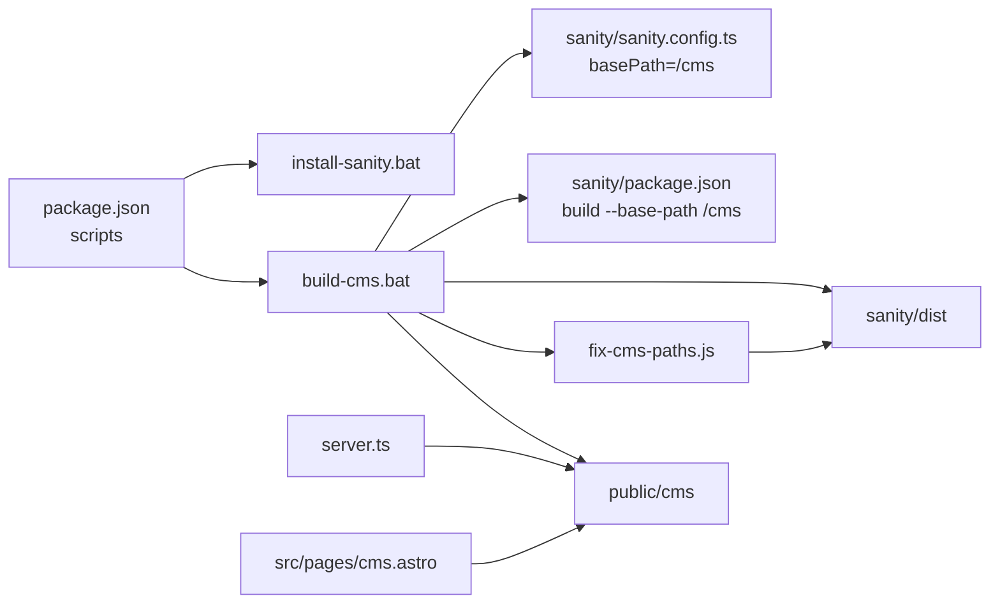

# 构建流程

<cite>
**本文引用的文件**
- [scripts/build-cms.bat](file://scripts/build-cms.bat)
- [scripts/fix-cms-paths.js](file://scripts/fix-cms-paths.js)
- [scripts/fix-current-cms.js](file://scripts/fix-current-cms.js)
- [scripts/install-sanity.bat](file://scripts/install-sanity.bat)
- [sanity/sanity.config.ts](file://sanity/sanity.config.ts)
- [sanity/package.json](file://sanity/package.json)
- [package.json](file://package.json)
- [public/cms/index.html](file://public/cms/index.html)
- [src/pages/cms.astro](file://src/pages/cms.astro)
- [server.ts](file://server.ts)
</cite>

## 目录
1. [简介](#简介)
2. [项目结构](#项目结构)
3. [核心组件](#核心组件)
4. [架构总览](#架构总览)
5. [详细组件分析](#详细组件分析)
6. [依赖关系分析](#依赖关系分析)
7. [性能与优化建议](#性能与优化建议)
8. [故障排查指南](#故障排查指南)
9. [结论](#结论)

## 简介
本文件系统性解析网站项目中“构建 CMS”的完整流程，重点围绕批处理脚本 build-cms.bat 的四个阶段展开：Sanity Studio 构建、静态资源路径修正（通过 fix-cms-paths.js 与 fix-current-cms.js）、文件复制到 public/cms 目录以及临时文件清理。文档同时解释 basePath 配置对路径修正的关键作用，确保 CMS 界面在子路径 /cms 下正常加载；并给出构建优化策略、错误处理机制与脚本执行顺序的依赖关系说明。

## 项目结构
该仓库采用“前端主站 + Sanity CMS 子项目”的组织方式：
- 前端主站位于根目录，使用 Astro 框架进行构建与预览。
- CMS 代码位于 sanity 子目录，独立管理依赖与构建配置。
- 构建产物输出至 sanity/dist，再由脚本复制到 public/cms，供本地服务器直接提供静态资源。
- 本地开发服务器通过 server.ts 将 /cms 路径映射到 public 目录，实现子路径访问。

图表来源
- [package.json](file://package.json#L1-L28)
- [sanity/package.json](file://sanity/package.json#L1-L38)
- [scripts/build-cms.bat](file://scripts/build-cms.bat#L1-L44)
- [scripts/fix-cms-paths.js](file://scripts/fix-cms-paths.js#L1-L96)
- [scripts/fix-current-cms.js](file://scripts/fix-current-cms.js#L1-L34)
- [public/cms/index.html](file://public/cms/index.html#L1-L272)
- [server.ts](file://server.ts#L1-L19)
- [src/pages/cms.astro](file://src/pages/cms.astro#L1-L19)

章节来源
- [package.json](file://package.json#L1-L28)
- [sanity/package.json](file://sanity/package.json#L1-L38)
- [scripts/build-cms.bat](file://scripts/build-cms.bat#L1-L44)
- [server.ts](file://server.ts#L1-L19)

## 核心组件
- 构建批处理脚本：负责按序执行 Sanity 构建、路径修正、复制与清理。
- 路径修正脚本：
  - fix-cms-paths.js：面向 sanity/dist 的批量路径修正，覆盖 HTML、CSS 中的 url(...) 引用，并对 index.html 中的属性与 JSON 字符串进行替换。
  - fix-current-cms.js：面向已部署到 public/cms 的 index.html 的快速修正，便于无需重新构建即可修复路径问题。
- Sanity 配置：通过 basePath: "/cms" 使 Sanity 构建默认产出带 /cms 前缀的资源路径，减少后续修正工作量。
- 本地服务器：将 /cms 请求转发到 public 目录，保证子路径访问可用。

章节来源
- [scripts/build-cms.bat](file://scripts/build-cms.bat#L1-L44)
- [scripts/fix-cms-paths.js](file://scripts/fix-cms-paths.js#L1-L96)
- [scripts/fix-current-cms.js](file://scripts/fix-current-cms.js#L1-L34)
- [sanity/sanity.config.ts](file://sanity/sanity.config.ts#L1-L31)
- [sanity/package.json](file://sanity/package.json#L1-L38)
- [public/cms/index.html](file://public/cms/index.html#L1-L272)
- [server.ts](file://server.ts#L1-L19)

## 架构总览
下图展示从触发构建到浏览器访问 CMS 的整体流程，包括各阶段的输入输出与依赖关系。

图表来源
- [package.json](file://package.json#L1-L28)
- [scripts/build-cms.bat](file://scripts/build-cms.bat#L1-L44)
- [sanity/package.json](file://sanity/package.json#L1-L38)
- [scripts/fix-cms-paths.js](file://scripts/fix-cms-paths.js#L1-L96)
- [server.ts](file://server.ts#L1-L19)

## 详细组件分析

### 构建批处理脚本：build-cms.bat 的四个阶段
- 阶段一：Sanity Studio 构建
  - 进入 sanity 子目录，执行 npm run build。
  - 若返回码非零，立即退出并提示错误。
- 阶段二：静态资源路径修正
  - 调用 node scripts/fix-cms-paths.js 修正 sanity/dist 中的路径。
  - 若返回码非零，立即退出并提示错误。
- 阶段三：复制到 public/cms
  - 删除已存在的 public/cms 目录（若存在）。
  - 复制 sanity/dist 全部内容到 public/cms。
  - 若复制失败，立即退出并提示错误。
- 阶段四：清理临时文件
  - 删除 sanity/dist 目录，释放磁盘空间。

图表来源
- [scripts/build-cms.bat](file://scripts/build-cms.bat#L1-L44)

章节来源
- [scripts/build-cms.bat](file://scripts/build-cms.bat#L1-L44)

### 路径修正脚本：fix-cms-paths.js 的工作机制
- 目标：确保 sanity/dist 产出的静态资源路径在子路径 /cms 下可正确加载。
- 关键点：
  - 首先检查 index.html 是否包含未修正的 /static/ 或 /vendor/ 引用，若检测到则进行替换。
  - 递归遍历目录，对 HTML、JS、CSS 文件中的 url(...) 引用进行统一修正。
  - 仅在内容发生变化时写回文件，避免不必要的 I/O。
  - 错误处理：捕获异常并退出进程，保证构建链路的健壮性。

图表来源
- [scripts/fix-cms-paths.js](file://scripts/fix-cms-paths.js#L1-L96)

章节来源
- [scripts/fix-cms-paths.js](file://scripts/fix-cms-paths.js#L1-L96)

### 路径修正脚本：fix-current-cms.js 的快速修复能力
- 目标：在已有 public/cms 构建产物的情况下，快速修正 index.html 中的静态资源路径。
- 适用场景：无需重新构建 Sanity，直接修复已部署的 index.html。
- 行为：对 HTML 属性、JSON 字符串与单引号字符串中的 /static/ 与 /vendor/ 进行替换。

章节来源
- [scripts/fix-current-cms.js](file://scripts/fix-current-cms.js#L1-L34)
- [public/cms/index.html](file://public/cms/index.html#L1-L272)

### Sanity 配置与 basePath 的关键作用
- basePath: "/cms"：在构建时强制生成以 /cms 为前缀的资源路径，降低后续路径修正的工作量。
- sanity/package.json 中的 build 脚本使用 --base-path /cms，确保构建产物天然适配子路径部署。
- sanity/sanity.config.ts 显式声明 basePath，保证构建行为一致。

章节来源
- [sanity/sanity.config.ts](file://sanity/sanity.config.ts#L1-L31)
- [sanity/package.json](file://sanity/package.json#L1-L38)

### 本地服务器与访问入口
- server.ts：当请求路径以 /cms 开头时，将请求转发到 public 目录，从而提供 public/cms 下的静态资源。
- src/pages/cms.astro：在本地开发时提供一个轻量的重定向页面，将用户引导到 /cms/index.html，便于访问 Sanity Studio。

章节来源
- [server.ts](file://server.ts#L1-L19)
- [src/pages/cms.astro](file://src/pages/cms.astro#L1-L19)

## 依赖关系分析
- 构建链路依赖
  - npm run build-cms 依赖 scripts/install-sanity.bat 与 scripts/build-cms.bat。
  - build-cms.bat 依赖 sanity/package.json 的 build 脚本与 sanity/sanity.config.ts 的 basePath 配置。
  - 路径修正依赖 sanity/dist 的存在与完整性。
- 资源路径依赖
  - index.html 中的静态资源路径必须与 basePath 保持一致，否则会出现 404。
  - vendor 与 static 目录的相对位置需与 basePath 匹配，否则 CSS 中的 url(...) 也会失效。

图表来源
- [package.json](file://package.json#L1-L28)
- [scripts/install-sanity.bat](file://scripts/install-sanity.bat#L1-L14)
- [scripts/build-cms.bat](file://scripts/build-cms.bat#L1-L44)
- [sanity/sanity.config.ts](file://sanity/sanity.config.ts#L1-L31)
- [sanity/package.json](file://sanity/package.json#L1-L38)
- [server.ts](file://server.ts#L1-L19)
- [src/pages/cms.astro](file://src/pages/cms.astro#L1-L19)

章节来源
- [package.json](file://package.json#L1-L28)
- [scripts/install-sanity.bat](file://scripts/install-sanity.bat#L1-L14)
- [scripts/build-cms.bat](file://scripts/build-cms.bat#L1-L44)
- [sanity/sanity.config.ts](file://sanity/sanity.config.ts#L1-L31)
- [sanity/package.json](file://sanity/package.json#L1-L38)
- [server.ts](file://server.ts#L1-L19)
- [src/pages/cms.astro](file://src/pages/cms.astro#L1-L19)

## 性能与优化建议
- 减少不必要的 I/O：fix-cms-paths.js 已在修改后才写回文件，避免重复写入。
- 选择性修正：优先修正 index.html，再对其他文件进行递归修正，缩短处理时间。
- 缓存与增量：在 CI 场景中，可考虑缓存 sanity 依赖与构建产物，减少重复安装与构建时间。
- 资源压缩：在生产构建中启用压缩与缓存策略，提升静态资源加载速度。
- 路径一致性：确保 basePath 与实际部署路径完全一致，避免二次修正带来的额外开销。

[本节为通用建议，不直接分析具体文件]

## 故障排查指南
- 构建失败
  - 症状：阶段一构建返回非零状态码。
  - 排查：检查 sanity 依赖安装是否成功，确认 sanity/package.json 的 build 脚本可用。
  - 参考
    - [scripts/install-sanity.bat](file://scripts/install-sanity.bat#L1-L14)
    - [sanity/package.json](file://sanity/package.json#L1-L38)
- 路径修正失败
  - 症状：阶段二修正返回非零状态码或 index.html 仍包含未修正路径。
  - 排查：确认 sanity/dist 是否存在；检查 fix-cms-paths.js 的日志与异常处理。
  - 参考
    - [scripts/fix-cms-paths.js](file://scripts/fix-cms-paths.js#L1-L96)
    - [public/cms/index.html](file://public/cms/index.html#L1-L272)
- 复制失败
  - 症状：阶段三复制 public/cms 失败。
  - 排查：检查目标目录权限、磁盘空间与 sanity/dist 内容完整性。
  - 参考
    - [scripts/build-cms.bat](file://scripts/build-cms.bat#L1-L44)
- 访问 404
  - 症状：浏览器访问 /cms 报错。
  - 排查：确认 server.ts 是否正确将 /cms 路径映射到 public；确认 public/cms 下是否存在 index.html。
  - 参考
    - [server.ts](file://server.ts#L1-L19)
    - [public/cms/index.html](file://public/cms/index.html#L1-L272)
- 快速修复
  - 当已有 public/cms 构建产物但路径不正确时，可使用 fix-current-cms.js 进行快速修正。
  - 参考
    - [scripts/fix-current-cms.js](file://scripts/fix-current-cms.js#L1-L34)

章节来源
- [scripts/install-sanity.bat](file://scripts/install-sanity.bat#L1-L14)
- [scripts/fix-cms-paths.js](file://scripts/fix-cms-paths.js#L1-L96)
- [scripts/build-cms.bat](file://scripts/build-cms.bat#L1-L44)
- [server.ts](file://server.ts#L1-L19)
- [public/cms/index.html](file://public/cms/index.html#L1-L272)
- [scripts/fix-current-cms.js](file://scripts/fix-current-cms.js#L1-L34)

## 结论
本项目的 CMS 构建流程通过“Sanity 构建 + 路径修正 + 复制 + 清理”的标准化步骤，结合 basePath 配置与本地服务器的子路径映射，确保 CMS 在子路径 /cms 下稳定运行。路径修正脚本针对 index.html 与 CSS 中的 url(...) 引用进行精准替换，配合快速修复脚本，既满足一次性构建场景，也支持现有产物的即时修复。遵循本文档的优化建议与排障指引，可进一步提升构建效率与稳定性。