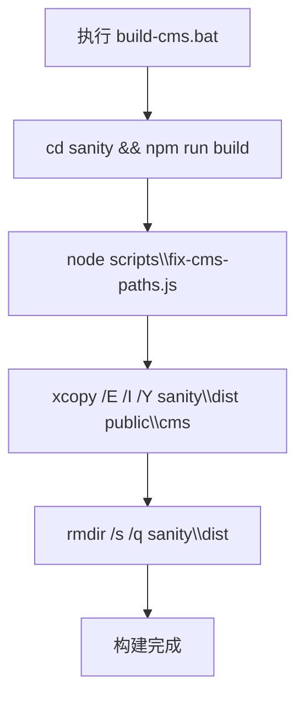
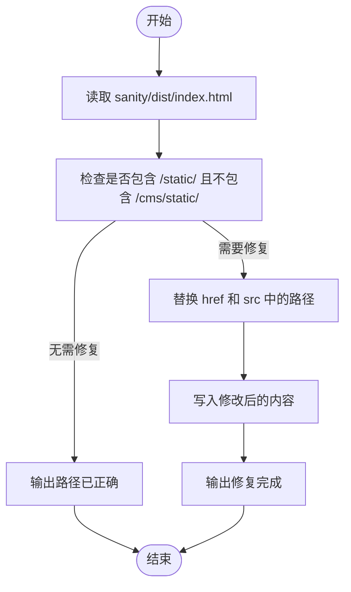
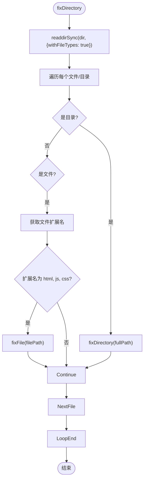
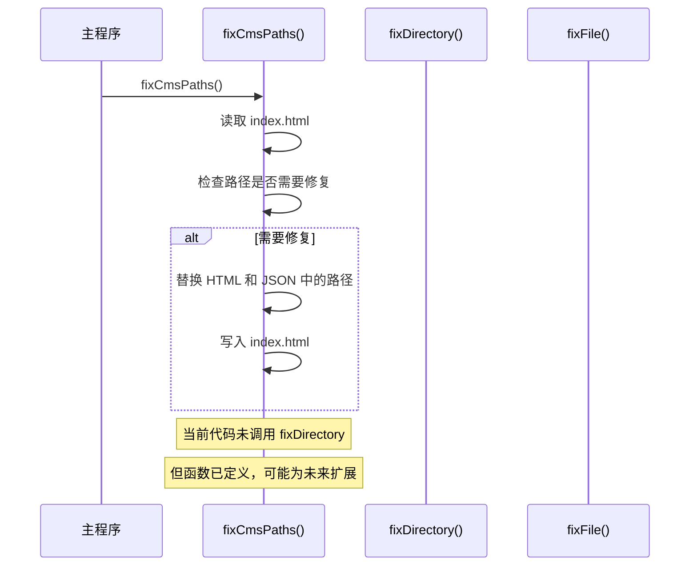

# fix-cms-paths.js 脚本详解

<cite>
**本文档引用文件**  
- [fix-cms-paths.js](file://scripts/fix-cms-paths.js)
- [build-cms.bat](file://scripts/build-cms.bat)
- [sanity.config.ts](file://sanity/sanity.config.ts)
- [package.json](file://sanity/package.json)
- [index.html](file://public/cms/index.html)
</cite>

## 目录
1. [引言](#引言)
2. [项目结构与构建流程](#项目结构与构建流程)
3. [核心功能分析](#核心功能分析)
4. [主函数 fixCmsPaths 详解](#主函数-fixcmsspaths-详解)
5. [辅助函数 fixDirectory 与 fixFile](#辅助函数-fixdirectory-与-fixfile)
6. [正则表达式匹配逻辑解析](#正则表达式匹配逻辑解析)
7. [调用关系与执行流程](#调用关系与执行流程)
8. [错误处理与调试方法](#错误处理与调试方法)
9. [边缘情况处理目的](#边缘情况处理目的)
10. [结论](#结论)

## 引言
`fix-cms-paths.js` 是一个用于修复 Sanity CMS 构建输出中静态资源路径的 Node.js 脚本。尽管 Sanity 在构建时已通过 `--base-path /cms` 参数正确生成大部分路径，但该脚本仍作为兜底机制，确保所有 HTML、JS 和 CSS 文件中的资源引用都正确指向 `/cms` 前缀路径。本文将深入分析其内部实现机制。

## 项目结构与构建流程
该项目采用多模块架构，Sanity CMS 构建输出位于 `sanity/dist` 目录，并最终部署至 `public/cms`。构建过程由 `build-cms.bat` 批处理脚本驱动，依次执行 Sanity 构建、路径修复、文件复制和清理操作。



**Diagram sources**
- [build-cms.bat](file://scripts/build-cms.bat#L7-L43)

**Section sources**
- [build-cms.bat](file://scripts/build-cms.bat#L1-L43)

## 核心功能分析
脚本的核心功能是递归遍历 `sanity/dist` 目录下的所有 HTML、JS 和 CSS 文件，查找并替换其中对 `/static/` 和 `/vendor/` 路径的引用，将其修正为 `/cms/static/` 和 `/cms/vendor/`。此操作确保了当 CMS 部署在子路径 `/cms` 下时，所有静态资源均可被正确加载。

## 主函数 fixCmsPaths 详解
`fixCmsPaths` 函数是脚本的入口点，主要负责检查并修复 `index.html` 文件中的路径引用。



**Diagram sources**
- [fix-cms-paths.js](file://scripts/fix-cms-paths.js#L15-L47)

**Section sources**
- [fix-cms-paths.js](file://scripts/fix-cms-paths.js#L15-L47)

## 辅助函数 fixDirectory 与 fixFile
`fixDirectory` 函数实现递归目录遍历，对每个子目录调用自身，对每个 HTML、JS 或 CSS 文件调用 `fixFile` 函数。`fixFile` 函数则负责读取文件内容，使用正则表达式替换 `url()` 函数内的路径引用，并在内容发生变化时写回文件。



```mermaid
flowchart TD
FileStart([fixFile]) --> ReadFile["readFileSync(filePath, 'utf-8')"]
ReadFile --> StoreOrig["保存原始内容"]
StoreOrig --> ReplaceURL["替换 url(\"/static/\", url('/static/', url(/static/"]
ReplaceURL --> ReplaceVendor["替换 url(\"/vendor/\", url('/vendor/', url(/vendor/"]
ReplaceVendor --> ContentChanged{"内容有变化?"}
ContentChanged --> |是| WriteBack["writeFileSync(filePath, content, 'utf-8')"]
ContentChanged --> |否| Skip
WriteBack --> End([结束])
Skip --> End
```

**Diagram sources**
- [fix-cms-paths.js](file://scripts/fix-cms-paths.js#L53-L92)

**Section sources**
- [fix-cms-paths.js](file://scripts/fix-cms-paths.js#L53-L92)

## 正则表达式匹配逻辑解析
脚本使用了多组正则表达式来精确匹配不同上下文中的路径引用：

| 正则表达式 | 匹配目标 | 替换结果 | 说明 |
|----------|--------|--------|------|
| `/href="\/static\//g` | HTML 中 href 属性引用 `/static/` | `href="/cms/static/` | 修复 HTML 资源链接 |
| `/src="\/static\//g` | HTML 中 src 属性引用 `/static/` | `src="/cms/static/` | 修复 HTML 脚本/图片引用 |
| `/url\("\/static\//g` | CSS 中 url(") 函数引用 `/static/` | `url("/cms/static/` | 双引号字符串内的路径 |
| `/url\('\/static\//g` | CSS 中 url(') 函数引用 `/static/` | `url('/cms/static/` | 单引号字符串内的路径 |
| `/url\(\/static\//g` | CSS 中 url() 函数引用 `/static/` | `url(/cms/static/` | 无引号路径 |
| `/\"\/static\//g` | JSON 字符串中引用 `/static/` | `"/cms/static/` | 修复 import map 等 JSON 数据 |

**Section sources**
- [fix-cms-paths.js](file://scripts/fix-cms-paths.js#L28-L35)
- [fix-cms-paths.js](file://scripts/fix-cms-paths.js#L79-L84)

## 调用关系与执行流程
脚本的执行流程始于 `fixCmsPaths()` 的调用。该函数首先检查 `index.html` 是否需要修复，若需要则进行替换。随后，虽然当前代码中未显式调用 `fixDirectory`，但从函数定义来看，其设计意图是在 `fixCmsPaths` 中调用 `fixDirectory(distDir)` 以递归处理整个输出目录。



**Diagram sources**
- [fix-cms-paths.js](file://scripts/fix-cms-paths.js#L15-L95)

**Section sources**
- [fix-cms-paths.js](file://scripts/fix-cms-paths.js#L15-L95)

## 错误处理与调试方法
脚本在 `try-catch` 块中执行主要逻辑，捕获文件读写异常。若发生错误，将输出错误信息并调用 `process.exit(1)` 终止进程。`fixFile` 函数中的 `try-catch` 则选择性忽略无法读取的文件，保证整体流程不因单个文件失败而中断。

常见错误类型包括：
- **文件权限错误**：运行脚本的用户无权读写 `sanity/dist` 目录
- **路径不存在**：`sanity/dist` 目录或 `index.html` 文件未生成
- **编码错误**：文件非 UTF-8 编码导致读取异常

调试方法：
1. 确认 `sanity/dist` 目录存在且包含构建输出
2. 检查运行脚本的用户权限
3. 在 `console.log` 输出中观察是否出现 "Found unpatched paths" 提示
4. 使用 `node --inspect scripts/fix-cms-paths.js` 进行断点调试

**Section sources**
- [fix-cms-paths.js](file://scripts/fix-cms-paths.js#L44-L47)
- [fix-cms-paths.js](file://scripts/fix-cms-paths.js#L90-L92)

## 边缘情况处理目的
尽管 Sanity 构建时已通过 `--base-path /cms` 参数（在 `sanity/package.json` 的 build 脚本中定义）和 `sanity.config.ts` 中的 `basePath: '/cms'` 配置正确生成路径，但 `fix-cms-paths.js` 仍作为安全网存在。其主要目的是处理可能因构建工具版本差异、缓存问题或配置未完全生效而导致的路径未正确替换的边缘情况，确保部署的 CMS 能够稳定运行。

**Section sources**
- [fix-cms-paths.js](file://scripts/fix-cms-paths.js#L11-L13)
- [sanity.config.ts](file://sanity/sanity.config.ts#L15)
- [package.json](file://sanity/package.json#L10)

## 结论
`fix-cms-paths.js` 脚本是一个关键的构建后处理工具，通过精确的正则匹配和文件操作，确保 Sanity CMS 的静态资源路径在子路径部署环境下正确无误。其设计简洁而有效，结合了直接的字符串替换与稳健的错误处理机制，为项目的可靠部署提供了保障。