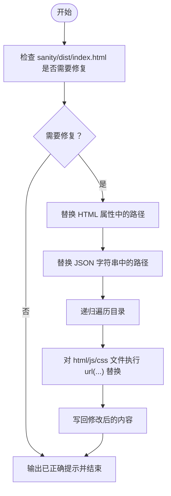

# fix-current-cms.js 脚本详解

<cite>
**本文引用的文件**
- [scripts/fix-current-cms.js](file://scripts/fix-current-cms.js)
- [scripts/fix-cms-paths.js](file://scripts/fix-cms-paths.js)
- [public/cms/index.html](file://public/cms/index.html)
- [scripts/README.md](file://scripts/README.md)
- [README.md](file://README.md)
- [sanity/sanity.config.ts](file://sanity/sanity.config.ts)
- [scripts/build-cms.bat](file://scripts/build-cms.bat)
- [src/pages/cms.astro](file://src/pages/cms.astro)
- [server.ts](file://server.ts)
</cite>

## 目录
1. [简介](#简介)
2. [项目结构](#项目结构)
3. [核心组件](#核心组件)
4. [架构总览](#架构总览)
5. [详细组件分析](#详细组件分析)
6. [依赖关系分析](#依赖关系分析)
7. [性能考量](#性能考量)
8. [故障排查指南](#故障排查指南)
9. [结论](#结论)
10. [附录](#附录)

## 简介
本文件围绕 fix-current-cms.js 脚本展开，系统性解析其功能、执行流程与正则替换策略，并与 fix-cms-paths.js 进行作用范围对比。重点说明该脚本如何针对已部署的 CMS 入口文件 public/cms/index.html 进行路径修正，覆盖双引号、单引号与 JSON 字符串三类引用形式，确保静态资源路径在不同引用上下文中均被正确修复。同时给出开发环境下的使用模式与浏览器缓存刷新建议，帮助快速定位与解决路径问题。

## 项目结构
本项目采用 Astro 前端 + Sanity CMS 的组合，CMS 构建产物最终部署到 public/cms 目录，供静态服务器按 /cms 路由提供服务。脚本位于 scripts 目录，README 对其用途与使用方式进行了说明；Sanity 配置设置了 basePath 为 /cms，以保证构建时生成的资源路径具备正确的基线。


图表来源
- [sanity/sanity.config.ts](file://sanity/sanity.config.ts#L13-L15)
- [scripts/fix-cms-paths.js](file://scripts/fix-cms-paths.js#L15-L47)
- [scripts/build-cms.bat](file://scripts/build-cms.bat#L1-L43)
- [server.ts](file://server.ts#L1-L19)
- [src/pages/cms.astro](file://src/pages/cms.astro#L1-L19)

章节来源
- [README.md](file://README.md#L164-L169)
- [scripts/README.md](file://scripts/README.md#L19-L28)

## 核心组件
- fix-current-cms.js：面向已部署的 public/cms/index.html 执行路径修正，覆盖 HTML 属性、JSON 字符串与单引号字符串三类引用。
- fix-cms-paths.js：面向 sanity/dist 中的构建产物，先检查是否需要修复，再对 index.html 进行路径修正，并可递归修复目录中的 HTML/JS/CSS 文件。
- public/cms/index.html：CMS 入口文件，包含静态资源链接、import map 等路径引用。
- sanity/sanity.config.ts：设置 basePath 为 /cms，影响构建时的资源路径生成。
- scripts/build-cms.bat：完整构建流程，包含修复与复制步骤。
- server.ts：本地开发服务器对 /cms 路由的分发逻辑。
- src/pages/cms.astro：本地开发时的重定向页面，便于访问 CMS。

章节来源
- [scripts/fix-current-cms.js](file://scripts/fix-current-cms.js#L1-L33)
- [scripts/fix-cms-paths.js](file://scripts/fix-cms-paths.js#L15-L47)
- [public/cms/index.html](file://public/cms/index.html#L1-L272)
- [sanity/sanity.config.ts](file://sanity/sanity.config.ts#L13-L15)
- [scripts/build-cms.bat](file://scripts/build-cms.bat#L1-L43)
- [server.ts](file://server.ts#L1-L19)
- [src/pages/cms.astro](file://src/pages/cms.astro#L1-L19)

## 架构总览
下图展示了脚本在构建与部署链路中的位置，以及与入口文件的关系。


图表来源
- [scripts/build-cms.bat](file://scripts/build-cms.bat#L1-L43)
- [scripts/fix-cms-paths.js](file://scripts/fix-cms-paths.js#L15-L47)
- [public/cms/index.html](file://public/cms/index.html#L1-L272)

## 详细组件分析

### fix-current-cms.js：已部署入口文件的路径修正
- 作用范围：仅处理 public/cms/index.html，不涉及其他文件或目录。
- 输入输出：
  - 输入：public/cms/index.html（已部署的入口文件）
  - 输出：修改后的同名文件，写回原路径
- 正则替换策略：
  - HTML 属性中的路径（双引号）：将 href=".../static/..." 与 src=".../static/..."、href=".../vendor/..." 与 src=".../vendor/..." 替换为以 /cms 开头的新路径。
  - JSON 字符串中的路径（双引号）：针对 import map 等 JSON 内容中的 "/static/" 与 "/vendor/" 进行替换。
  - 单引号字符串中的路径（单引号）：针对单引号包裹的 "/static/" 与 "/vendor/" 进行替换。
- 错误处理：捕获异常并输出错误日志，避免中断流程。
- 执行提示：成功后输出提示，建议刷新浏览器以验证修复效果。


图表来源
- [scripts/fix-current-cms.js](file://scripts/fix-current-cms.js#L10-L33)

章节来源
- [scripts/fix-current-cms.js](file://scripts/fix-current-cms.js#L10-L33)

### fix-cms-paths.js：构建产物的全面路径修复
- 作用范围：面向 sanity/dist 目录，先检查 index.html 是否需要修复，再递归修复 HTML/JS/CSS 文件中的 url(...) 引用。
- 输入输出：
  - 输入：sanity/dist 下的 index.html 与其他文件
  - 输出：按需修改对应文件
- 修复逻辑：
  - 检查是否存在未修复的路径（如包含 /static/ 但不包含 /cms/static/），若需要则进行替换。
  - 递归遍历目录，仅对 html/js/css 文件执行修复。
  - 对 url(...) 形式的 CSS 资源引用进行替换，覆盖双引号、单引号与无引号三种写法。
- 错误处理：捕获异常并退出进程，确保构建失败时及时反馈。



图表来源
- [scripts/fix-cms-paths.js](file://scripts/fix-cms-paths.js#L15-L47)
- [scripts/fix-cms-paths.js](file://scripts/fix-cms-paths.js#L53-L95)

章节来源
- [scripts/fix-cms-paths.js](file://scripts/fix-cms-paths.js#L15-L47)
- [scripts/fix-cms-paths.js](file://scripts/fix-cms-paths.js#L53-L95)

### public/cms/index.html：入口文件中的路径引用
- 静态资源链接：包含 favicon、manifest、字体等，路径以 /cms/static/ 开头。
- import map：通过内联 JSON 字符串提供模块映射，其中包含 /cms/vendor/ 路径。
- 入口脚本：加载 /cms/static/ 下的主包。
- 该文件是 fix-current-cms.js 与 fix-cms-paths.js 的共同目标，二者均需确保这些路径在不同引用上下文中保持一致。

章节来源
- [public/cms/index.html](file://public/cms/index.html#L1-L272)

### Sanity 配置与 basePath
- sanity/sanity.config.ts 设置 basePath 为 /cms，使构建时生成的资源路径默认以 /cms 为前缀，减少路径问题发生的概率。
- 该配置与脚本配合，确保构建产物在部署后能正确解析静态资源。

章节来源
- [sanity/sanity.config.ts](file://sanity/sanity.config.ts#L13-L15)

### 构建与部署流程
- scripts/build-cms.bat 负责：
  - 构建 Sanity Studio
  - 执行 fix-cms-paths.js 修复构建产物
  - 复制 sanity/dist 到 public/cms
  - 清理临时文件
- 该流程确保部署前完成路径修正，降低运行期路径错误的风险。

章节来源
- [scripts/build-cms.bat](file://scripts/build-cms.bat#L1-L43)

### 本地开发与路由分发
- server.ts 将 /cms 路径请求转发至 public 目录，使本地开发时能直接访问 public/cms 下的资源。
- src/pages/cms.astro 提供本地重定向，便于在本地快速打开 CMS 页面。

章节来源
- [server.ts](file://server.ts#L1-L19)
- [src/pages/cms.astro](file://src/pages/cms.astro#L1-L19)

## 依赖关系分析
- fix-current-cms.js 依赖 Node 内置模块 fs 与 path，读取并写回 public/cms/index.html。
- fix-cms-paths.js 同样依赖 fs 与 path，但还包含目录遍历与文件类型过滤逻辑。
- 两者均与 public/cms/index.html 存在直接的“目标文件”关系，但作用范围不同。
- sanity/sanity.config.ts 的 basePath 配置直接影响构建产物的路径生成，从而影响脚本的修复必要性。

```mermaid
graph LR
FS["fs 模块"] --> FixCurrent["fix-current-cms.js"]
PATH["path 模块"] --> FixCurrent
FS --> FixDist["fix-cms-paths.js"]
PATH --> FixDist
Config["sanity/sanity.config.ts<br/>basePath=/cms"] --> FixDist
Index["public/cms/index.html"] <- --> FixCurrent
Index <- --> FixDist
```

图表来源
- [scripts/fix-current-cms.js](file://scripts/fix-current-cms.js#L1-L9)
- [scripts/fix-cms-paths.js](file://scripts/fix-cms-paths.js#L1-L9)
- [sanity/sanity.config.ts](file://sanity/sanity.config.ts#L13-L15)
- [public/cms/index.html](file://public/cms/index.html#L1-L272)

章节来源
- [scripts/fix-current-cms.js](file://scripts/fix-current-cms.js#L1-L9)
- [scripts/fix-cms-paths.js](file://scripts/fix-cms-paths.js#L1-L9)
- [sanity/sanity.config.ts](file://sanity/sanity.config.ts#L13-L15)
- [public/cms/index.html](file://public/cms/index.html#L1-L272)

## 性能考量
- 文件读写：两个脚本均只读取与写回目标文件，I/O 成本较低，适合在本地开发环境中频繁执行。
- 正则替换：替换规则简单明确，匹配次数有限，对性能影响可忽略。
- 递归修复：fix-cms-paths.js 的目录遍历仅限于 html/js/css 文件，且仅在需要时才写回，避免不必要的磁盘写入。

## 故障排查指南
- 执行失败：
  - 检查 public/cms/index.html 是否存在且可读写。
  - 查看控制台输出的错误信息，确认路径是否正确。
- 修复无效：
  - 确认浏览器已刷新缓存（见下一节）。
  - 检查是否存在其他引用未被覆盖的路径（例如第三方 CDN 链接）。
- 与 basePath 配置冲突：
  - 若 basePath 已正确设置为 /cms，理论上无需额外修复；若仍出现路径问题，可使用 fix-current-cms.js 进行针对性修正。

章节来源
- [scripts/fix-current-cms.js](file://scripts/fix-current-cms.js#L31-L33)
- [scripts/fix-cms-paths.js](file://scripts/fix-cms-paths.js#L43-L47)

## 结论
- 作用范围差异：
  - fix-current-cms.js：仅处理 public/cms/index.html，适合在已部署的入口文件上进行快速修复。
  - fix-cms-paths.js：面向 sanity/dist 的构建产物，支持对 index.html 的条件修复与对目录中 HTML/JS/CSS 的递归修复。
- 正则覆盖必要性：
  - 为确保在不同引用上下文（HTML 属性、JSON 字符串、单引号字符串）中均能正确替换，脚本分别针对双引号、单引号与 JSON 字符串进行处理。
- 使用建议：
  - 开发环境下，若仅需修复已部署的入口文件，可直接执行 node scripts/fix-current-cms.js。
  - 若需要修复构建产物中的更多文件或存在边缘情况，应使用 scripts/build-cms.bat 或单独运行 scripts/fix-cms-paths.js。
  - 执行后务必刷新浏览器缓存，以避免旧版本资源导致的路径问题。

## 附录

### 使用模式与最佳实践
- 首次构建与部署：使用 npm run build-cms（或 scripts/build-cms.bat），自动完成修复与复制。
- 快速修复（无需重建）：在已部署的 public/cms 目录存在的情况下，执行 node scripts/fix-current-cms.js。
- 浏览器缓存刷新建议：
  - 强制刷新：Ctrl+F5 或 Cmd+Shift+R。
  - 清理浏览器缓存：清除静态资源缓存后再访问 /cms。
  - 使用隐身/无痕模式：排除缓存干扰，验证修复效果。

章节来源
- [scripts/README.md](file://scripts/README.md#L43-L48)
- [README.md](file://README.md#L164-L169)