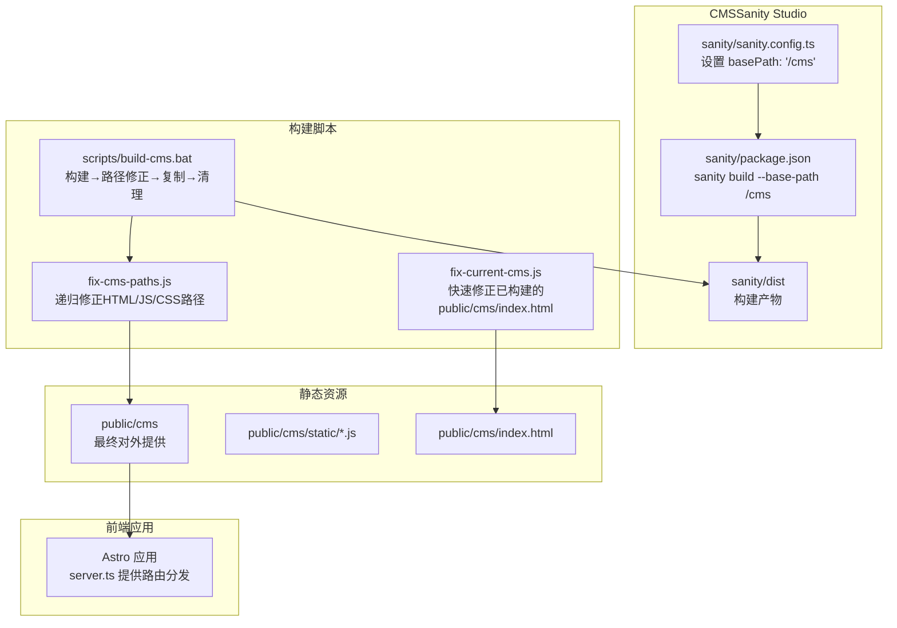
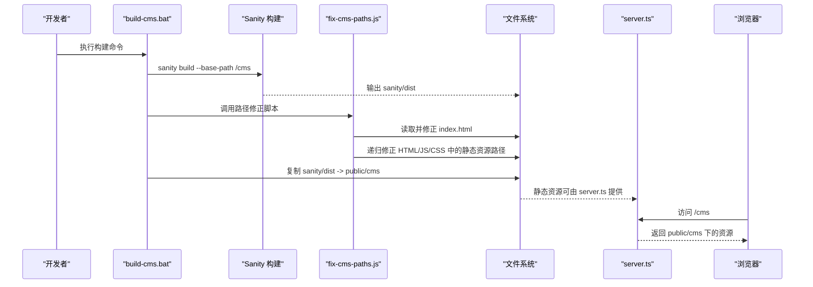
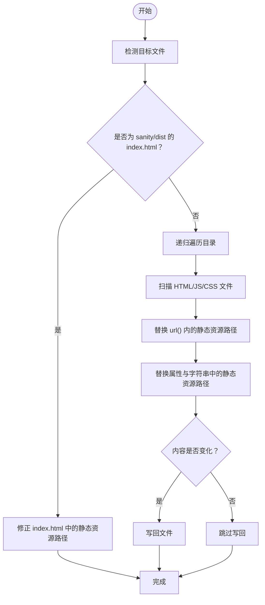
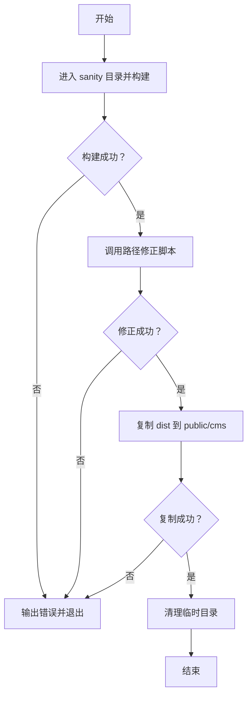
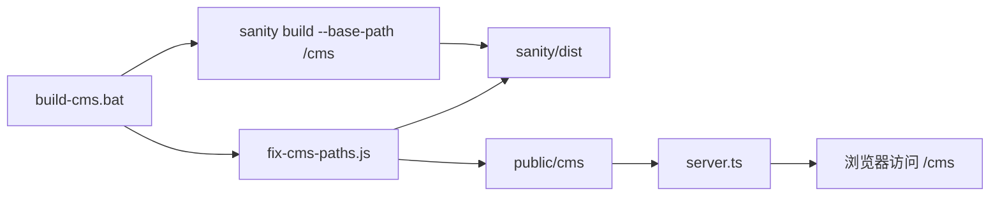

# 路径处理

<cite>
**本文引用的文件**
- [scripts/build-cms.bat](file://scripts/build-cms.bat)
- [scripts/fix-cms-paths.js](file://scripts/fix-cms-paths.js)
- [scripts/fix-current-cms.js](file://scripts/fix-current-cms.js)
- [scripts/README.md](file://scripts/README.md)
- [sanity/sanity.config.ts](file://sanity/sanity.config.ts)
- [sanity/package.json](file://sanity/package.json)
- [public/cms/index.html](file://public/cms/index.html)
- [public/cms/static/sanity-BsKuDWaA.js](file://public/cms/static/sanity-BsKuDWaA.js)
- [public/cms/static/sanity-Bvxx0R8f.js](file://public/cms/static/sanity-Bvxx0R8f.js)
- [server.ts](file://server.ts)
- [package.json](file://package.json)
</cite>

## 目录
1. [简介](#简介)
2. [项目结构](#项目结构)
3. [核心组件](#核心组件)
4. [架构总览](#架构总览)
5. [详细组件分析](#详细组件分析)
6. [依赖关系分析](#依赖关系分析)
7. [性能考量](#性能考量)
8. [故障排查指南](#故障排查指南)
9. [结论](#结论)

## 简介
本文件聚焦于构建流程中的“路径修正机制”，系统性对比分析两个Node.js脚本：fix-cms-paths.js与fix-current-cms.js，解释它们如何通过字符串替换修复Sanity构建后静态资源的路径引用问题，确保CMS界面能在/cmc子路径下正确加载。同时，结合build-cms.bat的执行时机与顺序，说明脚本在整体构建流水线中的作用，并给出路径修正失败的错误处理与调试建议。

## 项目结构
该仓库采用前后端分离的组织方式：
- 前端应用位于根目录，使用Astro作为SSG框架，服务端通过自定义服务器进行路由分发。
- CMS（Sanity Studio）位于sanity/目录，构建产物输出到sanity/dist，再复制到public/cms供前端服务器托管。
- scripts/目录包含构建与路径修正脚本，用于自动化完成Sanity构建、路径修正、复制与清理。

图表来源
- [sanity/sanity.config.ts](file://sanity/sanity.config.ts#L13-L16)
- [sanity/package.json](file://sanity/package.json#L10-L10)
- [scripts/build-cms.bat](file://scripts/build-cms.bat#L7-L36)
- [scripts/fix-cms-paths.js](file://scripts/fix-cms-paths.js#L15-L96)
- [scripts/fix-current-cms.js](file://scripts/fix-current-cms.js#L1-L34)
- [public/cms/index.html](file://public/cms/index.html#L1-L272)
- [public/cms/static/sanity-BsKuDWaA.js](file://public/cms/static/sanity-BsKuDWaA.js#L1-L1)
- [public/cms/static/sanity-Bvxx0R8f.js](file://public/cms/static/sanity-Bvxx0R8f.js#L1-L1)
- [server.ts](file://server.ts#L1-L19)

章节来源
- [sanity/sanity.config.ts](file://sanity/sanity.config.ts#L13-L16)
- [sanity/package.json](file://sanity/package.json#L10-L10)
- [scripts/build-cms.bat](file://scripts/build-cms.bat#L7-L36)
- [scripts/README.md](file://scripts/README.md#L10-L28)

## 核心组件
- Sanity构建配置与基路径
  - 在sanity/sanity.config.ts中设置basePath为/cms，使Sanity构建时生成的资源引用自动带有/cmc前缀，从而避免相对路径导致的跨域或路径不一致问题。
  - sanity/package.json中通过sanity build --base-path /cms明确传递基路径参数，确保构建产物与运行时部署路径一致。

- 路径修正脚本
  - fix-cms-paths.js：在Sanity构建完成后，对sanity/dist中的index.html进行二次校验与修正；随后递归扫描HTML/JS/CSS文件，统一替换静态资源路径为/cmc前缀。该脚本还处理url()函数内的路径引用，覆盖双引号、单引号与无引号三种形式。
  - fix-current-cms.js：针对已部署至public/cms的现有构建，仅修正public/cms/index.html中的静态资源路径，适用于无需重新构建的快速修复场景。

- 构建流水线
  - build-cms.bat负责按序执行：Sanity构建、路径修正、复制到public/cms、清理临时目录。并在每一步检查返回码，失败时立即退出并提示错误。

章节来源
- [sanity/sanity.config.ts](file://sanity/sanity.config.ts#L13-L16)
- [sanity/package.json](file://sanity/package.json#L10-L10)
- [scripts/fix-cms-paths.js](file://scripts/fix-cms-paths.js#L15-L96)
- [scripts/fix-current-cms.js](file://scripts/fix-current-cms.js#L1-L34)
- [scripts/build-cms.bat](file://scripts/build-cms.bat#L7-L36)

## 架构总览
下图展示从Sanity构建到CMS上线的关键步骤及路径修正位置：

图表来源
- [sanity/package.json](file://sanity/package.json#L10-L10)
- [scripts/build-cms.bat](file://scripts/build-cms.bat#L7-L36)
- [scripts/fix-cms-paths.js](file://scripts/fix-cms-paths.js#L15-L96)
- [server.ts](file://server.ts#L1-L19)

## 详细组件分析

### 组件A：路径修正脚本对比分析（fix-cms-paths.js vs fix-current-cms.js）
- 共同目标
  - 将HTML/JS/CSS中的静态资源路径从“/static/”、“/vendor/”修正为“/cms/static/”、“/cms/vendor/”，确保在/cmc子路径下能正确加载。
- 差异点
  - 适用范围
    - fix-cms-paths.js：面向Sanity构建产物（sanity/dist），先对index.html进行一次性修正，再递归扫描HTML/JS/CSS文件，覆盖更广。
    - fix-current-cms.js：仅针对public/cms/index.html，适合已部署构建的快速修复。
  - 处理细节
    - fix-cms-paths.js：对url()函数内的路径进行多格式匹配（双引号、单引号、无引号），并仅在内容发生变化时写回，减少不必要的磁盘IO。
    - fix-current-cms.js：直接替换HTML属性与JSON字符串中的路径，覆盖双引号与单引号两种字符串格式。
  - 容错与日志
    - fix-cms-paths.js：包含错误捕获与进程退出逻辑，打印详细错误信息；对index.html的修正包含前置条件判断，避免重复修正。
    - fix-current-cms.js：捕获异常并输出错误信息，未显式处理文件不存在等边界情况。

图表来源
- [scripts/fix-cms-paths.js](file://scripts/fix-cms-paths.js#L15-L96)

章节来源
- [scripts/fix-cms-paths.js](file://scripts/fix-cms-paths.js#L15-L96)
- [scripts/fix-current-cms.js](file://scripts/fix-current-cms.js#L1-L34)

### 组件B：构建脚本执行流程（build-cms.bat）
- 步骤说明
  - 第一步：进入sanity目录执行sanity build，传入--base-path /cms，生成构建产物sanity/dist。
  - 第二步：调用node scripts/fix-cms-paths.js进行路径修正。
  - 第三步：将sanity/dist复制到public/cms，覆盖旧版本。
  - 第四步：删除sanity/dist临时目录，保持工作区整洁。
- 错误处理
  - 每一步均检查返回码，若非零则输出错误信息并终止，防止后续步骤污染。

图表来源
- [scripts/build-cms.bat](file://scripts/build-cms.bat#L7-L36)

章节来源
- [scripts/build-cms.bat](file://scripts/build-cms.bat#L7-L36)

### 组件C：Sanity构建配置与基路径
- basePath配置
  - sanity/sanity.config.ts中设置basePath为/cms，使构建时生成的资源引用自动包含/cmc前缀，降低路径修正的复杂度。
- 构建命令
  - sanity/package.json中通过sanity build --base-path /cms明确传递基路径，确保构建产物与运行时部署路径一致。

章节来源
- [sanity/sanity.config.ts](file://sanity/sanity.config.ts#L13-L16)
- [sanity/package.json](file://sanity/package.json#L10-L10)

### 组件D：运行时路由与资源提供（server.ts）
- 路由规则
  - 当请求路径以/cms开头时，server.ts从public目录提供静态资源；否则从dist目录提供主站资源。
- 作用
  - 保证CMS静态资源与主站资源隔离，避免路径冲突。

章节来源
- [server.ts](file://server.ts#L1-L19)

## 依赖关系分析
- 脚本与Sanity构建的关系
  - build-cms.bat在Sanity构建之后调用fix-cms-paths.js，确保路径修正基于最新构建产物。
- 脚本与目标文件的关系
  - fix-cms-paths.js依赖sanity/dist目录结构；fix-current-cms.js依赖public/cms/index.html。
- 路由与资源的关系
  - server.ts依赖public/cms目录结构，确保/cmc路径下的资源可被正确提供。

图表来源
- [scripts/build-cms.bat](file://scripts/build-cms.bat#L7-L36)
- [sanity/package.json](file://sanity/package.json#L10-L10)
- [scripts/fix-cms-paths.js](file://scripts/fix-cms-paths.js#L15-L96)
- [server.ts](file://server.ts#L1-L19)

章节来源
- [scripts/build-cms.bat](file://scripts/build-cms.bat#L7-L36)
- [sanity/package.json](file://sanity/package.json#L10-L10)
- [scripts/fix-cms-paths.js](file://scripts/fix-cms-paths.js#L15-L96)
- [server.ts](file://server.ts#L1-L19)

## 性能考量
- 递归扫描与写回策略
  - fix-cms-paths.js在递归扫描时仅处理HTML/JS/CSS文件，避免对无关文件进行I/O操作。
  - 仅在内容发生变化时写回，减少磁盘写入次数。
- 正则替换效率
  - 使用全局正则替换，避免多次循环；对url()函数的匹配覆盖多种引号形式，提高命中率。
- 构建流水线优化
  - build-cms.bat在关键步骤检查返回码，失败即停，避免无效的后续操作。

章节来源
- [scripts/fix-cms-paths.js](file://scripts/fix-cms-paths.js#L53-L96)
- [scripts/build-cms.bat](file://scripts/build-cms.bat#L7-L36)

## 故障排查指南
- 常见问题与定位
  - 资源404或跨域错误
    - 现象：浏览器控制台显示静态资源加载失败，路径指向/cmc前缀。
    - 排查：确认sanity/sanity.config.ts的basePath是否为/cms；确认sanity/package.json的构建命令是否包含--base-path /cms。
  - 路径修正未生效
    - 现象：public/cms/index.html中的静态资源路径仍为“/static/”或“/vendor/”。
    - 排查：检查build-cms.bat是否成功执行fix-cms-paths.js；查看脚本输出日志；确认sanity/dist是否存在且已复制到public/cms。
  - 已部署构建路径不正确
    - 现象：已有public/cms/index.html未被修正。
    - 解决：直接运行node scripts/fix-current-cms.js进行快速修正。
- 调试建议
  - 在本地开发环境中，先单独运行sanity build --base-path /cms，观察sanity/dist中的index.html是否已包含/cmc前缀。
  - 使用node scripts/fix-current-cms.js对public/cms/index.html进行修正后，刷新浏览器验证。
  - 若仍失败，检查server.ts的路由规则，确认/public/cms下的资源可被正确提供。

章节来源
- [sanity/sanity.config.ts](file://sanity/sanity.config.ts#L13-L16)
- [sanity/package.json](file://sanity/package.json#L10-L10)
- [scripts/build-cms.bat](file://scripts/build-cms.bat#L7-L36)
- [scripts/fix-current-cms.js](file://scripts/fix-current-cms.js#L1-L34)
- [server.ts](file://server.ts#L1-L19)

## 结论
- basePath配置与构建命令是实现/cmc路径加载的关键前提，sanity/sanity.config.ts与sanity/package.json共同确保构建产物的路径一致性。
- fix-cms-paths.js在构建后进行二次校验与递归修正，覆盖HTML/JS/CSS中的多种路径引用格式，适合完整构建流程；fix-current-cms.js则提供快速修复能力，适用于已部署构建的微调。
- build-cms.bat将Sanity构建、路径修正、复制与清理串联为一个可靠的流水线，配合错误处理与日志输出，显著提升构建稳定性与可维护性。