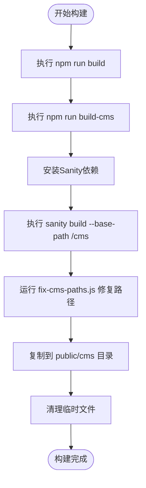

# 部署指南

<cite>
**本文档中引用的文件**  
- [astro.config.mjs](file://astro.config.mjs)
- [package.json](file://package.json)
- [README.md](file://README.md)
- [sanity.config.ts](file://sanity/sanity.config.ts)
- [build-cms.bat](file://scripts/build-cms.bat)
- [fix-cms-paths.js](file://scripts/fix-cms-paths.js)
- [install-sanity.bat](file://scripts/install-sanity.bat)
</cite>

## 目录
1. [简介](#简介)
2. [构建配置详解](#构建配置详解)
3. [静态文件生成流程](#静态文件生成流程)
4. [Vercel部署指南](#vercel部署指南)
5. [Netlify部署指南](#netlify部署指南)
6. [自定义域名与SSL配置](#自定义域名与ssl配置)
7. [CDN资源映射策略](#cdn资源映射策略)
8. [部署验证步骤](#部署验证步骤)
9. [回滚方案](#回滚方案)
10. [CI/CD最佳实践](#cicd最佳实践)

## 简介
本指南详细说明如何将基于Astro框架构建的个人网站项目部署到Vercel、Netlify等现代静态站点托管平台。项目采用Astro + Sanity CMS架构，前端使用Astro进行静态生成，CMS部分使用Sanity Studio构建并嵌入到`/cms`路径下。文档涵盖从构建配置、静态文件生成、平台部署到自定义域名设置的完整生产环境部署流程。

## 构建配置详解

项目在`astro.config.mjs`中配置了关键的部署相关设置。`output: 'static'`指定了静态站点生成模式，这是部署到Vercel、Netlify等平台的前提。`site: 'https://www.mengkai.ren'`设置了站点的正式URL，用于生成绝对路径的链接和SEO优化。Vite配置中的自定义中间件确保了`/cms`路径的正确重定向，这对于嵌入式CMS的正常访问至关重要。

**Section sources**
- [astro.config.mjs](file://astro.config.mjs#L1-L35)

## 静态文件生成流程

完整的构建流程分为两个主要步骤：前端构建和CMS构建。首先通过`npm run build`命令构建Astro前端应用，生成`dist`目录下的静态文件。然后通过`npm run build-cms`命令构建Sanity CMS。该命令是一个批处理脚本，会依次执行安装依赖、构建CMS、修复资源路径、复制到`public/cms`目录等操作。`fix-cms-paths.js`脚本确保了CMS的静态资源路径正确指向`/cms`子路径，避免了资源加载失败的问题。

**Diagram sources**
- [package.json](file://package.json#L14)
- [build-cms.bat](file://scripts/build-cms.bat#L1-L44)
- [fix-cms-paths.js](file://scripts/fix-cms-paths.js#L1-L96)
- [sanity.config.ts](file://sanity/sanity.config.ts#L15)

**Section sources**
- [package.json](file://package.json#L8-L14)
- [build-cms.bat](file://scripts/build-cms.bat#L1-L44)
- [fix-cms-paths.js](file://scripts/fix-cms-paths.js#L1-L96)

## Vercel部署指南

将项目部署到Vercel非常简单。首先在Vercel仪表板中创建一个新项目，并连接到GitHub仓库。Vercel会自动检测到这是一个Astro项目。在部署设置中，确保构建命令（Build Command）为`npm run build && npm run build-cms`，这将确保前端和CMS都被正确构建。输出目录（Output Directory）应设置为`dist`。由于`astro.config.mjs`中已配置`output: 'static'`，Vercel会自动以静态站点模式进行部署，无需额外配置。

**Section sources**
- [astro.config.mjs](file://astro.config.mjs#L11)
- [package.json](file://package.json#L8-L9)

## Netlify部署指南

部署到Netlify的流程与Vercel类似。在Netlify中新建站点并连接GitHub仓库。在构建设置中，指定构建命令为`npm run build && npm run build-cms`，发布目录为`dist`。Netlify会自动安装Node.js依赖并执行构建。Netlify的即用型CDN和全球边缘网络将确保站点在全球范围内快速加载。与Vercel一样，由于项目是纯静态的，Netlify会自动优化部署流程。

**Section sources**
- [package.json](file://package.json#L8-L9)

## 自定义域名与SSL配置

在Vercel或Netlify上设置自定义域名非常直观。在项目设置的"Domains"（域名）部分，添加您的自定义域名（如`www.mengkai.ren`）。平台会引导您通过DNS提供商（如Cloudflare、Namecheap）添加相应的DNS记录（通常是CNAME或ALIAS记录）。一旦DNS记录生效，平台会自动为您的域名颁发并配置免费的Let's Encrypt SSL证书，确保所有流量都通过HTTPS加密。`astro.config.mjs`中的`site`配置确保了所有生成的链接都使用HTTPS协议。

**Section sources**
- [astro.config.mjs](file://astro.config.mjs#L12)

## CDN资源映射策略

项目的CDN策略分为两部分。前端静态资源由Vercel或Netlify的全球CDN自动分发。对于Sanity CMS，项目本身也利用了Sanity提供的CDN。在`sanity.config.ts`中，`basePath: '/cms'`的配置确保了CMS的API请求和静态资源都通过Sanity的CDN进行缓存和加速。这种双重CDN策略极大地提升了内容加载速度。`fix-cms-paths.js`脚本确保了所有CMS内部的资源引用都正确映射到`/cms`路径，避免了CDN缓存失效的问题。

**Section sources**
- [sanity.config.ts](file://sanity/sanity.config.ts#L15)
- [fix-cms-paths.js](file://scripts/fix-cms-paths.js#L1-L96)

## 部署验证步骤

部署完成后，必须进行严格的验证。首先访问主站点（如`https://www.mengkai.ren`），检查所有页面是否正常加载，链接是否正确。然后访问CMS管理后台（如`https://www.mengkai.ren/cms`），验证登录功能和内容编辑界面是否正常工作。检查浏览器开发者工具的网络面板，确认所有资源（CSS、JS、图片）都能成功加载，且状态码为200。最后，使用Lighthouse等工具进行性能审计，确保PWA、SEO和最佳实践得分良好。

**Section sources**
- [README.md](file://README.md#L168)

## 回滚方案

如果新部署出现问题，应立即回滚到上一个稳定版本。Vercel和Netlify都提供了版本历史和一键回滚功能。在Vercel的"Deployments"（部署）标签页中，可以查看所有历史部署。找到上一个正常工作的部署，点击"Rollback"（回滚）按钮即可。Netlify在"Deploys"（部署）页面也提供了类似功能。此外，建议在本地保留最近一次的`dist`目录备份，以便在极端情况下快速重新部署。

**Section sources**
- [README.md](file://README.md#L165-L167)

## CI/CD最佳实践

为了实现持续集成和持续部署，建议配置GitHub Actions工作流。创建一个`.github/workflows/deploy.yml`文件，定义在`main`分支推送或拉取请求合并时自动触发的流程。工作流应包含安装依赖、运行构建命令、运行测试（如果有）和部署到生产环境的步骤。通过环境变量管理敏感信息（如Sanity API密钥），并在部署前设置审批流程，以确保生产环境的稳定性。这种自动化流程可以显著减少人为错误，提高发布效率。

**Section sources**
- [package.json](file://package.json#L8-L14)
- [README.md](file://README.md#L113-L121)