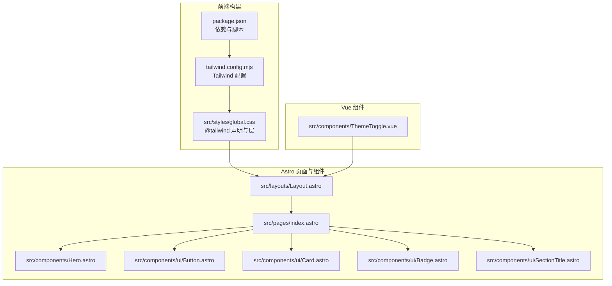
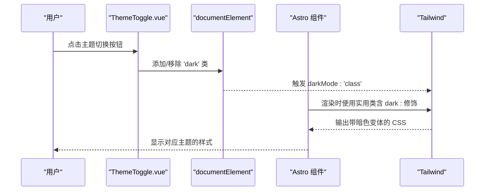
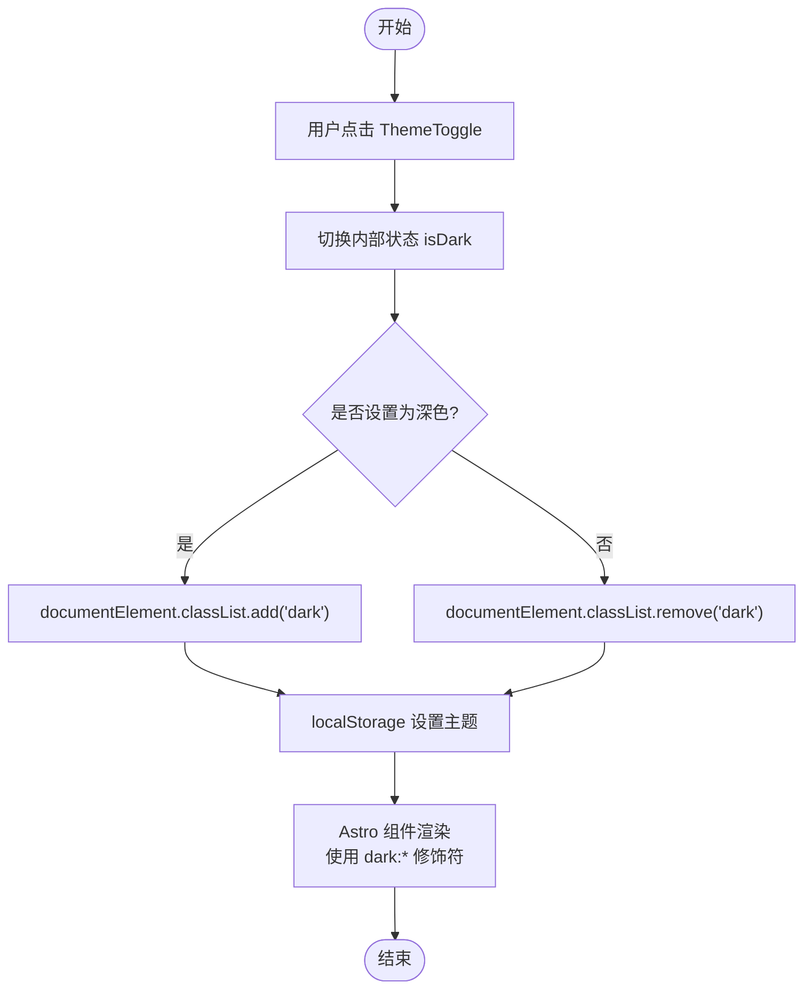
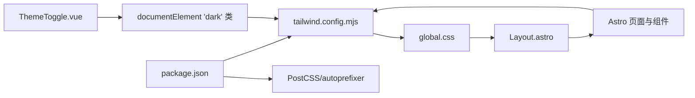

# Tailwind 配置

<cite>
**本文引用的文件**
- [tailwind.config.mjs](file://tailwind.config.mjs)
- [ThemeToggle.vue](file://src/components/ThemeToggle.vue)
- [global.css](file://src/styles/global.css)
- [package.json](file://package.json)
- [Layout.astro](file://src/layouts/Layout.astro)
- [Hero.astro](file://src/components/Hero.astro)
- [Button.astro](file://src/components/ui/Button.astro)
- [Card.astro](file://src/components/ui/Card.astro)
- [Badge.astro](file://src/components/ui/Badge.astro)
- [SectionTitle.astro](file://src/components/ui/SectionTitle.astro)
- [index.astro](file://src/pages/index.astro)
</cite>

## 目录
1. [简介](#简介)
2. [项目结构](#项目结构)
3. [核心组件](#核心组件)
4. [架构总览](#架构总览)
5. [详细组件分析](#详细组件分析)
6. [依赖关系分析](#依赖关系分析)
7. [性能考量](#性能考量)
8. [故障排查指南](#故障排查指南)
9. [结论](#结论)
10. [附录](#附录)

## 简介
本文件系统性地文档化了 Tailwind 配置文件的结构与行为，重点覆盖以下主题：
- darkMode: 'class' 的实现机制与 ThemeToggle.vue 的集成方式
- theme.extend 中自定义颜色（primary、light、dark、accent）、字体（Inter、JetBrains Mono）、字体大小、间距、圆角、阴影、动画及关键帧的配置逻辑
- content 字段如何扫描 Astro 组件以生成实用类
- backgroundImage 中网格图案和径向渐变的定义方式
- 插件系统扩展的最佳实践建议

## 项目结构
该站点采用 Astro + Vue + Tailwind 的组合：Astro 负责页面与组件渲染，Vue 提供交互式组件（如主题切换），Tailwind 负责样式生成与按需裁剪。全局样式通过 PostCSS/Tailwind 在构建时注入，Astro 组件中直接使用 Tailwind 实用类。

图表来源
- [package.json](file://package.json#L1-L28)
- [tailwind.config.mjs](file://tailwind.config.mjs#L1-L119)
- [global.css](file://src/styles/global.css#L1-L177)
- [Layout.astro](file://src/layouts/Layout.astro#L1-L59)
- [index.astro](file://src/pages/index.astro#L1-L242)
- [Hero.astro](file://src/components/Hero.astro#L1-L45)
- [Button.astro](file://src/components/ui/Button.astro#L1-L55)
- [Card.astro](file://src/components/ui/Card.astro#L1-L40)
- [Badge.astro](file://src/components/ui/Badge.astro#L1-L39)
- [SectionTitle.astro](file://src/components/ui/SectionTitle.astro#L1-L32)
- [ThemeToggle.vue](file://src/components/ThemeToggle.vue#L1-L79)

章节来源
- [package.json](file://package.json#L1-L28)
- [tailwind.config.mjs](file://tailwind.config.mjs#L1-L119)
- [global.css](file://src/styles/global.css#L1-L177)
- [Layout.astro](file://src/layouts/Layout.astro#L1-L59)
- [index.astro](file://src/pages/index.astro#L1-L242)

## 核心组件
- Tailwind 配置：定义 content 扫描范围、darkMode 行为、主题扩展（颜色、字体、字号、间距、圆角、阴影、动画、关键帧、背景图）以及空插件数组。
- 全局样式：在全局 CSS 中声明 @tailwind base/components/utilities，并通过 @layer 与自定义 CSS 片段组织基础、组件与工具层。
- 主题切换组件：ThemeToggle.vue 通过在 documentElement 上添加/移除 'dark' 类，配合 Tailwind 的 darkMode: 'class' 实现主题切换。
- Astro 组件：大量使用 Tailwind 实用类，包括暗色修饰符 dark:、prose 暗色变体 dark:prose-*、以及自定义动画与背景图等。

章节来源
- [tailwind.config.mjs](file://tailwind.config.mjs#L1-L119)
- [global.css](file://src/styles/global.css#L1-L177)
- [ThemeToggle.vue](file://src/components/ThemeToggle.vue#L1-L79)
- [Hero.astro](file://src/components/Hero.astro#L1-L45)
- [Button.astro](file://src/components/ui/Button.astro#L1-L55)
- [Card.astro](file://src/components/ui/Card.astro#L1-L40)
- [Badge.astro](file://src/components/ui/Badge.astro#L1-L39)
- [SectionTitle.astro](file://src/components/ui/SectionTitle.astro#L1-L32)

## 架构总览
Tailwind 的工作流由三部分组成：
- 配置阶段：tailwind.config.mjs 决定扫描范围、darkMode 行为与主题扩展。
- 构建阶段：Astro 与 PostCSS/Tailwind 在构建时扫描 content，提取并生成所需实用类。
- 运行阶段：Astro 组件与 Vue 组件在 DOM 中应用实用类；ThemeToggle.vue 通过切换 'dark' 类驱动 Tailwind 的暗色变体。

图表来源
- [ThemeToggle.vue](file://src/components/ThemeToggle.vue#L1-L79)
- [tailwind.config.mjs](file://tailwind.config.mjs#L1-L119)
- [Hero.astro](file://src/components/Hero.astro#L1-L45)
- [Button.astro](file://src/components/ui/Button.astro#L1-L55)
- [Card.astro](file://src/components/ui/Card.astro#L1-L40)
- [Badge.astro](file://src/components/ui/Badge.astro#L1-L39)
- [SectionTitle.astro](file://src/components/ui/SectionTitle.astro#L1-L32)

## 详细组件分析

### darkMode: 'class' 的实现机制与 ThemeToggle.vue 集成
- darkMode: 'class'：在 tailwind.config.mjs 中启用 class 驱动的暗色模式，Tailwind 将根据根元素上的 'dark' 类应用对应的暗色变体。
- ThemeToggle.vue：在点击事件中切换内部状态，并通过在 documentElement 上添加/移除 'dark' 类来触发 Tailwind 的暗色变体。同时持久化用户选择到 localStorage，以便页面刷新后保持一致的主题状态。
- Astro 组件中的暗色修饰：例如在组件中使用 dark:text-*、dark:bg-*、dark:border-*、dark:prose-* 等，这些类在 'dark' 类存在时生效。

图表来源
- [ThemeToggle.vue](file://src/components/ThemeToggle.vue#L1-L79)
- [tailwind.config.mjs](file://tailwind.config.mjs#L1-L119)
- [Hero.astro](file://src/components/Hero.astro#L1-L45)
- [Button.astro](file://src/components/ui/Button.astro#L1-L55)
- [Card.astro](file://src/components/ui/Card.astro#L1-L40)
- [Badge.astro](file://src/components/ui/Badge.astro#L1-L39)
- [SectionTitle.astro](file://src/components/ui/SectionTitle.astro#L1-L32)

章节来源
- [ThemeToggle.vue](file://src/components/ThemeToggle.vue#L1-L79)
- [tailwind.config.mjs](file://tailwind.config.mjs#L1-L119)
- [Hero.astro](file://src/components/Hero.astro#L1-L45)
- [Button.astro](file://src/components/ui/Button.astro#L1-L55)
- [Card.astro](file://src/components/ui/Card.astro#L1-L40)
- [Badge.astro](file://src/components/ui/Badge.astro#L1-L39)
- [SectionTitle.astro](file://src/components/ui/SectionTitle.astro#L1-L32)

### theme.extend：自定义颜色、字体、字号、间距、圆角、阴影、动画与关键帧
- 自定义颜色
  - primary：包含 50 到 950 的多级色阶，用于强调与高亮。
  - light：浅色背景系列，包含 DEFAULT、50、100、200、300。
  - dark：深色背景系列，包含 DEFAULT、50、100、200、300。
  - accent：包含 lime 与 dark 两种强调色。
- 字体族
  - sans：优先使用 Inter，回退到系统字体。
  - mono：优先使用 JetBrains Mono，回退到等宽字体。
- 字号
  - display-xl、display-lg、display、heading-xl、heading-lg、heading 等语义化字号，均包含行高与字距微调。
- 间距
  - 新增 18、22、30 的自定义间距值，便于布局一致性。
- 圆角
  - 新增 2xl、3xl、4xl 的圆角尺寸，适配卡片与按钮等组件。
- 阴影
  - card、card-hover、button、button-hover 等阴影层级，满足卡片与按钮在不同状态下的视觉层次。
- 动画与关键帧
  - animation：float、glow-pulse、fade-in、fade-in-up、slide-in-left、slide-in-right。
  - keyframes：与上述动画一一对应的关键帧定义，用于平滑过渡与动态效果。
- 背景图
  - gradient-radial：径向渐变占位符，可直接在类名中使用。
  - grid-pattern、grid-pattern-dark：网格线条背景，分别针对浅色与深色模式的透明度差异。

章节来源
- [tailwind.config.mjs](file://tailwind.config.mjs#L1-L119)

### content 字段：扫描 Astro 组件以生成实用类
- content 扫描范围：包含 src 下所有 Astro、HTML、JS、TS、Svelte、Vue、MD/MDX 等文件类型，确保 Astro 组件中的实用类被正确提取。
- 作用：Tailwind 在构建时仅生成实际使用的实用类，避免无用 CSS，提升性能与体积控制。
- 集成验证：Astro 组件广泛使用 Tailwind 类，如 dark:*、animate-*、bg-grid*、rounded-*、shadow-* 等，均在构建后生效。

章节来源
- [tailwind.config.mjs](file://tailwind.config.mjs#L1-L119)
- [Hero.astro](file://src/components/Hero.astro#L1-L45)
- [Button.astro](file://src/components/ui/Button.astro#L1-L55)
- [Card.astro](file://src/components/ui/Card.astro#L1-L40)
- [Badge.astro](file://src/components/ui/Badge.astro#L1-L39)
- [SectionTitle.astro](file://src/components/ui/SectionTitle.astro#L1-L32)

### 背景图：网格图案与径向渐变
- 网格图案
  - grid-pattern：通过两条线性渐变叠加形成网格线，背景尺寸设定为 80×80 像素，适合大面积背景。
  - grid-pattern-dark：与 grid-pattern 类似，但网格线颜色针对深色模式进行了调整，保证对比度。
- 径向渐变
  - gradient-radial：作为占位符，可在类名中直接使用，配合渐变色停靠变量生成渐变效果。

章节来源
- [tailwind.config.mjs](file://tailwind.config.mjs#L1-L119)
- [global.css](file://src/styles/global.css#L1-L177)

### 插件系统扩展：最佳实践建议
- 使用官方插件前先评估是否可通过 theme.extend 实现，减少额外依赖。
- 若确需插件，建议：
  - 将插件配置集中于 plugins 数组，按功能分组注释说明用途。
  - 避免在插件中引入与现有 theme.extend 冲突的键名，防止重复定义导致的覆盖问题。
  - 在开发阶段开启插件调试输出，确认生成的类名与预期一致。
  - 对于需要运行时动态变更的特性，优先考虑通过 JS 控制类名（如 ThemeToggle.vue 的方式），而非完全依赖插件。

章节来源
- [tailwind.config.mjs](file://tailwind.config.mjs#L1-L119)

## 依赖关系分析
- 构建链路
  - package.json 指定 @astrojs/tailwind、tailwindcss、postcss、autoprefixer 等依赖，确保 Tailwind 与 PostCSS 正常工作。
  - global.css 中的 @tailwind 声明与 @layer 组织，使 Tailwind 的基础、组件与工具层有序合并。
  - Layout.astro 引入全局样式，确保页面整体样式一致。
- 组件与配置耦合
  - ThemeToggle.vue 与 tailwind.config.mjs 的 darkMode: 'class' 强耦合，任何对根元素 'dark' 类的操作都会影响 Tailwind 的暗色变体。
  - Astro 组件广泛使用 Tailwind 类，content 扫描确保这些类在构建时被保留。

图表来源
- [package.json](file://package.json#L1-L28)
- [tailwind.config.mjs](file://tailwind.config.mjs#L1-L119)
- [global.css](file://src/styles/global.css#L1-L177)
- [Layout.astro](file://src/layouts/Layout.astro#L1-L59)
- [ThemeToggle.vue](file://src/components/ThemeToggle.vue#L1-L79)

章节来源
- [package.json](file://package.json#L1-L28)
- [tailwind.config.mjs](file://tailwind.config.mjs#L1-L119)
- [global.css](file://src/styles/global.css#L1-L177)
- [Layout.astro](file://src/layouts/Layout.astro#L1-L59)
- [ThemeToggle.vue](file://src/components/ThemeToggle.vue#L1-L79)

## 性能考量
- 按需生成：content 扫描仅产出实际使用的实用类，降低 CSS 体积。
- 动画与阴影：合理使用内置动画与阴影，避免过度堆叠导致重绘开销。
- 背景图：网格背景使用小尺寸背景图，注意在大屏或高分辨率设备上的缩放表现。
- 主题切换：ThemeToggle.vue 通过类名切换而非样式重算，切换成本低且即时。

## 故障排查指南
- 暗色模式不生效
  - 检查 documentElement 是否正确添加/移除 'dark' 类。
  - 确认 tailwind.config.mjs 的 darkMode: 'class' 未被覆盖。
  - 验证组件中是否使用了 dark:* 修饰符。
- 实用类未生成
  - 检查 content 扫描路径是否包含目标文件类型（Astro、TS、JS 等）。
  - 确保类名拼写正确，避免大小写或命名错误。
- 动画或关键帧无效
  - 确认 animation 与 keyframes 名称一致，且未被覆盖。
  - 检查全局 CSS 中是否重复定义了同名 keyframes，导致冲突。
- 背景图不显示
  - 确认类名使用正确，且 Tailwind 已生成对应背景图类。
  - 检查容器尺寸与背景定位，确保可见区域足够。

章节来源
- [ThemeToggle.vue](file://src/components/ThemeToggle.vue#L1-L79)
- [tailwind.config.mjs](file://tailwind.config.mjs#L1-L119)
- [global.css](file://src/styles/global.css#L1-L177)

## 结论
本配置通过 class 驱动的暗色模式与丰富的 theme.extend，提供了统一、可维护且高性能的样式体系。Astro 组件与 Vue 组件在运行时无缝协作，ThemeToggle.vue 以最小代价实现主题切换，content 扫描确保按需生成实用类。建议在扩展插件时遵循“能用 extend 解决就不用插件”的原则，保持配置简洁与可维护性。

## 附录
- 使用示例参考
  - 暗色修饰符：在组件中使用 dark:* 类，如 dark:text-white、dark:bg-dark-100。
  - 自定义动画：在元素上使用 animate-float、animate-glow-pulse、animate-fade-in-up 等。
  - 背景图：使用 bg-grid、bg-grid-fade 或自定义的 gradient-radial。
  - 按钮与卡片：使用 btn-*、btn-primary、btn-secondary、btn-ghost、shadow-card、rounded-2xl 等。

章节来源
- [Hero.astro](file://src/components/Hero.astro#L1-L45)
- [Button.astro](file://src/components/ui/Button.astro#L1-L55)
- [Card.astro](file://src/components/ui/Card.astro#L1-L40)
- [Badge.astro](file://src/components/ui/Badge.astro#L1-L39)
- [SectionTitle.astro](file://src/components/ui/SectionTitle.astro#L1-L32)
- [index.astro](file://src/pages/index.astro#L1-L242)