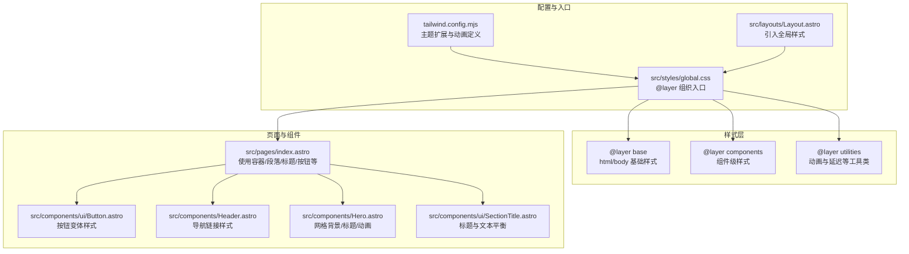
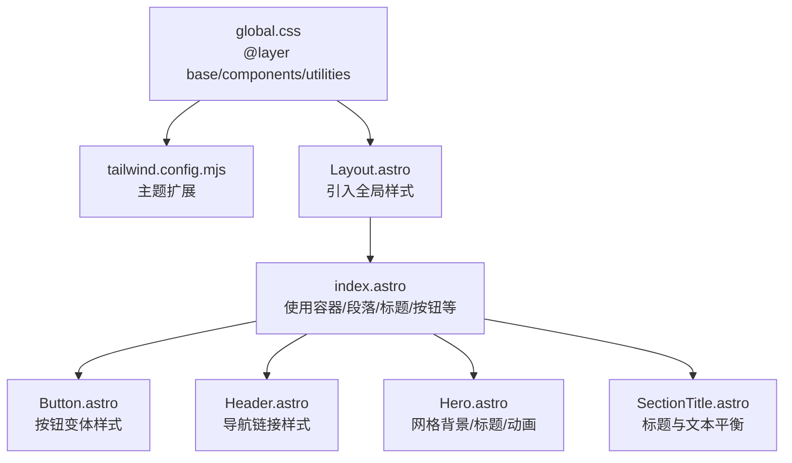
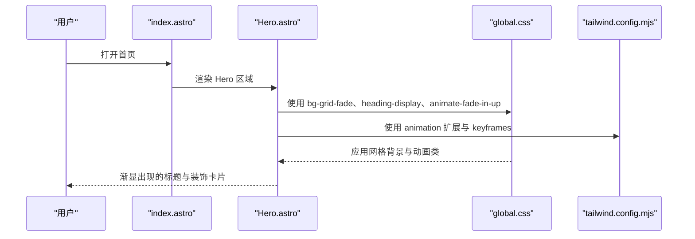
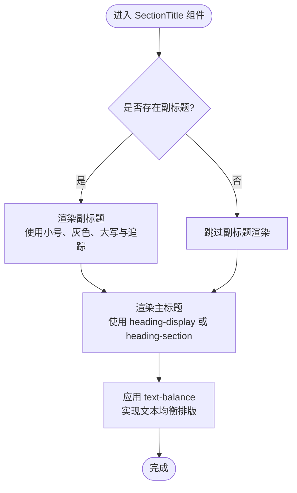
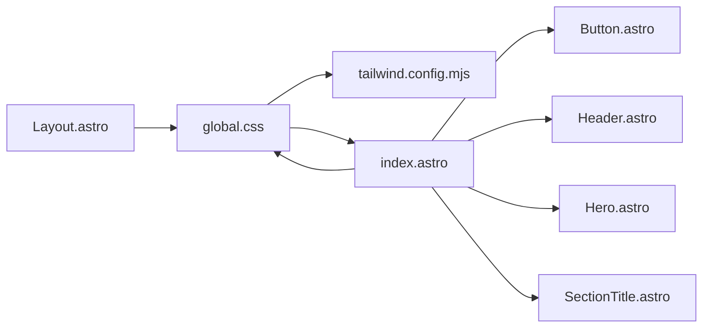

# 全局样式

<cite>
**本文引用的文件**
- [global.css](file://src/styles/global.css)
- [tailwind.config.mjs](file://tailwind.config.mjs)
- [Layout.astro](file://src/layouts/Layout.astro)
- [Button.astro](file://src/components/ui/Button.astro)
- [Header.astro](file://src/components/Header.astro)
- [Hero.astro](file://src/components/Hero.astro)
- [SectionTitle.astro](file://src/components/ui/SectionTitle.astro)
- [index.astro](file://src/pages/index.astro)
</cite>

## 目录
1. [引言](#引言)
2. [项目结构](#项目结构)
3. [核心组件](#核心组件)
4. [架构总览](#架构总览)
5. [详细组件分析](#详细组件分析)
6. [依赖关系分析](#依赖关系分析)
7. [性能考量](#性能考量)
8. [故障排查指南](#故障排查指南)
9. [结论](#结论)

## 引言
本文件深入解析站点全局样式 global.css 中基于 @layer 的样式分层架构，系统性说明 base、components、utilities 三层的职责划分与协作方式；覆盖 html 与 body 的基础样式（如滚动平滑、字体抗锯齿、颜色过渡）、滚动条自定义、文本选中效果、网格背景（bg-grid、bg-grid-fade）的实现原理；并解释容器、段落间距、标题类（heading-display）、链接、导航项等组件级样式的定义方式，以及动画类（animate-fade-in-up）与延迟类的实用工具设计。同时结合 Tailwind 配置与实际页面组件，帮助读者在不直接阅读源码的情况下也能准确理解样式体系的设计意图与使用方法。

## 项目结构
- 全局样式入口位于 src/styles/global.css，采用 Tailwind 的 @layer 机制组织基础层、组件层与工具层。
- Tailwind 配置位于 tailwind.config.mjs，负责主题扩展（颜色、字体、字号、阴影、圆角、动画、背景图案等），并与 @layer 体系协同工作。
- 页面布局 Layout.astro 引入全局样式并在页面中通过类名使用这些样式。
- 多个组件（如 Button、Header、Hero、SectionTitle）在模板中直接使用全局样式类，体现“组件层”与“工具层”的落地应用。

图表来源
- [global.css](file://src/styles/global.css#L1-L177)
- [tailwind.config.mjs](file://tailwind.config.mjs#L1-L119)
- [Layout.astro](file://src/layouts/Layout.astro#L1-L59)
- [Button.astro](file://src/components/ui/Button.astro#L1-L56)
- [Header.astro](file://src/components/Header.astro#L1-L164)
- [Hero.astro](file://src/components/Hero.astro#L1-L109)
- [SectionTitle.astro](file://src/components/ui/SectionTitle.astro#L1-L33)

章节来源
- [global.css](file://src/styles/global.css#L1-L177)
- [tailwind.config.mjs](file://tailwind.config.mjs#L1-L119)
- [Layout.astro](file://src/layouts/Layout.astro#L1-L59)

## 核心组件
- 基础层（base）
  - html：启用滚动平滑，改善长页面滚动体验。
  - body：设置无衬线字体、开启字体抗锯齿、设定浅色背景与深色文字、统一颜色过渡时长，确保整体视觉一致性与交互流畅度。
  - ::-webkit-scrollbar：为 WebKit 内核浏览器提供自定义滚动条宽度、轨道与滑块的颜色与圆角，悬停时增强可发现性。
  - ::selection：定义文本选中时的背景透明度与文字颜色，提升对比度与可读性。
- 组件层（components）
  - 网格背景：bg-grid 与 bg-grid-fade 使用线性渐变叠加 mask-image 实现网格线与渐隐效果，用于营造现代感背景。
  - 按钮：btn 基础样式与 btn-primary、btn-secondary、btn-ghost 三种变体，统一对齐、间距、过渡与悬停阴影。
  - 链接：.link 提供默认与悬停下的颜色与下划线行为，统一过渡时长。
  - 容器：.container-custom 统一最大宽度、水平内边距与响应式内边距。
  - 段落间距：.section 提供页面区块的上下间距，保证内容密度与留白一致。
  - 标题：.heading-display 与 .heading-section 提供不同层级标题的字号、字重、字距与颜色。
  - 标签/徽章：.badge 与 .badge-lime 提供统一的内边距、圆角、颜色与强调色。
  - 导航：.nav-link 与 .nav-link-active 提供导航项的默认与激活态样式。
- 工具层（utilities）
  - 动画：.animate-fade-in-up 定义淡入上移动画，配合 Tailwind 的 animation 扩展。
  - 延迟：.animation-delay-100、.animation-delay-200、.animation-delay-300 提供统一的动画延迟工具类。
  - 文本平衡：.text-balance 使用 text-wrap: balance 实现更均衡的排版。

章节来源
- [global.css](file://src/styles/global.css#L1-L177)
- [tailwind.config.mjs](file://tailwind.config.mjs#L1-L119)

## 架构总览
全局样式采用“三层分层 + Tailwind 扩展”的架构：
- @layer base：定义全局基础元素的默认外观与行为，避免重复声明，确保一致性。
- @layer components：封装可复用的组件样式，形成稳定的组件 API，便于在各页面与组件中直接使用。
- @layer utilities：提供细粒度的工具类，如动画与延迟，支撑页面层面的微交互与排版需求。
- Tailwind 配置：通过主题扩展提供颜色、字体、字号、阴影、圆角、动画与背景图案等能力，与 @layer 互补，形成“约定优于配置”的开发体验。

图表来源
- [global.css](file://src/styles/global.css#L1-L177)
- [tailwind.config.mjs](file://tailwind.config.mjs#L1-L119)
- [Layout.astro](file://src/layouts/Layout.astro#L1-L59)
- [index.astro](file://src/pages/index.astro#L1-L242)
- [Button.astro](file://src/components/ui/Button.astro#L1-L56)
- [Header.astro](file://src/components/Header.astro#L1-L164)
- [Hero.astro](file://src/components/Hero.astro#L1-L109)
- [SectionTitle.astro](file://src/components/ui/SectionTitle.astro#L1-L33)

## 详细组件分析

### 基础层（base）详解
- html
  - 职责：启用滚动平滑，使锚点跳转与滚动手势更顺滑。
  - 影响范围：全局页面滚动行为。
- body
  - 职责：设置无衬线字体、开启字体抗锯齿、设定浅色背景与深色文字、统一颜色过渡时长。
  - 设计要点：通过过渡时长统一颜色变化节奏，避免闪烁与突兀。
- ::-webkit-scrollbar
  - 职责：自定义滚动条宽度、轨道与滑块颜色及圆角；悬停时增强滑块颜色。
  - 适用场景：桌面端滚动条美化，提升界面质感。
- ::selection
  - 职责：统一文本选中时的背景透明度与文字颜色，提高对比度与可读性。
  - 适用场景：长文本阅读与编辑场景。

章节来源
- [global.css](file://src/styles/global.css#L1-L40)

### 组件层（components）详解
- 网格背景（bg-grid 与 bg-grid-fade）
  - 实现原理：使用线性渐变创建网格线，通过 background-size 控制网格密度；bg-grid-fade 在 bg-grid 基础上叠加 mask-image，实现从上至下的渐隐遮罩，营造层次感。
  - 使用场景：Hero 区域背景、卡片背景等需要现代感网格装饰的区域。
- 按钮（btn、btn-primary、btn-secondary、btn-ghost）
  - 定义方式：btn 作为基础样式集合，其他变体通过组合 btn 与特定颜色、边框、阴影与过渡类实现。
  - 设计要点：统一对齐、间距、过渡与悬停阴影，保持视觉一致性。
- 链接（link）
  - 定义方式：统一默认与悬停颜色、下划线偏移与悬停下划线行为，统一过渡时长。
- 容器（container-custom）
  - 定义方式：统一最大宽度、水平内边距与响应式内边距，确保内容在不同屏幕尺寸下的可读性与留白。
- 段落间距（section）
  - 定义方式：统一页面区块的上下间距，保证内容密度与留白一致。
- 标题（heading-display、heading-section）
  - 定义方式：分别针对主标题与章节标题设置字号、字重、字距与颜色，形成清晰的层级关系。
- 标签/徽章（badge、badge-lime）
  - 定义方式：统一内边距、圆角、颜色与强调色，支持不同状态下的视觉反馈。
- 导航（nav-link、nav-link-active）
  - 定义方式：默认与悬停颜色、字体大小与字重、过渡时长；激活态突出当前路径。

章节来源
- [global.css](file://src/styles/global.css#L42-L141)
- [Hero.astro](file://src/components/Hero.astro#L1-L109)
- [Button.astro](file://src/components/ui/Button.astro#L1-L56)
- [Header.astro](file://src/components/Header.astro#L1-L164)
- [SectionTitle.astro](file://src/components/ui/SectionTitle.astro#L1-L33)

### 工具层（utilities）详解
- 动画（animate-fade-in-up）
  - 定义方式：通过 animation 属性绑定 fade-in-up 动画，配合 Tailwind 的 animation 扩展与 keyframes。
  - 使用方式：在元素上添加该类并配合延迟类实现逐帧出现的层次感。
- 延迟（animation-delay-100、animation-delay-200、animation-delay-300）
  - 定义方式：提供固定毫秒数的延迟工具类，便于在页面中实现错峰动画。
- 文本平衡（text-balance）
  - 定义方式：使用 text-wrap: balance，自动调整行宽与断行位置，提升排版均衡性。

章节来源
- [global.css](file://src/styles/global.css#L143-L177)
- [tailwind.config.mjs](file://tailwind.config.mjs#L1-L119)

### 关键流程与使用示例

#### 页面加载与动画序列

图表来源
- [index.astro](file://src/pages/index.astro#L1-L242)
- [Hero.astro](file://src/components/Hero.astro#L1-L109)
- [global.css](file://src/styles/global.css#L1-L177)
- [tailwind.config.mjs](file://tailwind.config.mjs#L1-L119)

#### 标题层级与文本平衡

图表来源
- [SectionTitle.astro](file://src/components/ui/SectionTitle.astro#L1-L33)
- [global.css](file://src/styles/global.css#L109-L117)
- [tailwind.config.mjs](file://tailwind.config.mjs#L1-L119)

## 依赖关系分析
- global.css 与 tailwind.config.mjs
  - global.css 通过 @layer 与 Tailwind 工具类协作；tailwind.config.mjs 提供颜色、字体、字号、阴影、圆角、动画与背景图案等主题扩展，二者共同构成样式体系的基础。
- global.css 与 Layout.astro
  - Layout.astro 在页面头部引入 global.css，确保所有页面共享同一套基础样式与组件样式。
- global.css 与页面组件
  - index.astro 在多个区块中使用 container-custom、section、heading-display、btn、link、nav-link 等类，体现组件层与工具层在页面中的落地应用。
- global.css 与 Hero 组件
  - Hero 使用 bg-grid-fade 作为背景、heading-display 作为主标题、animate-fade-in-up 与 animation-delay-* 实现逐帧出现的动画序列。
- global.css 与 Button 组件
  - Button 组件内部组合了 btn 与多种变体样式，体现组件层对基础样式的复用与扩展。
- global.css 与 Header 组件
  - Header 使用 nav-link 与 nav-link-active 类，体现导航项的默认与激活态样式。

图表来源
- [global.css](file://src/styles/global.css#L1-L177)
- [tailwind.config.mjs](file://tailwind.config.mjs#L1-L119)
- [Layout.astro](file://src/layouts/Layout.astro#L1-L59)
- [index.astro](file://src/pages/index.astro#L1-L242)
- [Button.astro](file://src/components/ui/Button.astro#L1-L56)
- [Header.astro](file://src/components/Header.astro#L1-L164)
- [Hero.astro](file://src/components/Hero.astro#L1-L109)
- [SectionTitle.astro](file://src/components/ui/SectionTitle.astro#L1-L33)

章节来源
- [global.css](file://src/styles/global.css#L1-L177)
- [tailwind.config.mjs](file://tailwind.config.mjs#L1-L119)
- [Layout.astro](file://src/layouts/Layout.astro#L1-L59)
- [index.astro](file://src/pages/index.astro#L1-L242)
- [Button.astro](file://src/components/ui/Button.astro#L1-L56)
- [Header.astro](file://src/components/Header.astro#L1-L164)
- [Hero.astro](file://src/components/Hero.astro#L1-L109)
- [SectionTitle.astro](file://src/components/ui/SectionTitle.astro#L1-L33)

## 性能考量
- 样式体积控制
  - 通过 @layer 将基础样式、组件样式与工具类分离，避免重复定义，减少最终 CSS 体积。
  - 利用 Tailwind 的按需扫描（content 配置）仅生成实际使用的类，降低冗余。
- 动画与过渡
  - 统一过渡时长与动画曲线，减少频繁重排与重绘，提升滚动与交互性能。
  - 合理使用 mask-image 与渐变背景，避免复杂滤镜导致的性能问题。
- 图片与背景
  - 网格背景使用线性渐变与 mask-image，无需额外图片资源，减少网络请求与内存占用。

## 故障排查指南
- 滚动条样式未生效
  - 确认浏览器是否为 WebKit 内核（Chrome/Safari），因为 ::-webkit-scrollbar 仅在该内核有效。
  - 检查是否被其他样式覆盖，必要时增加特异性或使用 !important（谨慎使用）。
- 文本选中颜色不明显
  - 检查 ::selection 的颜色对比度，确保在浅色与深色背景下均具备足够可读性。
- 网格背景不显示
  - 确认 bg-grid 或 bg-grid-fade 是否正确应用到元素上，且元素具有足够的尺寸与定位。
  - 检查 mask-image 的兼容性与浏览器支持情况。
- 动画未按预期出现
  - 确认元素是否正确添加 animate-fade-in-up 与 animation-delay-* 类。
  - 检查 Tailwind 的 animation 扩展是否已启用，以及 keyframes 是否存在。
- 导航链接样式异常
  - 确认 nav-link 与 nav-link-active 的组合使用是否正确，避免冲突类导致的样式覆盖。

## 结论
本项目的全局样式以 @layer 为核心，将基础层、组件层与工具层清晰分离，配合 Tailwind 的主题扩展，实现了高内聚、低耦合的样式体系。html 与 body 的基础样式确保了全局一致的滚动体验与视觉基调；组件层提供了可复用的 UI 原子样式；工具层则通过动画与延迟类支撑页面层面的微交互。通过在页面与组件中直接使用这些类，既保证了开发效率，也提升了样式的一致性与可维护性。