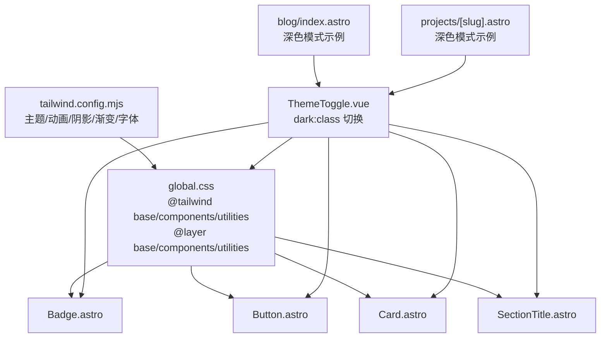
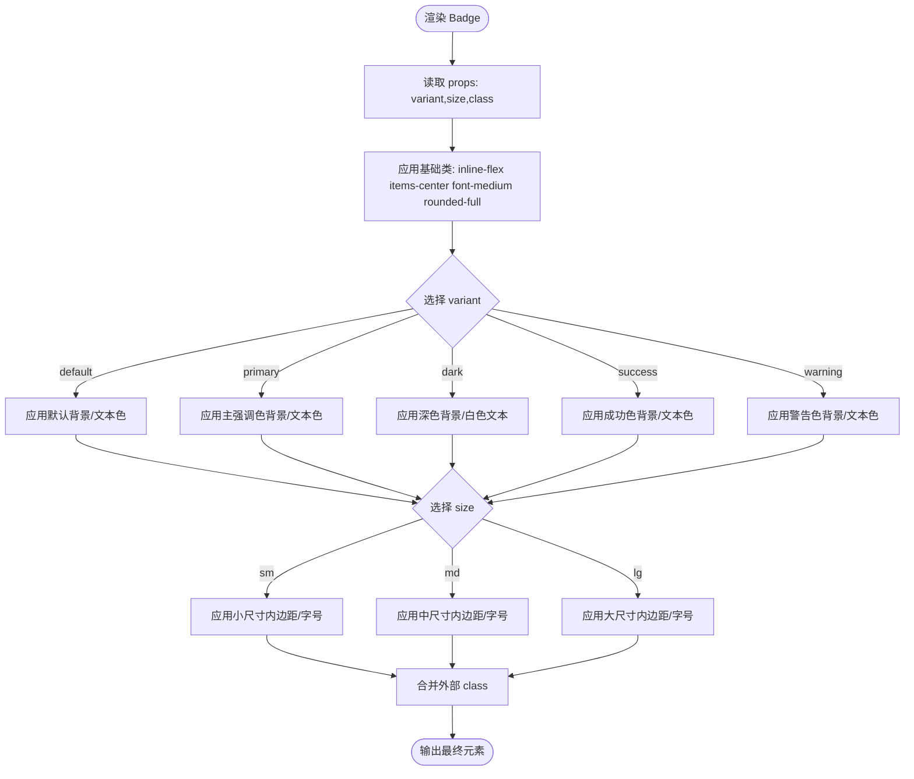
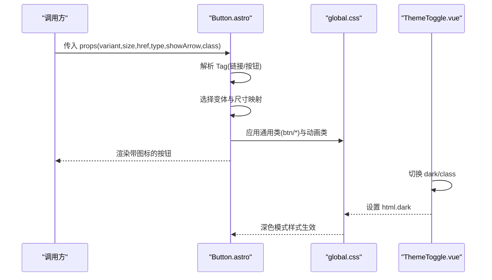
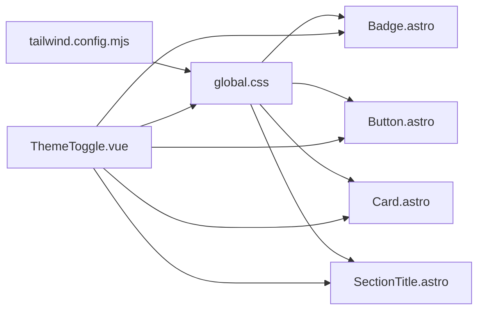

# 样式系统

<cite>
**本文引用的文件**
- [tailwind.config.mjs](file://tailwind.config.mjs)
- [global.css](file://src/styles/global.css)
- [Badge.astro](file://src/components/ui/Badge.astro)
- [Button.astro](file://src/components/ui/Button.astro)
- [Card.astro](file://src/components/ui/Card.astro)
- [SectionTitle.astro](file://src/components/ui/SectionTitle.astro)
- [ThemeToggle.vue](file://src/components/ThemeToggle.vue)
- [blog/index.astro](file://src/pages/blog/index.astro)
- [projects/[slug].astro](file://src/pages/projects/[slug].astro)
</cite>

## 目录
1. [简介](#简介)
2. [项目结构](#项目结构)
3. [核心组件](#核心组件)
4. [架构总览](#架构总览)
5. [详细组件分析](#详细组件分析)
6. [依赖关系分析](#依赖关系分析)
7. [性能考量](#性能考量)
8. [故障排查指南](#故障排查指南)
9. [结论](#结论)
10. [附录](#附录)

## 简介
本文件系统性地文档化本项目的样式架构，重点围绕 Tailwind CSS 的集成与定制化实践展开。内容覆盖：
- tailwind.config.mjs 中的主题、插件与变体配置方式
- global.css 中全局样式重置与自定义类的定义
- UI 组件（Badge、Button、Card、SectionTitle）如何利用 Tailwind 类实现高度可定制的视觉表现
- 响应式断点与深色模式适配（dark:class）的实现机制
- 如何通过 @apply 保持组件样式的整洁性
- 设计一致性与最佳实践建议

## 项目结构
样式体系由“配置层 + 全局层 + 组件层”三层构成：
- 配置层：tailwind.config.mjs 提供主题扩展、动画、阴影、渐变等能力
- 全局层：global.css 通过 @tailwind 指令引入基础、组件、工具层，并定义全局重置与常用自定义类
- 组件层：各 UI 组件通过 props 控制变体与尺寸，结合 Tailwind 工具类实现一致的视觉与交互



图表来源
- [tailwind.config.mjs](file://tailwind.config.mjs#L1-L119)
- [global.css](file://src/styles/global.css#L1-L177)
- [Badge.astro](file://src/components/ui/Badge.astro#L1-L40)
- [Button.astro](file://src/components/ui/Button.astro#L1-L56)
- [Card.astro](file://src/components/ui/Card.astro#L1-L41)
- [SectionTitle.astro](file://src/components/ui/SectionTitle.astro#L1-L33)
- [ThemeToggle.vue](file://src/components/ThemeToggle.vue#L1-L79)
- [blog/index.astro](file://src/pages/blog/index.astro#L1-L321)
- [projects/[slug].astro](file://src/pages/projects/[slug].astro#L1-L162)

章节来源
- [tailwind.config.mjs](file://tailwind.config.mjs#L1-L119)
- [global.css](file://src/styles/global.css#L1-L177)

## 核心组件
- Badge：通过 variant 与 size 映射不同背景、文本颜色与内边距，保证在浅色/深色模式下的一致可读性
- Button：支持多种变体与尺寸，统一的悬停、焦点与过渡效果，配合图标与箭头增强交互反馈
- Card：统一圆角、边框、阴影与过渡，支持可选悬停效果与内边距配置
- SectionTitle：标题层级与段落辅助文本的排版控制，支持居中与响应式字号

章节来源
- [Badge.astro](file://src/components/ui/Badge.astro#L1-L40)
- [Button.astro](file://src/components/ui/Button.astro#L1-L56)
- [Card.astro](file://src/components/ui/Card.astro#L1-L41)
- [SectionTitle.astro](file://src/components/ui/SectionTitle.astro#L1-L33)

## 架构总览
Tailwind 配置通过 content 指向 Astro 与静态资源目录，启用 class 驱动的深色模式，主题扩展包含：
- 颜色：主强调色 primary、浅色背景 light、深色背景 dark、强调色 accent
- 字体：sans 与 mono 字体族
- 字号：display 与 heading 系列
- 间距与圆角：扩展常用步进值
- 阴影：卡片与按钮阴影
- 动画与关键帧：浮动、脉冲、淡入等
- 背景：径向渐变与网格图案
- 插件：当前为空数组（预留）

全局样式通过 @tailwind base/components/utilities 引入，再用 @layer base/components/utilities 定义重置、通用组件类与工具类。UI 组件通过 props 选择变体与尺寸，最终渲染为语义化标签并组合 Tailwind 工具类。

```mermaid
classDiagram
class TailwindConfig {
+content
+darkMode
+theme.extend.colors
+theme.extend.fontFamily
+theme.extend.fontSize
+theme.extend.spacing
+theme.extend.borderRadius
+theme.extend.boxShadow
+theme.extend.backdropBlur
+theme.extend.animation
+theme.extend.keyframes
+theme.extend.backgroundImage
+plugins
}
class GlobalCSS {
+@tailwind base
+@tailwind components
+@tailwind utilities
+@layer base
+@layer components
+@layer utilities
}
class Badge {
+props : variant,size,class
+variants映射
+sizes映射
}
class Button {
+props : variant,size,href,type,showArrow,class
+variants映射
+sizes映射
}
class Card {
+props : href,class,hover,padding
+paddings映射
}
class SectionTitle {
+props : title,subtitle,centered,class
}
class ThemeToggle {
+toggleTheme()
+updateTheme()
}
TailwindConfig --> GlobalCSS : "提供主题/工具类"
GlobalCSS --> Badge : "提供通用类与动画"
GlobalCSS --> Button : "提供通用类与动画"
GlobalCSS --> Card : "提供通用类与动画"
GlobalCSS --> SectionTitle : "提供通用类与动画"
ThemeToggle --> GlobalCSS : "dark : class 切换"
ThemeToggle --> Badge
ThemeToggle --> Button
ThemeToggle --> Card
ThemeToggle --> SectionTitle
```

图表来源
- [tailwind.config.mjs](file://tailwind.config.mjs#L1-L119)
- [global.css](file://src/styles/global.css#L1-L177)
- [Badge.astro](file://src/components/ui/Badge.astro#L1-L40)
- [Button.astro](file://src/components/ui/Button.astro#L1-L56)
- [Card.astro](file://src/components/ui/Card.astro#L1-L41)
- [SectionTitle.astro](file://src/components/ui/SectionTitle.astro#L1-L33)
- [ThemeToggle.vue](file://src/components/ThemeToggle.vue#L1-L79)

## 详细组件分析

### Badge 组件
- 设计要点
  - 通过 variant 映射不同背景与文本色，确保在浅色/深色模式下的对比度与可读性
  - 通过 size 映射内边距与字号，形成统一的密度与比例
  - 使用 class 参数允许外部传入额外样式，便于组合使用
- 深色模式适配
  - 组件内部未显式使用 dark: 前缀，但其依赖的全局类与主题色在 dark:class 下自动生效
- 响应式与可组合性
  - 通过 Tailwind 工具类组合，可在父级容器中进一步叠加响应式断点



图表来源
- [Badge.astro](file://src/components/ui/Badge.astro#L1-L40)

章节来源
- [Badge.astro](file://src/components/ui/Badge.astro#L1-L40)

### Button 组件
- 设计要点
  - 变体映射：primary、secondary、ghost、outline，分别对应不同的背景、边框与悬停效果
  - 尺寸映射：sm、md、lg，统一内边距与圆角，保持视觉层级一致
  - 交互统一：统一的过渡、焦点环与悬停阴影，提升一致性
  - 图标与箭头：通过 showArrow 与 variant 的条件样式，增强语义反馈
- 深色模式适配
  - 组件内部未显式使用 dark: 前缀，但其依赖的全局类与主题色在 dark:class 下自动生效
- 响应式与可组合性
  - 通过 Tailwind 工具类组合，可在父级容器中进一步叠加响应式断点



图表来源
- [Button.astro](file://src/components/ui/Button.astro#L1-L56)
- [global.css](file://src/styles/global.css#L61-L90)
- [ThemeToggle.vue](file://src/components/ThemeToggle.vue#L43-L78)

章节来源
- [Button.astro](file://src/components/ui/Button.astro#L1-L56)
- [global.css](file://src/styles/global.css#L61-L90)
- [ThemeToggle.vue](file://src/components/ThemeToggle.vue#L1-L79)

### Card 组件
- 设计要点
  - 统一圆角、边框与阴影，hover 时增强阴影与边框，提升交互反馈
  - 内边距通过 padding 映射，满足不同卡片密度需求
  - 支持 href 渲染为链接，同时保留悬停指针样式
- 深色模式适配
  - 组件内部未显式使用 dark: 前缀，但其依赖的全局类与主题色在 dark:class 下自动生效
- 响应式与可组合性
  - 通过 Tailwind 工具类组合，可在父级容器中进一步叠加响应式断点

章节来源
- [Card.astro](file://src/components/ui/Card.astro#L1-L41)

### SectionTitle 组件
- 设计要点
  - 标题层级与副标题的排版控制，支持居中与响应式字号
  - 通过 text-balance 优化文本换行平衡
- 深色模式适配
  - 组件内部未显式使用 dark: 前缀，但其依赖的全局类与主题色在 dark:class 下自动生效

章节来源
- [SectionTitle.astro](file://src/components/ui/SectionTitle.astro#L1-L33)

## 依赖关系分析
- Tailwind 配置对全局样式的影响
  - tailwind.config.mjs 提供的颜色、字体、字号、阴影、动画等主题扩展，被 global.css 与各组件类所复用
- 深色模式依赖
  - tailwind.config.mjs 启用 class 驱动的深色模式，ThemeToggle.vue 通过在 html 上添加/移除 dark 类实现切换
- 组件与全局样式的耦合
  - 组件通过通用类（如 btn、badge、section、heading-*）与工具类组合，减少重复定义，提高一致性



图表来源
- [tailwind.config.mjs](file://tailwind.config.mjs#L1-L119)
- [global.css](file://src/styles/global.css#L1-L177)
- [Badge.astro](file://src/components/ui/Badge.astro#L1-L40)
- [Button.astro](file://src/components/ui/Button.astro#L1-L56)
- [Card.astro](file://src/components/ui/Card.astro#L1-L41)
- [SectionTitle.astro](file://src/components/ui/SectionTitle.astro#L1-L33)
- [ThemeToggle.vue](file://src/components/ThemeToggle.vue#L1-L79)

章节来源
- [tailwind.config.mjs](file://tailwind.config.mjs#L1-L119)
- [global.css](file://src/styles/global.css#L1-L177)
- [ThemeToggle.vue](file://src/components/ThemeToggle.vue#L1-L79)

## 性能考量
- 构建体积与按需扫描
  - tailwind.config.mjs 的 content 覆盖 Astro、HTML、JS、TS、Svelte、Vue 等文件类型，确保仅生成实际使用的样式，避免无用 CSS
- 动画与阴影
  - 主题扩展了多个动画与阴影，建议在组件中按需使用，避免过度堆叠导致渲染压力
- 深色模式切换
  - ThemeToggle.vue 通过在根元素上切换 dark 类，避免为每个组件单独维护两套样式，降低维护成本与体积

章节来源
- [tailwind.config.mjs](file://tailwind.config.mjs#L1-L119)
- [ThemeToggle.vue](file://src/components/ThemeToggle.vue#L43-L78)

## 故障排查指南
- 深色模式不生效
  - 检查 tailwind.config.mjs 是否启用 class 驱动的深色模式
  - 检查 ThemeToggle.vue 是否正确在 html 上添加/移除 dark 类
  - 检查页面中是否使用 dark: 前缀或依赖全局暗色变量
- 自定义类未生效
  - 确认 global.css 中 @tailwind 指令已存在且顺序正确（base/components/utilities）
  - 确认 @layer base/components/utilities 的使用是否符合预期
- 响应式断点无效
  - 确认 Tailwind 断点命名与组件类名一致（sm:、md:、lg: 等）
  - 确认组件类未被更高优先级的样式覆盖
- 动画类不工作
  - 确认 global.css 中 @layer utilities 定义的动画类与组件类名一致
  - 确认 keyframes 已在 tailwind.config.mjs 中定义并被编译

章节来源
- [tailwind.config.mjs](file://tailwind.config.mjs#L1-L119)
- [global.css](file://src/styles/global.css#L143-L177)
- [ThemeToggle.vue](file://src/components/ThemeToggle.vue#L43-L78)

## 结论
本项目的样式系统以 Tailwind CSS 为核心，通过配置层的主题扩展与全局层的样式组织，实现了高可定制、强一致性的视觉体系。UI 组件通过 props 映射变体与尺寸，结合 Tailwind 工具类与 @apply，既保证了灵活性，又维持了设计一致性。深色模式采用 class 驱动，配合 ThemeToggle 实现平滑切换。建议在后续迭代中持续沉淀通用类与组件规范，确保跨页面的一致体验。

## 附录

### 响应式断点与深色模式机制
- 响应式断点
  - 组件广泛使用 sm:、md:、lg:、xl:、2xl: 等断点前缀，确保在不同设备上的布局与排版一致性
- 深色模式
  - tailwind.config.mjs 启用 class 驱动的深色模式，ThemeToggle.vue 在挂载时根据本地存储与系统偏好初始化，并在点击时切换 html 的 dark 类

章节来源
- [tailwind.config.mjs](file://tailwind.config.mjs#L1-L119)
- [ThemeToggle.vue](file://src/components/ThemeToggle.vue#L43-L78)
- [blog/index.astro](file://src/pages/blog/index.astro#L160-L175)
- [projects/[slug].astro](file://src/pages/projects/[slug].astro#L96-L100)

### @apply 使用建议
- 在 global.css 中通过 @apply 组合常用样式，减少重复定义
- 组件内部尽量通过 props 与工具类组合，避免在组件内重复定义复杂样式
- 对于动画与过渡，优先使用 Tailwind 主题扩展提供的动画类，保持一致性

章节来源
- [global.css](file://src/styles/global.css#L61-L165)