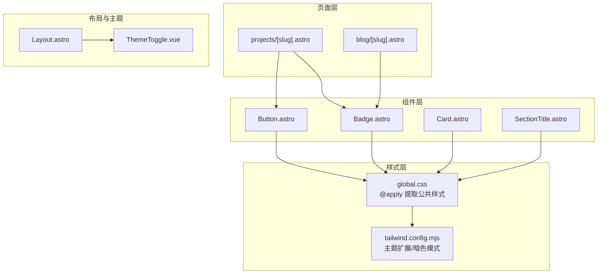
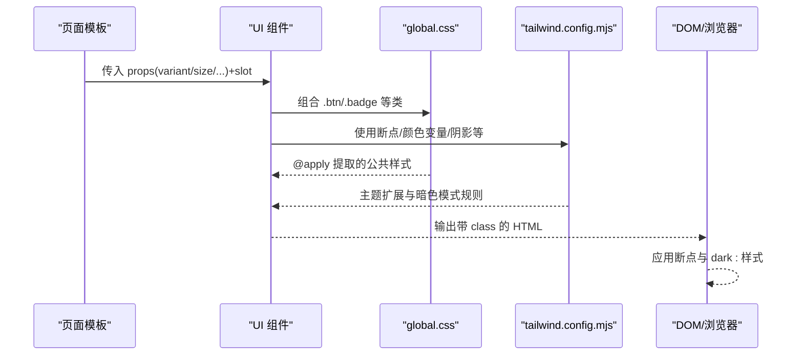
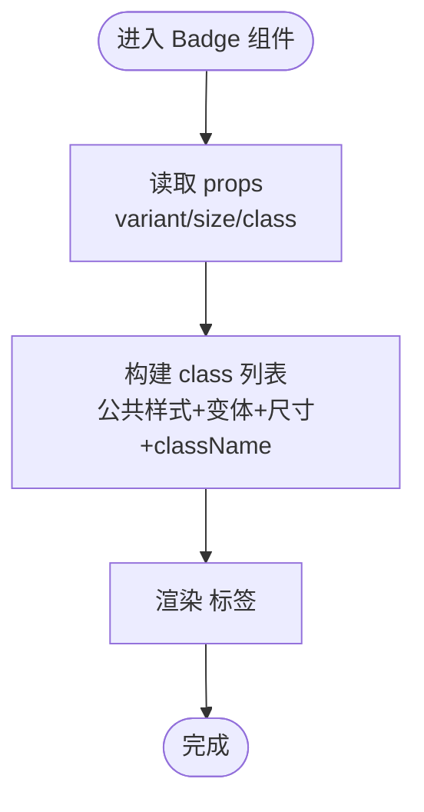
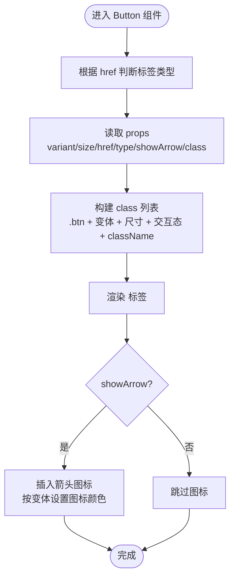
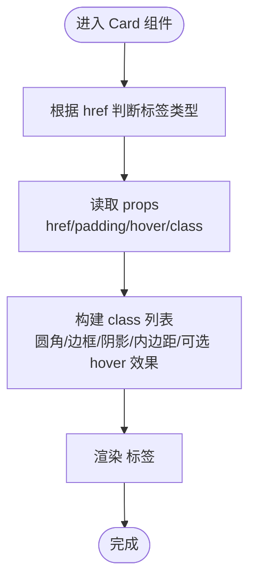
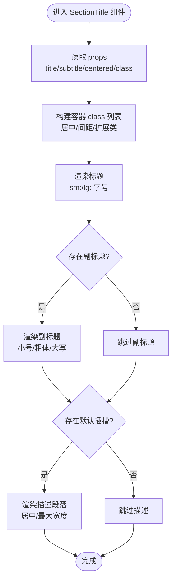
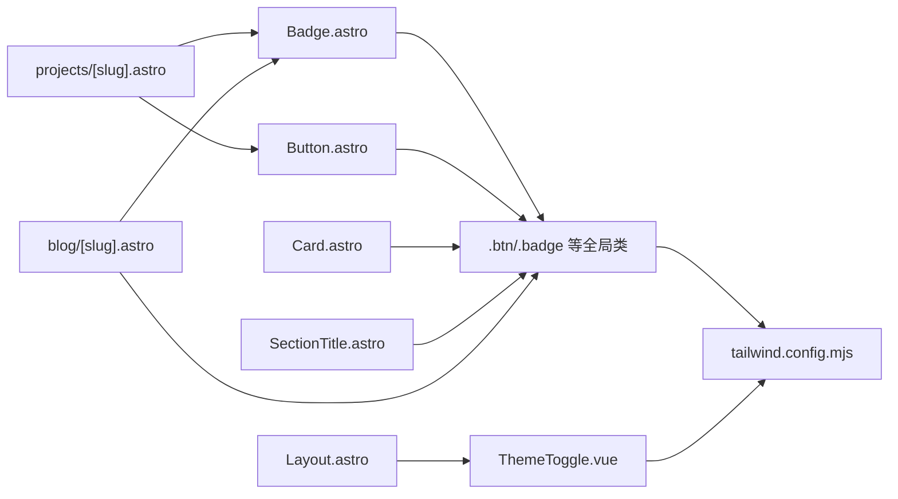

# 组件样式应用

<cite>
**本文引用的文件**
- [src/components/ui/Badge.astro](file://src/components/ui/Badge.astro)
- [src/components/ui/Button.astro](file://src/components/ui/Button.astro)
- [src/components/ui/Card.astro](file://src/components/ui/Card.astro)
- [src/components/ui/SectionTitle.astro](file://src/components/ui/SectionTitle.astro)
- [src/styles/global.css](file://src/styles/global.css)
- [tailwind.config.mjs](file://tailwind.config.mjs)
- [src/layouts/Layout.astro](file://src/layouts/Layout.astro)
- [src/components/ThemeToggle.vue](file://src/components/ThemeToggle.vue)
- [src/pages/projects/[slug].astro](file://src/pages/projects/[slug].astro)
- [src/pages/blog/[slug].astro](file://src/pages/blog/[slug].astro)
</cite>

## 目录
1. [引言](#引言)
2. [项目结构](#项目结构)
3. [核心组件](#核心组件)
4. [架构总览](#架构总览)
5. [详细组件分析](#详细组件分析)
6. [依赖关系分析](#依赖关系分析)
7. [性能考量](#性能考量)
8. [故障排查指南](#故障排查指南)
9. [结论](#结论)

## 引言
本文件聚焦于 UI 组件如何通过 Tailwind CSS 实现高度可定制的视觉表现，重点以 Badge.astro 与 Button.astro 为例，说明它们如何结合全局样式类（如 .btn、.badge）与内联 Tailwind 类实现主题一致性；同时解析组件中使用 @apply 提取公共样式的模式，确保模板简洁性；并阐述响应式断点（sm:、lg:）在 Card 与 SectionTitle 中的应用，以及深色模式下通过 dark: 前缀动态切换颜色的实现机制。

## 项目结构
该项目采用 Astro + Vue 的混合前端架构，UI 组件位于 src/components/ui 下，全局样式定义在 src/styles/global.css，并通过 tailwind.config.mjs 进行主题扩展与暗色模式配置。页面层通过 Astro 模板导入组件并在模板中组合使用。

图表来源
- [src/components/ui/Badge.astro](file://src/components/ui/Badge.astro#L1-L40)
- [src/components/ui/Button.astro](file://src/components/ui/Button.astro#L1-L56)
- [src/components/ui/Card.astro](file://src/components/ui/Card.astro#L1-L41)
- [src/components/ui/SectionTitle.astro](file://src/components/ui/SectionTitle.astro#L1-L33)
- [src/styles/global.css](file://src/styles/global.css#L1-L177)
- [tailwind.config.mjs](file://tailwind.config.mjs#L1-L119)
- [src/pages/projects/[slug].astro](file://src/pages/projects/[slug].astro#L1-L124)
- [src/pages/blog/[slug].astro](file://src/pages/blog/[slug].astro#L46-L82)
- [src/layouts/Layout.astro](file://src/layouts/Layout.astro#L1-L59)
- [src/components/ThemeToggle.vue](file://src/components/ThemeToggle.vue#L1-L78)

章节来源
- [src/styles/global.css](file://src/styles/global.css#L1-L177)
- [tailwind.config.mjs](file://tailwind.config.mjs#L1-L119)
- [src/layouts/Layout.astro](file://src/layouts/Layout.astro#L1-L59)

## 核心组件
本节从“主题一致性”“可定制性”“响应式断点”“深色模式”四个维度，系统梳理 Badge、Button、Card、SectionTitle 的样式策略与实现要点。

- 主题一致性
  - 通过全局样式类（如 .btn、.badge）统一提取公共样式，组件内部仅注入变体与尺寸，避免重复定义，保证跨组件一致的外观与交互。
  - 组件 props 控制 variant/size 等维度，最终拼装为内联 Tailwind 类，形成“可组合”的样式体系。

- 可定制性
  - 组件提供 class 扩展位，允许父级传入额外样式覆盖默认行为。
  - 使用 @apply 将常用组合封装为 .btn/.badge 等类，既减少模板复杂度，又便于集中维护。

- 响应式断点
  - Card 与 SectionTitle 明确使用 sm:/lg: 断点调整字体大小与间距，确保在不同屏幕宽度下的阅读体验与布局稳定性。

- 深色模式
  - tailwind.config.mjs 启用 darkMode: 'class'，并通过 ThemeToggle.vue 在文档根元素上切换 'dark' 类，从而驱动 dark: 前缀的样式生效。
  - 组件与页面广泛使用 dark: 前缀类，实现主题切换时的颜色与对比度自动适配。

章节来源
- [src/components/ui/Badge.astro](file://src/components/ui/Badge.astro#L1-L40)
- [src/components/ui/Button.astro](file://src/components/ui/Button.astro#L1-L56)
- [src/components/ui/Card.astro](file://src/components/ui/Card.astro#L1-L41)
- [src/components/ui/SectionTitle.astro](file://src/components/ui/SectionTitle.astro#L1-L33)
- [src/styles/global.css](file://src/styles/global.css#L60-L141)
- [tailwind.config.mjs](file://tailwind.config.mjs#L1-L119)
- [src/components/ThemeToggle.vue](file://src/components/ThemeToggle.vue#L1-L78)

## 架构总览
下图展示了组件样式应用的整体流程：页面导入组件 -> 组件根据 props 选择变体/尺寸 -> 组合全局样式类与内联 Tailwind 类 -> Tailwind 根据断点与暗色模式生成最终 CSS。

图表来源
- [src/pages/projects/[slug].astro](file://src/pages/projects/[slug].astro#L100-L124)
- [src/pages/blog/[slug].astro](file://src/pages/blog/[slug].astro#L46-L82)
- [src/components/ui/Badge.astro](file://src/components/ui/Badge.astro#L1-L40)
- [src/components/ui/Button.astro](file://src/components/ui/Button.astro#L1-L56)
- [src/styles/global.css](file://src/styles/global.css#L60-L141)
- [tailwind.config.mjs](file://tailwind.config.mjs#L1-L119)

## 详细组件分析

### Badge.astro：变体与尺寸的可组合样式
- 设计要点
  - 通过 variants/sizes 对象将不同变体与尺寸映射为一组 Tailwind 类，组件只负责拼装，不直接写样式。
  - 使用 class:list 将公共样式、变体样式、尺寸样式与外部传入的 className 合并，保持模板简洁。
  - 与全局 .badge 类配合，可在需要时直接使用 .badge 或 .badge-lime 等变体类，实现更灵活的组合。

- 主题一致性
  - 变体类使用颜色变量（如 bg-primary-500/20、text-gray-700），与 tailwind.config.mjs 中的主题色保持一致。
  - 通过 .badge 提供默认徽章样式，避免重复定义基础样式。

- 可定制性
  - 支持 variant/size/class 扩展，满足不同业务场景的差异化需求。

- 响应式与深色模式
  - 组件本身未显式使用断点或 dark: 前缀，但其变体类遵循全局主题，可在父级模板中叠加 sm:/lg:/dark: 断点类实现响应式与主题切换。

图表来源
- [src/components/ui/Badge.astro](file://src/components/ui/Badge.astro#L1-L40)
- [src/styles/global.css](file://src/styles/global.css#L120-L131)

章节来源
- [src/components/ui/Badge.astro](file://src/components/ui/Badge.astro#L1-L40)
- [src/styles/global.css](file://src/styles/global.css#L120-L131)

### Button.astro：多变体与交互态的统一入口
- 设计要点
  - 通过 variants/sizes 对象定义 primary/secondary/ghost/outline 与 sm/md/lg 尺寸，组件仅做拼装。
  - 内联包含 hover/过渡/焦点环等交互态类，确保一致的交互反馈。
  - 支持 href 自动切换为 a 标签，保持语义正确性。

- 主题一致性
  - 变体类使用颜色变量（如 bg-dark-100/text-white、hover:bg-dark-300），与 tailwind.config.mjs 中的 dark 色板一致。
  - 通过 .btn/.btn-primary 等全局类，可快速复用按钮样式，避免重复定义。

- 可定制性
  - 支持 showArrow 动态渲染箭头图标，并根据变体动态设置图标颜色，提升视觉一致性。

- 响应式与深色模式
  - 组件本身未显式使用断点或 dark: 前缀，但其变体类遵循全局主题，可在父级模板中叠加 sm:/lg:/dark: 断点类实现响应式与主题切换。

图表来源
- [src/components/ui/Button.astro](file://src/components/ui/Button.astro#L1-L56)
- [src/styles/global.css](file://src/styles/global.css#L62-L91)

章节来源
- [src/components/ui/Button.astro](file://src/components/ui/Button.astro#L1-L56)
- [src/styles/global.css](file://src/styles/global.css#L62-L91)

### Card.astro：卡片容器的统一风格
- 设计要点
  - 通过 paddings 对象映射 sm/md/lg 内边距，统一卡片内容区的留白。
  - 内联包含圆角、边框、阴影与 hover 效果，确保卡片在悬停时有清晰的层次感。
  - 支持 href 自动切换为 a 标签，hover 时提供指针光标，增强交互提示。

- 主题一致性
  - 背景、边框、阴影均使用颜色变量与阴影扩展，与 tailwind.config.mjs 保持一致。

- 响应式与深色模式
  - 组件本身未显式使用断点或 dark: 前缀，但其样式遵循全局主题，可在父级模板中叠加 sm:/lg:/dark: 断点类实现响应式与主题切换。

图表来源
- [src/components/ui/Card.astro](file://src/components/ui/Card.astro#L1-L41)
- [tailwind.config.mjs](file://tailwind.config.mjs#L66-L72)

章节来源
- [src/components/ui/Card.astro](file://src/components/ui/Card.astro#L1-L41)
- [tailwind.config.mjs](file://tailwind.config.mjs#L66-L72)

### SectionTitle.astro：标题层级与响应式排版
- 设计要点
  - 通过 props 控制标题文本、副标题与居中对齐，支持插槽以扩展描述内容。
  - 使用 sm:/lg: 断点调整标题字号，确保在小屏与大屏上的阅读体验。
  - 通过 mb-12 与 lg:mb-16 在不同断点下控制段落间距，提升整体节奏感。

- 主题一致性
  - 标题颜色使用灰阶变量，与全局主题一致。

- 响应式与深色模式
  - 标题字号与间距使用断点前缀，实现自适应布局。
  - 深色模式下可通过 dark: 前缀类覆盖颜色，确保对比度与可读性。

图表来源
- [src/components/ui/SectionTitle.astro](file://src/components/ui/SectionTitle.astro#L1-L33)

章节来源
- [src/components/ui/SectionTitle.astro](file://src/components/ui/SectionTitle.astro#L1-L33)

## 依赖关系分析
- 组件与全局样式
  - Badge/Button/Card/SectionTitle 通过 class 列表组合全局样式类（如 .btn/.badge）与内联 Tailwind 类，形成“类名即样式”的声明式风格。
  - 全局样式通过 @apply 将常用组合封装为 .btn/.badge 等类，降低模板复杂度。

- 组件与 Tailwind 配置
  - tailwind.config.mjs 扩展了 colors、fontFamily、fontSize、spacing、borderRadius、boxShadow、animation、backgroundImage 等主题属性，并启用 darkMode: 'class'。
  - 组件中的颜色变量（如 bg-dark-100、text-white、shadow-card-hover 等）来源于此配置。

- 页面与组件
  - 页面模板在使用组件时，可叠加断点类与 dark: 前缀，实现响应式与主题切换。
  - 示例：projects/[slug].astro 中使用 Badge/Button，blog/[slug].astro 中使用 Badge 并叠加 dark: 前缀。

图表来源
- [src/components/ui/Badge.astro](file://src/components/ui/Badge.astro#L1-L40)
- [src/components/ui/Button.astro](file://src/components/ui/Button.astro#L1-L56)
- [src/components/ui/Card.astro](file://src/components/ui/Card.astro#L1-L41)
- [src/components/ui/SectionTitle.astro](file://src/components/ui/SectionTitle.astro#L1-L33)
- [src/styles/global.css](file://src/styles/global.css#L60-L141)
- [tailwind.config.mjs](file://tailwind.config.mjs#L1-L119)
- [src/pages/projects/[slug].astro](file://src/pages/projects/[slug].astro#L100-L124)
- [src/pages/blog/[slug].astro](file://src/pages/blog/[slug].astro#L46-L82)
- [src/layouts/Layout.astro](file://src/layouts/Layout.astro#L1-L59)
- [src/components/ThemeToggle.vue](file://src/components/ThemeToggle.vue#L1-L78)

章节来源
- [src/styles/global.css](file://src/styles/global.css#L60-L141)
- [tailwind.config.mjs](file://tailwind.config.mjs#L1-L119)
- [src/pages/projects/[slug].astro](file://src/pages/projects/[slug].astro#L100-L124)
- [src/pages/blog/[slug].astro](file://src/pages/blog/[slug].astro#L46-L82)
- [src/components/ThemeToggle.vue](file://src/components/ThemeToggle.vue#L1-L78)

## 性能考量
- 样式体积控制
  - 通过 @apply 将常用组合封装为全局类，减少模板中重复类名，有助于缩小 HTML 体积与提升渲染效率。
- 构建优化
  - tailwind.config.mjs 中的 content 覆盖了 Astro/HTML/JS/TS/Vue 等文件，确保仅生成实际使用的样式，避免无用 CSS。
- 交互态最小化
  - 组件内仅引入必要的 hover/focus/transition 类，避免过度动画影响性能。

[本节为通用建议，无需特定文件引用]

## 故障排查指南
- 暗色模式未生效
  - 确认 tailwind.config.mjs 已启用 darkMode: 'class'。
  - 确认 ThemeToggle.vue 正确在文档根元素上添加/移除 'dark' 类。
  - 确认组件/页面中使用了 dark: 前缀类。

- 响应式断点无效
  - 确认在组件或父级模板中使用了 sm:/lg: 前缀类。
  - 确认 tailwind.config.mjs 中未禁用相关断点或覆盖冲突。

- 样式覆盖异常
  - 检查组件的 class 扩展位是否被父级样式覆盖。
  - 检查全局样式类的优先级，必要时使用 !important（谨慎使用）。

章节来源
- [tailwind.config.mjs](file://tailwind.config.mjs#L1-L119)
- [src/components/ThemeToggle.vue](file://src/components/ThemeToggle.vue#L1-L78)
- [src/layouts/Layout.astro](file://src/layouts/Layout.astro#L1-L59)

## 结论
本项目通过“组件 + 全局样式类 + Tailwind 配置”的三层结构，实现了高度可定制且主题一致的 UI 样式体系：
- Badge/Button/Card/SectionTitle 以 props 驱动变体与尺寸，通过 class 列表组合全局样式类与内联 Tailwind 类，确保模板简洁、样式统一。
- tailwind.config.mjs 提供丰富的主题扩展与暗色模式支持，组件样式自然融入主题体系。
- 响应式断点与 dark: 前缀在组件与页面层面协同工作，实现跨设备与主题的无缝适配。