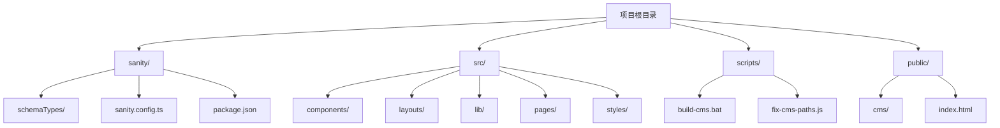
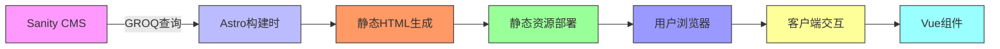
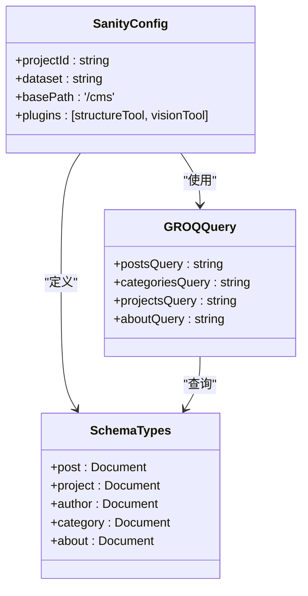
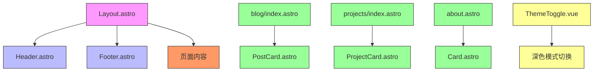
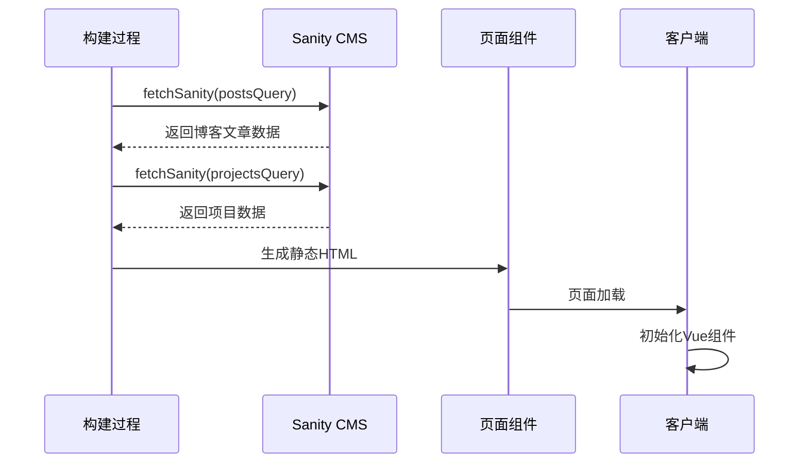
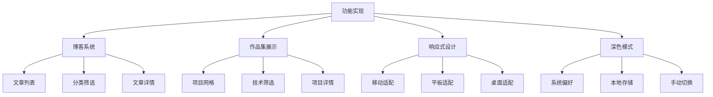
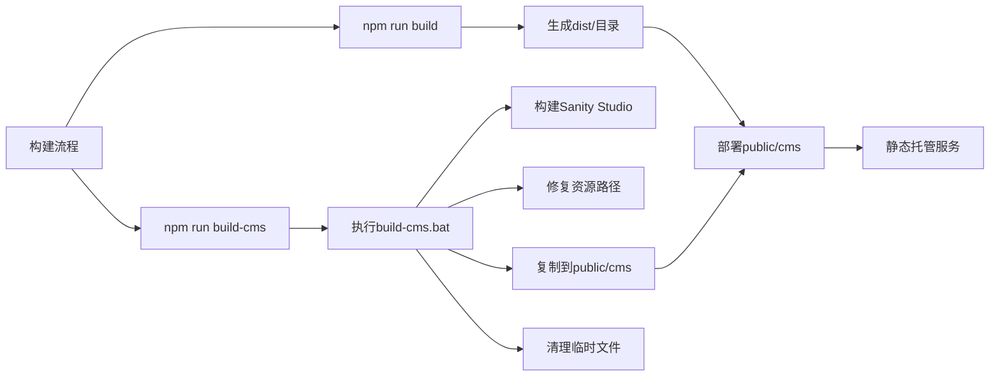
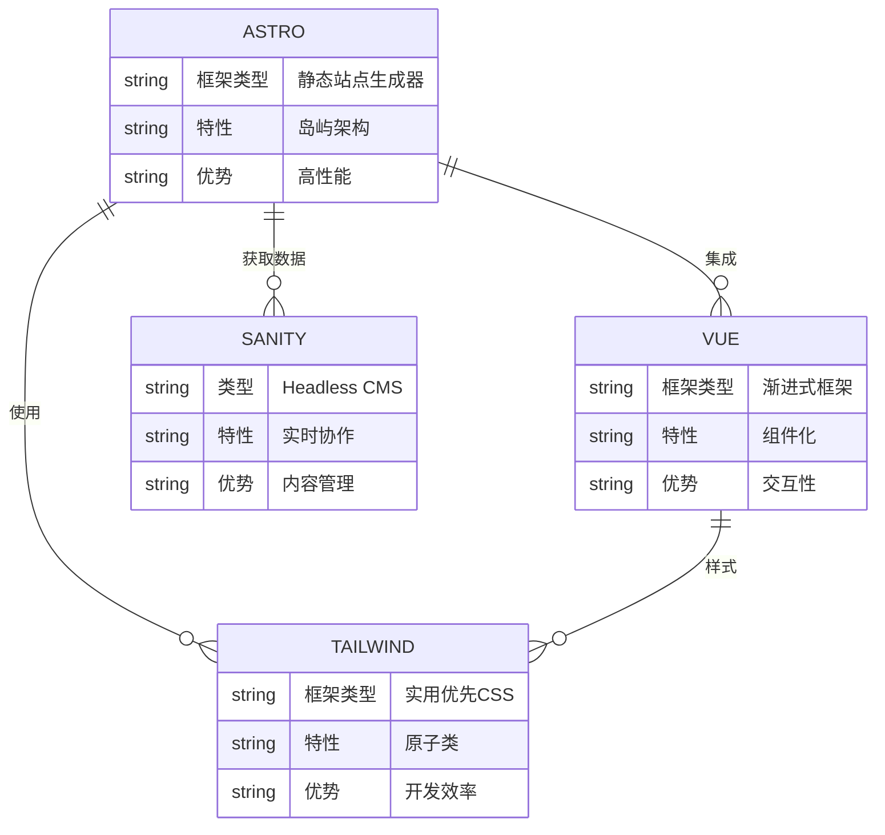

# 项目概述

<cite>
**本文档引用的文件**  
- [README.md](file://README.md)
- [package.json](file://package.json)
- [astro.config.mjs](file://astro.config.mjs)
- [sanity.config.ts](file://sanity/sanity.config.ts)
- [sanity.ts](file://src/lib/sanity.ts)
- [Layout.astro](file://src/layouts/Layout.astro)
- [blog/index.astro](file://src/pages/blog/index.astro)
- [projects/index.astro](file://src/pages/projects/index.astro)
- [about.astro](file://src/pages/about.astro)
- [ThemeToggle.vue](file://src/components/ThemeToggle.vue)
- [global.css](file://src/styles/global.css)
- [post.ts](file://sanity/schemaTypes/post.ts)
- [project.ts](file://sanity/schemaTypes/project.ts)
- [build-cms.bat](file://scripts/build-cms.bat)
</cite>

## 目录
1. [简介](#简介)
2. [项目结构](#项目结构)
3. [核心架构](#核心架构)
4. [内容管理系统](#内容管理系统)
5. [前端架构](#前端架构)
6. [数据流与查询](#数据流与查询)
7. [核心功能实现](#核心功能实现)
8. [构建与部署流程](#构建与部署流程)
9. [技术选型分析](#技术选型分析)
10. [结论](#结论)

## 简介

本项目是一个基于Astro框架的个人博客与作品集网站，采用前后端分离的架构设计，结合静态站点生成（SSG）与内容即服务（CaaS）的理念，实现了高性能、易维护的现代化Web应用。项目通过Sanity CMS实现内容管理，利用Astro进行高效静态渲染，为用户提供流畅的浏览体验。

该网站主要包含博客系统、作品集展示和个人介绍三大核心功能模块，支持响应式设计和深色模式切换，旨在为开发者提供一个展示技术能力和个人作品的专业平台。项目采用Astro + Vue + Tailwind CSS + Sanity的技术组合，充分发挥各技术栈的优势，实现开发效率与运行性能的平衡。

**Section sources**
- [README.md](file://README.md#L1-L185)

## 项目结构

项目采用清晰的模块化结构，主要分为前端源码、CMS配置和脚本工具三个部分。这种结构设计使得内容管理与前端展示完全分离，便于团队协作和独立维护。

**Diagram sources**
- [README.md](file://README.md#L15-L35)

**Section sources**
- [README.md](file://README.md#L15-L35)

## 核心架构

项目采用前后端分离的架构设计，前端使用Astro框架进行静态站点生成，后端使用Sanity CMS作为内容即服务（CaaS）平台。这种架构模式结合了静态站点的高性能优势和CMS系统的易用性特点。

**Diagram sources**
- [astro.config.mjs](file://astro.config.mjs#L1-L35)
- [sanity.config.ts](file://sanity/sanity.config.ts#L1-L31)

**Section sources**
- [astro.config.mjs](file://astro.config.mjs#L1-L35)
- [sanity.config.ts](file://sanity/sanity.config.ts#L1-L31)

## 内容管理系统

项目使用Sanity CMS作为内容管理后台，提供了直观的内容编辑界面和灵活的数据模型定义。Sanity Studio被构建并部署在`/cms`路径下，通过独立的构建流程集成到静态站点中。

**Diagram sources**
- [sanity.config.ts](file://sanity/sanity.config.ts#L1-L31)
- [schemaTypes/post.ts](file://sanity/schemaTypes/post.ts#L1-L84)
- [schemaTypes/project.ts](file://sanity/schemaTypes/project.ts#L1-L97)

**Section sources**
- [sanity.config.ts](file://sanity/sanity.config.ts#L1-L31)
- [schemaTypes/post.ts](file://sanity/schemaTypes/post.ts#L1-L84)
- [schemaTypes/project.ts](file://sanity/schemaTypes/project.ts#L1-L97)

## 前端架构

前端采用Astro框架作为核心，结合Vue组件和Tailwind CSS样式系统，实现了高效的静态渲染和丰富的交互体验。Astro的岛屿架构允许在静态页面中嵌入交互式Vue组件，兼顾性能与功能。

**Diagram sources**
- [src/layouts/Layout.astro](file://src/layouts/Layout.astro#L1-L59)
- [src/components/ThemeToggle.vue](file://src/components/ThemeToggle.vue#L1-L79)

**Section sources**
- [src/layouts/Layout.astro](file://src/layouts/Layout.astro#L1-L59)
- [src/components/ThemeToggle.vue](file://src/components/ThemeToggle.vue#L1-L79)

## 数据流与查询

项目通过GROQ（Graph-Relational Object Queries）语言从Sanity CMS获取数据，在构建时预取内容并生成静态页面。这种数据获取策略确保了最终用户获得最快的加载速度。

**Diagram sources**
- [src/lib/sanity.ts](file://src/lib/sanity.ts#L1-L99)
- [src/pages/blog/index.astro](file://src/pages/blog/index.astro#L1-L321)

**Section sources**
- [src/lib/sanity.ts](file://src/lib/sanity.ts#L1-L99)
- [src/pages/blog/index.astro](file://src/pages/blog/index.astro#L1-L321)

## 核心功能实现

项目实现了博客系统、作品集展示、响应式设计和深色模式支持等核心功能。每个功能模块都经过精心设计，确保用户体验的完整性和一致性。

**Diagram sources**
- [src/pages/blog/index.astro](file://src/pages/blog/index.astro#L1-L321)
- [src/pages/projects/index.astro](file://src/pages/projects/index.astro#L1-L171)
- [src/components/ThemeToggle.vue](file://src/components/ThemeToggle.vue#L1-L79)

**Section sources**
- [src/pages/blog/index.astro](file://src/pages/blog/index.astro#L1-L321)
- [src/pages/projects/index.astro](file://src/pages/projects/index.astro#L1-L171)
- [src/components/ThemeToggle.vue](file://src/components/ThemeToggle.vue#L1-L79)

## 构建与部署流程

项目采用自动化构建流程，通过npm脚本协调前端和CMS的构建过程。完整的构建流程确保了前后端资源的正确集成和部署。

**Diagram sources**
- [package.json](file://package.json#L1-L28)
- [scripts/build-cms.bat](file://scripts/build-cms.bat#L1-L44)

**Section sources**
- [package.json](file://package.json#L1-L28)
- [scripts/build-cms.bat](file://scripts/build-cms.bat#L1-L44)

## 技术选型分析

项目选择Astro + Vue + Tailwind CSS + Sanity的技术组合，是基于对开发效率、性能表现和可维护性的综合考量。这种技术栈组合充分发挥了各工具的优势，形成了良好的开发体验。

**Diagram sources**
- [package.json](file://package.json#L1-L28)
- [astro.config.mjs](file://astro.config.mjs#L1-L35)

**Section sources**
- [package.json](file://package.json#L1-L28)
- [astro.config.mjs](file://astro.config.mjs#L1-L35)

## 结论

本项目成功实现了一个现代化的个人博客与作品集网站，通过合理的架构设计和技术选型，平衡了开发效率、运行性能和用户体验。前后端分离的架构使得内容管理与前端展示可以独立演进，静态站点生成确保了最佳的加载性能，而Vue组件的引入则提供了必要的交互功能。

项目的技术组合Astro + Vue + Tailwind CSS + Sanity展现了现代Web开发的最佳实践，既保持了静态站点的简单性和性能优势，又通过组件化和CMS系统提供了足够的灵活性和可扩展性。这种架构特别适合内容驱动的网站，如博客、作品集、文档站点等，为开发者提供了一个可复用的模板和参考实现。

**Section sources**
- [README.md](file://README.md#L1-L185)
- [package.json](file://package.json#L1-L28)